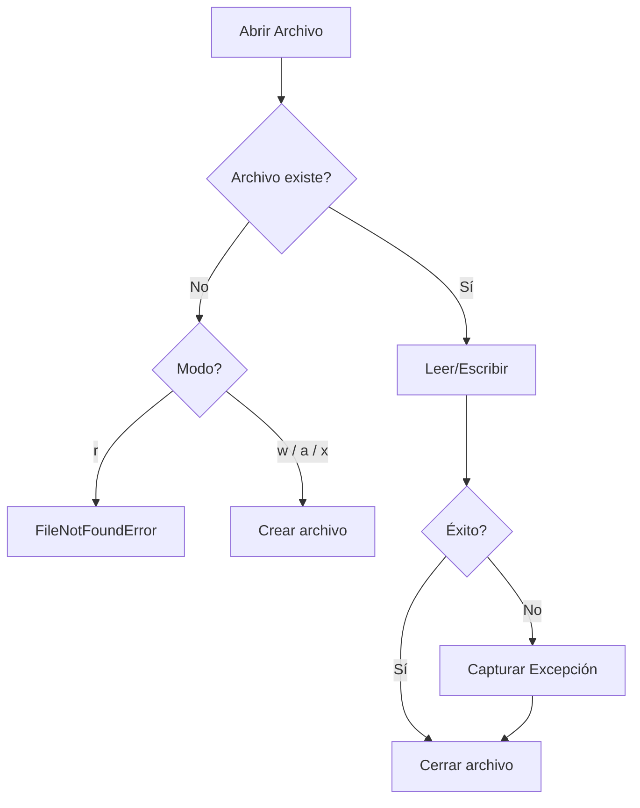

# Manejo de Archivos y E/S

La E/S de archivos es fundamental para casi toda aplicación Python — desde leer archivos de configuración hasta procesar grandes conjuntos de datos. El manejo de archivos de Python es limpio, potente y soporta múltiples formatos.

## La Función `open()`

```python
file = open("example.txt", "r")    # Lectura (predeterminado)
file = open("example.txt", "w")    # Escritura (¡sobrescribe!)
file = open("example.txt", "a")    # Añadir
file = open("example.txt", "r+")   # Lectura y escritura
file = open("example.txt", "x")    # Creación exclusiva (falla si existe)
```

| Modo | Leer | Escribir | Crear | Truncar | Posición |
|------|------|----------|-------|---------|----------|
| `"r"` | Sí | No | No | No | Inicio |
| `"w"` | No | Sí | Sí | Sí | Inicio |
| `"a"` | No | Sí | Sí | No | Fin |
| `"r+"` | Sí | Sí | No | No | Inicio |
| `"w+"` | Sí | Sí | Sí | Sí | Inicio |
| `"a+"` | Sí | Sí | Sí | No | Fin |
| `"x"` | No | Sí | Sí (exclusivo) | No | Inicio |
| `"b"` | (modificador) | Modo binario | — | — | — |

> [!WARNING]
> ¡Siempre cierra los archivos! La declaración `with` maneja esto automáticamente (ver abajo).

## La Declaración `with` (Administrador de Contexto)

La declaración `with` asegura que el archivo se cierre correctamente, incluso si ocurre una excepción:

```python
# MAL — cierre manual (propenso a errores)
f = open("data.txt", "r")
try:
    content = f.read()
finally:
    f.close()

# BIEN — declaración with (cierre automático)
with open("data.txt", "r") as f:
    content = f.read()
# El archivo se cierra aquí, incluso si ocurrió un error
```

## Leyendo Archivos de Texto

```python
# Leer archivo completo como cadena
with open("data.txt", "r") as f:
    content = f.read()

# Leer línea por línea (eficiente en memoria para archivos grandes)
with open("data.txt", "r") as f:
    for line in f:
        print(line.rstrip())  # rstrip elimina el salto de línea final

# Leer todas las líneas en una lista
with open("data.txt", "r") as f:
    lines = f.readlines()

# Leer una línea a la vez
with open("data.txt", "r") as f:
    first_line = f.readline()
    second_line = f.readline()
```

> [!NOTE]
> Para archivos grandes, itera sobre el objeto de archivo directamente (`for line in f:`) en lugar de llamar a `read()` o `readlines()`. Esto lee de forma perezosa y no cargará todo el archivo en memoria.

## Escribiendo Archivos de Texto

```python
with open("output.txt", "w") as f:
    f.write("Hello, World!\n")
    f.write("This is line 2.\n")

# Escribir múltiples líneas desde una lista
lines = ["Line 1", "Line 2", "Line 3"]
with open("output.txt", "w") as f:
    f.writelines(line + "\n" for line in lines)
```

### Añadiendo

```python
with open("log.txt", "a") as f:
    f.write("New log entry\n")
```

## Codificación de Archivos

Siempre especifica la codificación para archivos de texto:

```python
with open("data.txt", "r", encoding="utf-8") as f:
    content = f.read()

with open("output.txt", "w", encoding="utf-8") as f:
    f.write("Unicode: ñ, é, 你好, こんにちは\n")
```

> [!WARNING]
> En Windows, la codificación predeterminada es `cp1252`, no `utf-8`. Siempre pasa `encoding="utf-8"` explícitamente para portabilidad multiplataforma.

## Archivos CSV

El módulo `csv` de Python maneja valores separados por comas:

```python
import csv

# Leyendo CSV
with open("employees.csv", "r", newline="", encoding="utf-8") as f:
    reader = csv.reader(f)
    header = next(reader)  # Saltar cabecera
    for row in reader:
        name, department, salary = row
        print(f"{name} works in {department}")

# Leyendo como diccionarios
with open("employees.csv", "r", newline="", encoding="utf-8") as f:
    reader = csv.DictReader(f)
    for row in reader:
        print(f"{row['name']} earns ${row['salary']}")
```

```python
import csv

# Escribiendo CSV
with open("output.csv", "w", newline="", encoding="utf-8") as f:
    writer = csv.writer(f)
    writer.writerow(["Name", "Department", "Salary"])
    writer.writerow(["Alice", "Engineering", 95000])
    writer.writerow(["Bob", "Marketing", 72000])
    writer.writerows([
        ["Charlie", "Sales", 85000],
        ["Diana", "Engineering", 98000],
    ])

# Escribiendo como diccionarios
with open("output.csv", "w", newline="", encoding="utf-8") as f:
    fieldnames = ["Name", "Department", "Salary"]
    writer = csv.DictWriter(f, fieldnames=fieldnames)
    writer.writeheader()
    writer.writerow({"Name": "Alice", "Department": "Engineering", "Salary": 95000})
```

> [!NOTE]
| Constructor | Cuándo Usar |
|------------|-------------|
| `csv.reader` / `csv.writer` | Listas simples, sin cabeceras |
| `csv.DictReader` / `csv.DictWriter` | Columnas con nombre, cabeceras presentes |

### Dialectos CSV y Delimitadores Personalizados

```python
import csv

# Valores separados por tabulaciones (TSV)
with open("data.tsv", "r", newline="") as f:
    reader = csv.reader(f, delimiter="\t")
    for row in reader:
        print(row)

# Delimitador personalizado con comillas
with open("data.csv", "w", newline="") as f:
    writer = csv.writer(f, delimiter=";", quotechar='"',
                        quoting=csv.QUOTE_ALL)
    writer.writerow(["Hello, World", 100, "A;B;C"])
```

## Manejo de Archivos Binarios

```python
# Leer archivo binario
with open("image.png", "rb") as f:
    data = f.read()
    print(f"Read {len(data)} bytes")

# Escribir archivo binario
with open("copy.png", "wb") as f:
    f.write(data)

# Copiar en bloques (eficiente en memoria)
BUFFER_SIZE = 8192
with open("large_file.bin", "rb") as src, open("copy.bin", "wb") as dst:
    while chunk := src.read(BUFFER_SIZE):
        dst.write(chunk)
```

> [!SUCCESS]
> El operador walrus (`:=`) combinado con `while` crea un patrón elegante de copia bloque por bloque. Cada bloque tiene como máximo `BUFFER_SIZE` bytes.

## Mundo Real: Pipeline de Procesamiento de Datos

```python
import csv
import json
from pathlib import Path

def process_sales_data(input_path: str, output_path: str) -> dict:
    summary = {"total_revenue": 0, "total_orders": 0, "products_sold": 0}

    with open(input_path, "r", newline="", encoding="utf-8") as infile:
        reader = csv.DictReader(infile)
        for row in reader:
            try:
                quantity = int(row["quantity"])
                price = float(row["price"])
                summary["total_revenue"] += quantity * price
                summary["total_orders"] += 1
                summary["products_sold"] += quantity
            except (ValueError, KeyError) as e:
                print(f"Skipping bad row: {e}")

    with open(output_path, "w", encoding="utf-8") as outfile:
        json.dump(summary, outfile, indent=2)

    return summary

result = process_sales_data("sales.csv", "summary.json")
print(result)
```

## Utilidades de Archivo y Ruta con `pathlib`

```python
from pathlib import Path

p = Path("data/reports/summary.csv")

# Componentes de la ruta
print(p.name)         # summary.csv
print(p.stem)         # summary
print(p.suffix)       # .csv
print(p.parent)       # data/reports
print(p.parents[0])   # data/reports
print(p.parents[1])   # data

# Verificar y crear
if p.exists():
    print(f"Size: {p.stat().st_size} bytes")
    print(f"Modified: {p.stat().st_mtime}")

p.parent.mkdir(parents=True, exist_ok=True)

# Globbing
data_dir = Path("data")
for csv_file in data_dir.glob("*.csv"):
    print(f"Found: {csv_file}")

# Lectura/escritura convenientes
content = p.read_text(encoding="utf-8")
Path("output.txt").write_text("Hello", encoding="utf-8")
```

## Trabajando con Archivos Temporales

```python
from tempfile import NamedTemporaryFile, TemporaryDirectory
import os

# Archivo temporal (autoeliminado al cerrar)
with NamedTemporaryFile(mode="w", suffix=".txt", delete=False) as f:
    f.write("Temporary content")
    temp_path = f.name

print(f"Temp file at: {temp_path}")
os.unlink(temp_path)  # Limpieza manual si delete=False

# Directorio temporal (autoeliminado)
with TemporaryDirectory() as tmpdir:
    work_file = Path(tmpdir) / "data.txt"
    work_file.write_text("Processing in isolation")
    # Procesar archivo...
# tmpdir y todo el contenido se eliminan aquí
```

> [!WARNING]
> El modo binario (`"rb"` / `"wb"`) es necesario para archivos no textuales (imágenes, audio, archivos). El modo texto puede corromper datos binarios interpretando caracteres UTF y traduciendo saltos de línea.

## Manejo de Errores en Operaciones de Archivo

```python
import os

def safe_read_file(path: str, default: str = "") -> str:
    try:
        with open(path, "r", encoding="utf-8") as f:
            return f.read()
    except FileNotFoundError:
        print(f"File {path} not found. Using default.")
        return default
    except PermissionError:
        print(f"Permission denied: {path}")
        return default
    except OSError as e:
        print(f"OS error reading {path}: {e}")
        return default

def safe_write_file(path: str, content: str) -> bool:
    try:
        os.makedirs(os.path.dirname(path) or ".", exist_ok=True)
        with open(path, "w", encoding="utf-8") as f:
            f.write(content)
        return True
    except OSError as e:
        print(f"Failed to write {path}: {e}")
        return False
```



> [!SUCCESS]
> La declaración `with` es la forma más segura y limpia de manejar archivos en Python. Garantiza la limpieza adecuada, funciona con administradores de contexto personalizados y reduce significativamente el código boilerplate.

## Preguntas de Práctica

1. ¿Qué garantiza la declaración `with` cuando se usa con `open()`?
2. ¿Cuál es la diferencia entre los modos de archivo `"w"` y `"a"`?
3. Escribe código que lea un archivo CSV e imprima filas donde el valor en la columna "age" sea > 30.
4. ¿Por qué deberías especificar `encoding="utf-8"` al abrir archivos de texto?
5. ¿Cómo lees un archivo de texto muy grande sin quedarte sin memoria?
6. ¿Qué hace `newline=""` en `open("file.csv", newline="")` y por qué es importante para archivos CSV?
7. Escribe una función que copie un archivo binario en bloques de 4096 bytes.
8. ¿Cuál es la diferencia entre `csv.reader` y `csv.DictReader`?
9. Usando `pathlib.Path`, escribe código para encontrar todos los archivos `.log` en un árbol de directorios e imprimir sus tamaños.
10. ¿Qué sucede si abres un archivo en modo `"x"` y el archivo ya existe?
