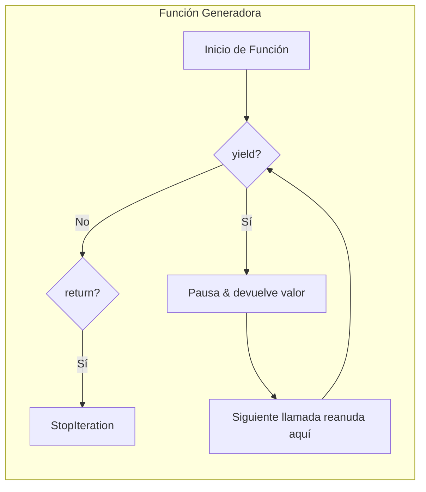

# Comprensiones y Generadores

Las comprensiones proporcionan una sintaxis concisa para crear colecciones. Los generadores permiten evaluación perezosa, procesando datos un elemento a la vez en lugar de cargar todo en memoria.

## Comprensiones de Lista

Sintaxis básica: `[expression for item in iterable if condition]`

```python
# Enfoque tradicional
squares = []
for x in range(10):
    squares.append(x ** 2)

# Comprensión de lista
squares = [x ** 2 for x in range(10)]

# Con condición
evens = [x for x in range(20) if x % 2 == 0]

# Bucles anidados
pairs = [(x, y) for x in range(3) for y in range(3)]

# Transformación
words = ["hello", "world", "python"]
upper_words = [w.upper() for w in words]
```

> [!NOTE]
| Bucle `for` Equivalente | Comprensión de Lista |
|------------------------|----------------------|
| 5 líneas | 1 línea |
| Acumulador mutable | Expresión funcional |
| Más lento (sobrecarga `.append`) | Más rápido (backend C optimizado) |

```python
# Transformaciones complejas
values = [1, -2, 3, -4, 5, -6]
processed = [x * 2 if x > 0 else abs(x) * 10 for x in values]
print(processed)  # [2, 20, 6, 40, 10, 60]

# Aplanar una matriz
matrix = [[1, 2, 3], [4, 5, 6], [7, 8, 9]]
flat = [num for row in matrix for num in row]
print(flat)  # [1, 2, 3, 4, 5, 6, 7, 8, 9]

# Producto cartesiano
colors = ["red", "blue"]
sizes = ["S", "M", "L"]
inventory = [(c, s) for c in colors for s in sizes]
print(inventory)
```

## Comprensiones de Diccionario

```python
# Diccionario de cuadrados: {0: 0, 1: 1, 2: 4, 3: 9, ...}
squares = {x: x ** 2 for x in range(10)}

# Filtrando y transformando
words = ["apple", "banana", "cherry", "date"]
word_lengths = {w: len(w) for w in words if len(w) > 4}
print(word_lengths)  # {"apple": 5, "banana": 6, "cherry": 6}

# Intercambiando claves y valores
original = {"a": 1, "b": 2, "c": 3}
swapped = {v: k for k, v in original.items()}
print(swapped)  # {1: "a", 2: "b", 3: "c"}

# Patrón enumerate
indexed = {i: char for i, char in enumerate("hello")}
print(indexed)  # {0: "h", 1: "e", 2: "l", 3: "l", 4: "o"}
```

## Comprensiones de Conjunto

```python
# Cuadrados pares únicos
even_squares = {x ** 2 for x in range(20) if x % 2 == 0}
print(even_squares)  # {0, 4, 16, 36, 64, 100, 144, 196, 256, 324}

# Encontrar caracteres únicos
text = "hello world"
unique_chars = {c for c in text if c != " "}
print(unique_chars)  # {"h", "e", "l", "o", "w", "r", "d"}
```

> [!SUCCESS]
| Tipo de Comprensión | Sintaxis | Tipo de Salida |
|--------------------|----------|----------------|
| Lista | `[expr for x in iter]` | `list` |
| Diccionario | `{k: v for x in iter}` | `dict` |
| Conjunto | `{expr for x in iter}` | `set` |
| Generador | `(expr for x in iter)` | `generator` |

## Funciones Generadoras con `yield`

Las funciones generadoras producen valores perezosamente usando `yield`:

```python
def count_up_to(n: int):
    i = 0
    while i < n:
        yield i
        i += 1

# Los generadores son perezosos — nada se computa aún
counter = count_up_to(5)

# Valores producidos bajo demanda
print(next(counter))  # 0
print(next(counter))  # 1
print(list(counter))  # [2, 3, 4] (restantes)

# O iterar directamente
for num in count_up_to(3):
    print(num)  # 0, 1, 2
```



### Generadores Infinitos

```python
def fibonacci():
    a, b = 0, 1
    while True:
        yield a
        a, b = b, a + b

fib = fibonacci()
print([next(fib) for _ in range(10)])  # [0, 1, 1, 2, 3, 5, 8, 13, 21, 34]

def counter(start: int = 0, step: int = 1):
    while True:
        yield start
        start += step

c = counter(10, 5)
print([next(c) for _ in range(4)])  # [10, 15, 20, 25]
```

## Expresiones Generadoras

Similares a las comprensiones de lista pero con paréntesis — perezosas y eficientes en memoria:

```python
# Comprensión de lista — crea lista completa en memoria
squares_list = [x ** 2 for x in range(1000000)]

# Expresión generadora — perezosa, un elemento a la vez
squares_gen = (x ** 2 for x in range(1000000))

# Suma del primer millón de cuadrados (no se necesita lista grande)
total = sum(x ** 2 for x in range(1000000))
```

> [!WARNING]
> Las expresiones generadoras son de un solo uso. Una vez agotadas, no se pueden re-iterar. Envuélvelas en `list()` si necesitas múltiples pasadas.

```python
gen = (x * 2 for x in range(5))
print(list(gen))  # [0, 2, 4, 6, 8]
print(list(gen))  # [] — ¡agotado!
```

## Encadenamiento y Pipeline de Generadores

```python
def numbers():
    for i in range(10):
        yield i

def even(iterable):
    for x in iterable:
        if x % 2 == 0:
            yield x

def squared(iterable):
    for x in iterable:
        yield x ** 2

# Pipeline — cada función procesa un elemento a la vez
pipeline = squared(even(numbers()))
print(list(pipeline))  # [0, 4, 16, 36, 64]

# Lo mismo con expresiones generadoras
result = (x ** 2 for x in range(10) if x % 2 == 0)
print(list(result))  # [0, 4, 16, 36, 64]
```

## `yield from` — Delegando a Subgeneradores

```python
def chain(*iterables):
    for iterable in iterables:
        yield from iterable

combined = chain([1, 2, 3], "abc", range(4, 6))
print(list(combined))  # [1, 2, 3, "a", "b", "c", 4, 5]

# Aplanar listas anidadas (recursivo)
def flatten(nested):
    for item in nested:
        if isinstance(item, (list, tuple)):
            yield from flatten(item)
        else:
            yield item

deep = [1, [2, [3, 4], 5], 6]
print(list(flatten(deep)))  # [1, 2, 3, 4, 5, 6]
```

## Comparación de Memoria

```python
import sys

# Comprensión de lista — todos los valores en memoria
list_comp = [x ** 2 for x in range(100000)]
print(f"List size: {sys.getsizeof(list_comp)} bytes")

# Expresión generadora — memoria mínima
gen_exp = (x ** 2 for x in range(100000))
print(f"Generator size: {sys.getsizeof(gen_exp)} bytes")

# Función generadora — también mínima
def gen_func():
    for x in range(100000):
        yield x ** 2

print(f"Gen function size: {sys.getsizeof(gen_func())} bytes")
```

> [!NOTE]
> Una expresión generadora típicamente ocupa ~120 bytes independientemente de cuántos elementos produzca. Una comprensión de lista crece proporcionalmente al número de elementos.

## Mundo Real: Procesamiento Perezoso de Archivos

```python
from pathlib import Path

def read_lines(paths: list[Path]):
    """Produce líneas perezosamente desde múltiples archivos."""
    for path in paths:
        with open(path, "r", encoding="utf-8") as f:
            yield from f

def filter_lines(lines, keyword: str):
    """Filtra líneas perezosamente que contienen la palabra clave."""
    for line in lines:
        if keyword in line:
            yield line

def count_words(lines):
    """Cuenta palabras entre líneas (perezoso)."""
    for line in lines:
        yield len(line.split())

# Procesar múltiples archivos de registro sin cargar todo
log_dir = Path("/var/log")
log_files = list(log_dir.glob("*.log"))

lines = read_lines(log_files[:5])  # ¡Aún sin lectura!
error_lines = filter_lines(lines, "ERROR")  # ¡Aún perezoso!
word_counts = count_words(error_lines)  # ¡Aún perezoso!

# Solo ahora ocurre la ejecución
total = sum(word_counts)
print(f"Total words in ERROR lines: {total}")
```

## Mundo Real: Paginación de API en Streaming

```python
from typing import Generator
import requests

def paginate(url: str, page_size: int = 100) -> Generator[dict, None, None]:
    """Produce elementos perezosamente desde una API paginada."""
    page = 1
    while True:
        response = requests.get(url, params={"page": page, "size": page_size})
        data = response.json()
        if not data["items"]:
            break
        yield from data["items"]
        page += 1

# Procesar todos los usuarios sin cargar todas las páginas en memoria
for user in paginate("https://api.example.com/users"):
    if user["status"] == "active":
        print(f"Processing {user['email']}")
```

> [!SUCCESS]
| Característica | Comprensión | Generador |
|---------------|-------------|-----------|
| ¿Crea todos los elementos inmediatamente? | Sí | No (perezoso) |
| Uso de memoria | O(n) | O(1) |
| ¿Reutilizable? | Sí | No (un solo uso) |
| Mejor para | Conjuntos pequeño-medianos, acceso aleatorio | Datos grandes/streaming, una sola pasada |

## Preguntas de Práctica

1. Escribe una comprensión de lista que produzca cuadrados de los números 1-10, pero solo para números impares.
2. ¿Cuál es la diferencia entre una función generadora (usando `yield`) y una función normal?
3. Reescribe este bucle como una comprensión de diccionario: `result = {}; for k, v in items: if len(v) > 3: result[k] = v.upper()`
4. ¿Por qué una expresión generadora `(x for x in range(1_000_000))` es más eficiente en memoria que una comprensión de lista?
5. ¿Qué sucede cuando llamas a `next()` en un generador que no tiene más elementos que producir?
6. Escribe una función generadora que produzca los primeros `n` números primos.
7. ¿Cómo difiere `yield from` de iterar manualmente y producir cada elemento?
8. Crea un pipeline que lea un archivo CSV, filtre filas donde valor > 50, y eleve al cuadrado el resultado — todo perezosamente.
9. ¿Qué hace el método `send()` en un generador? ¿En qué se diferencia de `next()`?
10. ¿Cuándo deberías usar un generador en lugar de una lista? ¿Cuándo no?
