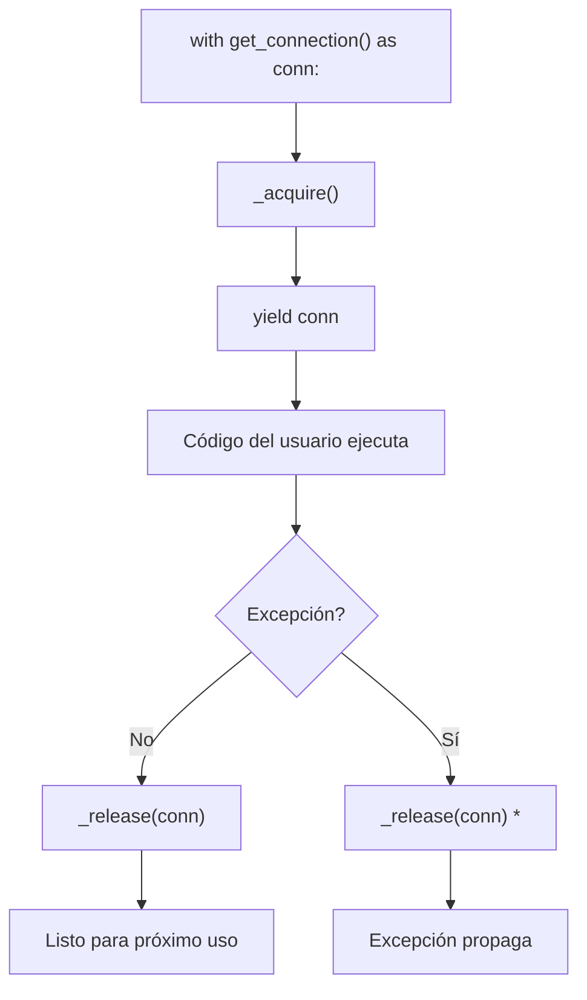

# Decoradores y Administradores de Contexto

Los decoradores y administradores de contexto son características potentes de Python que permiten modificar comportamiento y gestionar recursos de forma elegante. Ambos dependen del soporte de funciones de primera clase de Python.

## Funciones de Primera Clase

En Python, las funciones son objetos — pueden asignarse, pasarse y devolverse:

```python
def square(x: int) -> int:
    return x * x

def cube(x: int) -> int:
    return x * x * x

# Asignar a variable
f = square
print(f(5))  # 25

# Pasar como argumento
def apply(func, value):
    return func(value)

print(apply(square, 4))   # 16
print(apply(cube, 3))     # 27

# Devolver desde función
def get_operation(name: str):
    if name == "square":
        return square
    elif name == "cube":
        return cube
    else:
        return lambda x: x

op = get_operation("square")
print(op(6))  # 36
```

> [!NOTE]
> Las funciones pueden tener atributos, almacenarse en estructuras de datos y pasarse como callbacks — como cualquier otro objeto.

## Closure — Funciones que Recuerdan su Ámbito

```python
def make_multiplier(factor: float):
    def multiplier(x: float) -> float:
        return x * factor
    return multiplier

double = make_multiplier(2)
triple = make_multiplier(3)

print(double(5))   # 10
print(triple(5))   # 15
```

## Decoradores — Lo Básico

Un decorador es una función que toma otra función y extiende su comportamiento:

```python
def logger(func):
    def wrapper(*args, **kwargs):
        print(f"Calling {func.__name__} with {args}, {kwargs}")
        result = func(*args, **kwargs)
        print(f"{func.__name__} returned {result}")
        return result
    return wrapper

@logger
def add(a: int, b: int) -> int:
    return a + b

print(add(3, 5))
# Calling add with (3, 5), {}
# add returned 8
# 8
```

La sintaxis `@logger` es equivalente a: `add = logger(add)`

> [!WARNING]
> Sin `functools.wraps`, las funciones decoradas pierden sus metadatos (nombre, docstring, firma). ¡Úsalo siempre!

## Preservando Metadatos con `@wraps`

```python
import functools

def logger(func):
    @functools.wraps(func)
    def wrapper(*args, **kwargs):
        print(f"Calling {func.__name__}")
        return func(*args, **kwargs)
    return wrapper

@logger
def greet(name: str) -> str:
    """Saludar a alguien educadamente."""
    return f"Hello, {name}!"

print(greet.__name__)   # greet (¡no wrapper!)
print(greet.__doc__)    # Saludar a alguien educadamente. (¡preservado!)
help(greet)             # Muestra firma correcta
```

## Decoradores con Argumentos

```python
import functools

def repeat(times: int = 2):
    def decorator(func):
        @functools.wraps(func)
        def wrapper(*args, **kwargs):
            for _ in range(times):
                result = func(*args, **kwargs)
            return result
        return wrapper
    return decorator

@repeat(times=3)
def say_hello(name: str):
    print(f"Hello, {name}!")

say_hello("Alice")
# Hello, Alice!
# Hello, Alice!
# Hello, Alice!
```

## Apilando Decoradores

```python
import functools
import time

def logger(func):
    @functools.wraps(func)
    def wrapper(*args, **kwargs):
        print(f"→ {func.__name__}")
        return func(*args, **kwargs)
    return wrapper

def timer(func):
    @functools.wraps(func)
    def wrapper(*args, **kwargs):
        start = time.perf_counter()
        result = func(*args, **kwargs)
        elapsed = time.perf_counter() - start
        print(f"  {func.__name__} took {elapsed:.4f}s")
        return result
    return wrapper

@logger
@timer
def slow_add(a: int, b: int) -> int:
    time.sleep(0.1)
    return a + b

slow_add(3, 5)
# → wrapper  (más externo: logger)
#   wrapper took 0.1002s  (interno: timer)
# 8
```

> [!NOTE]
> Los decoradores se aplican de abajo arriba y se ejecutan de arriba abajo. `@logger @timer` significa `logger(timer(func))`.

## Mundo Real: Decorador de Reintento

```python
import functools
import time
import random

def retry(max_attempts: int = 3, delay: float = 1.0, backoff: float = 2.0):
    def decorator(func):
        @functools.wraps(func)
        def wrapper(*args, **kwargs):
            last_exception = None
            for attempt in range(1, max_attempts + 1):
                try:
                    return func(*args, **kwargs)
                except (ConnectionError, TimeoutError) as e:
                    last_exception = e
                    if attempt < max_attempts:
                        wait = delay * (backoff ** (attempt - 1))
                        print(f"Attempt {attempt} failed. Retrying in {wait:.1f}s...")
                        time.sleep(wait)
            raise last_exception
        return wrapper
    return decorator

@retry(max_attempts=3, delay=0.5)
def fetch_data(url: str) -> str:
    if random.random() < 0.7:
        raise ConnectionError("Network timeout")
    return f"Data from {url}"

try:
    result = fetch_data("https://api.example.com")
    print(result)
except ConnectionError:
    print("All retries exhausted")
```

## Decoradores Basados en Clase

```python
import functools

class CountCalls:
    def __init__(self, func):
        functools.update_wrapper(self, func)
        self.func = func
        self.count = 0

    def __call__(self, *args, **kwargs):
        self.count += 1
        print(f"Call {self.count} of {self.func.__name__}")
        return self.func(*args, **kwargs)

@CountCalls
def say(message: str):
    print(message)

say("Hi")   # Call 1 of say
say("Bye")  # Call 2 of say
print(f"Called {say.count} times")  # Called 2 times
```

## Administradores de Contexto — La Declaración `with`

Los administradores de contexto configuran y liberan recursos automáticamente:

```python
# Sin administrador de contexto
f = open("file.txt", "w")
f.write("data")
f.close()  # ¡Fácil de olvidar!

# Con administrador de contexto
with open("file.txt", "w") as f:
    f.write("data")
# Cerrado automáticamente, incluso en excepción
```

### Creando Administradores de Contexto con una Clase

```python
class ManagedFile:
    def __init__(self, path: str, mode: str = "r"):
        self.path = path
        self.mode = mode

    def __enter__(self):
        self.file = open(self.path, self.mode)
        return self.file

    def __exit__(self, exc_type, exc_val, exc_tb):
        self.file.close()
        # Devuelve False para propagar excepciones, True para suprimir
        return False

with ManagedFile("hello.txt", "w") as f:
    f.write("Hello, context manager!")
```

> [!NOTE]
> En `__exit__`, devolver `True` suprime cualquier excepción que ocurrió. Devolver `False` (o `None`) la deja propagar. Suprime excepciones solo cuando las manejes intencionalmente.

### Usando `@contextmanager`

```python
from contextlib import contextmanager

@contextmanager
def managed_file(path: str, mode: str = "r"):
    file = open(path, mode)
    try:
        yield file
    finally:
        file.close()

with managed_file("hello.txt", "w") as f:
    f.write("Much shorter!")
```

## Patrones Comunes de Administradores de Contexto

```python
from contextlib import contextmanager
import time

@contextmanager
def timer(message: str = "Block"):
    start = time.perf_counter()
    yield
    elapsed = time.perf_counter() - start
    print(f"{message} took {elapsed:.4f}s")

with timer("Heavy computation"):
    time.sleep(0.5)

@contextmanager
def change_directory(path: str):
    import os
    old_cwd = os.getcwd()
    os.chdir(path)
    try:
        yield
    finally:
        os.chdir(old_cwd)

with change_directory("/tmp"):
    print(f"Working in {os.getcwd()}")
print(f"Back to {os.getcwd()}")

@contextmanager
def transaction(db):
    db.begin()
    try:
        yield db
        db.commit()
    except Exception:
        db.rollback()
        raise
```

## Administradores de Contexto Incorporados

```python
from contextlib import redirect_stdout, redirect_stderr, nullcontext, suppress
import io

# Redirigir stdout
buf = io.StringIO()
with redirect_stdout(buf):
    print("This goes to buffer")
print(buf.getvalue())  # "This goes to buffer"

# Suprimir excepciones específicas
with suppress(FileNotFoundError, PermissionError):
    with open("/etc/shadow") as f:
        print(f.read())  # Ignorado silenciosamente

# nullcontext — no hace nada (útil para administradores condicionales)
def process_file(path: str, compress: bool = False):
    ctx = gzip.open(path, "rt") if compress else nullcontext(open(path))
    with ctx as f:
        return f.read()
```

> [!WARNING]
> `@contextmanager` requiere el patrón `try/finally` en el generador. Si el bloque envuelto lanza una excepción, el generador se reanuda en `yield` y el `finally` asegura la limpieza. Sin `try/finally`, los recursos podrían filtrarse en excepciones.

## Mundo Real: Pool de Conexiones de Base de Datos

```python
from contextlib import contextmanager
from typing import Optional

class DatabaseConnection:
    def __init__(self, host: str):
        self.host = host
        self.connected = False

    def connect(self):
        print(f"Connecting to {self.host}...")
        self.connected = True

    def disconnect(self):
        print(f"Disconnecting from {self.host}...")
        self.connected = False

    def query(self, sql: str) -> list:
        if not self.connected:
            raise RuntimeError("Not connected")
        return [f"Result of: {sql}"]

class ConnectionPool:
    def __init__(self, host: str, max_connections: int = 5):
        self.host = host
        self.max_connections = max_connections
        self._pool: list[DatabaseConnection] = []

    @contextmanager
    def get_connection(self) -> DatabaseConnection:
        conn = self._acquire()
        try:
            yield conn
        finally:
            self._release(conn)

    def _acquire(self) -> DatabaseConnection:
        if self._pool:
            return self._pool.pop()
        return DatabaseConnection(self.host)

    def _release(self, conn: DatabaseConnection):
        if len(self._pool) < self.max_connections:
            self._pool.append(conn)
        else:
            conn.disconnect()

pool = ConnectionPool("db.example.com")
with pool.get_connection() as conn:
    results = conn.query("SELECT * FROM users")
    print(results)
# Conexión devuelta al pool automáticamente
```



> [!SUCCESS]
| Decoradores | Administradores de Contexto |
|-------------|-----------------------------|
| Modifican/envuelven funciones | Gestionan recursos |
| Usados con sintaxis `@` | Usados con sintaxis `with` |
| Comúnmente preocupaciones transversales (logging, auth, timing) | Ciclo de vida de recursos (archivos, locks, conexiones) |
| Pueden ser basados en clase o función | Pueden ser basados en clase o generador |

## Preguntas de Práctica

1. ¿Qué hace `@functools.wraps` y por qué es importante en decoradores?
2. Escribe un decorador `@timed` que imprima cuánto tiempo tarda una función en ejecutarse.
3. ¿Cómo creas un decorador que acepta argumentos (ej.: `@repeat(n=5)`)?
4. ¿Qué sucede cuando apilas múltiples decoradores en una sola función? ¿En qué orden se aplican?
5. Escribe un administrador de contexto `@contextmanager` que cambie temporalmente el directorio de trabajo.
6. ¿Cuál es el propósito de los métodos `__enter__` y `__exit__` en un administrador de contexto basado en clase?
7. ¿Qué hace devolver `True` desde `__exit__`? ¿Cuándo podrías usar esto?
8. Crea un decorador `@validate_args` que verifique que todos los argumentos sean números positivos.
9. Escribe un administrador de contexto que adquiera y libere un threading.Lock.
10. ¿Cómo suprimes excepciones específicas usando `contextlib.suppress`? Da un ejemplo.
