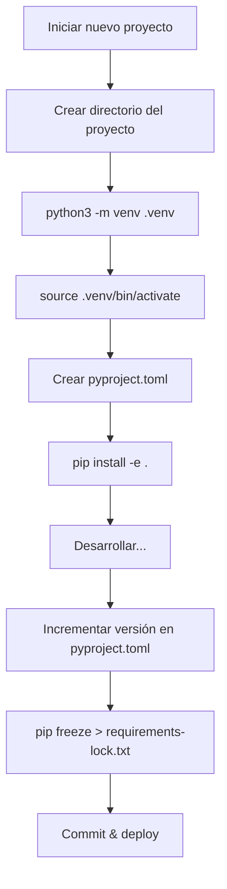

# pip y Entornos Virtuales

El desarrollo profesional en Python requiere gestionar dependencias y aislar entornos de proyecto. Esta lección cubre pip, entornos virtuales y estándares modernos de empaquetado.

## ¿Qué Son los Entornos Virtuales?

Un entorno virtual es una instalación Python aislada que mantiene las dependencias del proyecto separadas:

```
System Python
└── packages: requests@2.28, flask@2.3

Project A (venv)
└── packages: django@4.2, requests@2.31

Project B (venv)
└── packages: flask@3.0, requests@2.28
```

> [!NOTE]
> Sin entornos virtuales, las versiones conflictivas de paquetes entre proyectos serían imposibles de gestionar. Cada proyecto tiene su propio universo de dependencias.

## Creando y Usando `venv`

```bash
# Crear un entorno virtual
python3 -m venv .venv

# Activarlo (Linux/macOS)
source .venv/bin/activate

# Activarlo (Windows)
.venv\Scripts\activate

# Desactivar
deactivate
```

```python
import sys
print(sys.executable)  # Muestra qué Python se está usando
# Con venv activo: /path/to/project/.venv/bin/python
# Sin: /usr/bin/python3
```

> [!WARNING]
| Peligro | Solución |
|---------|----------|
| Olvidar activar el venv | Verifica `which python` o `sys.executable` |
| Comprometer `.venv` en git | Añade `.venv/` a `.gitignore` |
| Usar `sudo pip install` | ¡Nunca hagas esto — rompe paquetes del sistema! |

## `pip` — Instalando Paquetes

```bash
# Instalar un paquete
pip install requests

# Instalar una versión específica
pip install requests==2.31.0
pip install "requests>=2.28,<3.0"

# Instalar desde archivo requirements
pip install -r requirements.txt

# Actualizar un paquete
pip install --upgrade requests

# Desinstalar
pip uninstall requests -y

# Listar paquetes instalados
pip list

# Mostrar información del paquete
pip show requests
```

## `requirements.txt`

```txt
# requirements.txt
requests==2.31.0
flask>=2.3,<3.0
pandas~=2.0.0    # Versión compatible: >=2.0.0, <2.1.0
numpy             # Cualquier versión
-e .              # Instalación editable (proyecto actual)
```

```bash
# Generar desde el entorno actual
pip freeze > requirements.txt

# Instalar desde archivo
pip install -r requirements.txt
```

> [!NOTE]
> `pip freeze` genera TODOS los paquetes instalados incluyendo dependencias. Para un archivo más ligero, lista solo las dependencias directas y usa `pip install -r` para resolver las transitivas.

## `pip freeze` vs `pip list`

```bash
pip list          # Tabla formateada, concisa
pip freeze        # Formato compatible con pip install -r, incluye versiones
pip list --format=freeze  # Misma salida que pip freeze
```

## Especificadores de Versión

| Especificador | Significado |
|--------------|-------------|
| `==2.31.0` | Exactamente versión 2.31.0 |
| `>=2.28` | Versión 2.28 o superior |
| `<=3.0` | Versión 3.0 o inferior |
| `>2.0,<3.0` | Cualquier versión en el rango (exclusivo) |
| `~=2.0.0` | Versión compatible: `>=2.0.0, <2.1.0` |
| `!=2.0.0` | Cualquier versión excepto 2.0.0 |
| `*` | Cualquier versión (ej.: `==2.*` significa 2.x) |

## `pyproject.toml` — Empaquetado Moderno en Python

```toml
[build-system]
requires = ["setuptools>=68.0", "wheel"]
build-backend = "setuptools.backends._legacy:_Backend"

[project]
name = "my-data-tool"
version = "0.1.0"
description = "A tool for processing data files"
authors = [
    {name = "Alice Developer", email = "alice@example.com"}
]
requires-python = ">=3.10"
dependencies = [
    "requests>=2.28",
    "pandas>=2.0",
    "click>=8.0",
]

[project.optional-dependencies]
dev = [
    "pytest>=7.0",
    "black>=23.0",
    "ruff>=0.1",
]
test = [
    "pytest>=7.0",
    "pytest-cov>=4.0",
]
```

```bash
# Instalar con dependencias de desarrollo
pip install -e ".[dev]"

# Instalar con dependencias de prueba
pip install -e ".[test]"

# Instalar todas las dependencias opcionales
pip install -e ".[dev,test]"
```

> [!SUCCESS]
| Archivo | Propósito | Estado |
|---------|-----------|--------|
| `requirements.txt` | Fijar versiones exactas para despliegue | Aún común |
| `setup.py` | Metadatos del paquete e instalación | Legado |
| `setup.cfg` | Configuración declarativa | Transicional |
| `pyproject.toml` | Estándar moderno (PEP 518/621) | **Mejor práctica actual** |

## Archivos de Lock y Builds Reproducibles

```bash
# Generar requirements bloqueados
pip freeze > requirements-lock.txt

# Instalar desde archivo de lock
pip install -r requirements-lock.txt

# Verificar paquetes desactualizados
pip list --outdated
```

Para archivos de lock de nivel profesional, considera:

```bash
# pip-tools
pip install pip-tools
pip-compile pyproject.toml  # genera requirements.txt
pip-sync requirements.txt   # coincide entorno con archivo

# Poetry
poetry lock
poetry install

# pipenv
pipenv lock
pipenv install
```

## Comandos Avanzados de pip

```bash
# Descargar paquetes sin instalar (ej.: para sistemas sin internet)
pip download -r requirements.txt -d ./packages/

# Instalar desde directorio local
pip install ./packages/requests-2.31.0.tar.gz

# Instalar desde GitHub
pip install git+https://github.com/psf/requests.git
pip install git+https://github.com/psf/requests.git@v2.31.0

# Instalar con restricciones
pip install -c constraints.txt

# Verificar problemas de dependencia
pip check

# Gestión de caché
pip cache list
pip cache remove requests
pip cache purge
```

## Mundo Real: Script de Inicialización de Proyecto

```python
#!/usr/bin/env python3
"""Inicializar un nuevo proyecto Python con venv y dependencias."""

import subprocess
import sys
from pathlib import Path

PYPROJECT_CONTENT = """\
[build-system]
requires = ["setuptools>=68.0", "wheel"]
build-backend = "setuptools.backends._legacy:_Backend"

[project]
name = "{project_name}"
version = "0.1.0"
description = ""
requires-python = ">=3.10"
dependencies = []

[project.optional-dependencies]
dev = ["pytest>=7.0", "black>=23.0", "ruff>=0.1"]
"""

GITIGNORE_CONTENT = """\
# Python
__pycache__/
*.py[cod]
*.egg-info/
.venv/
.eggs/
dist/
build/
"""

def bootstrap(project_name: str) -> None:
    project_dir = Path.cwd() / project_name
    project_dir.mkdir(exist_ok=True)

    # Crear pyproject.toml
    (project_dir / "pyproject.toml").write_text(
        PYPROJECT_CONTENT.format(project_name=project_name)
    )

    # Crear .gitignore
    (project_dir / ".gitignore").write_text(GITIGNORE_CONTENT)

    # Crear entorno virtual
    venv_dir = project_dir / ".venv"
    subprocess.run([sys.executable, "-m", "venv", str(venv_dir)], check=True)

    # Determinar ruta de pip
    pip_path = venv_dir / "bin" / "pip"
    if not pip_path.exists():
        pip_path = venv_dir / "Scripts" / "pip.exe"

    # Instalar dependencias de desarrollo
    subprocess.run([str(pip_path), "install", "-e", ".[dev]"], cwd=project_dir, check=True)

    print(f"Project {project_name} bootstrapped at {project_dir}")
    print(f"Activate: source {venv_dir}/bin/activate")

if __name__ == "__main__":
    if len(sys.argv) != 2:
        print("Usage: python bootstrap.py <project-name>")
        sys.exit(1)
    bootstrap(sys.argv[1])
```

## Solución de Problemas Comunes de pip

```bash
# Error "externally-managed-environment" (PEP 668)
# ¡Usa un entorno virtual! Esto es una característica, no un error.
python3 -m venv .venv
source .venv/bin/activate

# Errores de certificado SSL
pip install --trusted-host pypi.org --trusted-host files.pythonhosted.org <package>

# Permiso denegado (no usando venv)
pip install --user <package>  # O mejor: usa un venv

# Incompatibilidad de hash
pip install --no-cache-dir <package>

# Conflictos de dependencia
pip check
pip install pipdeptree
pipdeptree  # Visualizar árbol de dependencias
```



> [!SUCCESS]
> Usa siempre un entorno virtual para cada proyecto. Es la práctica más importante de Python — previniendo conflictos de versión, permitiendo builds reproducibles y manteniendo tu Python del sistema limpio.

## Preguntas de Práctica

1. ¿Cuál es el propósito de un entorno virtual? ¿Por qué deberías usar uno para cada proyecto?
2. ¿Cómo creas y activas un entorno virtual llamado `.venv`?
3. ¿Cuál es la diferencia entre `pip freeze` y `pip list`? ¿Cuál usarías para un archivo requirements?
4. Escribe un `requirements.txt` que fije `requests` en la versión 2.31.x y permita cualquier versión de parche de `pandas` por encima de 2.0.
5. ¿Qué hace `pip install -e .`? ¿Cuándo lo usarías?
6. ¿Qué es `pyproject.toml` y en qué se diferencia de `setup.py`?
7. ¿Cómo instalas grupos de dependencias opcionales como `[dev]` desde `pyproject.toml`?
8. ¿Qué verifica `pip check` y cuándo lo ejecutarías?
9. ¿Qué es el error "externally-managed-environment" de PEP 668 y cómo lo solucionas?
10. Crea una secuencia de comandos shell que: cree un directorio de proyecto, configure un venv, lo active e instale paquetes desde requirements.txt.
