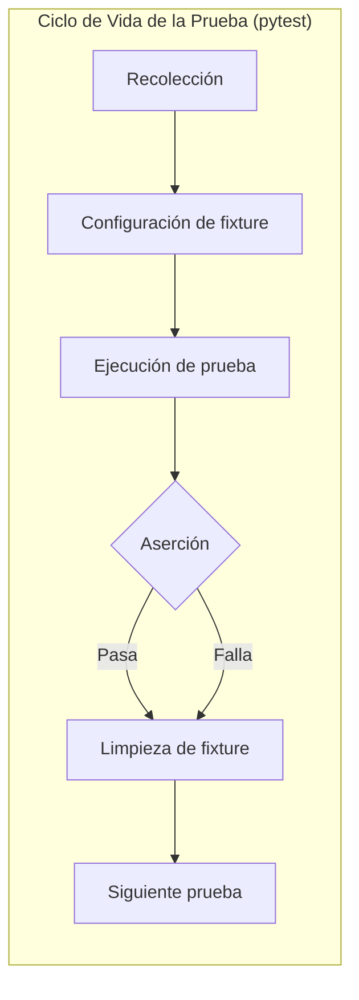
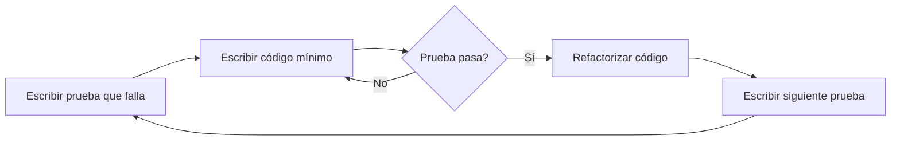

# Pruebas Unitarias

Las pruebas garantizan que tu código funciona correctamente y se mantiene correcto a medida que evoluciona. La biblioteca estándar de Python incluye `unittest`, y la comunidad usa ampliamente `pytest` por su simplicidad y potencia.

## ¿Por Qué Probar?

| Beneficio | Descripción |
|-----------|-------------|
| Detectar regresiones | Cambios que rompen el comportamiento existente se detectan inmediatamente |
| Documentar comportamiento | Las pruebas sirven como documentación ejecutable |
| Permitir refactorización | Reestructura código con confianza sabiendo que las pruebas protegen la corrección |
| Mejora de diseño | El código comprobable tiende a estar mejor estructurado |

## El Módulo `unittest`

```python
import unittest

def add(a: int, b: int) -> int:
    return a + b

class TestAdd(unittest.TestCase):
    def test_add_positive(self):
        self.assertEqual(add(2, 3), 5)

    def test_add_negative(self):
        self.assertEqual(add(-1, 1), 0)

    def test_add_zero(self):
        self.assertEqual(add(0, 0), 0)

if __name__ == "__main__":
    unittest.main()
```

```bash
python -m unittest test_math.py
python -m unittest test_math.TestAdd
python -m unittest test_math.TestAdd.test_add_positive
```

## Métodos `assert` Comunes

| Método | Verifica |
|--------|----------|
| `assertEqual(a, b)` | `a == b` |
| `assertNotEqual(a, b)` | `a != b` |
| `assertTrue(x)` | `bool(x) is True` |
| `assertFalse(x)` | `bool(x) is False` |
| `assertIs(a, b)` | `a is b` |
| `assertIsNone(x)` | `x is None` |
| `assertIn(a, b)` | `a in b` |
| `assertNotIn(a, b)` | `a not in b` |
| `assertRaises(Exc, func, *args)` | `func(*args)` lanza `Exc` |
| `assertAlmostEqual(a, b)` | Floats dentro de tolerancia (7 decimales) |
| `assertIsInstance(obj, cls)` | `isinstance(obj, cls)` |

```python
import unittest

class TestAssertions(unittest.TestCase):
    def test_assertions(self):
        self.assertAlmostEqual(0.1 + 0.2, 0.3)  # ¡Floats!
        self.assertRaises(ValueError, int, "not_a_number")
        self.assertIn("key", {"key": 42})
        self.assertIsInstance(3.14, float)

    def test_assert_raises_context_manager(self):
        with self.assertRaises(ZeroDivisionError):
            1 / 0

    def test_assert_raises_with_message(self):
        with self.assertRaisesRegex(ValueError, "invalid"):
            int("invalid")
```

## Fixtures de Prueba — `setUp` y `tearDown`

```python
import unittest
import tempfile
from pathlib import Path

class TestFileProcessor(unittest.TestCase):
    def setUp(self):
        """Crear un directorio temporal y archivo de prueba antes de cada prueba."""
        self.tmp_dir = tempfile.TemporaryDirectory()
        self.test_file = Path(self.tmp_dir.name) / "test.txt"
        self.test_file.write_text("Hello, World!")

    def tearDown(self):
        """Limpiar directorio temporal después de cada prueba."""
        self.tmp_dir.cleanup()

    def test_file_exists(self):
        self.assertTrue(self.test_file.exists())

    def test_file_content(self):
        content = self.test_file.read_text()
        self.assertEqual(content, "Hello, World!")

    def test_file_deletion(self):
        self.test_file.unlink()
        self.assertFalse(self.test_file.exists())
```

> [!NOTE]
| Método | Cuándo | Frecuencia |
|--------|--------|------------|
| `setUp` | Antes de cada método de prueba | Por prueba |
| `tearDown` | Después de cada método de prueba | Por prueba |
| `setUpClass` | Antes de todas las pruebas en la clase | Una vez por clase |
| `tearDownClass` | Después de todas las pruebas en la clase | Una vez por clase |

```python
class TestDatabase(unittest.TestCase):
    @classmethod
    def setUpClass(cls):
        print("Setting up database connection...")
        cls.db = {"alice": 100, "bob": 200}  # BD simulada

    @classmethod
    def tearDownClass(cls):
        print("Closing database connection...")
        cls.db = None

    def test_get_balance(self):
        self.assertEqual(self.db["alice"], 100)

    def test_update_balance(self):
        self.db["alice"] = 150
        self.assertEqual(self.db["alice"], 150)
```

## Mocking con `unittest.mock`

Los objetos Mock reemplazan dependencias reales para aislar el código bajo prueba:

```python
from unittest.mock import Mock, patch
import unittest

class PaymentProcessor:
    def __init__(self, api_client):
        self.api = api_client

    def process_payment(self, user_id: str, amount: float) -> dict:
        user = self.api.get_user(user_id)
        if not user.get("active"):
            raise ValueError("User not active")
        result = self.api.charge(user_id, amount)
        self.api.send_receipt(user_id, result["transaction_id"])
        return result

class TestPaymentProcessor(unittest.TestCase):
    def test_process_payment_success(self):
        mock_api = Mock()
        mock_api.get_user.return_value = {"id": "42", "active": True}
        mock_api.charge.return_value = {"transaction_id": "txn_123", "status": "success"}

        processor = PaymentProcessor(mock_api)
        result = processor.process_payment("42", 50.0)

        self.assertEqual(result["status"], "success")
        mock_api.get_user.assert_called_once_with("42")
        mock_api.charge.assert_called_once_with("42", 50.0)
        mock_api.send_receipt.assert_called_once_with("42", "txn_123")
```

### Usando `patch` — reemplazando objetos temporalmente

```python
from unittest.mock import patch
import unittest
import requests

def fetch_user(user_id: int) -> dict:
    response = requests.get(f"https://api.example.com/users/{user_id}")
    response.raise_for_status()
    return response.json()

class TestFetchUser(unittest.TestCase):
    @patch("requests.get")
    def test_fetch_user_success(self, mock_get):
        mock_response = Mock()
        mock_response.json.return_value = {"id": 1, "name": "Alice"}
        mock_response.raise_for_status.return_value = None
        mock_get.return_value = mock_response

        result = fetch_user(1)
        self.assertEqual(result["name"], "Alice")
        mock_get.assert_called_once_with("https://api.example.com/users/1")

    @patch("requests.get")
    def test_fetch_user_http_error(self, mock_get):
        mock_response = Mock()
        mock_response.raise_for_status.side_effect = requests.HTTPError("Not Found")
        mock_get.return_value = mock_response

        with self.assertRaises(requests.HTTPError):
            fetch_user(999)
```

> [!WARNING]
> Siempre aplica patch donde el objeto ES BUSCADO, no donde ESTÁ DEFINIDO. Usa `@patch("module.function")`, no `@patch("library.module.function")`.

### Side Effects de Mock

```python
from unittest.mock import Mock

# Valores de retorno alternados
mock = Mock()
mock.side_effect = [1, 2, 3]
print(mock())  # 1
print(mock())  # 2
print(mock())  # 3

# Lanzando excepciones
mock.side_effect = ValueError("Bad value")
with self.assertRaises(ValueError):
    mock()

# Callable: computar retorno basado en args
mock.side_effect = lambda x: x * 2
print(mock(5))  # 10
print(mock(10)) # 20
```

## Probando con `pytest`

```python
# test_math_pytest.py
def add(a: int, b: int) -> int:
    return a + b

def test_add_positive():
    assert add(2, 3) == 5

def test_add_negative():
    assert add(-1, 1) == 0

def test_add_floats():
    assert add(0.1, 0.2) == pytest.approx(0.3)
```

```bash
pytest                          # Descubrir y ejecutar todas las pruebas
pytest -v                       # Salida verbosa
pytest -k "positive"            # Ejecutar pruebas que coincidan con palabra clave
pytest -x                       # Detenerse en el primer fallo
pytest --tb=short               # Tracebacks más cortos
pytest test_math_pytest.py      # Ejecutar archivo específico
pytest --cov=src                # Con cobertura (pip install pytest-cov)
```

### Fixtures de pytest

```python
import pytest

@pytest.fixture
def sample_data():
    return {"name": "Alice", "age": 30}

@pytest.fixture
def db_connection():
    conn = create_database_connection(":memory:")
    yield conn
    conn.close()

def test_with_fixtures(sample_data, db_connection):
    assert sample_data["name"] == "Alice"
    result = db_connection.query("SELECT 1")
    assert result is not None
```

### Parametrización en pytest

```python
import pytest

@pytest.mark.parametrize("a,b,expected", [
    (2, 3, 5),
    (-1, 1, 0),
    (0, 0, 0),
    (100, 200, 300),
])
def test_add(a: int, b: int, expected: int):
    assert add(a, b) == expected

# Parametrización de fixture
@pytest.fixture(params=["json", "xml", "yaml"])
def parser(request):
    if request.param == "json":
        return JSONParser()
    elif request.param == "xml":
        return XMLParser()

def test_parsing(parser):
    data = parser.parse("<root/>")
    assert data is not None
```



## Mundo Real: Probando un Pipeline de Datos

```python
# pipeline.py
import csv
from pathlib import Path

def load_csv(path: Path) -> list[dict]:
    with open(path, newline="") as f:
        return list(csv.DictReader(f))

def filter_adults(people: list[dict]) -> list[dict]:
    return [p for p in people if int(p["age"]) >= 18]

def compute_average_age(people: list[dict]) -> float:
    if not people:
        raise ValueError("Cannot compute average of empty list")
    ages = [int(p["age"]) for p in people]
    return sum(ages) / len(ages)
```

```python
# test_pipeline.py
import pytest
from pathlib import Path
from pipeline import load_csv, filter_adults, compute_average_age

class TestLoadCSV:
    def test_load_csv_success(self, tmp_path: Path):
        test_file = tmp_path / "test.csv"
        test_file.write_text("name,age\nAlice,30\nBob,15\nCarol,25\n")
        result = load_csv(test_file)
        assert len(result) == 3
        assert result[0]["name"] == "Alice"

    def test_load_csv_empty(self, tmp_path: Path):
        test_file = tmp_path / "empty.csv"
        test_file.write_text("name,age\n")
        result = load_csv(test_file)
        assert result == []

class TestFilterAdults:
    def test_filters_minors(self):
        people = [
            {"name": "Alice", "age": "30"},
            {"name": "Bob", "age": "15"},
            {"name": "Carol", "age": "25"},
        ]
        result = filter_adults(people)
        assert len(result) == 2
        assert all(p["name"] != "Bob" for p in result)

class TestComputeAverageAge:
    def test_average(self):
        people = [{"name": "A", "age": "20"}, {"name": "B", "age": "30"}]
        assert compute_average_age(people) == 25.0

    def test_empty_raises(self):
        with pytest.raises(ValueError, match="Cannot compute"):
            compute_average_age([])
```

## Ciclo de Desarrollo Guiado por Pruebas (TDD)



> [!SUCCESS]
| Principio | Por qué |
|-----------|--------|
| Prueba una cosa por prueba | Depuración simple, mensajes de fallo claros |
| Usa nombres de prueba descriptivos | `test_withdraw_reduces_balance` no `test_1` |
| Aísla pruebas | Cada prueba debe configurar y limpiar su propio estado |
| Prueba casos extremos | Entrada vacía, valores límite, condiciones de error |
| Haz pruebas rápidas | Las pruebas lentas no se ejecutan con frecuencia |

## Preguntas de Práctica

1. ¿Cuál es la diferencia entre `setUp` / `tearDown` y `setUpClass` / `tearDownClass`?
2. Escribe un `unittest.TestCase` que pruebe una función `is_palindrome(s: str) -> bool`.
3. ¿Qué hace `@patch` y dónde deberías aplicarlo en relación con el módulo bajo prueba?
4. Escribe una fixture de pytest que cree un directorio temporal con archivos de datos de prueba.
5. ¿Cómo usas `@pytest.mark.parametrize` para probar una función con múltiples entradas?
6. ¿Cuál es el propósito de `Mock.side_effect`? Proporciona un ejemplo con una lista y un callable.
7. Escribe una prueba para una función que lee un archivo y devuelve su contenido. Mock la operación de apertura de archivo.
8. ¿Qué métodos proporciona `unittest.mock.Mock` para verificar cómo se llamó a un mock?
9. ¿Cómo descubre `pytest` archivos y funciones de prueba? ¿Qué convenciones de nomenclatura sigue?
10. Escribe una suite de pruebas completa (usando pytest) para una clase `ShoppingCart` con métodos add, remove y total.
