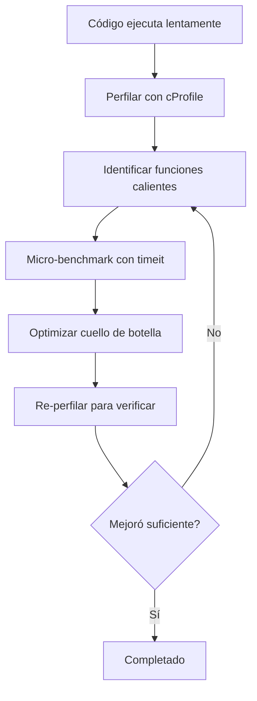

# Depuración y Perfilado

Incluso los desarrolladores experimentados pasan tiempo significativo depurando y optimizando. Python proporciona herramientas integradas potentes para inspeccionar, rastrear y medir el comportamiento y rendimiento de tu código.

## El Módulo `logging`

El módulo `logging` es la alternativa profesional a `print()` para depuración — es configurable, jerárquico y seguro para producción.

```python
import logging

# Configuración básica
logging.basicConfig(
    level=logging.DEBUG,
    format="%(asctime)s [%(levelname)s] %(name)s: %(message)s",
    filename="app.log",  # Omite para salida en consola
)

# Crear un logger para tu módulo
logger = logging.getLogger(__name__)

logger.debug("Detailed debug information")
logger.info("General operational messages")
logger.warning("Something concerning but not an error")
logger.error("A real problem occurred")
logger.critical("System is unusable!")
```

| Nivel | Valor Numérico | Cuándo Usar |
|-------|---------------|-------------|
| `DEBUG` | 10 | Información detallada de diagnóstico |
| `INFO` | 20 | Confirmación de que las cosas funcionan como se espera |
| `WARNING` | 30 | Algo inesperado pero no es un error |
| `ERROR` | 40 | Un problema que impidió una operación |
| `CRITICAL` | 50 | Una falla grave que requiere atención inmediata |

### Configuración de Logging

```python
import logging

# Configuración avanzada
logger = logging.getLogger("my_app")
logger.setLevel(logging.DEBUG)

# File handler
file_handler = logging.FileHandler("app.log")
file_handler.setLevel(logging.WARNING)
file_formatter = logging.Formatter(
    "%(asctime)s [%(levelname)s] %(name)s: %(message)s"
)
file_handler.setFormatter(file_formatter)

# Console handler
console_handler = logging.StreamHandler()
console_handler.setLevel(logging.DEBUG)
console_formatter = logging.Formatter(
    "%(levelname)s: %(message)s"
)
console_handler.setFormatter(console_formatter)

# Añadir handlers
logger.addHandler(file_handler)
logger.addHandler(console_handler)

logger.info("Shows in console only")      # Nivel DEBUG → consola
logger.warning("Shows in both")           # Nivel WARNING → ambos
```

> [!NOTE]
| Patrón | Mejor Práctica |
|--------|----------------|
| `logger = logging.getLogger(__name__)` | Loggers por módulo con nombres jerárquicos |
| `logging.exception("...")` | Registra en nivel ERROR E incluye traceback |
| `logger.debug(f"x = {x}")` | Evita f-strings en debug — usa formato `%s` para evaluación perezosa |

### Logging Estructurado

```python
import logging

logger = logging.getLogger(__name__)

try:
    result = risky_operation()
except Exception as e:
    logger.exception(
        "Operation failed for user %s",
        {"user_id": 42, "operation": "payment"},
    )

# Contexto extra
logger.info("User action", extra={
    "user_id": user.id,
    "action": "login",
    "ip": request.ip,
})
```

## Depuración con `pdb`

El Depurador de Python permite pausar la ejecución, inspeccionar variables y recorrer el código:

```python
# Insertar breakpoint (Python 3.7+)
def divide(a: int, b: int) -> float:
    result = a / b
    breakpoint()  # Abre pdb
    return result

divide(10, 2)
```

```python
# Equivalente a:
import pdb; pdb.set_trace()
```

### Comandos de pdb

| Comando | Atajo | Descripción |
|---------|-------|-------------|
| `next` | `n` | Ejecutar siguiente línea (pasar por encima) |
| `step` | `s` | Entrar en llamada de función |
| `continue` | `c` | Continuar hasta próximo breakpoint |
| `list` | `l` | Mostrar código fuente alrededor de la línea actual |
| `print expr` | `p` | Evaluar e imprimir expresión |
| `pp expr` | `pp` | Imprimir expresión formateada |
| `args` | `a` | Imprimir argumentos de la función |
| `locals()` | — | Imprimir todas las variables locales |
| `break lineno` | `b` | Definir breakpoint en número de línea |
| `disable nb` | — | Deshabilitar breakpoint por número |
| `where` | `w` | Imprimir rastreo de la pila |
| `up` | `u` | Subir un marco en la pila |
| `down` | `d` | Bajar un marco en la pila |
| `quit` | `q` | Salir del depurador |

```python
# demostración de pdb
def process_data(items: list[int]) -> int:
    total = 0
    for i, item in enumerate(items):
        total += item
        if total > 100:
            breakpoint()  # Inspeccionar estado aquí
    return total

process_data([10, 20, 30, 50, 100])
```

> [!WARNING]
> Elimina las llamadas `breakpoint()` antes de comprometer código. Considera usar una guarda de variable de entorno: `if os.getenv("DEBUG"): breakpoint()`

### Depuración Post-Mortem

```python
import pdb

def buggy_function():
    x = 1
    y = 0
    return x / y

try:
    buggy_function()
except ZeroDivisionError:
    pdb.post_mortem()  # Abre depurador en el lugar del fallo
```

### Ejecutando pdb desde la Línea de Comandos

```bash
python -m pdb my_script.py       # Iniciar depurador desde la primera línea
python -m pdb -c "b 42" script.py  # Definir breakpoint en línea 42
```

## Perfilado con `cProfile`

`cProfile` mide cuánto tiempo tarda cada función en ejecutarse:

```python
import cProfile
import pstats

def slow_function():
    total = 0
    for i in range(10_000_000):
        total += i
    return total

def fast_function():
    return sum(range(10_000_000))

# Perfilar una llamada específica
cProfile.run("fast_function()", sort="time")
```

```python
# Perfilado detallado
profiler = cProfile.Profile()
profiler.enable()

slow_function()
fast_function()

profiler.disable()
stats = pstats.Stats(profiler)
stats.sort_stats("cumtime")  # Ordenar por tiempo acumulativo
stats.print_stats(10)        # Mostrar top 10
```

> [!NOTE]
> `cProfile` tiene una sobrecarga muy baja — típicamente < 1% de ralentización. Es seguro usarlo en cargas de trabajo similares a las de producción.

### Perfilado desde la Línea de Comandos

```bash
python -m cProfile -o output.prof my_script.py
python -m pstats output.prof  # Navegador interactivo de estadísticas
```

```text
# Ejemplo de salida:
ncalls  tottime  percall  cumtime  percall  filename:lineno(function)
     1   0.000    0.000    0.500    0.500  script.py:10(slow_function)
     1   0.000    0.000    0.002    0.002  script.py:15(fast_function)
```

| Columna | Significado |
|---------|-------------|
| `ncalls` | Número de llamadas |
| `tottime` | Tiempo total en esta función (excluyendo sub-llamadas) |
| `percall` | `tottime` / `ncalls` |
| `cumtime` | Tiempo acumulativo (incluyendo sub-llamadas) |
| `filename:lineno(function)` | Ubicación |

### Visualizando Perfiles

```bash
# Instalar snakeviz para perfilado visual
pip install snakeviz
python -m cProfile -o output.prof my_script.py
snakeviz output.prof  # Abre gráfico de llamas interactivo en el navegador
```

## Midiendo Tiempo con `timeit`

`timeit` proporciona mediciones precisas de tiempo ejecutando código múltiples veces:

```python
import timeit

# Medir una declaración
execution_time = timeit.timeit("sum(range(1000))", number=10_000)
print(f"Average: {execution_time / 10_000 * 1_000_000:.2f} μs")

# Medir desde la línea de comandos
# python -m timeit "sum(range(1000))"
# 100000 loops, best of 5: 6.2 usec per loop
```

```python
# Comparando enfoques
setup = "import random; data = [random.random() for _ in range(1000)]"

method1 = timeit.timeit("sorted(data)", setup=setup, number=1000)
method2 = timeit.timeit("data.sort()", setup=setup, number=1000)

print(f"sorted(): {method1:.4f}s")
print(f".sort():  {method2:.4f}s")
print(f"Ratio: {method1 / method2:.2f}x")
```

### Usando `timeit` en Jupyter / Scripts

```python
import timeit

# Para funciones, usa Timer
t = timeit.Timer(lambda: sum(range(1000)))
print(f"Min of 5 runs: {t.timeit(number=1000):.4f}s")

# Repetir para estadísticas
results = timeit.repeat(
    "sum(range(1000))",
    number=10_000,
    repeat=5,
)
print(f"Best: {min(results):.4f}s, Worst: {max(results):.4f}s")
```

> [!WARNING]
| Peligro | Por qué | Solución |
|---------|---------|----------|
| Incluir setup en la medición | Distorsiona resultados | Usa parámetro `setup` |
| Medición de ejecución única | Alta varianza | Ejecuta muchas veces, toma el mínimo |
| Optimizar temprano | Desperdicia esfuerzo | Perfila primero, optimiza cuellos de botella |
| Micro-benchmark != rendimiento real | Caché de CPU, E/S, GC importan | Prueba con tamaños de datos realistas |

## Patrones Comunes de Depuración

```python
# Patrón 1: Breakpoint condicional
DEBUG = os.getenv("DEBUG")
if DEBUG:
    breakpoint()

# Patrón 2: Pretty-print de objetos complejos
from pprint import pprint
data = {"deeply": {"nested": {"structure": [1, 2, [3, 4]]}}}
pprint(data, depth=3)

# Patrón 3: Rastrear llamadas de función
import sys

def trace_calls(frame, event, arg):
    if event == "call":
        print(f"→ {frame.f_code.co_name}")
    return trace_calls

sys.settrace(trace_calls)

# Patrón 4: Decorador de logging
import functools
import logging

logger = logging.getLogger(__name__)

def logged(func):
    @functools.wraps(func)
    def wrapper(*args, **kwargs):
        logger.debug("Calling %s with args=%s kwargs=%s",
                     func.__name__, args, kwargs)
        try:
            result = func(*args, **kwargs)
            logger.debug("%s returned %s", func.__name__, result)
            return result
        except Exception as e:
            logger.exception("%s raised %s", func.__name__, e)
            raise
    return wrapper
```

## Mundo Real: Perfilando una Función Lenta

```python
import cProfile
import pstats
import io

def generate_report(users: list[dict]) -> str:
    lines = []
    for user in users:
        # Construcción ineficiente de cadenas
        line = ""
        for key, value in user.items():
            line += f"{key}: {value}, "
        lines.append(line)

    # Ordenación lenta
    for i in range(len(lines)):
        for j in range(i + 1, len(lines)):
            if lines[i] > lines[j]:
                lines[i], lines[j] = lines[j], lines[i]

    return "\n".join(lines)

# Perfilar la función
profiler = cProfile.Profile()
profiler.enable()

users = [{"name": f"User{i}", "email": f"user{i}@test.com", "score": i}
         for i in range(500)]
result = generate_report(users)

profiler.disable()

# Analizar resultados
s = io.StringIO()
stats = pstats.Stats(profiler, stream=s)
stats.sort_stats("cumtime")
stats.print_stats(20)
print(s.getvalue())
```



> [!SUCCESS]
> "La optimización prematura es la raíz de todos los males" — Donald Knuth. Perfila primero, optimiza después. Usa `logging` para diagnóstico en producción, `pdb` para depuración interactiva y `cProfile` para análisis de rendimiento.

## Preguntas de Práctica

1. ¿Cuáles son los cinco niveles de logging en Python, del menos al más severo?
2. ¿Cómo configuras logging para escribir en un archivo en nivel WARNING y superior, mientras muestras nivel INFO en la consola?
3. ¿Cuál es la diferencia entre los comandos `next` y `step` de `pdb`?
4. ¿Cómo inicias pdb cuando ocurre una excepción sin modificar el código fuente?
5. Ejecuta `python -m cProfile -s time` en un script simple e interpreta los 5 principales resultados.
6. ¿Qué devuelve `timeit.repeat` y por qué es más confiable que una sola medición?
7. Escribe un decorador de logging que registre entrada, salida, excepciones y tiempo de ejecución de la función.
8. ¿Cómo estableces un breakpoint condicional (ej.: detener cuando `x > 100`) en pdb?
9. ¿Cuál es la diferencia entre `tottime` y `cumtime` en la salida de cProfile?
10. Usa `timeit` para comparar `list.append()` vs comprensión de lista para crear una lista de 10,000 cuadrados.
