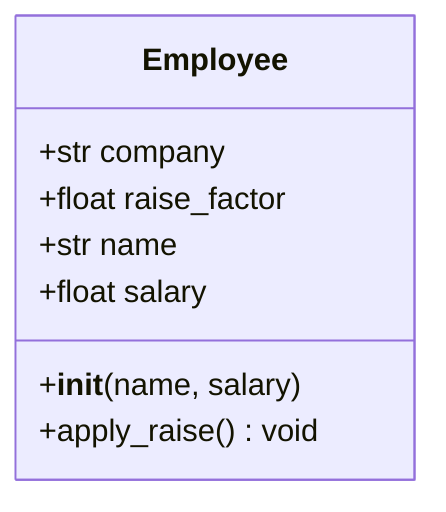

# Classes e Objetos

A programação orientada a objetos (POO) é um paradigma que organiza o código em torno de objetos — pacotes de dados e comportamento. Python suporta POO com uma sintaxe limpa e intuitiva.

## Definindo uma Classe

Uma classe é um modelo para criar objetos:

```python
class Dog:
    def __init__(self, name: str, age: int):
        self.name = name
        self.age = age

    def bark(self) -> str:
        return f"{self.name} says woof!"

    def get_human_years(self) -> int:
        return self.age * 7
```

```python
my_dog = Dog("Rex", 3)
print(my_dog.bark())           # Rex says woof!
print(my_dog.get_human_years())  # 21
```

> [!NOTE]
> Diferente de Java ou C++, Python não requer `new` explícito para instanciar — você simplesmente chama a classe como se fosse uma função.

## O Parâmetro `self`

`self` refere-se à instância atual. Deve ser o primeiro parâmetro de todo método de instância — mas você não o passa; o Python faz isso automaticamente.

```python
class Counter:
    def __init__(self):
        self.count = 0

    def increment(self, amount: int = 1):
        self.count += amount

    def reset(self):
        self.count = 0

c = Counter()
c.increment(5)
print(c.count)  # 5
```

> [!WARNING]
> `self` é apenas uma convenção — você poderia nomeá-lo `this` ou qualquer outra coisa — mas **sempre use `self`** para seguir os padrões da comunidade Python.

## Atributos de Instância vs Classe

| Tipo de Atributo | Definido | Acesso | Compartilhado Entre Instâncias |
|-----------------|----------|--------|-------------------------------|
| Instância | Dentro de `__init__` via `self` | `obj.attr` | Não |
| Classe | Diretamente no corpo da classe | `ClassName.attr` ou `obj.attr` | Sim |

```python
class Employee:
    company = "Acme Corp"       # Atributo de classe
    raise_factor = 1.05         # Atributo de classe

    def __init__(self, name: str, salary: float):
        self.name = name        # Atributo de instância
        self.salary = salary    # Atributo de instância

e1 = Employee("Alice", 70000)
e2 = Employee("Bob", 80000)

print(e1.company)  # Acme Corp (da classe)
e1.raise_factor = 1.10  # Sombra o atributo de classe apenas para esta instância
print(e1.raise_factor)  # 1.10
print(e2.raise_factor)  # 1.05 (inalterado)
```



## `__str__` vs `__repr__`

Estes métodos dunder (sublinhado duplo) controlam como os objetos são exibidos:

| Método | Objetivo | Usado Por | Deve Retornar |
|--------|---------|-----------|---------------|
| `__str__` | Legível para humanos | `print()`, `str()` | String informal e amigável |
| `__repr__` | Inequívoco para desenvolvedores | REPL, `repr()`, depuração | String que pode recriar o objeto |

```python
class Point:
    def __init__(self, x: float, y: float):
        self.x = x
        self.y = y

    def __repr__(self) -> str:
        return f"Point({self.x!r}, {self.y!r})"

    def __str__(self) -> str:
        return f"({self.x}, {self.y})"

p = Point(3.5, 7.2)
print(repr(p))   # Point(3.5, 7.2)
print(str(p))    # (3.5, 7.2)
print(p)         # (3.5, 7.2)  — chama __str__
```

> [!SUCCESS]
> Sempre implemente `__repr__` em suas classes — isso torna a depuração drasticamente mais fácil. Implemente `__str__` quando quiser uma exibição bonita.

## Decoradores de Propriedade

Use `@property` para definir atributos computados com controle de getter/setter:

```python
class Circle:
    def __init__(self, radius: float):
        self._radius = radius

    @property
    def radius(self) -> float:
        return self._radius

    @radius.setter
    def radius(self, value: float):
        if value <= 0:
            raise ValueError("Radius must be positive")
        self._radius = value

    @property
    def area(self) -> float:
        import math
        return math.pi * self._radius ** 2

    @property
    def circumference(self) -> float:
        import math
        return 2 * math.pi * self._radius

c = Circle(5)
print(c.area)           # 78.5398...
c.radius = 10
print(c.circumference)  # 62.8318...
# c.radius = -5  # Lança ValueError
```

## Métodos Dunder Comuns

```python
class BankAccount:
    def __init__(self, owner: str, balance: float = 0.0):
        self.owner = owner
        self.balance = balance

    def __repr__(self) -> str:
        return f"BankAccount({self.owner!r}, {self.balance!r})"

    def __str__(self) -> str:
        return f"{self.owner}'s account: ${self.balance:.2f}"

    def __add__(self, other: "BankAccount") -> float:
        """Combina saldos (ex.: conta conjunta)."""
        return self.balance + other.balance

    def __len__(self) -> int:
        """Número de dólares inteiros."""
        return int(self.balance)

    def __bool__(self) -> bool:
        """Uma conta é verdadeira se tem dinheiro."""
        return self.balance > 0

    def __eq__(self, other: object) -> bool:
        if not isinstance(other, BankAccount):
            return NotImplemented
        return self.owner == other.owner and self.balance == other.balance

a1 = BankAccount("Alice", 1500.50)
a2 = BankAccount("Bob", 300)
print(a1)            # Alice's account: $1500.50
print(a1 + a2)       # 1800.5
print(len(a1))       # 1500
print(bool(a1))      # True
print(a1 == BankAccount("Alice", 1500.50))  # True
```

## Atributos Privados e Name Mangling

Python não possui atributos verdadeiramente privados. A convenção usa sublinhados:

| Convenção | Significado |
|-----------|-------------|
| `name` | Atributo público |
| `_name` | "Protegido" — uso interno (convenção apenas) |
| `__name` | "Privado" — aciona name mangling para `_ClassName__name` |
| `__name__` | Dunder — métodos especiais do Python, não invente os seus |

```python
class Person:
    def __init__(self, name: str):
        self.name = name          # Público
        self._age = 0             # "Protegido"
        self.__ssn = "123-45-6789"  # Name-mangled

    def get_ssn(self) -> str:
        return self.__ssn[-4:]    # Acesso interno funciona

p = Person("Alice")
print(p.name)        # Alice
print(p._age)        # 0 (funciona, mas é mal visto)
# print(p.__ssn)     # AttributeError!
print(p._Person__ssn)  # "123-45-6789" (nome modificado)
```

> [!WARNING]
> Name mangling é para evitar acesso acidental em subclasses, não segurança. Python confia em seus usuários.

## Exemplo do Mundo Real: Registro de Dados

```python
from datetime import datetime
from typing import Optional

class Transaction:
    def __init__(self, amount: float, description: str,
                 timestamp: Optional[datetime] = None):
        self.amount = amount
        self.description = description
        self.timestamp = timestamp or datetime.now()
        self.id = id(self)

    def __repr__(self) -> str:
        return (f"Transaction({self.amount!r}, {self.description!r}, "
                f"timestamp={self.timestamp!r})")

    def __str__(self) -> str:
        return f"[{self.timestamp:%Y-%m-%d %H:%M}] {self.description}: ${self.amount:+.2f}"

class Account:
    def __init__(self, account_holder: str):
        self.holder = account_holder
        self.transactions: list[Transaction] = []

    def deposit(self, amount: float, description: str = "Deposit"):
        if amount <= 0:
            raise ValueError("Deposit amount must be positive")
        self.transactions.append(Transaction(amount, description))

    def withdraw(self, amount: float, description: str = "Withdrawal"):
        if amount <= 0:
            raise ValueError("Withdrawal amount must be positive")
        if self.balance < amount:
            raise ValueError("Insufficient funds")
        self.transactions.append(Transaction(-amount, description))

    @property
    def balance(self) -> float:
        return sum(t.amount for t in self.transactions)

    def __repr__(self) -> str:
        return f"Account({self.holder!r})"

    def __str__(self) -> str:
        return f"{self.holder}'s Account — Balance: ${self.balance:.2f}"

    def __len__(self) -> int:
        return len(self.transactions)

acc = Account("Alice")
acc.deposit(1000, "Salary")
acc.withdraw(200, "Rent")
acc.deposit(500, "Freelance")
print(acc)
for t in acc.transactions:
    print(f"  {t}")
print(f"Total transactions: {len(acc)}")
```

## Quando Usar Classes vs Funções Simples

| Use Classes Quando | Use Funções Quando |
|-------------------|-------------------|
| Você precisa manter estado | Processando dados sem estado |
| Você tem múltiplos métodos compartilhando dados | Operação única necessária |
| Você quer impor invariantes (via propriedades) | Apenas transformações simples |
| Você precisa de múltiplas instâncias com mesmo comportamento | Operações pontuais |

> [!SUCCESS]
> POO é uma ferramenta, não uma regra. Python suporta múltiplos paradigmas — escolha o certo para cada problema.

## Perguntas de Prática

1. O que é `self` em um método de classe e por que é necessário?
2. Qual é a diferença entre `__str__` e `__repr__`? Qual deles o `print()` chama?
3. Crie uma classe `Book` com atributos `title`, `author` e `year`. Adicione métodos `__str__` e `__repr__`.
4. Qual é o propósito de `@property` em classes Python? Dê um exemplo.
5. Como os atributos de classe diferem dos atributos de instância? O que acontece quando você modifica um atributo de classe através de uma instância?
6. O que o Python faz quando você prefixa um atributo com sublinhado duplo (`__secret`)?
7. Escreva uma classe `Temperature` que armazena Celsius internamente e expõe Fahrenheit e Kelvin como propriedades.
8. O que `__bool__` controla, e qual é a veracidade padrão que um objeto customizado tem?
9. Crie uma classe `ShoppingCart` que suporta `__len__`, `__add__` (mesclando carrinhos) e uma propriedade `total`.
10. Por que você pode escolher uma classe com propriedades em vez de um dicionário simples?
