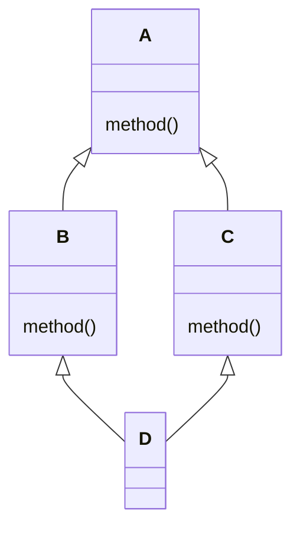
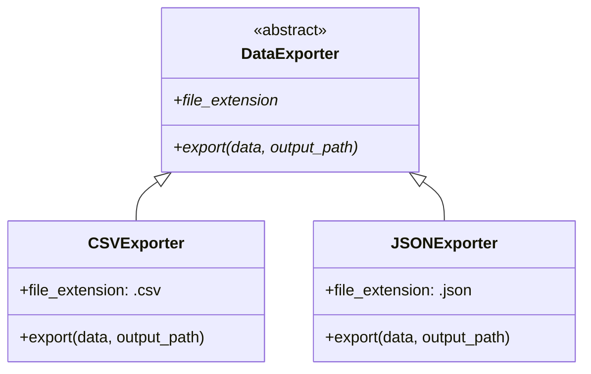

# Herança e Polimorfismo

Herança permite criar hierarquias de classes onde classes filhas reutilizam e estendem o comportamento da classe pai. Polimorfismo permite que objetos de diferentes tipos sejam tratados uniformemente através de uma interface comum.

## Herança Básica

```python
class Animal:
    def __init__(self, name: str):
        self.name = name

    def speak(self) -> str:
        return f"{self.name} makes a sound."

    def move(self) -> str:
        return f"{self.name} moves."

class Dog(Animal):
    def speak(self) -> str:
        return f"{self.name} barks!"

class Cat(Animal):
    def speak(self) -> str:
        return f"{self.name} meows!"

dog = Dog("Rex")
cat = Cat("Luna")
print(dog.speak())  # Rex barks!
print(cat.speak())  # Luna meows!
print(dog.move())   # Rex moves. (herdado)
```

> [!NOTE]
> Python suporta herança simples e múltipla. Todas as classes implicitamente herdam de `object`.

## Sobrescrita de Métodos

Classes filhas podem sobrescrever qualquer método da classe pai:

```python
class Vehicle:
    def __init__(self, brand: str, model: str):
        self.brand = brand
        self.model = model

    def description(self) -> str:
        return f"{self.brand} {self.model}"

    def fuel_type(self) -> str:
        return "Unknown fuel type"

class Car(Vehicle):
    def fuel_type(self) -> str:
        return "Gasoline or Diesel"

class ElectricCar(Vehicle):
    def __init__(self, brand: str, model: str, battery_capacity: float):
        super().__init__(brand, model)
        self.battery_capacity = battery_capacity

    def fuel_type(self) -> str:
        return "Electricity"

    def description(self) -> str:
        return f"{super().description()} ({self.battery_capacity} kWh)"

tesla = ElectricCar("Tesla", "Model 3", 75)
print(tesla.description())  # Tesla Model 3 (75 kWh)
print(tesla.fuel_type())    # Electricity
```

## Usando `super()`

`super()` delega para a classe pai. É essencial ao estender o comportamento da classe pai:

```python
class Logger:
    def __init__(self, name: str):
        self.name = name
        self.logs = []

    def log(self, message: str):
        self.logs.append(f"[{self.name}] {message}")

class TimestampLogger(Logger):
    def __init__(self, name: str, timezone: str = "UTC"):
        super().__init__(name)   # Inicializa o pai
        self.timezone = timezone

    def log(self, message: str):
        from datetime import datetime
        timestamp = datetime.now().isoformat()
        super().log(f"{timestamp} | {message}")  # Chama método do pai

    def __repr__(self) -> str:
        return f"TimestampLogger({self.name!r}, timezone={self.timezone!r})"

logger = TimestampLogger("App")
logger.log("User logged in")
logger.log("File saved")
print(logger.logs)
# ['[App] 2025-01-15T10:30:00 | User logged in', ...]
```

> [!WARNING]
> Nunca esqueça de chamar `super().__init__()` nas classes filhas — caso contrário, os atributos da classe pai não serão inicializados.

## MRO (Method Resolution Order)

O Python determina qual método chamar usando o algoritmo de linearização C3:

```python
class A:
    def method(self):
        return "A"

class B(A):
    def method(self):
        return "B"

class C(A):
    def method(self):
        return "C"

class D(B, C):
    pass

d = D()
print(d.method())  # B (segue o MRO)
print(D.__mro__)
# (<class 'D'>, <class 'B'>, <class 'C'>, <class 'A'>, <class 'object'>)
```



> [!NOTE]
> `D.__mro__` mostra a ordem de resolução: `D → B → C → A → object`. Python pesquisa da esquerda para a direita, profundidade primeiro.

## Classes Base Abstratas (ABC)

ABCs definem interfaces que as classes filhas devem implementar:

```python
from abc import ABC, abstractmethod

class Shape(ABC):
    @abstractmethod
    def area(self) -> float:
        pass

    @abstractmethod
    def perimeter(self) -> float:
        pass

    def describe(self) -> str:
        return f"Area: {self.area():.2f}, Perimeter: {self.perimeter():.2f}"

class Rectangle(Shape):
    def __init__(self, width: float, height: float):
        self.width = width
        self.height = height

    def area(self) -> float:
        return self.width * self.height

    def perimeter(self) -> float:
        return 2 * (self.width + self.height)

class Circle(Shape):
    def __init__(self, radius: float):
        self.radius = radius

    def area(self) -> float:
        import math
        return math.pi * self.radius ** 2

    def perimeter(self) -> float:
        import math
        return 2 * math.pi * self.radius

# shape = Shape()  # TypeError! Não pode instanciar ABC
rect = Rectangle(5, 3)
print(rect.describe())  # Area: 15.00, Perimeter: 16.00
```

> [!WARNING]
> Classes abstratas não podem ser instanciadas diretamente. Todos os métodos abstratos devem ser implementados em subclasses concretas.

### Propriedades e Métodos Estáticos Abstratos

```python
from abc import ABC, abstractmethod

class ConfigParser(ABC):
    @property
    @abstractmethod
    def format_name(self) -> str:
        pass

    @abstractmethod
    def parse(self, content: str) -> dict:
        pass

    @staticmethod
    @abstractmethod
    def supports_extension(ext: str) -> bool:
        pass

class JSONParser(ConfigParser):
    @property
    def format_name(self) -> str:
        return "JSON"

    def parse(self, content: str) -> dict:
        import json
        return json.loads(content)

    @staticmethod
    def supports_extension(ext: str) -> bool:
        return ext in (".json", ".jsonc")
```

## Duck Typing

"Se anda como um pato e grasna como um pato, é um pato." Python foca no comportamento, não no tipo:

```python
class Duck:
    def quack(self):
        return "Quack!"

    def walk(self):
        return "Waddles"

class Person:
    def quack(self):
        return "Imitates a duck"

    def walk(self):
        return "Walks on two legs"

def make_it_quack(thing):
    print(thing.quack())
    print(thing.walk())

make_it_quack(Duck())
make_it_quack(Person())  # Mesma função, tipos diferentes — polimorfismo!
```

### Usando `isinstance()` e `hasattr()` com Protocols

```python
from typing import Protocol

class Quackable(Protocol):
    def quack(self) -> str:
        ...

def process_quackable(obj: Quackable):
    if hasattr(obj, "quack"):
        print(obj.quack())
    else:
        print("Not quackable")

class Robot:
    def quack(self) -> str:
        return "Beep boop quack"

process_quackable(Robot())  # Beep boop quack
```

## Mundo Real: Sistema de Plugins com ABC

```python
from abc import ABC, abstractmethod
import os
import importlib.util

class DataExporter(ABC):
    @abstractmethod
    def export(self, data: list[dict], output_path: str) -> None:
        pass

    @property
    @abstractmethod
    def file_extension(self) -> str:
        pass

class CSVExporter(DataExporter):
    @property
    def file_extension(self) -> str:
        return ".csv"

    def export(self, data: list[dict], output_path: str) -> None:
        import csv
        if not data:
            raise ValueError("No data to export")
        with open(output_path, "w", newline="") as f:
            writer = csv.DictWriter(f, fieldnames=data[0].keys())
            writer.writeheader()
            writer.writerows(data)

class JSONExporter(DataExporter):
    @property
    def file_extension(self) -> str:
        return ".json"

    def export(self, data: list[dict], output_path: str) -> None:
        import json
        with open(output_path, "w") as f:
            json.dump(data, f, indent=2)

def export_data(data: list[dict], output_path: str, fmt: str):
    exporters = {".csv": CSVExporter, ".json": JSONExporter}
    ext = fmt if fmt.startswith(".") else f".{fmt}"
    cls = exporters.get(ext)
    if cls is None:
        raise ValueError(f"Unsupported format: {fmt}")
    exporter = cls()
    exporter.export(data, output_path)

records = [
    {"name": "Alice", "score": 95},
    {"name": "Bob", "score": 87},
]
export_data(records, "output.csv", "csv")
export_data(records, "output.json", "json")
```



## Herança Múltipla

```python
class Flyer:
    def fly(self):
        return "Flying through the air"

    def speed(self) -> str:
        return "Fast"

class Swimmer:
    def swim(self):
        return "Swimming through water"

    def speed(self) -> str:
        return "Moderate"

class Duck(Flyer, Swimmer):
    def speed(self) -> str:
        return f"{Flyer.speed(self)} in air, {Swimmer.speed(self)} in water"

duck = Duck()
print(duck.fly())   # Flying through the air
print(duck.swim())  # Swimming through water
print(duck.speed()) # Fast in air, Moderate in water
```

> [!WARNING]
| Armadilha | Solução |
|-----------|---------|
| Problema do diamante (mesmo método em múltiplos caminhos) | MRO lida com isso; use `super()` com cuidado |
| Ordem de inicialização incerta | Cada `__init__` deve chamar `super().__init__()` |
| Acoplamento forte | Prefira composição em vez de herança |

## Composição em Vez de Herança

```python
class Engine:
    def start(self):
        return "Engine started"

    def stop(self):
        return "Engine stopped"

class Wheels:
    def rotate(self):
        return "Wheels rotating"

class Car:
    def __init__(self):
        self.engine = Engine()
        self.wheels = Wheels()

    def drive(self):
        return f"{self.engine.start()} — {self.wheels.rotate()}"

    def park(self):
        return self.engine.stop()

car = Car()
print(car.drive())  # Engine started — Wheels rotating
```

> [!SUCCESS]
> Prefira composição em vez de herança: relacionamentos "tem-um" são mais flexíveis que "é-um".

## Perguntas de Prática

1. O que `super()` retorna e por que é importante em `__init__`?
2. Crie uma classe abstrata `PaymentGateway` com métodos `process_payment` e `refund`. Implemente `PayPalGateway` e `StripeGateway`.
3. O que é o MRO e como você pode inspecioná-lo para uma determinada classe?
4. Explique duck typing em Python com um exemplo que não envolva herança.
5. O que acontece se você tentar instanciar uma classe abstrata que tem métodos abstratos não implementados?
6. Crie uma hierarquia de classes: `Employee` → `Manager` → `Executive`. Cada uma deve sobrescrever `get_bonus()`.
7. Qual é a diferença entre `isinstance(obj, cls)` e `issubclass(sub, cls)`? Quando você usaria cada um?
8. Como o Python resolve chamadas de métodos em herança múltipla? O que a linearização C3 garante?
9. Crie uma classe `LoggableMixin` que adiciona registro de log a qualquer classe, então use-a com herança múltipla.
10. Por que a composição é frequentemente preferida em vez da herança? Dê um exemplo concreto onde a composição é melhor.
