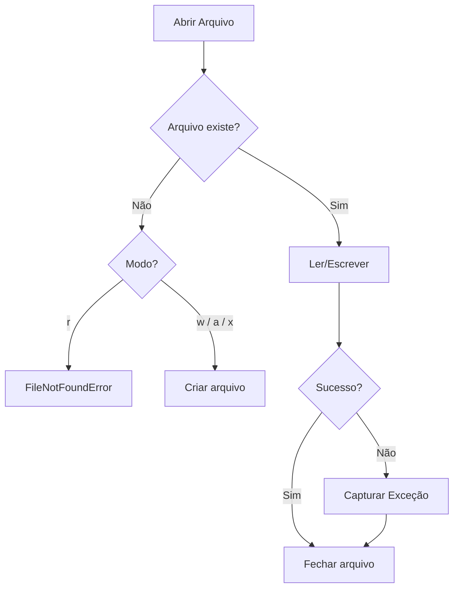

# Manipulação de Arquivos e E/S

E/S de arquivos é fundamental para quase toda aplicação Python — desde ler arquivos de configuração até processar grandes conjuntos de dados. A manipulação de arquivos do Python é limpa, poderosa e suporta múltiplos formatos.

## A Função `open()`

```python
file = open("example.txt", "r")    # Leitura (padrão)
file = open("example.txt", "w")    # Escrita (sobrescreve!)
file = open("example.txt", "a")    # Acrescentar
file = open("example.txt", "r+")   # Leitura e escrita
file = open("example.txt", "x")    # Criação exclusiva (falha se existir)
```

| Modo | Ler | Escrever | Criar | Truncar | Posição |
|------|-----|---------|-------|---------|---------|
| `"r"` | Sim | Não | Não | Não | Início |
| `"w"` | Não | Sim | Sim | Sim | Início |
| `"a"` | Não | Sim | Sim | Não | Fim |
| `"r+"` | Sim | Sim | Não | Não | Início |
| `"w+"` | Sim | Sim | Sim | Sim | Início |
| `"a+"` | Sim | Sim | Sim | Não | Fim |
| `"x"` | Não | Sim | Sim (exclusivo) | Não | Início |
| `"b"` | (modificador) | Modo binário | — | — | — |

> [!WARNING]
> Sempre feche arquivos! A instrução `with` lida com isso automaticamente (veja abaixo).

## A Instrução `with` (Gerenciador de Contexto)

A instrução `with` garante que o arquivo seja fechado corretamente, mesmo se uma exceção ocorrer:

```python
# RUIM — fechamento manual (propenso a erros)
f = open("data.txt", "r")
try:
    content = f.read()
finally:
    f.close()

# BOM — instrução with (fechamento automático)
with open("data.txt", "r") as f:
    content = f.read()
# O arquivo é fechado aqui, mesmo se um erro ocorreu
```

## Lendo Arquivos de Texto

```python
# Ler arquivo inteiro como string
with open("data.txt", "r") as f:
    content = f.read()

# Ler linha por linha (eficiente em memória para arquivos grandes)
with open("data.txt", "r") as f:
    for line in f:
        print(line.rstrip())  # rstrip remove a nova linha no final

# Ler todas as linhas em uma lista
with open("data.txt", "r") as f:
    lines = f.readlines()

# Ler uma linha de cada vez
with open("data.txt", "r") as f:
    first_line = f.readline()
    second_line = f.readline()
```

> [!NOTE]
> Para arquivos grandes, itere sobre o objeto de arquivo diretamente (`for line in f:`) em vez de chamar `read()` ou `readlines()`. Isso lê preguiçosamente e não carregará o arquivo inteiro na memória.

## Escrevendo Arquivos de Texto

```python
with open("output.txt", "w") as f:
    f.write("Hello, World!\n")
    f.write("This is line 2.\n")

# Escrever múltiplas linhas de uma lista
lines = ["Line 1", "Line 2", "Line 3"]
with open("output.txt", "w") as f:
    f.writelines(line + "\n" for line in lines)
```

### Acrescentando

```python
with open("log.txt", "a") as f:
    f.write("New log entry\n")
```

## Codificação de Arquivos

Sempre especifique a codificação para arquivos de texto:

```python
with open("data.txt", "r", encoding="utf-8") as f:
    content = f.read()

with open("output.txt", "w", encoding="utf-8") as f:
    f.write("Unicode: ñ, é, 你好, こんにちは\n")
```

> [!WARNING]
> No Windows, a codificação padrão é `cp1252`, não `utf-8`. Sempre passe `encoding="utf-8"` explicitamente para portabilidade entre plataformas.

## Arquivos CSV

O módulo `csv` do Python lida com valores separados por vírgula:

```python
import csv

# Lendo CSV
with open("employees.csv", "r", newline="", encoding="utf-8") as f:
    reader = csv.reader(f)
    header = next(reader)  # Pular cabeçalho
    for row in reader:
        name, department, salary = row
        print(f"{name} works in {department}")

# Lendo como dicionários
with open("employees.csv", "r", newline="", encoding="utf-8") as f:
    reader = csv.DictReader(f)
    for row in reader:
        print(f"{row['name']} earns ${row['salary']}")
```

```python
import csv

# Escrevendo CSV
with open("output.csv", "w", newline="", encoding="utf-8") as f:
    writer = csv.writer(f)
    writer.writerow(["Name", "Department", "Salary"])
    writer.writerow(["Alice", "Engineering", 95000])
    writer.writerow(["Bob", "Marketing", 72000])
    writer.writerows([
        ["Charlie", "Sales", 85000],
        ["Diana", "Engineering", 98000],
    ])

# Escrevendo como dicionários
with open("output.csv", "w", newline="", encoding="utf-8") as f:
    fieldnames = ["Name", "Department", "Salary"]
    writer = csv.DictWriter(f, fieldnames=fieldnames)
    writer.writeheader()
    writer.writerow({"Name": "Alice", "Department": "Engineering", "Salary": 95000})
```

> [!NOTE]
| Construtor | Quando Usar |
|-----------|-------------|
| `csv.reader` / `csv.writer` | Listas simples, sem cabeçalhos |
| `csv.DictReader` / `csv.DictWriter` | Colunas nomeadas, cabeçalhos presentes |

### Dialetos CSV e Delimitadores Personalizados

```python
import csv

# Valores separados por tabulação (TSV)
with open("data.tsv", "r", newline="") as f:
    reader = csv.reader(f, delimiter="\t")
    for row in reader:
        print(row)

# Delimitador personalizado com aspas
with open("data.csv", "w", newline="") as f:
    writer = csv.writer(f, delimiter=";", quotechar='"',
                        quoting=csv.QUOTE_ALL)
    writer.writerow(["Hello, World", 100, "A;B;C"])
```

## Manipulação de Arquivos Binários

```python
# Ler arquivo binário
with open("image.png", "rb") as f:
    data = f.read()
    print(f"Read {len(data)} bytes")

# Escrever arquivo binário
with open("copy.png", "wb") as f:
    f.write(data)

# Copiar em blocos (eficiente em memória)
BUFFER_SIZE = 8192
with open("large_file.bin", "rb") as src, open("copy.bin", "wb") as dst:
    while chunk := src.read(BUFFER_SIZE):
        dst.write(chunk)
```

> [!SUCCESS]
> O operador walrus (`:=`) combinado com `while` cria um padrão elegante de cópia bloco por bloco. Cada bloco tem no máximo `BUFFER_SIZE` bytes.

## Mundo Real: Pipeline de Processamento de Dados

```python
import csv
import json
from pathlib import Path

def process_sales_data(input_path: str, output_path: str) -> dict:
    summary = {"total_revenue": 0, "total_orders": 0, "products_sold": 0}

    with open(input_path, "r", newline="", encoding="utf-8") as infile:
        reader = csv.DictReader(infile)
        for row in reader:
            try:
                quantity = int(row["quantity"])
                price = float(row["price"])
                summary["total_revenue"] += quantity * price
                summary["total_orders"] += 1
                summary["products_sold"] += quantity
            except (ValueError, KeyError) as e:
                print(f"Skipping bad row: {e}")

    with open(output_path, "w", encoding="utf-8") as outfile:
        json.dump(summary, outfile, indent=2)

    return summary

result = process_sales_data("sales.csv", "summary.json")
print(result)
```

## Utilitários de Arquivo e Caminho com `pathlib`

```python
from pathlib import Path

p = Path("data/reports/summary.csv")

# Componentes do caminho
print(p.name)         # summary.csv
print(p.stem)         # summary
print(p.suffix)       # .csv
print(p.parent)       # data/reports
print(p.parents[0])   # data/reports
print(p.parents[1])   # data

# Verificar e criar
if p.exists():
    print(f"Size: {p.stat().st_size} bytes")
    print(f"Modified: {p.stat().st_mtime}")

p.parent.mkdir(parents=True, exist_ok=True)

# Globbing
data_dir = Path("data")
for csv_file in data_dir.glob("*.csv"):
    print(f"Found: {csv_file}")

# Leitura/escrita convenientes
content = p.read_text(encoding="utf-8")
Path("output.txt").write_text("Hello", encoding="utf-8")
```

## Trabalhando com Arquivos Temporários

```python
from tempfile import NamedTemporaryFile, TemporaryDirectory
import os

# Arquivo temporário (auto-deletado ao fechar)
with NamedTemporaryFile(mode="w", suffix=".txt", delete=False) as f:
    f.write("Temporary content")
    temp_path = f.name

print(f"Temp file at: {temp_path}")
os.unlink(temp_path)  # Limpeza manual se delete=False

# Diretório temporário (auto-deletado)
with TemporaryDirectory() as tmpdir:
    work_file = Path(tmpdir) / "data.txt"
    work_file.write_text("Processing in isolation")
    # Processar arquivo...
# tmpdir e todo o conteúdo são deletados aqui
```

> [!WARNING]
> O modo binário (`"rb"` / `"wb"`) é necessário para arquivos não-texto (imagens, áudio, arquivos). O modo texto pode corromper dados binários interpretando caracteres UTF e traduzindo quebras de linha.

## Tratamento de Erros em Operações de Arquivo

```python
import os

def safe_read_file(path: str, default: str = "") -> str:
    try:
        with open(path, "r", encoding="utf-8") as f:
            return f.read()
    except FileNotFoundError:
        print(f"File {path} not found. Using default.")
        return default
    except PermissionError:
        print(f"Permission denied: {path}")
        return default
    except OSError as e:
        print(f"OS error reading {path}: {e}")
        return default

def safe_write_file(path: str, content: str) -> bool:
    try:
        os.makedirs(os.path.dirname(path) or ".", exist_ok=True)
        with open(path, "w", encoding="utf-8") as f:
            f.write(content)
        return True
    except OSError as e:
        print(f"Failed to write {path}: {e}")
        return False
```



> [!SUCCESS]
> A instrução `with` é a forma mais segura e limpa de manipular arquivos em Python. Ela garante a limpeza adequada, funciona com gerenciadores de contexto personalizados e reduz significativamente o código boilerplate.

## Perguntas de Prática

1. O que a instrução `with` garante quando usada com `open()`?
2. Qual é a diferença entre os modos de arquivo `"w"` e `"a"`?
3. Escreva código que lê um arquivo CSV e imprime linhas onde o valor na coluna "age" é > 30.
4. Por que você deve especificar `encoding="utf-8"` ao abrir arquivos de texto?
5. Como você lê um arquivo de texto muito grande sem ficar sem memória?
6. O que `newline=""` faz em `open("file.csv", newline="")` e por que é importante para arquivos CSV?
7. Escreva uma função que copia um arquivo binário em blocos de 4096 bytes.
8. Qual é a diferença entre `csv.reader` e `csv.DictReader`?
9. Usando `pathlib.Path`, escreva código para encontrar todos os arquivos `.log` em uma árvore de diretórios e imprimir seus tamanhos.
10. O que acontece se você abrir um arquivo no modo `"x"` e o arquivo já existir?
