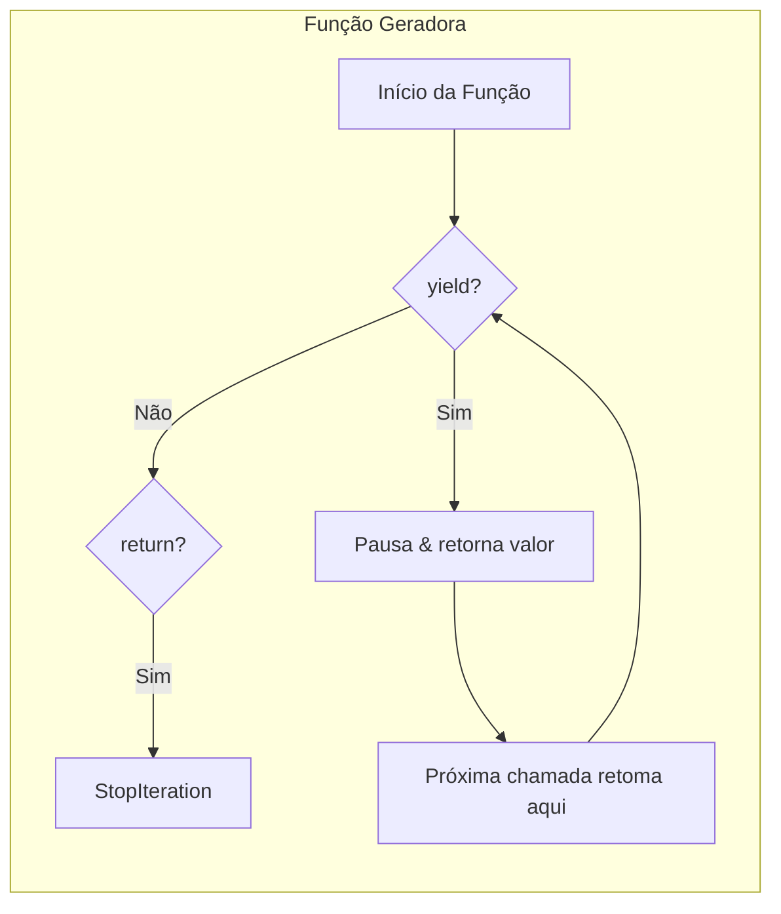

# Compreensões e Geradores

Compreensões fornecem uma sintaxe concisa para criar coleções. Geradores permitem avaliação preguiçosa, processando dados um item de cada vez em vez de carregar tudo na memória.

## Compreensões de Lista

Sintaxe básica: `[expression for item in iterable if condition]`

```python
# Abordagem tradicional
squares = []
for x in range(10):
    squares.append(x ** 2)

# Compreensão de lista
squares = [x ** 2 for x in range(10)]

# Com condição
evens = [x for x in range(20) if x % 2 == 0]

# Loops aninhados
pairs = [(x, y) for x in range(3) for y in range(3)]

# Transformação
words = ["hello", "world", "python"]
upper_words = [w.upper() for w in words]
```

> [!NOTE]
| Loop `for` Equivalente | Compreensão de Lista |
|-----------------------|----------------------|
| 5 linhas | 1 linha |
| Acumulador mutável | Expressão funcional |
| Mais lento (sobrecarga `.append`) | Mais rápido (backend C otimizado) |

```python
# Transformações complexas
values = [1, -2, 3, -4, 5, -6]
processed = [x * 2 if x > 0 else abs(x) * 10 for x in values]
print(processed)  # [2, 20, 6, 40, 10, 60]

# Achatar uma matriz
matrix = [[1, 2, 3], [4, 5, 6], [7, 8, 9]]
flat = [num for row in matrix for num in row]
print(flat)  # [1, 2, 3, 4, 5, 6, 7, 8, 9]

# Produto cartesiano
colors = ["red", "blue"]
sizes = ["S", "M", "L"]
inventory = [(c, s) for c in colors for s in sizes]
print(inventory)
```

## Compreensões de Dicionário

```python
# Dicionário de quadrados: {0: 0, 1: 1, 2: 4, 3: 9, ...}
squares = {x: x ** 2 for x in range(10)}

# Filtrando e transformando
words = ["apple", "banana", "cherry", "date"]
word_lengths = {w: len(w) for w in words if len(w) > 4}
print(word_lengths)  # {"apple": 5, "banana": 6, "cherry": 6}

# Trocando chaves e valores
original = {"a": 1, "b": 2, "c": 3}
swapped = {v: k for k, v in original.items()}
print(swapped)  # {1: "a", 2: "b", 3: "c"}

# Padrão enumerate
indexed = {i: char for i, char in enumerate("hello")}
print(indexed)  # {0: "h", 1: "e", 2: "l", 3: "l", 4: "o"}
```

## Compreensões de Conjunto

```python
# Quadrados pares únicos
even_squares = {x ** 2 for x in range(20) if x % 2 == 0}
print(even_squares)  # {0, 4, 16, 36, 64, 100, 144, 196, 256, 324}

# Encontrar caracteres únicos
text = "hello world"
unique_chars = {c for c in text if c != " "}
print(unique_chars)  # {"h", "e", "l", "o", "w", "r", "d"}
```

> [!SUCCESS]
| Tipo de Compreensão | Sintaxe | Tipo de Saída |
|--------------------|---------|--------------|
| Lista | `[expr for x in iter]` | `list` |
| Dicionário | `{k: v for x in iter}` | `dict` |
| Conjunto | `{expr for x in iter}` | `set` |
| Gerador | `(expr for x in iter)` | `generator` |

## Funções Geradoras com `yield`

Funções geradoras produzem valores preguiçosamente usando `yield`:

```python
def count_up_to(n: int):
    i = 0
    while i < n:
        yield i
        i += 1

# Geradores são preguiçosos — nada é computado ainda
counter = count_up_to(5)

# Valores produzidos sob demanda
print(next(counter))  # 0
print(next(counter))  # 1
print(list(counter))  # [2, 3, 4] (restantes)

# Ou itere diretamente
for num in count_up_to(3):
    print(num)  # 0, 1, 2
```



### Geradores Infinitos

```python
def fibonacci():
    a, b = 0, 1
    while True:
        yield a
        a, b = b, a + b

fib = fibonacci()
print([next(fib) for _ in range(10)])  # [0, 1, 1, 2, 3, 5, 8, 13, 21, 34]

def counter(start: int = 0, step: int = 1):
    while True:
        yield start
        start += step

c = counter(10, 5)
print([next(c) for _ in range(4)])  # [10, 15, 20, 25]
```

## Expressões Geradoras

Semelhante às compreensões de lista, mas com parênteses — preguiçosas e eficientes em memória:

```python
# Compreensão de lista — cria lista inteira na memória
squares_list = [x ** 2 for x in range(1000000)]

# Expressão geradora — preguiçosa, um item de cada vez
squares_gen = (x ** 2 for x in range(1000000))

# Soma dos primeiros milhões de quadrados (nenhuma lista grande necessária)
total = sum(x ** 2 for x in range(1000000))
```

> [!WARNING]
> Expressões geradoras são de uso único. Uma vez esgotadas, não podem ser re-iteradas. Use `list()` se precisar de múltiplas passagens.

```python
gen = (x * 2 for x in range(5))
print(list(gen))  # [0, 2, 4, 6, 8]
print(list(gen))  # [] — esgotado!
```

## Encadeamento e Pipeline de Geradores

```python
def numbers():
    for i in range(10):
        yield i

def even(iterable):
    for x in iterable:
        if x % 2 == 0:
            yield x

def squared(iterable):
    for x in iterable:
        yield x ** 2

# Pipeline — cada função processa um item de cada vez
pipeline = squared(even(numbers()))
print(list(pipeline))  # [0, 4, 16, 36, 64]

# Mesmo com expressões geradoras
result = (x ** 2 for x in range(10) if x % 2 == 0)
print(list(result))  # [0, 4, 16, 36, 64]
```

## `yield from` — Delegando a Sub-geradores

```python
def chain(*iterables):
    for iterable in iterables:
        yield from iterable

combined = chain([1, 2, 3], "abc", range(4, 6))
print(list(combined))  # [1, 2, 3, "a", "b", "c", 4, 5]

# Achatar listas aninhadas (recursivo)
def flatten(nested):
    for item in nested:
        if isinstance(item, (list, tuple)):
            yield from flatten(item)
        else:
            yield item

deep = [1, [2, [3, 4], 5], 6]
print(list(flatten(deep)))  # [1, 2, 3, 4, 5, 6]
```

## Comparação de Memória

```python
import sys

# Compreensão de lista — todos os valores na memória
list_comp = [x ** 2 for x in range(100000)]
print(f"List size: {sys.getsizeof(list_comp)} bytes")

# Expressão geradora — memória mínima
gen_exp = (x ** 2 for x in range(100000))
print(f"Generator size: {sys.getsizeof(gen_exp)} bytes")

# Função geradora — também mínima
def gen_func():
    for x in range(100000):
        yield x ** 2

print(f"Gen function size: {sys.getsizeof(gen_func())} bytes")
```

> [!NOTE]
> Uma expressão geradora tem tipicamente ~120 bytes independentemente de quantos itens produz. Uma compreensão de lista cresce proporcionalmente ao número de elementos.

## Mundo Real: Processamento Preguiçoso de Arquivos

```python
from pathlib import Path

def read_lines(paths: list[Path]):
    """Produz linhas preguiçosamente de múltiplos arquivos."""
    for path in paths:
        with open(path, "r", encoding="utf-8") as f:
            yield from f

def filter_lines(lines, keyword: str):
    """Filtra linhas preguiçosamente contendo a palavra-chave."""
    for line in lines:
        if keyword in line:
            yield line

def count_words(lines):
    """Conta palavras entre linhas (preguiçoso)."""
    for line in lines:
        yield len(line.split())

# Processar múltiplos arquivos de log sem carregar tudo
log_dir = Path("/var/log")
log_files = list(log_dir.glob("*.log"))

lines = read_lines(log_files[:5])  # Ainda sem leitura!
error_lines = filter_lines(lines, "ERROR")  # Ainda preguiçoso!
word_counts = count_words(error_lines)  # Ainda preguiçoso!

# Só agora a execução acontece
total = sum(word_counts)
print(f"Total words in ERROR lines: {total}")
```

## Mundo Real: Paginação de API em Streaming

```python
from typing import Generator
import requests

def paginate(url: str, page_size: int = 100) -> Generator[dict, None, None]:
    """Produz itens preguiçosamente de uma API paginada."""
    page = 1
    while True:
        response = requests.get(url, params={"page": page, "size": page_size})
        data = response.json()
        if not data["items"]:
            break
        yield from data["items"]
        page += 1

# Processar todos os usuários sem carregar todas as páginas na memória
for user in paginate("https://api.example.com/users"):
    if user["status"] == "active":
        print(f"Processing {user['email']}")
```

> [!SUCCESS]
| Característica | Compreensão | Gerador |
|---------------|-------------|---------|
| Cria todos os itens imediatamente? | Sim | Não (preguiçoso) |
| Uso de memória | O(n) | O(1) |
| Reutilizável? | Sim | Não (uso único) |
| Melhor para | Conjuntos pequeno-médios, acesso aleatório | Dados grandes/streaming, passagem única |

## Perguntas de Prática

1. Escreva uma compreensão de lista que produza quadrados dos números 1-10, mas apenas para números ímpares.
2. Qual é a diferença entre uma função geradora (usando `yield`) e uma função normal?
3. Reescreva este loop como uma compreensão de dicionário: `result = {}; for k, v in items: if len(v) > 3: result[k] = v.upper()`
4. Por que uma expressão geradora `(x for x in range(1_000_000))` é mais eficiente em memória que uma compreensão de lista?
5. O que acontece quando você chama `next()` em um gerador que não tem mais itens para produzir?
6. Escreva uma função geradora que produza os primeiros `n` números primos.
7. Como `yield from` difere de iterar manualmente e produzir cada item?
8. Crie um pipeline que lê um arquivo CSV, filtra linhas onde valor > 50, e eleva ao quadrado o resultado — tudo preguiçosamente.
9. O que o método `send()` faz em um gerador? Como é diferente de `next()`?
10. Quando você deve usar um gerador em vez de uma lista? Quando não deve?
