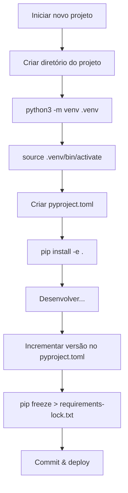

# pip e Ambientes Virtuais

O desenvolvimento profissional em Python requer gerenciamento de dependências e isolamento de ambientes de projeto. Esta lição cobre pip, ambientes virtuais e padrões modernos de empacotamento.

## O Que São Ambientes Virtuais?

Um ambiente virtual é uma instalação Python isolada que mantém as dependências do projeto separadas:

```
System Python
└── packages: requests@2.28, flask@2.3

Project A (venv)
└── packages: django@4.2, requests@2.31

Project B (venv)
└── packages: flask@3.0, requests@2.28
```

> [!NOTE]
> Sem ambientes virtuais, versões conflitantes de pacotes entre projetos seriam impossíveis de gerenciar. Cada projeto tem seu próprio universo de dependências.

## Criando e Usando `venv`

```bash
# Criar um ambiente virtual
python3 -m venv .venv

# Ativá-lo (Linux/macOS)
source .venv/bin/activate

# Ativá-lo (Windows)
.venv\Scripts\activate

# Desativar
deactivate
```

```python
import sys
print(sys.executable)  # Mostra qual Python está sendo usado
# Com venv ativo: /path/to/project/.venv/bin/python
# Sem: /usr/bin/python3
```

> [!WARNING]
| Armadilha | Solução |
|-----------|---------|
| Esquecer de ativar o venv | Verifique `which python` ou `sys.executable` |
| Commitar `.venv` no git | Adicione `.venv/` ao `.gitignore` |
| Usar `sudo pip install` | Nunca faça isso — quebra pacotes do sistema! |

## `pip` — Instalando Pacotes

```bash
# Instalar um pacote
pip install requests

# Instalar uma versão específica
pip install requests==2.31.0
pip install "requests>=2.28,<3.0"

# Instalar a partir de arquivo requirements
pip install -r requirements.txt

# Atualizar um pacote
pip install --upgrade requests

# Desinstalar
pip uninstall requests -y

# Listar pacotes instalados
pip list

# Mostrar informações do pacote
pip show requests
```

## `requirements.txt`

```txt
# requirements.txt
requests==2.31.0
flask>=2.3,<3.0
pandas~=2.0.0    # Versão compatível: >=2.0.0, <2.1.0
numpy             # Qualquer versão
-e .              # Instalação editável (projeto atual)
```

```bash
# Gerar a partir do ambiente atual
pip freeze > requirements.txt

# Instalar a partir do arquivo
pip install -r requirements.txt
```

> [!NOTE]
> `pip freeze` gera TODOS os pacotes instalados incluindo dependências. Para um arquivo mais enxuto, liste apenas dependências diretas e use `pip install -r` para resolver as transitivas.

## `pip freeze` vs `pip list`

```bash
pip list          # Tabela formatada, concisa
pip freeze        # Formato compatível com pip install -r, inclui versões
pip list --format=freeze  # Mesma saída que pip freeze
```

## Especificadores de Versão

| Especificador | Significado |
|--------------|-------------|
| `==2.31.0` | Exatamente versão 2.31.0 |
| `>=2.28` | Versão 2.28 ou superior |
| `<=3.0` | Versão 3.0 ou inferior |
| `>2.0,<3.0` | Qualquer versão no intervalo (exclusivo) |
| `~=2.0.0` | Versão compatível: `>=2.0.0, <2.1.0` |
| `!=2.0.0` | Qualquer versão exceto 2.0.0 |
| `*` | Qualquer versão (ex.: `==2.*` significa 2.x) |

## `pyproject.toml` — Empacotamento Moderno em Python

```toml
[build-system]
requires = ["setuptools>=68.0", "wheel"]
build-backend = "setuptools.backends._legacy:_Backend"

[project]
name = "my-data-tool"
version = "0.1.0"
description = "A tool for processing data files"
authors = [
    {name = "Alice Developer", email = "alice@example.com"}
]
requires-python = ">=3.10"
dependencies = [
    "requests>=2.28",
    "pandas>=2.0",
    "click>=8.0",
]

[project.optional-dependencies]
dev = [
    "pytest>=7.0",
    "black>=23.0",
    "ruff>=0.1",
]
test = [
    "pytest>=7.0",
    "pytest-cov>=4.0",
]
```

```bash
# Instalar com dependências de desenvolvimento
pip install -e ".[dev]"

# Instalar com dependências de teste
pip install -e ".[test]"

# Instalar todas as dependências opcionais
pip install -e ".[dev,test]"
```

> [!SUCCESS]
| Arquivo | Propósito | Status |
|---------|-----------|--------|
| `requirements.txt` | Fixar versões exatas para deploy | Ainda comum |
| `setup.py` | Metadados do pacote e instalação | Legado |
| `setup.cfg` | Configuração declarativa | Transicional |
| `pyproject.toml` | Padrão moderno (PEP 518/621) | **Melhor prática atual** |

## Arquivos de Lock e Builds Reproduzíveis

```bash
# Gerar requirements travados
pip freeze > requirements-lock.txt

# Instalar a partir do arquivo de lock
pip install -r requirements-lock.txt

# Verificar pacotes desatualizados
pip list --outdated
```

Para arquivos de lock de nível profissional, considere:

```bash
# pip-tools
pip install pip-tools
pip-compile pyproject.toml  # gera requirements.txt
pip-sync requirements.txt   # corresponde ambiente ao arquivo

# Poetry
poetry lock
poetry install

# pipenv
pipenv lock
pipenv install
```

## Comandos Avançados do pip

```bash
# Baixar pacotes sem instalar (ex.: para sistemas sem internet)
pip download -r requirements.txt -d ./packages/

# Instalar a partir de diretório local
pip install ./packages/requests-2.31.0.tar.gz

# Instalar a partir do GitHub
pip install git+https://github.com/psf/requests.git
pip install git+https://github.com/psf/requests.git@v2.31.0

# Instalar com restrições
pip install -c constraints.txt

# Verificar problemas de dependência
pip check

# Gerenciamento de cache
pip cache list
pip cache remove requests
pip cache purge
```

## Mundo Real: Script de Inicialização de Projeto

```python
#!/usr/bin/env python3
"""Inicializar um novo projeto Python com venv e dependências."""

import subprocess
import sys
from pathlib import Path

PYPROJECT_CONTENT = """\
[build-system]
requires = ["setuptools>=68.0", "wheel"]
build-backend = "setuptools.backends._legacy:_Backend"

[project]
name = "{project_name}"
version = "0.1.0"
description = ""
requires-python = ">=3.10"
dependencies = []

[project.optional-dependencies]
dev = ["pytest>=7.0", "black>=23.0", "ruff>=0.1"]
"""

GITIGNORE_CONTENT = """\
# Python
__pycache__/
*.py[cod]
*.egg-info/
.venv/
.eggs/
dist/
build/
"""

def bootstrap(project_name: str) -> None:
    project_dir = Path.cwd() / project_name
    project_dir.mkdir(exist_ok=True)

    # Criar pyproject.toml
    (project_dir / "pyproject.toml").write_text(
        PYPROJECT_CONTENT.format(project_name=project_name)
    )

    # Criar .gitignore
    (project_dir / ".gitignore").write_text(GITIGNORE_CONTENT)

    # Criar ambiente virtual
    venv_dir = project_dir / ".venv"
    subprocess.run([sys.executable, "-m", "venv", str(venv_dir)], check=True)

    # Determinar caminho do pip
    pip_path = venv_dir / "bin" / "pip"
    if not pip_path.exists():
        pip_path = venv_dir / "Scripts" / "pip.exe"

    # Instalar dependências de desenvolvimento
    subprocess.run([str(pip_path), "install", "-e", ".[dev]"], cwd=project_dir, check=True)

    print(f"Project {project_name} bootstrapped at {project_dir}")
    print(f"Activate: source {venv_dir}/bin/activate")

if __name__ == "__main__":
    if len(sys.argv) != 2:
        print("Usage: python bootstrap.py <project-name>")
        sys.exit(1)
    bootstrap(sys.argv[1])
```

## Solução de Problemas Comuns do pip

```bash
# Erro "externally-managed-environment" (PEP 668)
# Use um ambiente virtual! Isso é uma funcionalidade, não um bug.
python3 -m venv .venv
source .venv/bin/activate

# Erros de certificado SSL
pip install --trusted-host pypi.org --trusted-host files.pythonhosted.org <package>

# Permissão negada (não usando venv)
pip install --user <package>  # Ou melhor: use um venv

# Incompatibilidade de hash
pip install --no-cache-dir <package>

# Conflitos de dependência
pip check
pip install pipdeptree
pipdeptree  # Visualizar árvore de dependências
```



> [!SUCCESS]
> Sempre use um ambiente virtual para cada projeto. É a prática mais importante do Python — prevenindo conflitos de versão, permitindo builds reproduzíveis e mantendo seu Python do sistema limpo.

## Perguntas de Prática

1. Qual é o propósito de um ambiente virtual? Por que você deve usar um para cada projeto?
2. Como você cria e ativa um ambiente virtual chamado `.venv`?
3. Qual é a diferença entre `pip freeze` e `pip list`? Qual você usaria para um arquivo requirements?
4. Escreva um `requirements.txt` que fixe `requests` na versão 2.31.x e permita qualquer versão de patch do `pandas` acima de 2.0.
5. O que `pip install -e .` faz? Quando você o usaria?
6. O que é `pyproject.toml` e como difere de `setup.py`?
7. Como você instala grupos de dependências opcionais como `[dev]` do `pyproject.toml`?
8. O que `pip check` verifica e quando você o executaria?
9. O que é o erro "externally-managed-environment" do PEP 668 e como corrigi-lo?
10. Crie uma sequência de comandos shell que: cria um diretório de projeto, configura um venv, ativa-o e instala pacotes do requirements.txt.
