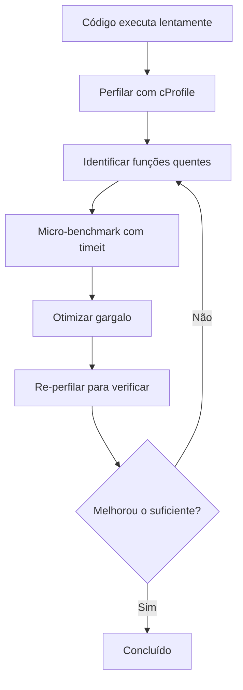

# Depuração e Perfilamento

Mesmo desenvolvedores experientes gastam tempo significativo depurando e otimizando. Python fornece ferramentas poderosas integradas para inspecionar, rastrear e medir o comportamento e desempenho do seu código.

## O Módulo `logging`

O módulo `logging` é a alternativa profissional ao `print()` para depuração — é configurável, hierárquico e seguro para produção.

```python
import logging

# Configuração básica
logging.basicConfig(
    level=logging.DEBUG,
    format="%(asctime)s [%(levelname)s] %(name)s: %(message)s",
    filename="app.log",  # Omita para saída no console
)

# Criar um logger para seu módulo
logger = logging.getLogger(__name__)

logger.debug("Detailed debug information")
logger.info("General operational messages")
logger.warning("Something concerning but not an error")
logger.error("A real problem occurred")
logger.critical("System is unusable!")
```

| Nível | Valor Numérico | Quando Usar |
|-------|---------------|-------------|
| `DEBUG` | 10 | Informação detalhada de diagnóstico |
| `INFO` | 20 | Confirmação de que as coisas funcionam como esperado |
| `WARNING` | 30 | Algo inesperado mas não um erro |
| `ERROR` | 40 | Um problema que impediu uma operação |
| `CRITICAL` | 50 | Uma falha grave que requer atenção imediata |

### Configuração de Logging

```python
import logging

# Configuração avançada
logger = logging.getLogger("my_app")
logger.setLevel(logging.DEBUG)

# File handler
file_handler = logging.FileHandler("app.log")
file_handler.setLevel(logging.WARNING)
file_formatter = logging.Formatter(
    "%(asctime)s [%(levelname)s] %(name)s: %(message)s"
)
file_handler.setFormatter(file_formatter)

# Console handler
console_handler = logging.StreamHandler()
console_handler.setLevel(logging.DEBUG)
console_formatter = logging.Formatter(
    "%(levelname)s: %(message)s"
)
console_handler.setFormatter(console_formatter)

# Adicionar handlers
logger.addHandler(file_handler)
logger.addHandler(console_handler)

logger.info("Shows in console only")      # Nível DEBUG → console
logger.warning("Shows in both")           # Nível WARNING → ambos
```

> [!NOTE]
| Padrão | Melhor Prática |
|--------|----------------|
| `logger = logging.getLogger(__name__)` | Loggers por módulo com nomes hierárquicos |
| `logging.exception("...")` | Registra no nível ERROR E inclui traceback |
| `logger.debug(f"x = {x}")` | Evite f-strings em debug — use formatação `%s` para avaliação preguiçosa |

### Logging Estruturado

```python
import logging

logger = logging.getLogger(__name__)

try:
    result = risky_operation()
except Exception as e:
    logger.exception(
        "Operation failed for user %s",
        {"user_id": 42, "operation": "payment"},
    )

# Contexto extra
logger.info("User action", extra={
    "user_id": user.id,
    "action": "login",
    "ip": request.ip,
})
```

## Depuração com `pdb`

O Depurador Python permite pausar a execução, inspecionar variáveis e percorrer o código:

```python
# Inserir breakpoint (Python 3.7+)
def divide(a: int, b: int) -> float:
    result = a / b
    breakpoint()  # Abre pdb
    return result

divide(10, 2)
```

```python
# Equivalente a:
import pdb; pdb.set_trace()
```

### Comandos pdb

| Comando | Atalho | Descrição |
|---------|--------|-----------|
| `next` | `n` | Executar próxima linha (passar por cima) |
| `step` | `s` | Entrar em chamada de função |
| `continue` | `c` | Continuar até próximo breakpoint |
| `list` | `l` | Mostrar código fonte ao redor da linha atual |
| `print expr` | `p` | Avaliar e imprimir expressão |
| `pp expr` | `pp` | Imprimir expressão formatada |
| `args` | `a` | Imprimir argumentos da função |
| `locals()` | — | Imprimir todas as variáveis locais |
| `break lineno` | `b` | Definir breakpoint no número da linha |
| `disable nb` | — | Desabilitar breakpoint por número |
| `where` | `w` | Imprimir rastreamento da pilha |
| `up` | `u` | Subir um quadro na pilha |
| `down` | `d` | Descer um quadro na pilha |
| `quit` | `q` | Sair do depurador |

```python
# demonstração pdb
def process_data(items: list[int]) -> int:
    total = 0
    for i, item in enumerate(items):
        total += item
        if total > 100:
            breakpoint()  # Inspecionar estado aqui
    return total

process_data([10, 20, 30, 50, 100])
```

> [!WARNING]
> Remova chamadas `breakpoint()` antes de commitar código. Considere usar uma proteção de variável de ambiente: `if os.getenv("DEBUG"): breakpoint()`

### Depuração Post-Mortem

```python
import pdb

def buggy_function():
    x = 1
    y = 0
    return x / y

try:
    buggy_function()
except ZeroDivisionError:
    pdb.post_mortem()  # Abre depurador no local da falha
```

### Executando pdb pela Linha de Comando

```bash
python -m pdb my_script.py       # Iniciar depurador desde a primeira linha
python -m pdb -c "b 42" script.py  # Definir breakpoint na linha 42
```

## Perfilamento com `cProfile`

`cProfile` mede quanto tempo cada função leva para executar:

```python
import cProfile
import pstats

def slow_function():
    total = 0
    for i in range(10_000_000):
        total += i
    return total

def fast_function():
    return sum(range(10_000_000))

# Perfilar uma chamada específica
cProfile.run("fast_function()", sort="time")
```

```python
# Perfilamento detalhado
profiler = cProfile.Profile()
profiler.enable()

slow_function()
fast_function()

profiler.disable()
stats = pstats.Stats(profiler)
stats.sort_stats("cumtime")  # Ordenar por tempo cumulativo
stats.print_stats(10)        # Mostrar top 10
```

> [!NOTE]
> `cProfile` tem sobrecarga muito baixa — tipicamente < 1% de lentidão. É seguro usar em cargas de trabalho similares às de produção.

### Perfilamento pela Linha de Comando

```bash
python -m cProfile -o output.prof my_script.py
python -m pstats output.prof  # Navegador interativo de estatísticas
```

```text
# Exemplo de saída:
ncalls  tottime  percall  cumtime  percall  filename:lineno(function)
     1   0.000    0.000    0.500    0.500  script.py:10(slow_function)
     1   0.000    0.000    0.002    0.002  script.py:15(fast_function)
```

| Coluna | Significado |
|--------|-------------|
| `ncalls` | Número de chamadas |
| `tottime` | Tempo total nesta função (excluindo sub-chamadas) |
| `percall` | `tottime` / `ncalls` |
| `cumtime` | Tempo cumulativo (incluindo sub-chamadas) |
| `filename:lineno(function)` | Localização |

### Visualizando Perfis

```bash
# Instalar snakeviz para perfilamento visual
pip install snakeviz
python -m cProfile -o output.prof my_script.py
snakeviz output.prof  # Abre gráfico de chamas interativo no navegador
```

## Medindo Tempo com `timeit`

`timeit` fornece medições precisas de tempo executando código múltiplas vezes:

```python
import timeit

# Medir uma declaração
execution_time = timeit.timeit("sum(range(1000))", number=10_000)
print(f"Average: {execution_time / 10_000 * 1_000_000:.2f} μs")

# Medir pela linha de comando
# python -m timeit "sum(range(1000))"
# 100000 loops, best of 5: 6.2 usec per loop
```

```python
# Comparando abordagens
setup = "import random; data = [random.random() for _ in range(1000)]"

method1 = timeit.timeit("sorted(data)", setup=setup, number=1000)
method2 = timeit.timeit("data.sort()", setup=setup, number=1000)

print(f"sorted(): {method1:.4f}s")
print(f".sort():  {method2:.4f}s")
print(f"Ratio: {method1 / method2:.2f}x")
```

### Usando `timeit` em Jupyter / Scripts

```python
import timeit

# Para funções, use Timer
t = timeit.Timer(lambda: sum(range(1000)))
print(f"Min of 5 runs: {t.timeit(number=1000):.4f}s")

# Repetir para estatísticas
results = timeit.repeat(
    "sum(range(1000))",
    number=10_000,
    repeat=5,
)
print(f"Best: {min(results):.4f}s, Worst: {max(results):.4f}s")
```

> [!WARNING]
| Armadilha | Porquê | Correção |
|-----------|--------|----------|
| Incluir setup na medição | Distorce resultados | Use parâmetro `setup` |
| Medição de execução única | Alta variância | Execute muitas vezes, pegue o mínimo |
| Otimizar cedo | Desperdiça esforço | Perfile primeiro, otimize gargalos |
| Micro-benchmark != perf real | Cache de CPU, E/S, GC importam | Teste com tamanhos de dados realistas |

## Padrões Comuns de Depuração

```python
# Padrão 1: Breakpoint condicional
DEBUG = os.getenv("DEBUG")
if DEBUG:
    breakpoint()

# Padrão 2: Pretty-print de objetos complexos
from pprint import pprint
data = {"deeply": {"nested": {"structure": [1, 2, [3, 4]]}}}
pprint(data, depth=3)

# Padrão 3: Rastrear chamadas de função
import sys

def trace_calls(frame, event, arg):
    if event == "call":
        print(f"→ {frame.f_code.co_name}")
    return trace_calls

sys.settrace(trace_calls)

# Padrão 4: Decorador de logging
import functools
import logging

logger = logging.getLogger(__name__)

def logged(func):
    @functools.wraps(func)
    def wrapper(*args, **kwargs):
        logger.debug("Calling %s with args=%s kwargs=%s",
                     func.__name__, args, kwargs)
        try:
            result = func(*args, **kwargs)
            logger.debug("%s returned %s", func.__name__, result)
            return result
        except Exception as e:
            logger.exception("%s raised %s", func.__name__, e)
            raise
    return wrapper
```

## Mundo Real: Perfilando uma Função Lenta

```python
import cProfile
import pstats
import io

def generate_report(users: list[dict]) -> str:
    lines = []
    for user in users:
        # Construção ineficiente de string
        line = ""
        for key, value in user.items():
            line += f"{key}: {value}, "
        lines.append(line)

    # Ordenação lenta
    for i in range(len(lines)):
        for j in range(i + 1, len(lines)):
            if lines[i] > lines[j]:
                lines[i], lines[j] = lines[j], lines[i]

    return "\n".join(lines)

# Perfilar a função
profiler = cProfile.Profile()
profiler.enable()

users = [{"name": f"User{i}", "email": f"user{i}@test.com", "score": i}
         for i in range(500)]
result = generate_report(users)

profiler.disable()

# Analisar resultados
s = io.StringIO()
stats = pstats.Stats(profiler, stream=s)
stats.sort_stats("cumtime")
stats.print_stats(20)
print(s.getvalue())
```



> [!SUCCESS]
> "Otimização prematura é a raiz de todo o mal" — Donald Knuth. Perfile primeiro, otimize depois. Use `logging` para diagnóstico em produção, `pdb` para depuração interativa e `cProfile` para análise de desempenho.

## Perguntas de Prática

1. Quais são os cinco níveis de logging em Python, do menos ao mais severo?
2. Como você configura logging para escrever em um arquivo no nível WARNING e acima, enquanto mostra nível INFO no console?
3. Qual é a diferença entre os comandos `next` e `step` do `pdb`?
4. Como você inicia o pdb quando uma exceção ocorre sem modificar o código fonte?
5. Execute `python -m cProfile -s time` em um script simples e interprete os 5 principais resultados.
6. O que `timeit.repeat` retorna e por que é mais confiável que uma única medição?
7. Escreva um decorador de logging que registra entrada, saída, exceções e tempo de execução da função.
8. Como você define um breakpoint condicional (ex.: parar quando `x > 100`) no pdb?
9. Qual é a diferença entre `tottime` e `cumtime` na saída do cProfile?
10. Use `timeit` para comparar `list.append()` vs compreensão de lista para criar uma lista de 10.000 quadrados.
