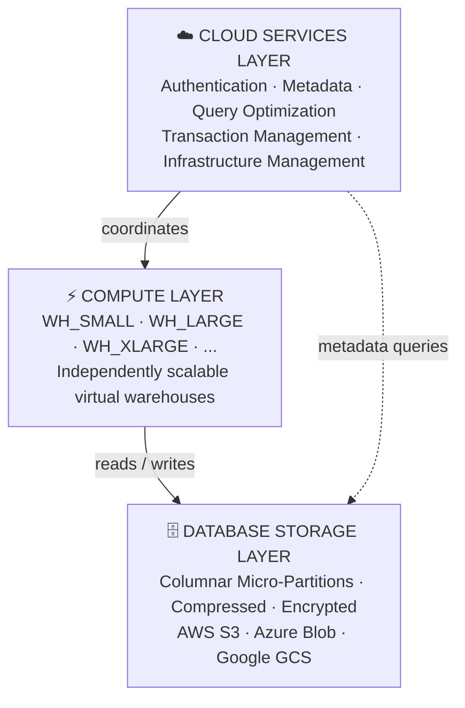

# Domain 1.1 — Snowflake Architecture

## Exam Weight

**Domain 1.0 — Snowflake AI Data Cloud Features & Architecture** accounts for **~31%** of the SnowPro Core COF-C03 exam — the largest single domain.

> [!NOTE]
> This lesson maps to **Exam Objective 1.1**: *Describe and use the Snowflake architecture*, including the Cloud Services layer, Compute layer, Database Storage layer, and comparison of Snowflake editions.

---

## What Is Snowflake?

Snowflake is a **cloud-native, fully managed data platform** delivered as Software-as-a-Service (SaaS). It was built from the ground up for the cloud — not ported from an on-premises product.

Key distinctions from traditional warehouses:

| Characteristic | Traditional Warehouse | Snowflake |
|---|---|---|
| Deployment | On-premises / IaaS | Pure SaaS |
| Scaling | Requires downtime | Seconds, zero downtime |
| Compute & Storage | Tightly coupled | Fully separated |
| Maintenance | Customer-managed | Snowflake-managed |
| Cloud providers | Single | AWS, Azure, GCP |
| Updates | Planned downtime | Automatic, transparent |

---

## The Three-Layer Architecture

Snowflake's architecture consists of three independently scalable layers. Understanding each layer — and the boundaries between them — is critical for the exam.



---

### Layer 1 — Database Storage Layer

This is where **all data permanently lives**. Key characteristics:

- Data is stored in Snowflake's proprietary **columnar micro-partition format** — automatically compressed and optimized. Customers cannot directly access the underlying files.
- Storage is built on top of the cloud provider's blob storage: **Amazon S3** (AWS), **Azure Blob Storage** (Azure), or **Google Cloud Storage** (GCP).
- **Billing is separate from compute**: you pay for storage even when no warehouses are running.
- Snowflake manages encryption, redundancy, and durability automatically.
- Data is reorganized into micro-partitions (50–500 MB compressed) with rich metadata about each partition (min/max values, distinct count, NULL count) to enable **partition pruning** during queries.

**What the storage layer holds:**
- Table data (micro-partitions)
- Time Travel versions of changed data
- Fail-Safe copies
- Stage data (for internal stages)
- Query result cache

---

### Layer 2 — Compute Layer (Virtual Warehouses)

The compute layer consists of **Virtual Warehouses (VWs)** — named clusters of compute resources that execute SQL queries and DML operations.

Key characteristics:

- Each Virtual Warehouse is an **MPP (Massively Parallel Processing)** compute cluster consisting of one or more nodes.
- **Multiple warehouses can read from the same storage simultaneously** — with no resource contention between them.
- Warehouses can be **suspended** (stopping billing instantly) and **resumed** (within seconds).
- Size is expressed in T-shirt sizes: **X-Small, Small, Medium, Large, X-Large, 2X-Large, 3X-Large, 4X-Large, 5X-Large, 6X-Large**.
- Each size-up **doubles** the compute resources (and credits per hour).

**Credit consumption by warehouse size (Standard):**

| Size | Credits/Hour |
|---|---|
| X-Small | 1 |
| Small | 2 |
| Medium | 4 |
| Large | 8 |
| X-Large | 16 |
| 2X-Large | 32 |
| 3X-Large | 64 |
| 4X-Large | 128 |
| 5X-Large | 256 |
| 6X-Large | 512 |

> [!WARNING]
> Snowpark-Optimized Warehouses consume **more credits** than Standard warehouses of the same T-shirt size. Do not confuse the two types on the exam.

**What the compute layer does:**
- Executes SQL queries (SELECT, DML)
- Loads data (COPY INTO)
- Runs Snowpark code
- Performs transformations

**What the compute layer does NOT do:**
- Store data permanently
- Run Cloud Services operations (those are free up to 10% of compute credits)

---

### Layer 3 — Cloud Services Layer

This is the **brain of Snowflake** — a collection of services that coordinate all activity across the platform. It runs on Snowflake-managed infrastructure and is **always available** even when no virtual warehouses are running.

**Cloud Services responsibilities:**

| Service | Description |
|---|---|
| **Authentication** | Validates user identity (passwords, MFA, OAuth, key-pair) |
| **Infrastructure Management** | Provisions, monitors, and repairs compute resources |
| **Metadata Management** | Tracks table definitions, statistics, partition metadata |
| **Query Parsing & Optimization** | Parses SQL, generates and optimizes query execution plans |
| **Access Control** | Enforces RBAC and DAC policies |
| **Transaction Management** | Ensures ACID compliance across concurrent operations |

**Billing note**: Cloud Services usage is **free up to 10% of daily compute credits consumed**. Usage beyond that threshold is billed separately. This is an important exam detail.

```sql
-- Cloud Services are used transparently — for example when you run:
SHOW TABLES IN DATABASE MY_DB;
-- This uses Cloud Services (metadata lookup) with no warehouse needed
```

---

## Separation of Storage and Compute — Why It Matters

This is the **most architecturally significant** feature of Snowflake and appears frequently on the exam.

**Benefits of separation:**

1. **Independent scaling** — scale compute up/down without touching storage
2. **Cost optimization** — suspend compute when idle; storage billing continues at low rates
3. **Workload isolation** — multiple teams run their own warehouses against shared data
4. **No contention** — a large analytics query on WH_ANALYTICS doesn't affect ingestion on WH_INGEST

```sql
-- Engineering ingests data on their warehouse
USE WAREHOUSE WH_INGEST;
COPY INTO raw.events FROM @my_stage;

-- Meanwhile, BI queries the same data on their own warehouse
USE WAREHOUSE WH_BI;
SELECT date_trunc('hour', event_time), count(*)
FROM raw.events
GROUP BY 1;
-- No queuing between these teams!
```

---

## Snowflake Editions

The **edition** determines which features are available and the SLA provided. You must know these for the exam.

| Feature | Standard | Enterprise | Business Critical | Virtual Private Snowflake (VPS) |
|---|---|---|---|---|
| **Time Travel (max)** | 1 day | 90 days | 90 days | 90 days |
| **Multi-cluster Warehouses** | ❌ | ✅ | ✅ | ✅ |
| **Column-level Security (Masking)** | ❌ | ✅ | ✅ | ✅ |
| **Row Access Policies** | ❌ | ✅ | ✅ | ✅ |
| **Search Optimization** | ❌ | ✅ | ✅ | ✅ |
| **HIPAA Compliance** | ❌ | ❌ | ✅ | ✅ |
| **PCI DSS Compliance** | ❌ | ❌ | ✅ | ✅ |
| **Tri-Secret Secure (CMK)** | ❌ | ❌ | ✅ | ✅ |
| **AWS PrivateLink / Azure PE** | ❌ | ❌ | ✅ | ✅ |
| **Private Deployment** | ❌ | ❌ | ❌ | ✅ |
| **SLA** | 99.5% | 99.9% | 99.95% | 99.99% |

> [!WARNING]
> The exam frequently tests **edition gates**. Remember: Multi-cluster warehouses, Column Masking, and Row Access Policies all require **Enterprise or higher**.

---

## Cloud Provider and Region Considerations

Snowflake accounts are deployed in a **specific cloud + region** combination. This is determined at account creation and cannot be changed.

| Cloud | Example Regions |
|---|---|
| AWS | us-east-1, us-west-2, eu-west-1, ap-southeast-1 |
| Azure | eastus2, westeurope, australiaeast |
| GCP | us-central1, europe-west4, asia-northeast1 |

**Key points for the exam:**
- A single Snowflake account lives in **one cloud and one region**
- Data can be **replicated** across regions and clouds using Database Replication
- **Cross-Cloud Business Continuity (CCBC)** allows failover to a different cloud provider
- **Private connectivity** (AWS PrivateLink, Azure Private Endpoints) is available on Business Critical+

---

## Key Terminology for the Exam

| Term | Definition |
|---|---|
| **Virtual Warehouse (VW)** | Named MPP compute cluster that executes queries |
| **Micro-partition** | Fundamental storage unit: 50–500 MB compressed, columnar |
| **Cloud Services Layer** | Intelligence layer: auth, optimization, metadata, access control |
| **SaaS** | Software as a Service — Snowflake manages all infrastructure |
| **MPP** | Massively Parallel Processing — queries distributed across nodes |
| **Separation of Storage & Compute** | Storage and compute scale independently, billed separately |
| **Credit** | Unit of Snowflake compute consumption |

---

## Practice Questions

**Q1.** Which Snowflake layer is responsible for query optimization and access control enforcement?

- A) Database Storage Layer
- B) Compute Layer
- C) Cloud Services Layer ✅
- D) Virtual Warehouse Layer

**Q2.** A company wants to ensure their BI reporting queries never compete with their ETL pipelines. Which Snowflake architectural feature enables this?

- A) Micro-partitions
- B) Separation of storage and compute ✅
- C) The Cloud Services layer
- D) Time Travel

**Q3.** At which Snowflake edition do Multi-cluster Virtual Warehouses first become available?

- A) Standard
- B) Enterprise ✅
- C) Business Critical
- D) Virtual Private Snowflake

**Q4.** Cloud Services usage is billed only when it exceeds what percentage of daily compute credits?

- A) 5%
- B) 10% ✅
- C) 15%
- D) 20%

**Q5.** A Snowflake warehouse is suspended for 4 hours. Which costs continue to accrue during this suspension?

- A) Compute costs only
- B) Both compute and storage costs
- C) Storage costs only ✅
- D) No costs accrue

**Q6.** Which Snowflake edition is required for HIPAA compliance?

- A) Standard
- B) Enterprise
- C) Business Critical ✅
- D) Virtual Private Snowflake

**Q7.** Snowflake stores data in which underlying format?

- A) Row-oriented flat files
- B) Parquet files directly readable by customers
- C) Compressed columnar micro-partitions ✅
- D) JSON documents

---

> [!SUCCESS]
> **Key Takeaways for Exam Day:**
> 1. Three layers: **Cloud Services → Compute (VW) → Storage** — each independent and separately billed
> 2. Cloud Services = brain (auth, optimization, metadata) — free up to **10%** of compute credits
> 3. **Storage billing never stops** — even when warehouses are suspended
> 4. Multi-cluster WH, Column Masking, Row Access Policies → **Enterprise+**
> 5. HIPAA / Tri-Secret Secure → **Business Critical+**
> 6. VPS = highest isolation, 99.99% SLA, private deployment