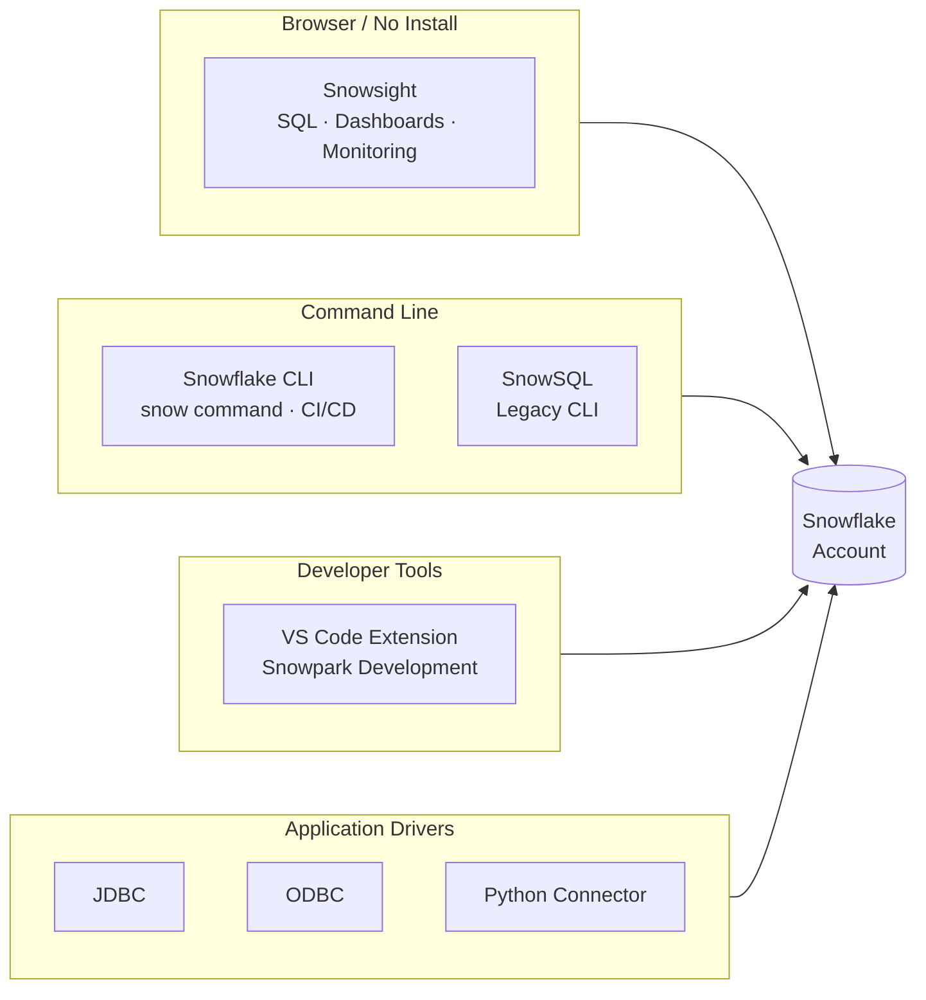

# Domain 1.2 — Snowflake Interfaces and Tools

## Exam Weight

**Domain 1.0** accounts for **~31%** of the exam. This sub-domain covers the tools and interfaces used to interact with Snowflake.

> [!NOTE]
> This lesson maps to **Exam Objective 1.2**: *Use Snowflake Interfaces and tools*, including Snowsight, Snowflake CLI, and IDE integrations.

---

## Overview of Snowflake Interfaces

Snowflake can be accessed through multiple interfaces depending on the use case — interactive analysis, scripting, automation, or development workflows.



| Interface | Best For | Requires Install |
|---|---|---|
| **Snowsight** | Interactive queries, dashboards, monitoring | No (browser-based) |
| **Snowflake CLI** | Scripting, CI/CD, automation | Yes |
| **SnowSQL** | Legacy CLI client | Yes |
| **VS Code Extension** | Developer workflows, Snowpark | Yes |
| **Drivers (JDBC, ODBC, Python)** | Application integration | Yes |

---

## Snowsight — The Web Interface

**Snowsight** is Snowflake's modern, browser-based SQL development and analytics interface. It replaced the older "Classic Console" and is now the primary web UI.

### Key Snowsight Capabilities

**Worksheets**
- Write and execute SQL with syntax highlighting and auto-complete
- Multi-statement execution — run individual statements or entire scripts
- Query results rendered as tables, with column statistics inline
- Share worksheets with teammates

**Dashboards**
- Build visual dashboards from query results — charts, scorecards, tables
- Schedule automatic refresh of dashboard data
- No external BI tool required for basic visualizations

**Query History & Monitoring**
- View all queries executed in the account (with appropriate role)
- Filter by user, warehouse, time range, status
- Access Query Profile (execution plan) for any completed query
- Identify performance bottlenecks: spilling, pruning, queuing

**Data Explorer**
- Browse databases, schemas, tables, views, and stages
- Preview table data and view column statistics
- Manage object-level properties and tags

**Notebooks (Preview)**
- Integrated Jupyter-style notebooks inside Snowsight
- Supports SQL, Python (via Snowpark), and Markdown cells
- Execute code against Snowflake data without leaving the browser

**Admin Section**
- Manage users, roles, and warehouses
- Monitor credit usage and cost attribution
- Set up resource monitors and alerts
- View ACCOUNT_USAGE data visualized

```sql
-- Example: Snowsight can execute multi-statement scripts
-- You can run the full block or highlight individual statements

CREATE OR REPLACE TABLE customers (
    id NUMBER,
    name STRING,
    region STRING
);

INSERT INTO customers VALUES (1, 'Acme Corp', 'US-EAST');
INSERT INTO customers VALUES (2, 'GlobeCo', 'EU-WEST');

SELECT region, count(*) FROM customers GROUP BY 1;
```

---

## Snowflake CLI

The **Snowflake CLI** (`snow`) is the modern command-line interface for Snowflake. It supersedes the older **SnowSQL** client for most use cases.

### Installation

```bash
# Install via pip
pip install snowflake-cli-labs

# Verify installation
snow --version
```

### Configuration

CLI connections are managed in a `config.toml` file:

```toml
[connections.my_connection]
account = "my_account.us-east-1"
user = "my_user"
authenticator = "externalbrowser"
warehouse = "WH_DEV"
database = "MY_DB"
schema = "PUBLIC"
```

### Common CLI Commands

```bash
# Connect and run a SQL query
snow sql -q "SELECT CURRENT_VERSION()" --connection my_connection

# Execute a SQL file
snow sql -f ./migrations/001_create_tables.sql

# Manage Snowpark applications
snow app deploy
snow app run

# Manage Native Apps
snow app bundle

# Cortex and AI features
snow cortex complete "Summarize this document" --file doc.txt

# Stage management
snow stage list @MY_STAGE
snow stage copy ./local_file.csv @MY_STAGE/
```

> [!NOTE]
> The Snowflake CLI is actively developed and is the recommended interface for **DevOps and CI/CD workflows**. It natively supports Snowflake Native App development, Snowpark deployments, and Git-integrated workflows.

---

## SnowSQL — Legacy CLI

**SnowSQL** is the original command-line client for Snowflake. While still supported and widely used, the newer Snowflake CLI is preferred for new projects.

```bash
# Connect via SnowSQL
snowsql -a <account_identifier> -u <username>

# Execute inline query
snowsql -a myaccount -u myuser -q "SELECT CURRENT_DATE()"

# Execute a file
snowsql -a myaccount -u myuser -f script.sql

# SnowSQL with key-pair authentication
snowsql -a myaccount -u myuser --private-key-path rsa_key.p8
```

---

## IDE Integrations

### Visual Studio Code Extension

The **Snowflake VS Code Extension** provides a rich development experience directly in VS Code:

**Features:**
- Connect to one or more Snowflake accounts
- Browse Snowflake objects (databases, schemas, tables) in the sidebar
- Execute SQL queries and view results inline
- **Snowpark** development — write Python/Java/Scala Snowpark code with Snowflake context-aware autocomplete
- Debug and run Snowpark functions locally before deploying

**Installation:**
```
VS Code → Extensions → Search "Snowflake" → Install
```

### Jupyter Notebooks with Snowpark

Snowflake integrates with Jupyter via the Snowflake Python connector and Snowpark:

```python
# Connect to Snowflake from a Jupyter notebook
from snowflake.snowpark import Session

connection_parameters = {
    "account": "myaccount",
    "user": "myuser",
    "password": "mypassword",
    "role": "SYSADMIN",
    "warehouse": "WH_DEV",
    "database": "MY_DB",
    "schema": "PUBLIC"
}

session = Session.builder.configs(connection_parameters).create()

# Use Snowpark DataFrame API
df = session.table("customers")
df.filter(df["region"] == "US-EAST").show()
```

### dbt (data build tool)

dbt integrates with Snowflake via `dbt-snowflake` adapter, enabling SQL-based transformation pipelines:

```yaml
# profiles.yml
my_project:
  target: dev
  outputs:
    dev:
      type: snowflake
      account: myaccount
      user: myuser
      role: TRANSFORMER
      warehouse: WH_TRANSFORM
      database: ANALYTICS
      schema: DBT_DEV
```

---

## Choosing the Right Interface

| Use Case | Recommended Interface |
|---|---|
| Exploratory SQL analysis | Snowsight Worksheets |
| Building dashboards | Snowsight Dashboards |
| Monitoring query performance | Snowsight Query History |
| CI/CD pipeline automation | Snowflake CLI |
| Snowpark app deployment | Snowflake CLI |
| Interactive Python development | Snowsight Notebooks or Jupyter |
| Application connectivity | JDBC / ODBC / Python Connector |
| Legacy script execution | SnowSQL |
| VS Code-based development | VS Code Extension |

---

## Snowflake Drivers and Connectors (Overview)

For programmatic access, Snowflake provides official drivers and connectors:

| Driver / Connector | Language / Platform |
|---|---|
| **Python Connector** | Python |
| **Snowpark Python** | Python (DataFrame API) |
| **Snowpark Java** | Java |
| **Snowpark Scala** | Scala |
| **JDBC Driver** | Java-based applications, BI tools |
| **ODBC Driver** | BI tools, Excel, Tableau, etc. |
| **Node.js Driver** | JavaScript/Node.js |
| **.NET Driver** | C# / .NET |
| **Go Driver** | Go |
| **PHP PDO Driver** | PHP |

---

## Practice Questions

**Q1.** Which Snowflake interface is browser-based and requires no local installation?

- A) SnowSQL
- B) Snowflake CLI
- C) Snowsight ✅
- D) VS Code Extension

**Q2.** A data engineer needs to automate Snowflake deployments in a CI/CD pipeline. Which interface is most appropriate?

- A) Snowsight Worksheets
- B) Snowflake CLI ✅
- C) Snowsight Dashboards
- D) ODBC Driver

**Q3.** Which Snowsight feature allows you to diagnose query bottlenecks such as data spilling or inefficient pruning?

- A) Data Explorer
- B) Dashboards
- C) Query Profile ✅
- D) Notebooks

**Q4.** A Python developer wants to write Snowpark code with Snowflake object autocomplete directly in their editor. Which tool enables this?

- A) SnowSQL
- B) Snowflake CLI
- C) VS Code Extension ✅
- D) Snowsight Worksheets

**Q5.** Which format is used to configure connections for the Snowflake CLI?

- A) `.env` files
- B) `config.toml` ✅
- C) `snowflake.json`
- D) `profiles.yml`

---

> [!SUCCESS]
> **Key Takeaways for Exam Day:**
> 1. **Snowsight** = primary web UI — worksheets, dashboards, query history, notebooks
> 2. **Snowflake CLI** (`snow`) = modern CLI — best for CI/CD, Snowpark deployment
> 3. **SnowSQL** = legacy CLI — still valid, file-based execution
> 4. **VS Code Extension** = developer IDE integration with Snowpark support
> 5. **Query Profile** in Snowsight = go-to tool for diagnosing query performance issues