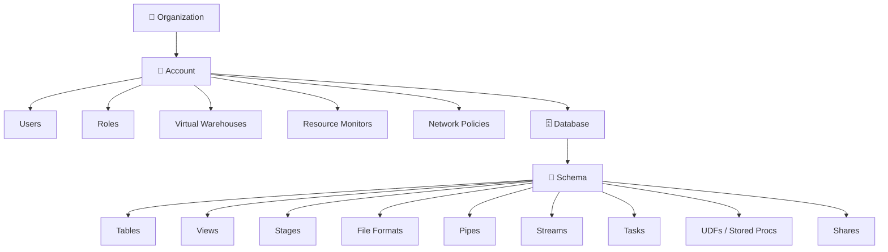

# Domain 1.3 — Snowflake Object Hierarchy and Types

## Exam Weight

**Domain 1.0** accounts for **~31%** of the exam. Object hierarchy and types is a fundamental concept tested throughout all domains.

> [!NOTE]
> This lesson maps to **Exam Objective 1.3**: *Differentiate Snowflake object hierarchy and types*, including organization/account objects, database objects, and session/context variables.

---

## The Snowflake Object Hierarchy

Snowflake organizes all resources in a strict **hierarchical container model**:



---

## Organization

An **Organization** is the top-level Snowflake entity — it groups multiple Snowflake accounts under a single umbrella:

- Enables **cross-account features**: replication, Snowflake Marketplace publishing, usage reporting
- Managed by the `ORGADMIN` system role
- An organization has a unique **organization name** (e.g., `MYCOMPANY`)

```sql
-- View all accounts in your organization
USE ROLE ORGADMIN;
SHOW ORGANIZATION ACCOUNTS;
```

---

## Account-Level Objects

These objects exist at the **account level** — they are not contained within a database.

| Object | Description |
|---|---|
| **User** | An individual or service identity that can authenticate |
| **Role** | A collection of privileges; assigned to users |
| **Virtual Warehouse** | Named compute cluster for query execution |
| **Resource Monitor** | Budget/credit limit enforcer for warehouses |
| **Network Policy** | IP allowlist/blocklist for account access |
| **Database** | Top-level data container |
| **Share** | Mechanism to share data with other accounts |
| **Integration** | Connection definition (storage, API, notification) |
| **Replication Group** | Group of objects to replicate across regions/clouds |

```sql
-- Account-level object examples
CREATE USER analyst_jane
    PASSWORD = 'SecurePass123!'
    DEFAULT_ROLE = ANALYST
    DEFAULT_WAREHOUSE = WH_REPORTING;

CREATE WAREHOUSE WH_REPORTING
    WAREHOUSE_SIZE = SMALL
    AUTO_SUSPEND = 300
    AUTO_RESUME = TRUE;

CREATE RESOURCE MONITOR monthly_cap
    CREDIT_QUOTA = 1000
    FREQUENCY = MONTHLY
    START_TIMESTAMP = IMMEDIATELY
    TRIGGERS ON 80 PERCENT DO NOTIFY
             ON 100 PERCENT DO SUSPEND;
```

---

## Database and Schema Objects

### Database

A **database** is a logical container for schemas. It supports:
- Zero-Copy Cloning
- Time Travel
- Replication across accounts

```sql
CREATE DATABASE ANALYTICS;
CREATE DATABASE DEV_ANALYTICS CLONE ANALYTICS;  -- zero-copy clone
```

### Schema

A **schema** is a namespace inside a database that groups related objects:

```sql
CREATE SCHEMA ANALYTICS.STAGING;
CREATE SCHEMA ANALYTICS.MARTS;
```

> [!NOTE]
> Every database automatically gets two schemas: `INFORMATION_SCHEMA` (ANSI-standard metadata views) and `PUBLIC` (default schema for new objects).

---

## Database Object Types

### Tables

Snowflake has multiple table types — understanding the differences is heavily tested:

| Table Type | Persistence | Time Travel | Fail-Safe | Storage Cost |
|---|---|---|---|---|
| **Permanent** | Until dropped | 0–90 days | 7 days | Full |
| **Temporary** | Session only | 0–1 day | None | Full (while session active) |
| **Transient** | Until dropped | 0–1 day | None | Reduced |
| **External** | Never (metadata only) | None | None | Minimal (metadata only) |
| **Apache Iceberg** | Until dropped | Configurable | Configurable | Via Iceberg catalog |
| **Dynamic** | Until dropped | Configurable | Configurable | Full |

```sql
-- Permanent table (default)
CREATE TABLE orders (id NUMBER, amount DECIMAL(10,2));

-- Temporary table (session-scoped)
CREATE TEMPORARY TABLE temp_work AS SELECT * FROM orders WHERE amount > 1000;

-- Transient table (no Fail-Safe - cheaper for intermediate data)
CREATE TRANSIENT TABLE staging_load (raw_data VARIANT);

-- External table (data stays in S3/Azure/GCS)
CREATE EXTERNAL TABLE ext_logs (
    log_time TIMESTAMP,
    message STRING
)
WITH LOCATION = @my_external_stage
FILE_FORMAT = (TYPE = PARQUET);

-- Dynamic table (declarative incremental refresh)
CREATE DYNAMIC TABLE daily_revenue
    TARGET_LAG = '1 hour'
    WAREHOUSE = WH_TRANSFORM
AS
SELECT date_trunc('day', order_time), sum(amount)
FROM orders
GROUP BY 1;
```

> [!WARNING]
> **Temporary vs Transient**: Both have no Fail-Safe. Temporary tables are **session-scoped** (dropped when session ends). Transient tables **persist** until explicitly dropped but have no Fail-Safe. This distinction is tested frequently.

### Views

| View Type | Performance | Security | Definition Visible |
|---|---|---|---|
| **Standard** | Query executes on demand | Default | Yes |
| **Materialized** | Pre-computed, auto-refreshed | Default | Yes |
| **Secure** | Query executes on demand | Hidden definition | No |

```sql
-- Standard view
CREATE VIEW v_active_customers AS
SELECT * FROM customers WHERE status = 'ACTIVE';

-- Materialized view (auto-refreshed by Snowflake)
CREATE MATERIALIZED VIEW mv_daily_sales AS
SELECT date_trunc('day', sale_time), sum(amount)
FROM sales GROUP BY 1;

-- Secure view (hides view definition from non-owners)
CREATE SECURE VIEW v_sensitive_customers AS
SELECT id, name FROM customers;
```

> [!NOTE]
> **Materialized Views** are automatically maintained by Snowflake's background services — no warehouse is needed for the refresh. They are used to accelerate repeated expensive queries.

### Stages

A **stage** is a named location where data files are stored for loading or unloading:

| Stage Type | Location | Auth Managed By |
|---|---|---|
| **Internal — User** | Snowflake-managed storage, per user | Snowflake |
| **Internal — Table** | Snowflake-managed storage, per table | Snowflake |
| **Internal — Named** | Snowflake-managed storage | Snowflake |
| **External — Named** | S3 / Azure Blob / GCS bucket | Customer |

```sql
-- Internal named stage
CREATE STAGE my_internal_stage;

-- External stage pointing to S3
CREATE STAGE my_s3_stage
    URL = 's3://my-bucket/data/'
    STORAGE_INTEGRATION = my_s3_integration
    FILE_FORMAT = (TYPE = CSV);

-- List files in a stage
LIST @my_s3_stage;

-- Special stage shortcuts
-- @~ = current user's stage
-- @%table_name = table's stage
```

### File Formats

A **file format** object defines how to parse files during loading/unloading:

```sql
CREATE FILE FORMAT my_csv_format
    TYPE = CSV
    FIELD_DELIMITER = ','
    SKIP_HEADER = 1
    NULL_IF = ('NULL', 'null', '')
    EMPTY_FIELD_AS_NULL = TRUE;

CREATE FILE FORMAT my_json_format
    TYPE = JSON
    STRIP_OUTER_ARRAY = TRUE;

CREATE FILE FORMAT my_parquet_format
    TYPE = PARQUET
    SNAPPY_COMPRESSION = TRUE;
```

### Pipes

A **Pipe** is an object that defines a `COPY INTO` statement used by **Snowpipe** for continuous/automated data ingestion:

```sql
CREATE PIPE orders_pipe
    AUTO_INGEST = TRUE  -- triggered by cloud storage events
AS
COPY INTO raw.orders
FROM @my_s3_stage/orders/
FILE_FORMAT = (FORMAT_NAME = my_csv_format);
```

### Streams

A **Stream** is a **Change Data Capture (CDC)** object that tracks DML changes (INSERT, UPDATE, DELETE) made to a source table:

```sql
-- Create a stream on a table
CREATE STREAM orders_stream ON TABLE raw.orders;

-- Query the stream to see changes since last consumed
SELECT *,
    METADATA$ACTION,      -- INSERT or DELETE
    METADATA$ISUPDATE,    -- TRUE if this is an update
    METADATA$ROW_ID       -- unique row identifier
FROM orders_stream;
```

> [!NOTE]
> Streams have an **offset** — once you consume the stream (e.g., in a Task or DML), the offset advances. Streams track changes using **Snowflake's Time Travel** internally.

### Tasks

A **Task** is a Snowflake-managed scheduler that executes a SQL statement or Snowpark procedure:

```sql
-- Time-scheduled task (every 5 minutes)
CREATE TASK refresh_marts
    WAREHOUSE = WH_TRANSFORM
    SCHEDULE = '5 MINUTE'
AS
INSERT INTO marts.daily_sales
SELECT * FROM staging.sales WHERE processed = FALSE;

-- Stream-triggered task (fires when stream has data)
CREATE TASK process_orders_task
    WAREHOUSE = WH_TRANSFORM
    WHEN SYSTEM$STREAM_HAS_DATA('orders_stream')
AS
CALL process_new_orders();

-- Resume a task (tasks start in SUSPENDED state)
ALTER TASK process_orders_task RESUME;
```

### Sequences

A **Sequence** generates unique integer values for surrogate keys:

```sql
CREATE SEQUENCE order_id_seq START = 1 INCREMENT = 1;

INSERT INTO orders (id, amount)
VALUES (order_id_seq.NEXTVAL, 99.99);
```

### User-Defined Functions (UDFs)

UDFs extend SQL with custom logic:

```sql
-- SQL UDF
CREATE FUNCTION dollar_to_euro(usd FLOAT)
RETURNS FLOAT
AS $$
    usd * 0.92
$$;

-- JavaScript UDF
CREATE FUNCTION parse_json_field(json_str STRING, field STRING)
RETURNS STRING
LANGUAGE JAVASCRIPT
AS $$
    return JSON.parse(JSON_STR)[FIELD];
$$;

-- Python UDF (Snowpark)
CREATE FUNCTION sentiment_score(text STRING)
RETURNS FLOAT
LANGUAGE PYTHON
RUNTIME_VERSION = '3.10'
PACKAGES = ('textblob')
HANDLER = 'compute_sentiment'
AS $$
from textblob import TextBlob
def compute_sentiment(text):
    return TextBlob(text).sentiment.polarity
$$;
```

### Stored Procedures

Stored procedures support complex logic with control flow:

```sql
CREATE PROCEDURE load_daily_data(target_date DATE)
RETURNS STRING
LANGUAGE SQL
AS
$$
BEGIN
    INSERT INTO daily_summary
    SELECT :target_date, sum(amount)
    FROM orders
    WHERE date(order_time) = :target_date;
    RETURN 'Done: ' || :target_date::STRING;
END;
$$;

CALL load_daily_data('2025-01-15');
```

### Shares

A **Share** is an object that enables **Secure Data Sharing** — granting read-only access to data in your account to another Snowflake account without copying data:

```sql
-- Provider side: create and populate a share
CREATE SHARE sales_share;
GRANT USAGE ON DATABASE analytics TO SHARE sales_share;
GRANT USAGE ON SCHEMA analytics.public TO SHARE sales_share;
GRANT SELECT ON TABLE analytics.public.orders TO SHARE sales_share;

-- Add a consumer account
ALTER SHARE sales_share ADD ACCOUNTS = consumer_account_id;
```

---

## Session and Context Variables

### Session Context

Snowflake maintains context for each session — the currently active account, role, warehouse, database, and schema:

```sql
-- View current context
SELECT CURRENT_ACCOUNT(), CURRENT_ROLE(), CURRENT_WAREHOUSE(),
       CURRENT_DATABASE(), CURRENT_SCHEMA();

-- Set context
USE ROLE SYSADMIN;
USE WAREHOUSE WH_ANALYTICS;
USE DATABASE ANALYTICS;
USE SCHEMA MARTS;
```

### Parameter Hierarchy

Snowflake parameters control behavior at multiple levels. Parameters cascade from higher to lower levels, with lower levels overriding higher ones:

```
Account-level parameter
    └── User-level parameter (overrides account)
        └── Session-level parameter (overrides user)
```

```sql
-- Set at account level (applies to all users)
ALTER ACCOUNT SET STATEMENT_TIMEOUT_IN_SECONDS = 3600;

-- Set at user level
ALTER USER jane SET STATEMENT_TIMEOUT_IN_SECONDS = 1800;

-- Set at session level (overrides all above)
ALTER SESSION SET STATEMENT_TIMEOUT_IN_SECONDS = 900;
```

**Common parameters:**

| Parameter | Description |
|---|---|
| `STATEMENT_TIMEOUT_IN_SECONDS` | Max time a query can run before being cancelled |
| `LOCK_TIMEOUT` | Max time to wait for a lock |
| `QUERY_TAG` | Tag applied to all queries in the session |
| `DATE_INPUT_FORMAT` | Default format for parsing date literals |
| `TIMEZONE` | Session timezone |
| `USE_CACHED_RESULT` | Whether to use the query result cache |

---

## Practice Questions

**Q1.** Which table type is automatically dropped at the end of the current session?

- A) Transient
- B) External
- C) Temporary ✅
- D) Dynamic

**Q2.** A data team wants to track all INSERT and DELETE operations on a `sales` table to build an incremental pipeline. Which Snowflake object should they use?

- A) Task
- B) Stream ✅
- C) Pipe
- D) Sequence

**Q3.** Which type of view hides the view definition (SELECT statement) from unauthorized users?

- A) Materialized View
- B) Standard View
- C) Secure View ✅
- D) External View

**Q4.** A transient table differs from a permanent table in which key way?

- A) Transient tables are session-scoped
- B) Transient tables have no Fail-Safe period ✅
- C) Transient tables cannot be queried with SQL
- D) Transient tables do not support Time Travel

**Q5.** At which level in the parameter hierarchy is a user-level parameter overridden?

- A) Account level
- B) Database level
- C) Session level ✅
- D) Schema level

**Q6.** Which Snowflake object automates data loading using cloud storage event notifications?

- A) Task
- B) Stream
- C) Pipe ✅
- D) File Format

**Q7.** Which metadata columns are automatically available when querying a Snowflake stream?

- A) `ROW_ID`, `CHANGE_TYPE`, `TIMESTAMP`
- B) `METADATA$ACTION`, `METADATA$ISUPDATE`, `METADATA$ROW_ID` ✅
- C) `CDC_TYPE`, `OPERATION`, `VERSION`
- D) `EVENT_TYPE`, `MODIFIED_AT`, `PARTITION_ID`

---

> [!SUCCESS]
> **Key Takeaways for Exam Day:**
> 1. Object hierarchy: **Organization → Account → Database → Schema → Objects**
> 2. Temporary = session-scoped, no Fail-Safe | Transient = persists, no Fail-Safe | Permanent = full features
> 3. **Stream** = CDC tracker | **Task** = scheduler | **Pipe** = Snowpipe automation
> 4. **Secure View** hides its definition from non-owners
> 5. Parameters cascade: Account → User → Session (lower overrides higher)
> 6. Stages: Internal (Snowflake-managed) vs External (customer's cloud storage)