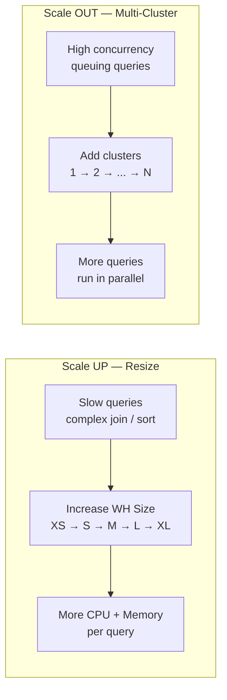

# Domain 1.4 — Configuring Virtual Warehouses

## Exam Weight

**Domain 1.0** accounts for **~31%** of the exam. Virtual Warehouse configuration is one of the most tested topics across multiple domains.

> [!NOTE]
> This lesson maps to **Exam Objective 1.4**: *Configure virtual warehouses*, including types, scaling policies, configurations for different use cases, and best practices.

---

## What Is a Virtual Warehouse?

A **Virtual Warehouse** (VW) is a named, on-demand compute cluster that executes:
- SQL queries (SELECT)
- DML statements (INSERT, UPDATE, DELETE, MERGE)
- Data loading (COPY INTO)
- Snowpark code

Virtual warehouses are the **only source of compute billing** in Snowflake (aside from Cloud Services overages). Storage is billed separately.

```sql
-- Create a warehouse
CREATE WAREHOUSE WH_ANALYTICS
    WAREHOUSE_SIZE = MEDIUM
    AUTO_SUSPEND = 300          -- suspend after 5 minutes of inactivity
    AUTO_RESUME = TRUE          -- auto-resume when a query is submitted
    INITIALLY_SUSPENDED = TRUE  -- don't start immediately
    COMMENT = 'BI reporting warehouse';

-- Use a warehouse
USE WAREHOUSE WH_ANALYTICS;

-- Manually suspend/resume
ALTER WAREHOUSE WH_ANALYTICS SUSPEND;
ALTER WAREHOUSE WH_ANALYTICS RESUME;
```

---

## Virtual Warehouse Types

### Standard Warehouses (Gen 1 and Gen 2)

Standard warehouses are the **default type** and are suitable for most SQL workloads:
- General SQL queries, BI, reporting, ETL
- Two generations: **Gen 1** (legacy) and **Gen 2** (newer, improved performance)
- Gen 2 warehouses offer better price/performance for CPU-intensive queries

### Snowpark-Optimized Warehouses

Snowpark-Optimized warehouses are designed for **memory-intensive Snowpark workloads** (Python/Java/Scala DataFrames, ML model training):

- Provide **16x more memory** per node compared to standard warehouses
- Each node has more RAM for large in-memory Snowpark operations
- **More expensive** per credit — use only when memory is the bottleneck
- Ideal for: ML model training, large-scale data science, complex Snowpark transformations

```sql
CREATE WAREHOUSE WH_ML_TRAINING
    WAREHOUSE_SIZE = LARGE
    WAREHOUSE_TYPE = 'SNOWPARK-OPTIMIZED'
    AUTO_SUSPEND = 600;
```

| Feature | Standard | Snowpark-Optimized |
|---|---|---|
| Best for | SQL, DML, ETL | Python/Java/Scala ML |
| Memory per node | Standard | 16x Standard |
| Credit cost | Base rate | Higher rate |
| Auto-suspend | ✅ | ✅ |
| Multi-cluster | ✅ | ✅ |

---

## Warehouse Sizing

Each size **doubles** the compute resources (nodes) and credit consumption:

| Size | Credits/Hour | Typical Use Case |
|---|---|---|
| X-Small | 1 | Development, small queries |
| Small | 2 | Small ETL, ad-hoc queries |
| Medium | 4 | Moderate ETL, standard BI |
| Large | 8 | Heavy ETL, complex analytics |
| X-Large | 16 | Very large datasets |
| 2X-Large | 32 | Data-intensive workloads |
| 3X-Large | 64 | Very high-volume processing |
| 4X-Large | 128 | Massive parallel workloads |
| 5X-Large | 256 | Extreme scale (AWS/Azure only) |
| 6X-Large | 512 | Extreme scale (AWS/Azure only) |

> [!NOTE]
> Snowflake bills by the **second** with a **60-second minimum** per warehouse start. Suspending and resuming frequently can lead to minimum charge accumulation. Consider `AUTO_SUSPEND` carefully.

---

## Auto-Suspend and Auto-Resume

### Auto-Suspend

`AUTO_SUSPEND` defines the number of **idle seconds** before the warehouse is automatically suspended:

```sql
-- Suspend after 5 minutes (300 seconds) of inactivity
ALTER WAREHOUSE WH_BI SET AUTO_SUSPEND = 300;

-- Disable auto-suspend (warehouse runs until manually suspended)
ALTER WAREHOUSE WH_BI SET AUTO_SUSPEND = 0;
```

**Best practices:**
- Set auto-suspend **low** (60–300 seconds) for intermittent or unpredictable workloads
- Set auto-suspend **higher** for warehouses with frequent, back-to-back queries (avoids the 60-second minimum charge on each restart)
- **Never disable** auto-suspend for development or testing warehouses

### Auto-Resume

`AUTO_RESUME = TRUE` means the warehouse **automatically starts** the moment a query is submitted — the user does not need to manually resume it:

```sql
ALTER WAREHOUSE WH_BI SET AUTO_RESUME = TRUE;
```

> [!WARNING]
> If `AUTO_RESUME = FALSE`, any query submitted to a suspended warehouse will **fail with an error**. Always set `AUTO_RESUME = TRUE` unless you want explicit control over warehouse lifecycle.

---

## Scaling: Size Up vs Scale Out

Snowflake offers two dimensions of scaling:



### Scaling Up (Resize)

**Change the warehouse size** when individual queries are slow (more resources per query):

```sql
-- Scale up for a heavy overnight ETL job
ALTER WAREHOUSE WH_ETL SET WAREHOUSE_SIZE = 'X-LARGE';

-- Scale back down after the job
ALTER WAREHOUSE WH_ETL SET WAREHOUSE_SIZE = 'SMALL';
```

**When to scale up:**
- Queries are taking too long (not enough CPU/memory per query)
- Complex joins, large aggregations, sorts
- Single-user or low-concurrency, query-heavy workloads

### Scaling Out (Multi-Cluster)

**Add more clusters** when many concurrent queries are queuing:

> [!WARNING]
> Multi-cluster warehouses require **Enterprise edition or higher**.

```sql
CREATE WAREHOUSE WH_REPORTING
    WAREHOUSE_SIZE = MEDIUM
    MAX_CLUSTER_COUNT = 5   -- up to 5 clusters
    MIN_CLUSTER_COUNT = 1   -- at least 1 always running
    SCALING_POLICY = 'ECONOMY';  -- or 'STANDARD'
```

**When to scale out:**
- Many users querying concurrently → queries are queuing
- BI dashboards with many simultaneous users
- High concurrency workloads where individual queries are fast

---

## Multi-Cluster Warehouses

A **multi-cluster warehouse** automatically spins up additional compute clusters when query demand exceeds the capacity of the current cluster:

```
Single-cluster mode:     [Cluster 1] ← all queries queue here

Multi-cluster mode:      [Cluster 1] [Cluster 2] [Cluster 3]
                              ↑            ↑            ↑
                        Queries distributed across clusters
```

### Scaling Policies

| Policy | Behavior | Best For |
|---|---|---|
| **Standard** | Adds clusters immediately when queuing is detected | Latency-sensitive workloads |
| **Economy** | Waits until the cluster would be kept busy for 6 minutes before adding | Cost-conscious workloads |

### Maximized vs Auto-Scale Mode

| Mode | Description | When to Use |
|---|---|---|
| **Auto-Scale** | `MIN ≠ MAX` — clusters scale up/down dynamically | Variable concurrency |
| **Maximized** | `MIN = MAX` — all clusters always running | Predictable high concurrency |

```sql
-- Auto-scale: 1 to 5 clusters
CREATE WAREHOUSE WH_CONCURRENT
    WAREHOUSE_SIZE = SMALL
    MIN_CLUSTER_COUNT = 1
    MAX_CLUSTER_COUNT = 5
    SCALING_POLICY = STANDARD;

-- Maximized: always 3 clusters
CREATE WAREHOUSE WH_ALWAYS_ON
    WAREHOUSE_SIZE = MEDIUM
    MIN_CLUSTER_COUNT = 3
    MAX_CLUSTER_COUNT = 3;
```

---

## Warehouse Configuration by Use Case

### Ad-Hoc Queries

**Goal:** Fast response for unpredictable, interactive queries by analysts.

```sql
CREATE WAREHOUSE WH_ADHOC
    WAREHOUSE_SIZE = MEDIUM       -- enough power for typical ad-hoc queries
    AUTO_SUSPEND = 120            -- suspend quickly — usage is sporadic
    AUTO_RESUME = TRUE
    MAX_CLUSTER_COUNT = 3         -- handle bursts of concurrent users
    SCALING_POLICY = STANDARD;   -- respond immediately to concurrency
```

### Data Loading (ETL/ELT)

**Goal:** Maximize throughput for large COPY INTO operations.

```sql
CREATE WAREHOUSE WH_INGEST
    WAREHOUSE_SIZE = LARGE        -- more nodes = more parallel file loading
    AUTO_SUSPEND = 60             -- suspend right after loading batch completes
    AUTO_RESUME = TRUE
    MAX_CLUSTER_COUNT = 1;        -- loading is not about concurrency, but size
```

> [!NOTE]
> For loading, **bigger single cluster** is better than more clusters. Snowflake distributes file loading across nodes within a single cluster. Multi-cluster helps concurrency, not single-query throughput.

### BI and Reporting

**Goal:** Consistent, fast response for many simultaneous dashboard users.

```sql
CREATE WAREHOUSE WH_BI
    WAREHOUSE_SIZE = SMALL        -- individual BI queries are typically small
    AUTO_SUSPEND = 300
    AUTO_RESUME = TRUE
    MIN_CLUSTER_COUNT = 1
    MAX_CLUSTER_COUNT = 6         -- scale out for many concurrent users
    SCALING_POLICY = ECONOMY;    -- cost-efficient for stable workloads
```

---

## Warehouse Best Practices Summary

| Scenario | Recommendation |
|---|---|
| Slow individual queries | **Scale UP** (larger size) |
| Many concurrent queries queuing | **Scale OUT** (multi-cluster) |
| Development/testing | Small size, auto-suspend 60–120s |
| ML model training with Snowpark | Snowpark-Optimized warehouse |
| Overnight batch ETL | Large size, disable during day |
| Different teams | Separate dedicated warehouses |
| Cost control | Low auto-suspend + Resource Monitor |

---

## Practice Questions

**Q1.** A BI team has 50 users who simultaneously run dashboards each morning. Queries are fast individually, but users experience delays. What is the BEST solution?

- A) Increase warehouse size to X-Large
- B) Enable multi-cluster warehouse (scale out) ✅
- C) Enable query result cache
- D) Create a materialized view

**Q2.** A warehouse is set to `AUTO_SUSPEND = 300`. The last query completed at 10:00 AM. What happens at 10:05 AM if no new queries arrive?

- A) The warehouse resumes automatically
- B) The warehouse suspends automatically ✅
- C) The warehouse generates an alert
- D) The warehouse drops itself

**Q3.** Which warehouse type provides 16x more memory per node, suitable for ML model training?

- A) Standard Gen 2
- B) X-Large Standard
- C) Snowpark-Optimized ✅
- D) Multi-cluster Economy

**Q4.** What is the minimum billing period every time a virtual warehouse starts?

- A) 30 seconds
- B) 60 seconds ✅
- C) 5 minutes
- D) 1 hour

**Q5.** The `ECONOMY` scaling policy for multi-cluster warehouses adds a new cluster when:

- A) The first query queues
- B) More than 10 queries are queuing
- C) The cluster would stay busy for at least 6 minutes ✅
- D) CPU utilization exceeds 80%

**Q6.** A developer sets `AUTO_RESUME = FALSE` on a warehouse. What happens when a user submits a query while the warehouse is suspended?

- A) The warehouse resumes and runs the query
- B) The query queues until the warehouse is manually resumed
- C) The query fails with an error ✅
- D) The query runs on the Cloud Services layer

---

> [!SUCCESS]
> **Key Takeaways for Exam Day:**
> 1. Two scaling dimensions: **UP** (bigger size, slow queries) vs **OUT** (multi-cluster, concurrent users)
> 2. Multi-cluster requires **Enterprise edition**
> 3. Billing: **per-second, 60-second minimum** per start
> 4. **Snowpark-Optimized** = 16x memory, for ML/data science
> 5. `STANDARD` policy = add cluster immediately | `ECONOMY` = wait for sustained load
> 6. `AUTO_RESUME = FALSE` + suspended warehouse = query **fails** (not queues)