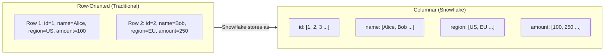
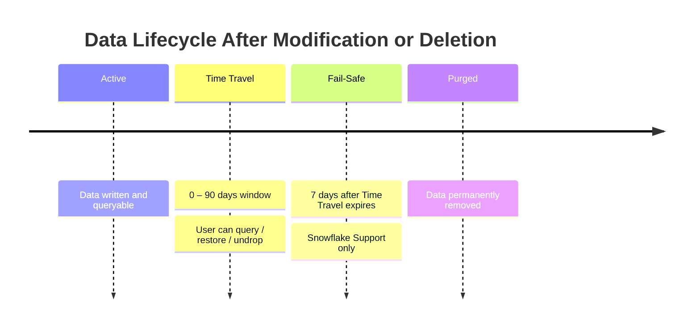

# Domain 1.5 — Snowflake Storage Concepts

## Exam Weight

**Domain 1.0** accounts for **~31%** of the exam. Storage concepts are foundational and appear in performance, governance, and data loading domains too.

> [!NOTE]
> This lesson maps to **Exam Objective 1.5**: *Explain Snowflake storage concepts*, including micro-partitions, data clustering, and all table and view types.

---

## Micro-Partitions

**Micro-partitions** are the fundamental storage unit in Snowflake. Every table's data is divided into micro-partitions automatically — no manual partitioning required.

### Key Characteristics

| Property | Value |
|---|---|
| **Size** | 50–500 MB (compressed) |
| **Format** | Columnar (column-oriented) |
| **Compression** | Automatic (Snowflake chooses algorithm) |
| **Encryption** | AES-256, automatic |
| **Immutability** | Immutable — DML creates new partitions |
| **Metadata** | Min/max values, distinct count, NULL count per column per partition |

### Columnar Storage

Snowflake stores data **by column, not by row**. This has major performance implications:



**Benefits for analytics:**
- Only the **queried columns** are read from disk → less I/O
- Similar values in a column compress extremely well → smaller storage
- Aggregate queries on one column skip all other columns

### Partition Pruning

Because Snowflake stores **min/max metadata per column per micro-partition**, it can **skip entire partitions** that don't match a WHERE clause:

```sql
-- Snowflake's optimizer knows which micro-partitions contain
-- orders from January 2025 and skips all others
SELECT sum(amount)
FROM orders
WHERE order_date BETWEEN '2025-01-01' AND '2025-01-31';
```

This is called **partition pruning** and is critical for query performance.

---

## Data Clustering

### Natural Clustering

When data is loaded in a consistent order (e.g., chronologically by `created_at`), micro-partitions are naturally well-clustered — queries filtering on that column benefit from pruning.

### Cluster Keys

For tables where the **natural load order doesn't match query patterns**, you can define an explicit **Cluster Key**:

```sql
-- Define a cluster key on the region and event_type columns
ALTER TABLE events CLUSTER BY (region, event_type);

-- Check clustering quality (0 = perfectly clustered, 1 = no clustering)
SELECT SYSTEM$CLUSTERING_INFORMATION('events', '(region, event_type)');
```

### Automatic Clustering

When a cluster key is defined, Snowflake's **Automatic Clustering** service runs in the background to **re-organize micro-partitions** — this consumes credits on your behalf.

| Concept | Description |
|---|---|
| **Cluster Depth** | Average number of overlapping partitions per value — lower is better |
| **Clustering Ratio** | Fraction of columns that are sorted within partitions — higher is better |
| **Automatic Clustering** | Background service that maintains clustering; billed separately |

> [!WARNING]
> Defining a cluster key on a small or infrequently queried table is **wasteful** — Automatic Clustering costs credits. Only cluster large tables (hundreds of GBs+) that are frequently queried on the cluster key column(s).

---

## Time Travel

**Time Travel** allows you to query historical versions of your data — up to 90 days in the past (depending on edition):

| Edition | Max Time Travel |
|---|---|
| Standard | 1 day (24 hours) |
| Enterprise | Up to 90 days |
| Business Critical | Up to 90 days |
| VPS | Up to 90 days |

```sql
-- Query data as it was 1 hour ago
SELECT * FROM orders AT (OFFSET => -3600);

-- Query data at a specific timestamp
SELECT * FROM orders AT (TIMESTAMP => '2025-06-01 12:00:00'::TIMESTAMP_TZ);

-- Query using a query ID (before that query ran)
SELECT * FROM orders BEFORE (STATEMENT => '019f18ba-0804-0...');

-- Restore a dropped table
UNDROP TABLE orders;

-- Clone a table at a point in time
CREATE TABLE orders_backup CLONE orders
    AT (TIMESTAMP => '2025-06-01 00:00:00'::TIMESTAMP_TZ);
```

### Time Travel Configuration

```sql
-- Set Time Travel retention for a specific table
ALTER TABLE orders SET DATA_RETENTION_TIME_IN_DAYS = 30;

-- Set at schema or database level
ALTER DATABASE my_db SET DATA_RETENTION_TIME_IN_DAYS = 7;

-- Disable Time Travel (reduce storage cost)
ALTER TABLE staging_table SET DATA_RETENTION_TIME_IN_DAYS = 0;
```

> [!NOTE]
> Time Travel data **does count toward storage billing**. Setting retention to 0 for tables that don't need historical recovery is a cost optimization strategy.

---

## Fail-Safe

**Fail-Safe** is a **7-day non-configurable** disaster recovery window that begins after the Time Travel period expires.



**Critical exam facts about Fail-Safe:**

| Property | Value |
|---|---|
| Duration | Always 7 days (non-configurable) |
| Who can recover data | **Snowflake Support only** (not the customer) |
| Cost | Included in storage — no extra charge |
| Self-service? | **No** — contact support |
| Applies to | Permanent tables only (not Temporary or Transient) |

> [!WARNING]
> Fail-Safe is **not** a self-service recovery tool. If you need self-service point-in-time recovery, use **Time Travel** (UNDROP / AT / BEFORE). Fail-Safe is a last resort that requires Snowflake Support involvement.

---

## Zero-Copy Cloning

**Zero-Copy Cloning** creates an instant copy of a database, schema, or table **without duplicating any underlying data**:

```sql
-- Clone entire database instantly
CREATE DATABASE DEV_DB CLONE PROD_DB;

-- Clone a schema
CREATE SCHEMA dev.staging CLONE prod.staging;

-- Clone a table
CREATE TABLE orders_backup CLONE orders;

-- Clone at a point in time (using Time Travel)
CREATE TABLE orders_jan CLONE orders
    AT (TIMESTAMP => '2025-01-31 23:59:59'::TIMESTAMP_TZ);
```

### How Zero-Copy Cloning Works

After cloning, the clone **shares the same micro-partitions** as the source. When either the source or the clone is modified, **Copy-on-Write** creates new micro-partitions for the modified data only:

```
Initial state:    [Partition A] [Partition B] [Partition C]
                       ↑              ↑              ↑
                   SOURCE       SOURCE + CLONE   SOURCE + CLONE

After UPDATE to clone:
Clone:        [New Partition A'] [Partition B] [Partition C]
Source:       [Partition A]      [Partition B] [Partition C]
```

**Benefits:**
- **Instant** — no data is copied
- **No extra storage cost** initially
- Storage only increases when data diverges between source and clone
- Perfect for dev/test environments, pre-migration snapshots, auditing

---

## Table Types (Comprehensive Review)

| Type | Persistence | Time Travel | Fail-Safe | Use Case |
|---|---|---|---|---|
| **Permanent** | Until dropped | 0–90 days | 7 days | Production tables |
| **Temporary** | Session end | 0–1 day | None | Session-scoped work |
| **Transient** | Until dropped | 0–1 day | None | Staging, intermediate ETL |
| **External** | Never (no data) | None | None | Query files in cloud storage |
| **Apache Iceberg** | Until dropped | Via Iceberg | Via Iceberg | Open format, multi-engine |
| **Dynamic** | Until dropped | Configurable | Configurable | Declarative incremental |

### Apache Iceberg Tables

Snowflake supports **Apache Iceberg** as an open table format — data lives in your own cloud storage and is accessible by multiple engines (Spark, Trino, Snowflake):

```sql
-- Iceberg table using Snowflake as catalog
CREATE ICEBERG TABLE icebergtable (id NUMBER, name STRING)
    CATALOG = SNOWFLAKE
    EXTERNAL_VOLUME = 'my_external_volume'
    BASE_LOCATION = 'iceberg_data/';
```

### Dynamic Tables

**Dynamic Tables** provide **declarative incremental materialization** — define the query result you want, and Snowflake keeps it fresh automatically:

```sql
CREATE DYNAMIC TABLE customer_summary
    TARGET_LAG = '1 hour'   -- data should be no older than 1 hour
    WAREHOUSE = WH_TRANSFORM
AS
SELECT
    customer_id,
    count(*) as order_count,
    sum(amount) as total_spent
FROM orders
GROUP BY customer_id;
```

**Dynamic Tables vs. Streams + Tasks:**
- Dynamic Tables: **simpler declarative approach** — Snowflake manages the refresh logic
- Streams + Tasks: **imperative** — you write the merge/insert logic explicitly

---

## View Types (Comprehensive Review)

| View Type | Definition Hidden | Pre-Computed | Auto-Refresh | Notes |
|---|---|---|---|---|
| **Standard** | No | No | N/A | Simple logical wrapper |
| **Secure** | Yes | No | N/A | Hides query logic from consumers |
| **Materialized** | No | Yes | Yes (background) | Performance optimization |

```sql
-- Materialized view: Snowflake refreshes this automatically
CREATE MATERIALIZED VIEW mv_hourly_sales AS
SELECT
    date_trunc('hour', sale_time) AS sale_hour,
    sum(amount) AS total_amount
FROM sales
GROUP BY 1;

-- Query the MV (reads pre-computed result)
SELECT * FROM mv_hourly_sales WHERE sale_hour > DATEADD('hour', -24, CURRENT_TIMESTAMP);
```

**Materialized View limitations:**
- Cannot reference other MVs or external tables
- Cannot use non-deterministic functions
- Maintained by Snowflake's background service (consumes credits)
- Only available on **Enterprise+**

---

## Encryption at Rest and in Transit

All Snowflake data is encrypted by default — no configuration required:

| Protection | Method |
|---|---|
| **Data at rest** | AES-256 (all micro-partitions) |
| **Data in transit** | TLS 1.2+ (all connections) |
| **Key management** | Snowflake-managed by default |
| **Tri-Secret Secure** | Customer-managed key (Business Critical+) |

---

## Practice Questions

**Q1.** What is the size range of a Snowflake micro-partition?

- A) 1–10 MB uncompressed
- B) 50–500 MB compressed ✅
- C) 1–5 GB uncompressed
- D) Fixed at 128 MB

**Q2.** After Time Travel expires, who can recover data during the Fail-Safe period?

- A) The customer using UNDROP
- B) The ACCOUNTADMIN role
- C) Snowflake Support only ✅
- D) No one — data is immediately purged

**Q3.** A data engineer clones a production table (`CREATE TABLE dev CLONE prod`). No modifications are made yet. How much additional storage does the clone consume?

- A) 100% of the original table size
- B) 50% of the original table size
- C) None — micro-partitions are shared ✅
- D) Only metadata storage

**Q4.** Which table type is appropriate for storing intermediate ETL results that do not need Fail-Safe but should persist beyond the current session?

- A) Temporary
- B) Transient ✅
- C) Permanent
- D) External

**Q5.** A Dynamic Table is configured with `TARGET_LAG = '1 hour'`. What does this mean?

- A) The table refreshes every hour at the top of the hour
- B) The data in the table should be no more than 1 hour behind the source ✅
- C) The table retains 1 hour of Time Travel
- D) The warehouse runs for 1 hour per refresh

**Q6.** Which Snowflake view type hides its underlying SELECT definition from users who have not been granted access by the owner?

- A) Materialized View
- B) Standard View
- C) Secure View ✅
- D) External View

**Q7.** Automatic Clustering is enabled on a table. Which statement is TRUE?

- A) Clustering runs on the customer's virtual warehouse
- B) Clustering is free and unlimited
- C) Clustering consumes credits on Snowflake's background service ✅
- D) Clustering requires the table to be recreated

---

> [!SUCCESS]
> **Key Takeaways for Exam Day:**
> 1. Micro-partitions: **50–500 MB compressed, columnar, immutable, automatic metadata**
> 2. Fail-Safe: **7 days, non-configurable, Snowflake Support only**
> 3. Time Travel: **Standard = 1 day max | Enterprise+ = 90 days max**
> 4. Zero-Copy Cloning: **instant, no initial storage cost, Copy-on-Write for divergence**
> 5. Transient vs Temporary: both no Fail-Safe, but Transient **persists** past session end
> 6. Dynamic Tables: declarative `TARGET_LAG` — simpler than Streams + Tasks