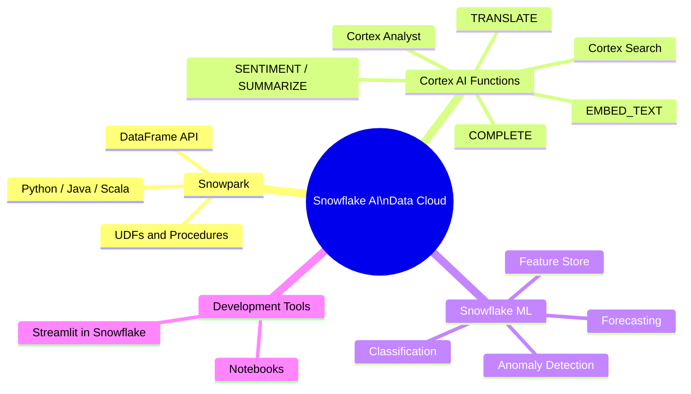

# Domain 1.6 — AI/ML and Application Development Features

## Exam Weight

**Domain 1.0** accounts for **~31%** of the exam. AI/ML features are a growing focus in the COF-C03 exam reflecting Snowflake's "AI Data Cloud" positioning.

> [!NOTE]
> This lesson maps to **Exam Objective 1.6**: *Explain AI/ML and application development features*, including Snowflake Notebooks, Streamlit, Snowpark, Snowflake Cortex, and Snowflake ML.



---

## Snowpark

**Snowpark** is Snowflake's developer framework that allows you to write data pipelines and transformations in **Python, Java, or Scala** using a DataFrame API — without moving data out of Snowflake.

### Key Snowpark Concepts

- Code is written in Python/Java/Scala using the Snowpark library
- Execution happens **inside Snowflake** — data never leaves
- Uses **lazy evaluation** — operations are built as a query plan and executed when an action is triggered
- Supports User-Defined Functions (UDFs), User-Defined Table Functions (UDTFs), and Stored Procedures

```python
# Python Snowpark example
from snowflake.snowpark import Session
from snowflake.snowpark.functions import col, sum as snow_sum

# Create a session
session = Session.builder.configs({
    "account": "myaccount",
    "user": "myuser",
    "password": "mypassword",
    "warehouse": "WH_DS",
    "database": "ANALYTICS",
    "schema": "PUBLIC"
}).create()

# Build a DataFrame (no data moved yet — lazy evaluation)
df = session.table("orders")

# Transform
result = (df
    .filter(col("status") == "COMPLETED")
    .group_by("region")
    .agg(snow_sum("amount").alias("total_revenue"))
    .sort("total_revenue", ascending=False)
)

# Execute and show results (triggers computation)
result.show()

# Write results back to Snowflake
result.write.mode("overwrite").save_as_table("revenue_by_region")
```

### Snowpark UDFs and UDTFs

```python
# Register a Python UDF in Snowflake
from snowflake.snowpark.functions import udf
from snowflake.snowpark.types import StringType, FloatType

@udf(return_type=FloatType(), input_types=[StringType()])
def sentiment_score(text: str) -> float:
    # This runs inside Snowflake's Python sandbox
    from textblob import TextBlob
    return TextBlob(text).sentiment.polarity

# Use the UDF in a query
df.select(sentiment_score(col("review_text")).alias("sentiment")).show()
```

### Snowpark for Machine Learning

```python
from snowflake.ml.modeling.linear_model import LinearRegression
from snowflake.ml.modeling.preprocessing import StandardScaler

# Train a model using Snowflake ML
scaler = StandardScaler(input_cols=["age", "income"], output_cols=["age_scaled", "income_scaled"])
df_scaled = scaler.fit(df).transform(df)

model = LinearRegression(input_cols=["age_scaled", "income_scaled"], label_cols=["churn"])
model.fit(df_scaled)

# Deploy model as UDF inside Snowflake
```

---

## Snowflake Cortex — AI SQL Functions

**Snowflake Cortex** provides **LLM-powered SQL functions** that run directly on Snowflake data — no external API calls required from the user's perspective.

### Cortex AI SQL Functions

| Function | Description | Example Use Case |
|---|---|---|
| `COMPLETE()` | Generate text with an LLM | Summarize, classify, answer questions |
| `EMBED_TEXT_768()` / `EMBED_TEXT_1024()` | Generate embeddings | Semantic search, similarity |
| `CLASSIFY_TEXT()` | Classify text into categories | Sentiment, topic classification |
| `EXTRACT_ANSWER()` | Extract an answer from context text | Q&A from documents |
| `SENTIMENT()` | Return sentiment score (-1 to 1) | Product review analysis |
| `SUMMARIZE()` | Summarize long text | News articles, documents |
| `TRANSLATE()` | Translate text between languages | Multilingual data |
| `PARSE_DOCUMENT()` | Extract text from PDFs/images | Document processing |

```sql
-- Summarize customer reviews
SELECT
    review_id,
    SNOWFLAKE.CORTEX.SUMMARIZE(review_text) AS summary
FROM customer_reviews;

-- Sentiment analysis
SELECT
    review_id,
    SNOWFLAKE.CORTEX.SENTIMENT(review_text) AS sentiment_score
FROM customer_reviews;

-- Classify support tickets
SELECT
    ticket_id,
    SNOWFLAKE.CORTEX.CLASSIFY_TEXT(
        ticket_body,
        ['billing', 'technical', 'account', 'general']
    ):label::STRING AS category
FROM support_tickets;

-- Generate completions with LLM
SELECT
    SNOWFLAKE.CORTEX.COMPLETE(
        'mistral-7b',   -- or 'llama3-70b', 'mixtral-8x7b', 'snowflake-arctic'
        'Summarize the following in one sentence: ' || description
    ) AS ai_summary
FROM products;
```

### Cortex Search

**Cortex Search** provides **semantic (vector) search** capabilities over Snowflake data without managing embeddings manually:

```sql
-- Create a Cortex Search service
CREATE CORTEX SEARCH SERVICE product_search
    ON COLUMN product_description
    WAREHOUSE = WH_SEARCH
    TARGET_LAG = '1 hour'
AS (
    SELECT product_id, product_name, product_description
    FROM products
    WHERE is_active = TRUE
);

-- Query the search service (via API or SQL function)
SELECT SNOWFLAKE.CORTEX.SEARCH_PREVIEW(
    'product_search',
    '{"query": "wireless noise-cancelling headphones", "limit": 5}'
);
```

### Cortex Analyst

**Cortex Analyst** enables **natural language to SQL** generation — business users ask questions in plain English and Cortex Analyst returns SQL queries and results:

- Built on LLMs fine-tuned for SQL generation
- Understands your Snowflake schema and semantic model
- Powers conversational BI interfaces
- Accessed via REST API or Streamlit integration

---

## Snowflake ML

**Snowflake ML** is a suite of ML capabilities built into Snowflake:

### Feature Store

Store, manage, and share ML features as Snowflake objects:

```python
from snowflake.ml.feature_store import FeatureStore, Entity, FeatureView

fs = FeatureStore(session=session, database="ML_DB", name="MY_FEATURE_STORE", ...)

# Define an entity
customer_entity = Entity(name="customer", join_keys=["customer_id"])

# Create a feature view
fv = FeatureView(
    name="customer_features",
    entities=[customer_entity],
    feature_df=df_features,
    refresh_freq="1 day"
)
fs.register_feature_view(fv, version="v1")
```

### Model Registry

Store, version, and deploy ML models inside Snowflake:

```python
from snowflake.ml.registry import Registry

reg = Registry(session=session, database_name="ML_DB", schema_name="PUBLIC")

# Log a model
mv = reg.log_model(
    model=trained_sklearn_model,
    model_name="churn_predictor",
    version_name="v1",
    sample_input_data=df_sample
)

# Run inference
predictions = mv.run(df_new_customers, function_name="predict")
```

### AutoML with Snowflake ML

```python
from snowflake.ml.modeling.linear_model import LogisticRegression
from snowflake.ml.modeling.model_selection import GridSearchCV

# Cross-validate hyperparameters inside Snowflake
param_grid = {"C": [0.1, 1, 10], "max_iter": [100, 200]}
cv = GridSearchCV(estimator=LogisticRegression(), param_grid=param_grid, cv=5)
cv.fit(df_train)
```

---

## Snowflake Notebooks

**Snowflake Notebooks** are **Jupyter-style interactive notebooks** embedded directly in Snowsight:

- Supports **SQL, Python (Snowpark), and Markdown cells** in the same notebook
- Python cells run inside Snowflake — data never leaves
- Access Snowflake data directly without connection setup
- Version-controlled via **Git integration**
- Can visualize results with popular Python libraries (matplotlib, plotly, altair)

```python
# In a Snowflake Notebook Python cell
import streamlit as st
import matplotlib.pyplot as plt

# Load data using Snowpark (already connected)
df = session.table("orders").to_pandas()

# Visualize
fig, ax = plt.subplots()
df.groupby("region")["amount"].sum().plot(kind="bar", ax=ax)
st.pyplot(fig)
```

```sql
-- In a SQL cell within the same notebook
SELECT region, count(*) as order_count
FROM orders
WHERE order_date >= DATEADD('month', -3, CURRENT_DATE)
GROUP BY 1
ORDER BY 2 DESC;
```

---

## Streamlit in Snowflake

**Streamlit in Snowflake** allows you to **deploy Streamlit Python applications directly inside Snowflake** — no external hosting required:

- Python data apps run natively in Snowflake
- Access Snowflake data securely without API keys
- Share with users inside your Snowflake account
- Use Snowflake RBAC to control who can access the app
- Build dashboards, data explorers, AI-powered apps

```python
# streamlit_app.py — runs inside Snowflake
import streamlit as st
from snowflake.snowpark.context import get_active_session

# Get the active Snowflake session (pre-authenticated)
session = get_active_session()

st.title("Sales Dashboard")

# Query Snowflake data
df = session.sql("SELECT region, sum(amount) as revenue FROM orders GROUP BY 1").to_pandas()

st.bar_chart(df.set_index("REGION")["REVENUE"])

# Use Cortex for AI features
query = st.text_input("Ask a question about your data:")
if query:
    response = session.sql(f"""
        SELECT SNOWFLAKE.CORTEX.COMPLETE('mistral-7b', '{query}')
    """).collect()[0][0]
    st.write(response)
```

```sql
-- Deploy a Streamlit app
CREATE STREAMLIT my_dashboard
    ROOT_LOCATION = '@my_stage/streamlit_app'
    MAIN_FILE = 'streamlit_app.py'
    QUERY_WAREHOUSE = WH_BI;
```

---

## AI/ML Feature Summary Table

| Feature | What It Does | Where It Runs |
|---|---|---|
| **Snowpark** | DataFrame API for Python/Java/Scala | Inside Snowflake (compute layer) |
| **Cortex COMPLETE()** | LLM text generation | Snowflake-managed LLM endpoints |
| **Cortex SENTIMENT()** | Sentiment analysis | Snowflake-managed LLM endpoints |
| **Cortex SUMMARIZE()** | Text summarization | Snowflake-managed LLM endpoints |
| **Cortex Search** | Semantic search service | Snowflake-managed vector index |
| **Cortex Analyst** | NL → SQL conversion | Snowflake-managed LLM |
| **Snowflake ML** | Sklearn-compatible ML in Snowflake | Snowflake compute |
| **Feature Store** | ML feature management | Snowflake storage + compute |
| **Model Registry** | ML model versioning & deployment | Snowflake storage + compute |
| **Notebooks** | Interactive SQL + Python IDE | Snowflake compute |
| **Streamlit in Snowflake** | Python web app hosting | Snowflake compute |

---

## Practice Questions

**Q1.** A data scientist wants to train a machine learning model using Python without moving data out of Snowflake. Which feature enables this?

- A) External functions
- B) Snowpark ✅
- C) Snowsight Dashboards
- D) COPY INTO

**Q2.** Which Snowflake Cortex function would you use to return a sentiment score between -1 and 1 for customer reviews?

- A) `COMPLETE()`
- B) `SUMMARIZE()`
- C) `SENTIMENT()` ✅
- D) `EXTRACT_ANSWER()`

**Q3.** A business analyst wants to ask "What were the top 5 products by revenue last quarter?" in plain English and get a SQL query back. Which Cortex feature supports this?

- A) Cortex Search
- B) Cortex Analyst ✅
- C) Cortex COMPLETE()
- D) Snowflake ML Registry

**Q4.** Streamlit in Snowflake applications are secured using which Snowflake mechanism?

- A) API keys in the app code
- B) Snowflake Role-Based Access Control (RBAC) ✅
- C) Third-party OAuth only
- D) Public internet access without authentication

**Q5.** Snowpark uses lazy evaluation. What triggers actual computation?

- A) Creating the DataFrame object
- B) Calling `.filter()` or `.group_by()`
- C) Calling an action like `.show()`, `.collect()`, or `.write` ✅
- D) Connecting to the session

---

> [!SUCCESS]
> **Key Takeaways for Exam Day:**
> 1. **Snowpark** = DataFrame API for Python/Java/Scala running INSIDE Snowflake
> 2. **Cortex SQL functions** = LLM capabilities as SQL (`SENTIMENT`, `SUMMARIZE`, `COMPLETE`, etc.)
> 3. **Cortex Analyst** = natural language → SQL for business users
> 4. **Cortex Search** = managed semantic/vector search service
> 5. **Streamlit in Snowflake** = Python web apps hosted and secured within Snowflake
> 6. **Snowflake Notebooks** = Jupyter-style notebooks with SQL + Python cells in Snowsight