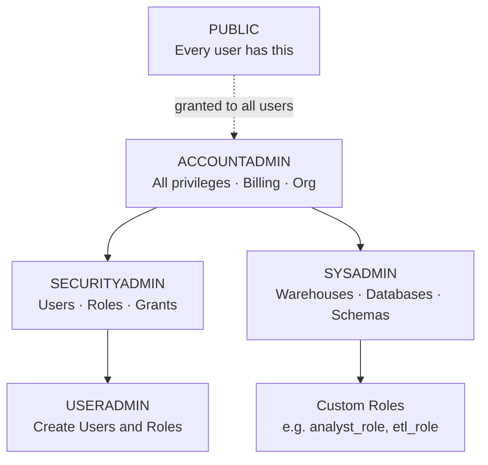

# Domain 2.1 — Snowflake Security Model and Principles

## Exam Weight

**Domain 2.0 — Account Management and Data Governance** accounts for **~20%** of the exam. Security is one of the most heavily tested topics.

> [!NOTE]
> This lesson maps to **Exam Objective 2.1**: *Explain Snowflake security model and principles*, including RBAC, DAC, securable object hierarchy, network policies, authentication methods, system-defined roles, functional roles, secondary roles, account identifiers, and logging/tracing.

---

## Snowflake's Access Control Framework

Snowflake uses **two complementary access control models** that work together:

| Model | Acronym | How It Works |
|---|---|---|
| **Role-Based Access Control** | RBAC | Privileges are granted to **roles**, roles are granted to **users** |
| **Discretionary Access Control** | DAC | The **owner of an object** can grant access to that object to other roles |

### RBAC in Practice

```sql
-- Grant privilege to a role
GRANT SELECT ON TABLE analytics.public.orders TO ROLE analyst_role;

-- Grant role to a user
GRANT ROLE analyst_role TO USER jane;

-- When Jane logs in, she can activate her role and run queries
USE ROLE analyst_role;
SELECT * FROM analytics.public.orders;
```

### DAC in Practice

The role that **owns** (created) an object can grant access to it:

```sql
-- Jane's role (data_owner) created this table — it "owns" it
CREATE TABLE analytics.public.customer_data (...);

-- As the owner, data_owner can grant access to others
GRANT SELECT ON TABLE analytics.public.customer_data TO ROLE analyst_role;
```

> [!NOTE]
> DAC means you don't need SYSADMIN to manage every grant. Object owners can self-manage access to their objects — this enables **federated administration**.

---

## Securable Object Hierarchy

Every Snowflake object is a **securable object** — privileges can be granted on it. Objects inherit from their parent container:

```
Organization
└── Account
    ├── Warehouse
    ├── Database
    │   └── Schema
    │       ├── Table
    │       ├── View
    │       ├── Stage
    │       ├── Function (UDF)
    │       ├── Procedure
    │       └── Stream / Task / Pipe
    ├── User
    └── Role
```

To access an object, a role typically needs:
1. `USAGE` on the **database**
2. `USAGE` on the **schema**
3. The specific privilege on the **object** (e.g., `SELECT`, `INSERT`)

```sql
-- Minimum grants for read access to a table
GRANT USAGE ON DATABASE analytics TO ROLE analyst_role;
GRANT USAGE ON SCHEMA analytics.public TO ROLE analyst_role;
GRANT SELECT ON TABLE analytics.public.orders TO ROLE analyst_role;

-- Grant on all current objects
GRANT SELECT ON ALL TABLES IN SCHEMA analytics.public TO ROLE analyst_role;

-- Grant on future objects too
GRANT SELECT ON FUTURE TABLES IN SCHEMA analytics.public TO ROLE analyst_role;
```

---

## System-Defined Roles

Snowflake provides pre-built system roles with a fixed privilege hierarchy:

| Role | Description | Key Privileges |
|---|---|---|
| `ACCOUNTADMIN` | Highest-level role | All privileges; manages billing, replication, org |
| `SECURITYADMIN` | Manages users and roles | Create/manage users, roles, grants |
| `SYSADMIN` | Manages warehouses and databases | Create warehouses, databases, schemas, tables |
| `USERADMIN` | Limited user management | Create users and roles only |
| `PUBLIC` | Default role for all users | Minimal — every user has this role |

**Role inheritance hierarchy:**



> [!WARNING]
> Best practice: **Never use ACCOUNTADMIN for daily tasks**. Create custom roles for specific workflows. ACCOUNTADMIN should be used only for account-level administration. Avoid logging in as a user whose default role is ACCOUNTADMIN.

---

## Functional Roles: Account Roles, Database Roles, and Custom Roles

### Account Roles

Account roles are scoped to the **entire account** — they can grant access to any object in the account:

```sql
-- Create a custom account role
CREATE ROLE analyst_role;
GRANT ROLE analyst_role TO ROLE SYSADMIN;  -- always grant custom roles to SYSADMIN!

-- Grant privileges
GRANT USAGE ON DATABASE analytics TO ROLE analyst_role;
GRANT SELECT ON ALL TABLES IN SCHEMA analytics.marts TO ROLE analyst_role;
```

> [!WARNING]
> Always grant custom roles to `SYSADMIN` (or higher) so that the SYSADMIN role retains visibility and control over all objects owned by custom roles.

### Database Roles

**Database roles** are scoped to a **specific database** and can be shared via Secure Data Sharing:

```sql
-- Create a database role
CREATE DATABASE ROLE analytics.reader_role;

-- Grant privileges within the database only
GRANT USAGE ON SCHEMA analytics.public TO DATABASE ROLE analytics.reader_role;
GRANT SELECT ON ALL TABLES IN SCHEMA analytics.public TO DATABASE ROLE analytics.reader_role;

-- Grant database role to an account role
GRANT DATABASE ROLE analytics.reader_role TO ROLE analyst_account_role;

-- Database roles can also be included in shares
GRANT DATABASE ROLE analytics.reader_role TO SHARE my_data_share;
```

### Secondary Roles

A user can activate **one primary role** and multiple **secondary roles** simultaneously:

```sql
-- Activate primary role + secondary roles
USE SECONDARY ROLES ALL;  -- activates all roles granted to the user

-- Or specify specific secondary roles
USE SECONDARY ROLES analyst_role, loader_role;
```

When secondary roles are active, the user has the **union of all privileges** from their primary + secondary roles.

---

## Authentication Methods

### Username + Password

Basic authentication — username and password. Least secure but simplest.

```sql
CREATE USER jane PASSWORD = 'SecurePass123!' MUST_CHANGE_PASSWORD = TRUE;
```

### Multi-Factor Authentication (MFA)

MFA adds a second factor (Duo Security) to password authentication:

```sql
-- Enforce MFA for a user
ALTER USER jane SET MINS_TO_BYPASS_MFA = 0;  -- enforce always

-- Policy-based MFA enforcement (account level)
ALTER ACCOUNT SET MFA_ENROLLMENT = REQUIRED;
```

### Federated Authentication / SSO

Snowflake integrates with enterprise **Identity Providers (IdPs)** via **SAML 2.0**:
- Okta, Azure AD, OneLogin, Ping Identity, etc.
- Users authenticate via the IdP — Snowflake validates the SAML assertion
- No Snowflake password required

```sql
-- Configure SAML SSO
CREATE SECURITY INTEGRATION my_saml_sso
    TYPE = SAML2
    SAML2_ISSUER = 'https://idp.example.com'
    SAML2_SSO_URL = 'https://idp.example.com/sso/saml'
    SAML2_PROVIDER = 'OKTA'
    SAML2_X509_CERT = '<certificate_content>';
```

### OAuth

Snowflake supports OAuth 2.0 for third-party applications and BI tools:

| OAuth Type | Use Case |
|---|---|
| **Snowflake OAuth** | Client applications (Tableau, PowerBI, custom apps) |
| **External OAuth** | Okta, Azure AD as OAuth server (SSO via token) |

```sql
-- Create an OAuth integration for a BI tool
CREATE SECURITY INTEGRATION tableau_oauth
    TYPE = OAUTH
    OAUTH_CLIENT = TABLEAU_DESKTOP
    OAUTH_REDIRECT_URI = 'https://localhost:5000';
```

### Key-Pair Authentication

RSA key-pair authentication for **service accounts and programmatic access** — more secure than passwords for automation:

```bash
# Generate key pair
openssl genrsa 2048 | openssl pkcs8 -topk8 -v2 des3 -inform PEM -out rsa_key.p8
openssl rsa -in rsa_key.p8 -pubout -out rsa_key.pub
```

```sql
-- Assign public key to user
ALTER USER svc_account SET RSA_PUBLIC_KEY = '<public_key_content>';
```

---

## Network Policies

A **Network Policy** controls which IP addresses can connect to Snowflake:

```sql
-- Create a network policy (allowlist + blocklist)
CREATE NETWORK POLICY corp_policy
    ALLOWED_IP_LIST = ('203.0.113.0/24', '198.51.100.50')
    BLOCKED_IP_LIST = ('198.51.100.100');

-- Apply at account level
ALTER ACCOUNT SET NETWORK_POLICY = corp_policy;

-- Apply at user level (overrides account policy for that user)
ALTER USER jane SET NETWORK_POLICY = corp_policy;
```

> [!NOTE]
> Network policies support **IPv4 CIDR notation**. When applied at the user level, the user-level policy overrides the account-level policy. Network policies are evaluated **before** authentication.

---

## Account Identifiers

Every Snowflake account has unique identifiers:

| Format | Example | Description |
|---|---|---|
| **Account locator** | `xy12345.us-east-1` | Legacy format (cloud+region specific) |
| **Account name** | `myorg-myaccount` | Modern format (org_name-account_name) |
| **Connection URL** | `xy12345.us-east-1.snowflakecomputing.com` | Full JDBC/connection URL |

```python
# Connect using account name (preferred)
conn = snowflake.connector.connect(
    account="myorg-myaccount",
    user="jane",
    password="secret"
)

# Connect using account locator (legacy)
conn = snowflake.connector.connect(
    account="xy12345.us-east-1",
    user="jane",
    password="secret"
)
```

---

## Logging and Tracing

### Access History

`SNOWFLAKE.ACCOUNT_USAGE.ACCESS_HISTORY` tracks who accessed what data:

```sql
-- Who queried the customers table in the last 7 days?
SELECT
    user_name,
    query_start_time,
    query_text
FROM SNOWFLAKE.ACCOUNT_USAGE.ACCESS_HISTORY
WHERE EXISTS (
    SELECT 1 FROM TABLE(FLATTEN(BASE_OBJECTS_ACCESSED)) f
    WHERE f.value:objectName::STRING = 'ANALYTICS.PUBLIC.CUSTOMERS'
)
AND query_start_time > DATEADD('day', -7, CURRENT_TIMESTAMP);
```

### Event Tables (Logging and Tracing)

Snowflake supports **OpenTelemetry-compatible logging and tracing** via event tables:

```sql
-- Create an event table
CREATE EVENT TABLE my_events;

-- Set at account level
ALTER ACCOUNT SET EVENT_TABLE = my_events;

-- Query logged events
SELECT *
FROM my_events
WHERE TIMESTAMP > DATEADD('hour', -1, CURRENT_TIMESTAMP)
ORDER BY TIMESTAMP DESC;
```

---

## Practice Questions

**Q1.** A team wants the owner of a table to be able to grant SELECT access to other roles without involving SYSADMIN. Which access control model enables this?

- A) Role-Based Access Control (RBAC)
- B) Discretionary Access Control (DAC) ✅
- C) Mandatory Access Control (MAC)
- D) Attribute-Based Access Control (ABAC)

**Q2.** Which system role should be used for daily account administration of warehouses and databases?

- A) ACCOUNTADMIN
- B) SECURITYADMIN
- C) SYSADMIN ✅
- D) USERADMIN

**Q3.** A service account needs to authenticate without a password for CI/CD automation. Which authentication method is most appropriate?

- A) Username + Password
- B) MFA with Duo
- C) Key-pair authentication ✅
- D) SAML SSO

**Q4.** Jane has primary role `ANALYST` and secondary roles ALL activated. Which statement is TRUE?

- A) Jane can only use privileges from the ANALYST role
- B) Jane has the union of privileges from all her granted roles ✅
- C) Jane cannot run queries with secondary roles active
- D) Secondary roles override the primary role's privileges

**Q5.** A network policy is applied at both the account level and the user level for user Bob. Which policy applies to Bob?

- A) The account-level policy
- B) The most restrictive policy
- C) The user-level policy ✅
- D) Both policies are applied simultaneously

**Q6.** To grant a new custom role to the role hierarchy so SYSADMIN can manage objects it creates, the custom role should be granted to which role?

- A) ACCOUNTADMIN
- B) PUBLIC
- C) SYSADMIN ✅
- D) SECURITYADMIN

---

> [!SUCCESS]
> **Key Takeaways for Exam Day:**
> 1. **RBAC**: privileges → roles → users | **DAC**: object owner grants access
> 2. System role hierarchy: ACCOUNTADMIN > SYSADMIN > custom roles | SECURITYADMIN > USERADMIN
> 3. Always grant custom roles to **SYSADMIN**
> 4. Network policy at **user level overrides** account-level policy
> 5. Key-pair auth = best for service accounts and automation
> 6. Secondary roles = user activates union of all granted role privileges