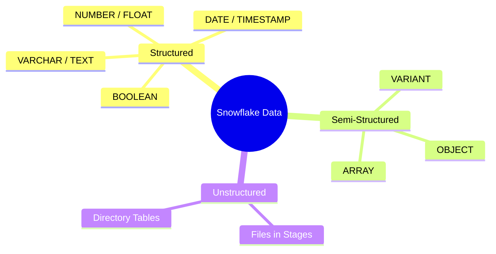
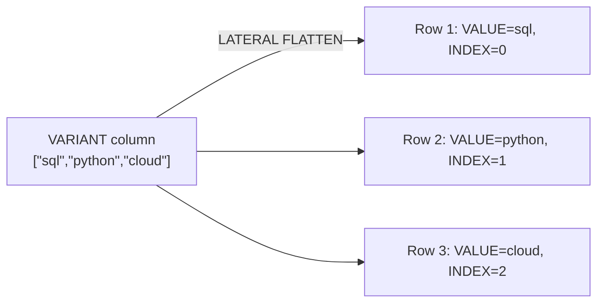
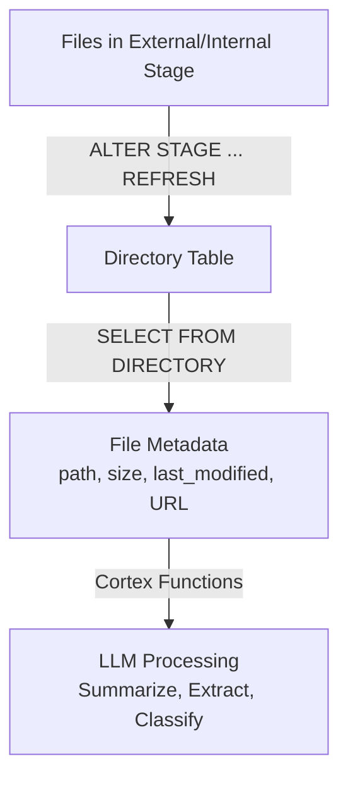
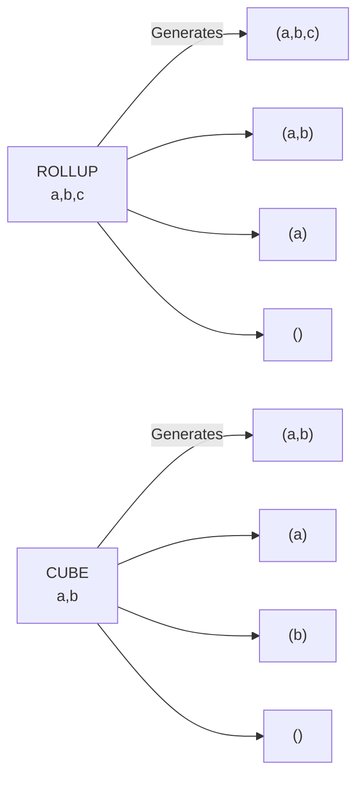
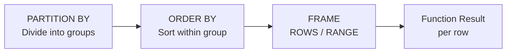
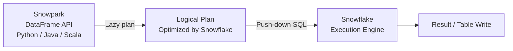
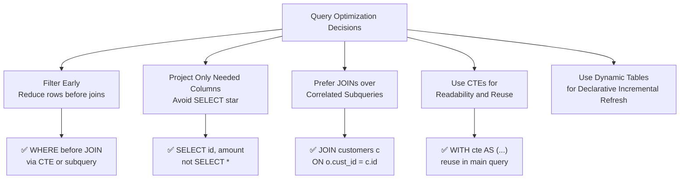

# Domain 4.4 — Data Transformation in Snowflake

> [!NOTE]
> **Exam Domain 4.4** — *Data Transformation* contributes to the **Performance Optimization, Querying, and Transformation** domain, which is **21%** of the COF-C03 exam.

---

## Data Type Landscape



---

## 1. Semi-Structured Data — VARIANT

Snowflake stores JSON, Avro, ORC, Parquet, and XML natively in a **VARIANT** column. No schema definition is needed at load time.

### Navigation Operators

| Operator | Purpose | Example |
|---|---|---|
| `:` | Navigate key | `v:address:city` |
| `[n]` | Array index | `v:tags[0]` |
| `::TYPE` | Cast to SQL type | `v:amount::FLOAT` |

```sql
-- Load JSON and query with colon notation
CREATE TABLE events (v VARIANT);
COPY INTO events FROM @my_stage/events.json.gz
  FILE_FORMAT = (TYPE = 'JSON');

SELECT
  v:user_id::INTEGER         AS user_id,
  v:event_name::VARCHAR      AS event_name,
  v:properties:page::VARCHAR AS page   -- nested key
FROM events;
```

> [!WARNING]
> Without `::TYPE` casting, expressions return a **VARIANT** — comparisons, sorting, and GROUP BY may behave unexpectedly.

### FLATTEN — Exploding Arrays



```sql
SELECT
  e.v:user_id::INT  AS user_id,
  f.value::VARCHAR  AS tag,
  f.index           AS tag_index
FROM events e,
     LATERAL FLATTEN(INPUT => e.v:tags) f;
```

Key FLATTEN output columns: `VALUE`, `KEY`, `INDEX`, `PATH`, `THIS`.

```sql
-- Recursive flatten (all depth levels)
SELECT path, value
FROM events,
     LATERAL FLATTEN(INPUT => v, RECURSIVE => TRUE);
```

### Building VARIANT Output

```sql
-- Build a VARIANT object from columns
SELECT OBJECT_CONSTRUCT('id', id, 'name', name) AS json_row
FROM customers;

-- Aggregate rows into a JSON array
SELECT ARRAY_AGG(OBJECT_CONSTRUCT('id', id, 'city', city)) AS cities
FROM customers GROUP BY country;
```

---

## 2. Unstructured Data and Directory Tables



```sql
-- Enable directory table on a stage
CREATE STAGE my_docs
  URL = 's3://bucket/docs/'
  DIRECTORY = (ENABLE = TRUE);

ALTER STAGE my_docs REFRESH;

SELECT RELATIVE_PATH, SIZE, LAST_MODIFIED, FILE_URL
FROM DIRECTORY(@my_docs);
```

---

## 3. Aggregate Functions

### Standard Aggregates

```sql
SELECT
  region,
  COUNT(*)                          AS total_orders,
  COUNT(DISTINCT customer_id)       AS unique_customers,
  SUM(amount)                       AS revenue,
  AVG(amount)                       AS avg_order,
  MEDIAN(amount)                    AS median_amt,
  APPROX_COUNT_DISTINCT(session_id) AS approx_sessions  -- HyperLogLog
FROM orders
GROUP BY region;
```

### GROUPING SETS, ROLLUP, CUBE



```sql
-- ROLLUP: subtotals along hierarchy (right-to-left)
SELECT region, country, SUM(revenue)
FROM sales
GROUP BY ROLLUP(region, country);

-- CUBE: every possible combination
SELECT region, product, SUM(revenue)
FROM sales
GROUP BY CUBE(region, product);

-- GROUPING SETS: exact combinations you define
SELECT region, product, SUM(revenue)
FROM sales
GROUP BY GROUPING SETS ((region), (product), (region, product), ());
```

> [!WARNING]
> `ROLLUP(a, b)` ≠ `ROLLUP(b, a)`. Subtotals are generated **right-to-left** along the list — order matters.

---

## 4. Window Functions

Window functions compute values **across related rows** without collapsing them into one output row.

### Window Clause Anatomy



```sql
function_name(args)
  OVER (
    [PARTITION BY partition_expr]
    [ORDER BY sort_expr]
    [ROWS|RANGE BETWEEN frame_start AND frame_end]
  )
```

### Ranking Functions

```sql
SELECT
  product, region, revenue,
  ROW_NUMBER()   OVER (PARTITION BY region ORDER BY revenue DESC) AS row_num,
  RANK()         OVER (PARTITION BY region ORDER BY revenue DESC) AS rnk,
  DENSE_RANK()   OVER (PARTITION BY region ORDER BY revenue DESC) AS dense_rnk,
  NTILE(4)       OVER (PARTITION BY region ORDER BY revenue DESC) AS quartile
FROM sales;
```

| Function | Ties get same rank? | Gaps after ties? |
|---|---|---|
| `ROW_NUMBER` | No — arbitrary tiebreak | No |
| `RANK` | **Yes** | **Yes** |
| `DENSE_RANK` | **Yes** | **No** |

### Value / Offset Functions

```sql
SELECT
  order_date, amount,
  LAG(amount,  1, 0) OVER (ORDER BY order_date) AS prev_amount,
  LEAD(amount, 1, 0) OVER (ORDER BY order_date) AS next_amount,
  FIRST_VALUE(amount) OVER (ORDER BY order_date
    ROWS BETWEEN UNBOUNDED PRECEDING AND CURRENT ROW) AS first_amt,
  LAST_VALUE(amount)  OVER (ORDER BY order_date
    ROWS BETWEEN CURRENT ROW AND UNBOUNDED FOLLOWING) AS last_amt
FROM orders;
```

> [!WARNING]
> `LAST_VALUE` default frame is `RANGE BETWEEN UNBOUNDED PRECEDING AND CURRENT ROW` — it returns the **current** row, not the last. Always add `ROWS BETWEEN CURRENT ROW AND UNBOUNDED FOLLOWING`.

### Running Aggregates

```sql
SELECT
  order_date, amount,
  SUM(amount) OVER (ORDER BY order_date
    ROWS BETWEEN UNBOUNDED PRECEDING AND CURRENT ROW) AS running_total,
  AVG(amount) OVER (ORDER BY order_date
    ROWS BETWEEN 6 PRECEDING AND CURRENT ROW)         AS rolling_7day_avg
FROM orders;
```

---

## 5. PIVOT and UNPIVOT


```sql
-- PIVOT: rows → columns
SELECT *
FROM (SELECT region, quarter, revenue FROM sales)
PIVOT (SUM(revenue) FOR quarter IN ('Q1','Q2','Q3','Q4'))
AS p (region, q1, q2, q3, q4);

-- UNPIVOT: columns → rows
SELECT region, quarter, revenue
FROM quarterly_summary
UNPIVOT (revenue FOR quarter IN (q1, q2, q3, q4));
```

---

## 6. Recursive CTEs

```sql
WITH RECURSIVE org AS (
  -- Anchor: top-level employees (no manager)
  SELECT employee_id, manager_id, name, 1 AS depth
  FROM employees WHERE manager_id IS NULL
  UNION ALL
  -- Recursive: each report
  SELECT e.employee_id, e.manager_id, e.name, o.depth + 1
  FROM employees e
  JOIN org o ON e.manager_id = o.employee_id
)
SELECT * FROM org ORDER BY depth, name;
```

---

## 7. Snowpark Transformations



```python
from snowflake.snowpark import Session
from snowflake.snowpark.functions import col, sum as sum_, when

session = Session.builder.configs(connection_params).create()

result = (
    session.table("orders")
    .filter(col("status") == "COMPLETED")
    .with_column("band",
        when(col("amount") < 100, "low")
        .when(col("amount") < 500, "medium")
        .otherwise("high"))
    .group_by("region", "band")
    .agg(sum_("amount").alias("total"))
    .sort("region", "total")
)

result.write.mode("overwrite").save_as_table("revenue_summary")
```

> [!NOTE]
> Snowpark uses **lazy evaluation** — transformations build a logical plan. Execution only occurs on action calls: `.collect()`, `.show()`, or a write operation.

---

## 8. SQL Transformation Optimization Patterns

Understanding how to write efficient transformation SQL is an exam objective. Snowflake's columnar, micro-partition engine rewards certain patterns.



### Filter Early — Push Predicates Up

```sql
-- ❌ Slow: joins all rows, then filters
SELECT a.*, b.city
FROM large_orders a
JOIN customers b ON a.cust_id = b.id
WHERE a.order_date > '2024-01-01';

-- ✅ Better: CTE filters before join
WITH recent AS (
    SELECT * FROM large_orders
    WHERE order_date > '2024-01-01'   -- prune micro-partitions early
)
SELECT r.*, c.city
FROM recent r
JOIN customers c ON r.cust_id = c.id;
```

### Avoid SELECT \*

```sql
-- ❌ Reads every column from disk (columnar penalty)
SELECT * FROM orders;

-- ✅ Read only what you need
SELECT order_id, amount, status FROM orders;
```

### Correlated Subqueries vs JOINs

```sql
-- ❌ Correlated scalar subquery — re-executes per row
SELECT o.*, (SELECT name FROM customers WHERE id = o.cust_id) AS cname
FROM orders o;

-- ✅ Equivalent JOIN — single pass
SELECT o.*, c.name AS cname
FROM orders o
JOIN customers c ON o.cust_id = c.id;
```

### Dynamic Tables — Declarative Incremental Refresh

Dynamic Tables define a transformation result set and let Snowflake determine how to refresh it incrementally.

```sql
CREATE DYNAMIC TABLE orders_summary
    TARGET_LAG = '10 minutes'          -- acceptable staleness
    WAREHOUSE = wh_pipeline
AS
    SELECT
        region,
        DATE_TRUNC('day', order_date) AS order_day,
        COUNT(*)       AS order_count,
        SUM(amount)    AS total_amount
    FROM raw.orders
    GROUP BY 1, 2;
```

> [!NOTE]
> Dynamic Tables are **serverless-eligible** and automatically track upstream changes. They are the preferred pattern for declarative ELT pipelines over manually maintained Streams + Tasks.

---

## Summary

> [!SUCCESS]
> **Key Takeaways for the Exam**
> - `v:key::TYPE` — colon notation for key traversal, `[n]` for array index, `::` to cast VARIANT to SQL type.
> - `LATERAL FLATTEN` explodes arrays/objects into rows; key output columns: `VALUE`, `KEY`, `INDEX`, `PATH`.
> - `ROLLUP` generates subtotals right-to-left; `CUBE` generates all combinations; `GROUPING SETS` defines explicit groupings.
> - `RANK` has gaps after ties; `DENSE_RANK` does not; `ROW_NUMBER` is always unique.
> - `LAST_VALUE` default frame stops at current row — always add `ROWS BETWEEN CURRENT ROW AND UNBOUNDED FOLLOWING`.
> - Snowpark = lazy evaluation; computation only triggers on action calls (`.collect()`, `.show()`, write).
> - Directory Tables expose file metadata from stages; enabled with `DIRECTORY = (ENABLE = TRUE)`.
> - Filter early and project only needed columns to maximise micro-partition pruning.
> - Prefer JOINs over correlated subqueries; use Dynamic Tables for declarative incremental pipelines.

---

## Practice Questions

**1.** JSON: `{"tags":["sql","python","cloud"]}`. Which returns `"python"`?

- A) `v:tags::VARCHAR`
- B) `v:tags[1]::VARCHAR` ✅
- C) `v:tags[2]::VARCHAR`
- D) `v.tags[1]::VARCHAR`

---

**2.** `LATERAL FLATTEN(INPUT => v:tags)` — which column holds the actual tag value?

- A) `KEY`
- B) `INDEX`
- C) `VALUE` ✅
- D) `PATH`

---

**3.** Data: `(A,100),(A,100),(B,200)` DESC. What does `RANK()` return for both `A` rows?

- A) 2, 3
- B) 2, 2 ✅
- C) 1, 2
- D) 1, 1

---

**4.** `GROUP BY ROLLUP(region, country)` with 3 regions × 4 countries produces how many groupings?

- A) 12
- B) 16
- C) 17 ✅ *(12 detail + 3 region subtotals + 1 grand total)*
- D) 24

---

**5.** `LAST_VALUE` returns the current row instead of the last row in a partition. What is the cause?

- A) Missing `PARTITION BY` clause
- B) Default frame ends at `CURRENT ROW` ✅
- C) `ORDER BY` is descending
- D) `LAST_VALUE` only works with `RANK()`

---

**6.** A Snowpark script calls `.filter().group_by().agg()` but no data is returned until `.collect()`. This describes:

- A) Eager evaluation
- B) Lazy evaluation ✅
- C) Deferred compilation
- D) Async pipelining

---

**7.** Which function converts an array stored in a VARIANT column into individual rows?

- A) `PARSE_JSON`
- B) `ARRAY_AGG`
- C) `LATERAL FLATTEN` ✅
- D) `OBJECT_CONSTRUCT`

---

**8.** A developer writes a query that joins two large tables and then applies a WHERE clause to filter by date. A colleague rewrites the filter into a CTE applied before the join. What is the primary benefit of the rewrite?

- A) The rewrite enables result cache usage
- B) The rewrite allows Snowflake to prune micro-partitions before the join, reducing data scanned ✅
- C) The rewrite avoids Cloud Services costs
- D) CTEs always execute faster than subqueries regardless of position

---

**9.** Which Snowflake feature lets you define a transformation as a SQL query and configure a target lag, with Snowflake automatically handling incremental refresh?

- A) Streams and Tasks
- B) Snowpipe Streaming
- C) Materialized Views
- D) Dynamic Tables ✅
