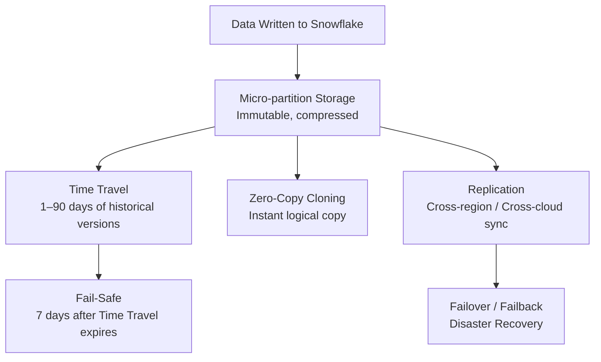
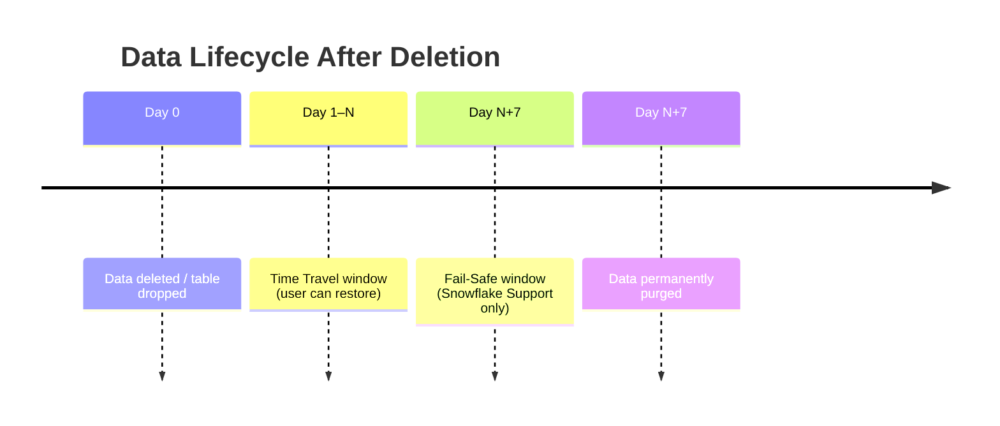
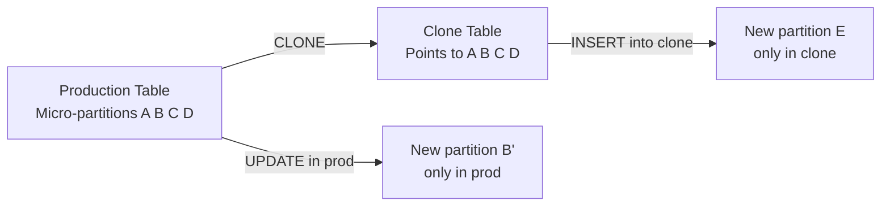
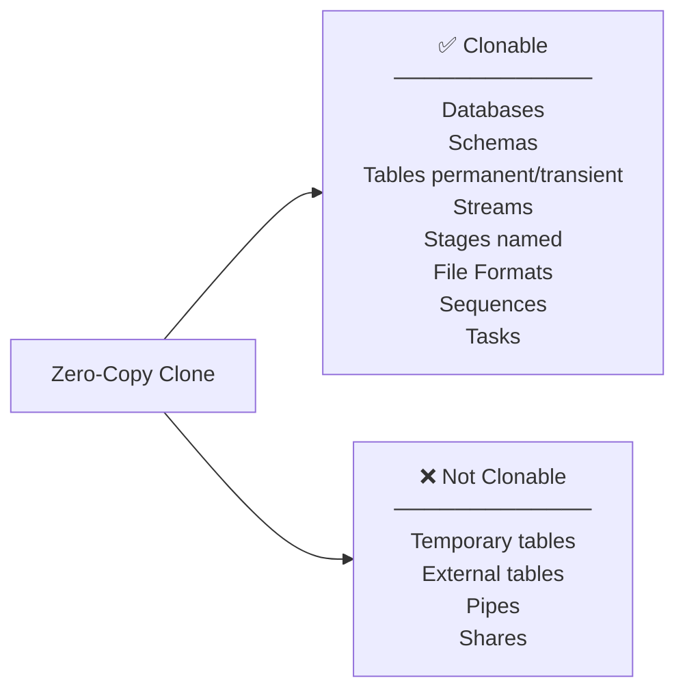
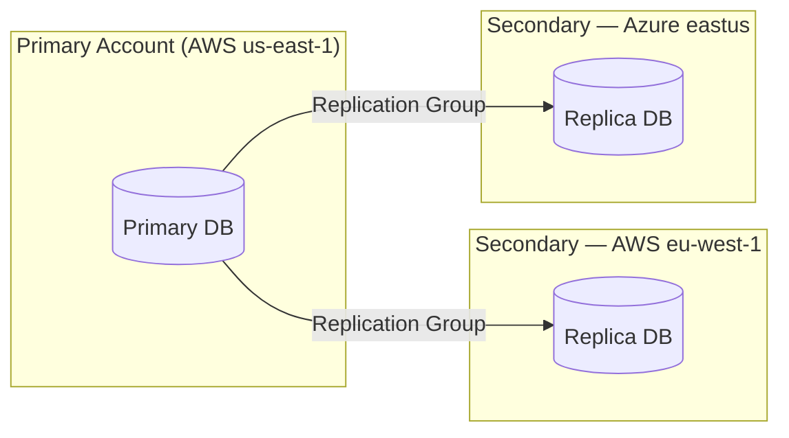
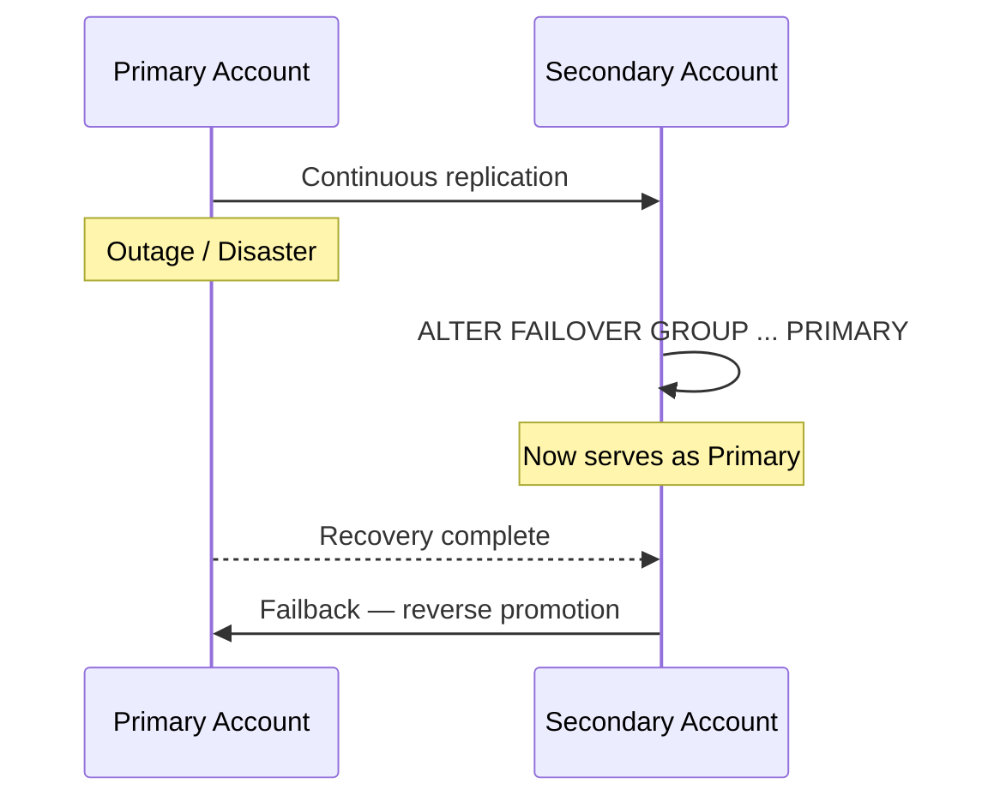
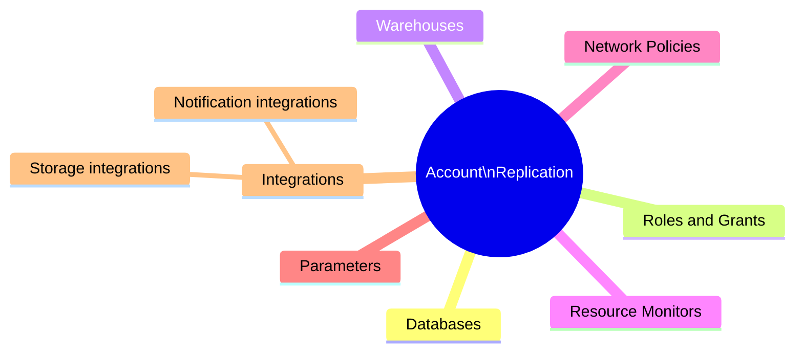

# Domain 5.1 — Data Collaboration, Replication, and Business Continuity

> [!NOTE]
> **Exam Domain 5.1** — *Data Collaboration and Data Protection* contributes to the **Data Collaboration** domain, which is **10%** of the COF-C03 exam.

Snowflake's multi-cloud architecture enables organisations to replicate data and account objects across regions and cloud providers, support disaster recovery with failover/failback, and share Time Travel snapshots — all without manual data movement.

---

## Big Picture: Data Protection Layers



---

## 1. Time Travel (Collaboration Context)

Time Travel lets you query, clone, or restore data **as it existed at a past point in time** — useful for both error recovery and sharing historical snapshots with consumers.

```sql
-- Query data 2 hours ago
SELECT * FROM orders AT (OFFSET => -7200);

-- Query at a specific timestamp
SELECT * FROM orders AT (TIMESTAMP => '2024-06-01 09:00:00'::TIMESTAMP);

-- Query by statement ID (before a specific DML ran)
SELECT * FROM orders BEFORE (STATEMENT => '<query_id>');

-- Clone as of a specific time (share historical snapshot)
CREATE TABLE orders_snapshot CLONE orders
  AT (TIMESTAMP => '2024-06-01 00:00:00'::TIMESTAMP);
```

### Time Travel Retention by Edition

| Edition | Max Retention | Default |
|---|---|---|
| Standard | **1 day** | 1 day |
| Enterprise+ | **90 days** | 1 day |

```sql
-- Change retention for a table
ALTER TABLE orders SET DATA_RETENTION_TIME_IN_DAYS = 30;

-- Disable Time Travel
ALTER TABLE orders SET DATA_RETENTION_TIME_IN_DAYS = 0;
```

> [!WARNING]
> Tables with `DATA_RETENTION_TIME_IN_DAYS = 0` have **no Time Travel**. Fail-Safe still applies for 7 days but is only accessible by Snowflake Support.

---

## 2. Fail-Safe



| Property | Value |
|---|---|
| Duration | **7 days** — always, non-configurable |
| Accessible by | **Snowflake Support only** |
| Applies to | Permanent tables |
| Does NOT apply to | Transient tables, temporary tables |
| Storage charged? | **Yes** — at standard storage rates |

> [!WARNING]
> **Transient and Temporary tables have NO Fail-Safe.** This is a deliberate cost/risk trade-off: use them only for ephemeral data where recovery is not required.

---

## 3. Zero-Copy Cloning

Cloning creates an **instant logical copy** of a database, schema, or table — no physical data is duplicated at creation time. Child and parent share the same underlying micro-partitions until either side modifies data.



```sql
-- Clone a table
CREATE TABLE orders_dev CLONE orders;

-- Clone a schema
CREATE SCHEMA dev_schema CLONE prod_schema;

-- Clone a database
CREATE DATABASE dev_db CLONE prod_db;

-- Clone at a historical point (snapshot for collaboration)
CREATE TABLE orders_q1_snapshot CLONE orders
  AT (TIMESTAMP => '2024-03-31 23:59:59'::TIMESTAMP);
```

### What Can Be Cloned?



Key facts:
- Cloning is **instantaneous** regardless of data size.
- No additional storage is charged until the clone diverges.
- Clones **inherit** the source's Time Travel history up to the clone point.
- Cloning respects **privileges** — the cloner needs `CREATE` on the target and `SELECT` on the source.

---

## 4. Replication

Replication synchronises **databases or account objects** from a **primary** account to one or more **secondary** (replica) accounts across regions or cloud providers.

### Replication Architecture



### Replication Groups vs. Failover Groups

| Feature | Replication Group | Failover Group |
|---|---|---|
| Purpose | Read-only replicas | Disaster recovery (failover capable) |
| Secondary writable? | No | Yes — after failover |
| Supports failover/failback? | **No** | **Yes** |
| Account objects included? | Optional | Yes |

```sql
-- Create a replication group on primary
CREATE REPLICATION GROUP my_rg
  OBJECT_TYPES = DATABASES, ROLES, WAREHOUSES
  ALLOWED_DATABASES = prod_db
  ALLOWED_ACCOUNTS = myorg.secondary_account;

-- Refresh secondary (on secondary account)
ALTER REPLICATION GROUP my_rg REFRESH;
```

### Replication Cost

- Storage for replicas is charged at standard rates.
- Data **transfer fees** apply for cross-region/cross-cloud replication.
- Refresh operations consume **compute credits**.

---

## 5. Failover and Failback

Failover Groups enable **automatic or manual promotion** of a secondary account to primary — providing business continuity.



```sql
-- On PRIMARY: create a failover group
CREATE FAILOVER GROUP my_fg
  OBJECT_TYPES = DATABASES, ROLES, WAREHOUSES, RESOURCE MONITORS
  ALLOWED_DATABASES = prod_db
  ALLOWED_ACCOUNTS = myorg.dr_account
  REPLICATION SCHEDULE = '10 MINUTE';

-- On SECONDARY: promote to primary (failover)
ALTER FAILOVER GROUP my_fg PRIMARY;

-- Failback: promote original primary back
ALTER FAILOVER GROUP my_fg PRIMARY;  -- run on original primary account
```

> [!NOTE]
> Failover Groups support a `REPLICATION SCHEDULE` — Snowflake automatically refreshes the secondary on the defined interval (minimum 1 minute).

---

## 6. Account Replication (Account Objects)

Beyond databases, Snowflake can replicate **account-level objects**:



This ensures that after failover, the secondary account has all the same roles, warehouses, and policies — not just the data.

---

## Summary

> [!SUCCESS]
> **Key Takeaways for the Exam**
> - **Time Travel**: Standard = 1 day max, Enterprise+ = 90 days max. Set per-table with `DATA_RETENTION_TIME_IN_DAYS`.
> - **Fail-Safe**: Always 7 days, non-configurable, Snowflake Support only. Transient/temp tables = NO Fail-Safe.
> - **Zero-Copy Clone**: Instantaneous, no storage cost until divergence, inherits Time Travel history.
> - **Replication Group**: Read-only replicas; **Failover Group**: disaster recovery, secondary can become primary.
> - Replication incurs storage + transfer + compute costs.
> - Failover Groups support scheduled automatic refresh.

---

## Practice Questions

**1.** A Standard edition account drops a table with default retention. For how many days can a user restore it via Time Travel?

- A) 0
- B) **1** ✅
- C) 7
- D) 90

---

**2.** After Time Travel expires on a dropped table, what additional protection exists?

- A) Replication group backup
- B) Snowflake Fail-Safe for 7 days ✅
- C) Zero-Copy Clone automatic backup
- D) No further protection

---

**3.** A developer clones a 500 GB production table. How much additional storage is charged at clone creation?

- A) 500 GB immediately
- B) 250 GB (50% deduplication)
- C) **0 GB — no storage charged until the clone diverges** ✅
- D) Depends on retention period

---

**4.** Which object type supports **failover** (promotion of secondary to primary)?

- A) Replication Group ✅ incorrect — this is Failover Group
- B) **Failover Group** ✅
- C) External Replication Policy
- D) Clone Group

---

**5.** A transient table is dropped. What recovery options exist?

- A) Time Travel only
- B) Time Travel and Fail-Safe
- C) **Time Travel only — transient tables have no Fail-Safe** ✅
- D) Neither Time Travel nor Fail-Safe

---

**6.** Which statement about cross-cloud replication is TRUE?

- A) It is free — Snowflake does not charge transfer fees
- B) It requires both accounts to use the same cloud provider
- C) **Data transfer fees apply for cross-region and cross-cloud replication** ✅
- D) Secondary accounts can be written to without failover

---

**7.** A Failover Group is configured with `REPLICATION SCHEDULE = '10 MINUTE'`. What does this mean?

- A) Manual refresh must be triggered every 10 minutes
- B) **Snowflake automatically refreshes the secondary every 10 minutes** ✅
- C) Failover occurs automatically after 10 minutes of primary downtime
- D) Replication is batched into 10-minute windows with no intermediate sync
