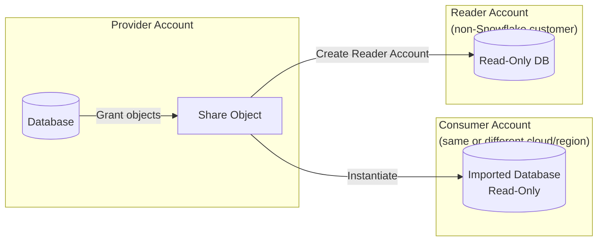
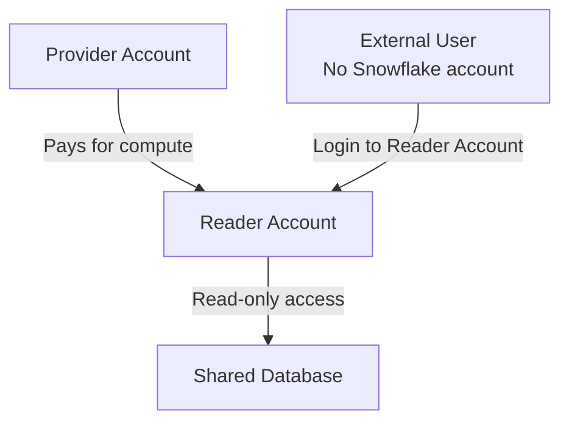
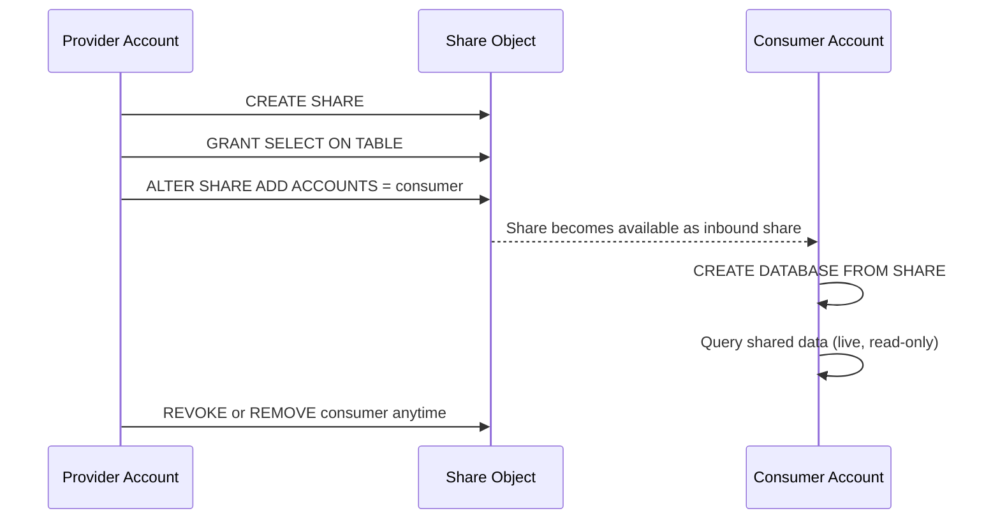
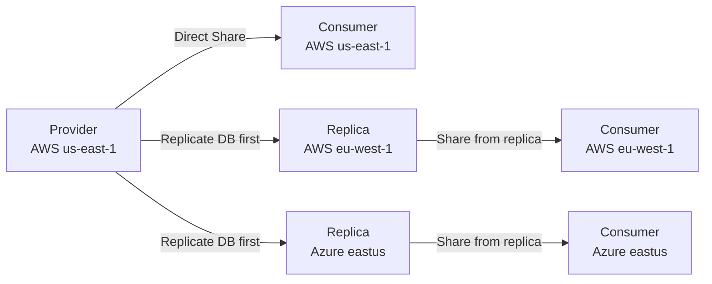
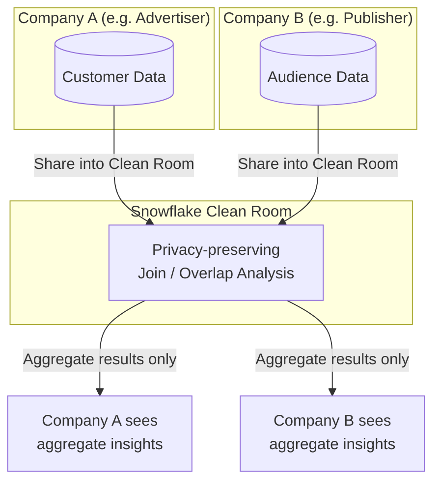
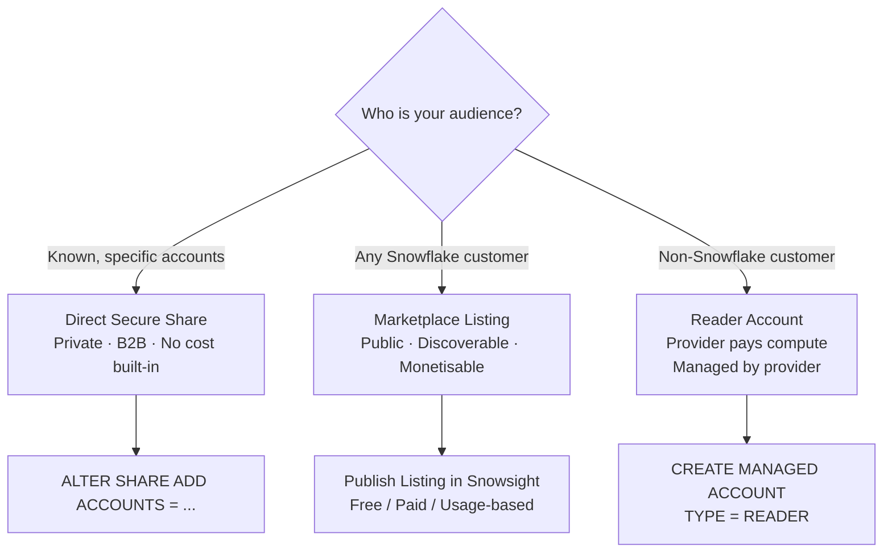

# Domain 5.2 — Secure Data Sharing and Data Clean Rooms

> [!NOTE]
> **Exam Domain 5.2** — *Secure Data Sharing* contributes to the **Data Collaboration** domain, which is **10%** of the COF-C03 exam.

---

## Overview: How Sharing Works

Snowflake Secure Data Sharing lets a **provider** share **live, read-only** data with a **consumer** — no data is copied, no ETL is required.



Key characteristics:
- **Zero data copy** — consumer reads directly from provider's storage.
- **Always live** — consumers see inserts/updates in real time.
- **Read-only** — consumers cannot modify shared data.
- **Cross-cloud/cross-region** requires replication (covered in Lesson 17).

---

## 1. Secure Shares

### Creating and Managing a Share

```sql
-- Create a share
CREATE SHARE sales_share;

-- Grant usage on the database and schema
GRANT USAGE ON DATABASE prod_db TO SHARE sales_share;
GRANT USAGE ON SCHEMA prod_db.public TO SHARE sales_share;

-- Grant access to specific objects
GRANT SELECT ON TABLE prod_db.public.orders TO SHARE sales_share;
GRANT SELECT ON VIEW  prod_db.public.orders_summary TO SHARE sales_share;

-- Add a consumer account
ALTER SHARE sales_share ADD ACCOUNTS = org1.consumer_account;

-- Remove a consumer
ALTER SHARE sales_share REMOVE ACCOUNTS = org1.consumer_account;

-- See current shares
SHOW SHARES;
```

### Consumer: Mounting a Share

```sql
-- Consumer creates a local database from the inbound share
CREATE DATABASE shared_sales
  FROM SHARE provider_org.sales_share;

-- Query like any other table (read-only)
SELECT * FROM shared_sales.public.orders;
```

### What Can Be Shared?

| Object | Shareable? |
|---|---|
| Tables | ✅ |
| External tables | ✅ |
| Secure views | ✅ |
| Secure materialized views | ✅ |
| UDFs (secure) | ✅ |
| Regular (non-secure) views | ❌ |
| Stages, pipes, streams | ❌ |

> [!WARNING]
> Only **SECURE** views and functions can be added to a share. A regular view exposes the underlying query definition, which is a privacy risk for providers.

---

## 2. Secure Views

A **Secure View** hides the view definition from the consumer. Without the `SECURE` keyword, a consumer could infer the provider's data model.

```sql
-- Regular view — definition is visible to consumers
CREATE VIEW orders_summary AS
  SELECT region, SUM(amount) FROM orders GROUP BY region;

-- Secure view — definition is hidden
CREATE SECURE VIEW orders_summary AS
  SELECT region, SUM(amount) FROM orders GROUP BY region;
```

> [!NOTE]
> Secure views disable certain query optimizer shortcuts. This can make them **slightly slower** than equivalent regular views. Use `SECURE` only when the view will be shared or where definition privacy is required.

---

## 3. Reader Accounts

A **Reader Account** allows providers to share data with **customers who do not have a Snowflake account**. The provider creates and manages the reader account.



```sql
-- Create a reader account (managed account)
CREATE MANAGED ACCOUNT my_reader_account
  ADMIN_NAME = 'reader_admin'
  ADMIN_PASSWORD = 'SecurePass123!'
  TYPE = READER;

-- Add the reader account to a share
ALTER SHARE sales_share ADD ACCOUNTS = my_reader_account;
```

Key facts about reader accounts:
- **Provider pays** all compute costs for the reader account.
- Reader accounts are **fully managed** by the provider.
- They can only access data from the **provider that created them**.
- Reader accounts cannot create shares of their own.

---

## 4. Data Sharing Roles and the Provider/Consumer Model



---

## 5. Cross-Cloud and Cross-Region Sharing

Direct sharing works between accounts on the **same cloud + region** without additional configuration. Cross-cloud or cross-region sharing requires a **replication** step.



---

## 6. Data Clean Rooms

A **Data Clean Room** is a privacy-preserving environment where two or more parties can run joint analyses on **combined datasets** without either party seeing the other's raw data.

### How Snowflake Clean Rooms Work



Key privacy guarantees:
- Neither party can see the other's **individual-level** records.
- Analysts receive only **aggregate or statistical** results.
- Row-level policies and differential privacy controls limit result precision.
- Built on Snowflake's standard **RBAC + Row Access Policies**.

### Use Cases

| Industry | Use Case |
|---|---|
| Advertising | Audience overlap analysis between advertiser and publisher |
| Financial services | Fraud detection across institutions |
| Healthcare | Multi-hospital research without exposing patient records |
| Retail | Supply chain partner data collaboration |

> [!NOTE]
> Snowflake's native Clean Room capability is built on the **Native App Framework** and secure sharing. On the exam, remember that clean rooms enforce privacy through **aggregation thresholds** and **secure views**, not encryption of query inputs.

---

## 7. Listing Data on the Marketplace vs. Direct Share



| | Secure Share (Direct) | Marketplace Listing |
|---|---|---|
| Audience | Specific known accounts | Any Snowflake customer |
| Discovery | Private | Public (or private listing) |
| Approval | Automatic | Provider can require approval |
| Monetisation | Not built-in | Via Snowflake billing integration |
| Use case | B2B partnerships | Data products, SaaS datasets |

---

## Summary

> [!SUCCESS]
> **Key Takeaways for the Exam**
> - Sharing is **zero-copy and live** — no ETL, no data movement.
> - Consumers get **read-only** access; they cannot write to shared objects.
> - Only **SECURE views** and secure UDFs can be added to shares.
> - **Reader Accounts**: for non-Snowflake consumers; provider pays compute.
> - Cross-cloud/cross-region sharing requires **replication** first.
> - **Data Clean Rooms** enable joint analysis without exposing raw records — results are aggregate only.

---

## Practice Questions

**1.** A provider adds a regular (non-secure) view to a share. What happens?

- A) It succeeds — all views can be shared
- B) **It fails — only SECURE views can be added to shares** ✅
- C) The view is automatically converted to a secure view
- D) Consumers see the data but not the definition

---

**2.** A consumer mounts a provider's share. 10 minutes later the provider inserts new rows. When does the consumer see the new rows?

- A) After the next scheduled refresh (daily)
- B) After the consumer re-runs `CREATE DATABASE FROM SHARE`
- C) **Immediately — sharing is live and zero-copy** ✅
- D) After the provider runs ALTER SHARE REFRESH

---

**3.** Which account type allows a provider to share data with a customer who has no Snowflake account?

- A) Secondary account
- B) Managed account
- C) **Reader account** ✅
- D) Business Critical account

---

**4.** Who pays for the compute costs in a Reader Account?

- A) The reader/consumer
- B) Snowflake automatically
- C) **The provider** ✅
- D) Split 50/50 between provider and consumer

---

**5.** Provider is on AWS us-east-1. Consumer is on Azure eastus. Can the provider share directly?

- A) Yes — sharing works across all clouds natively
- B) **No — cross-cloud sharing requires database replication first** ✅
- C) No — cross-cloud sharing is not supported at all
- D) Yes, but only for Enterprise edition providers

---

**6.** In a Data Clean Room, why can neither party see the other's raw data?

- A) Data is encrypted with different keys
- B) Results are routed through a third-party broker
- C) **Aggregation thresholds and secure views restrict output to aggregate results** ✅
- D) Individual rows are hashed before being shared

---

**7.** Which Snowflake object types can be included in a share? (Select all that apply)

- A) Tables ✅
- B) Secure views ✅
- C) Stages
- D) External tables ✅
- E) Streams
