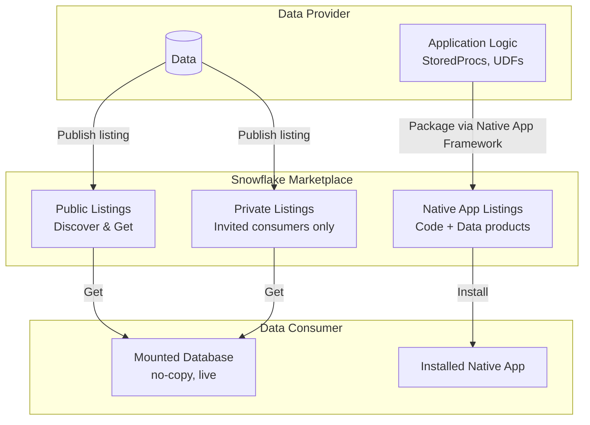
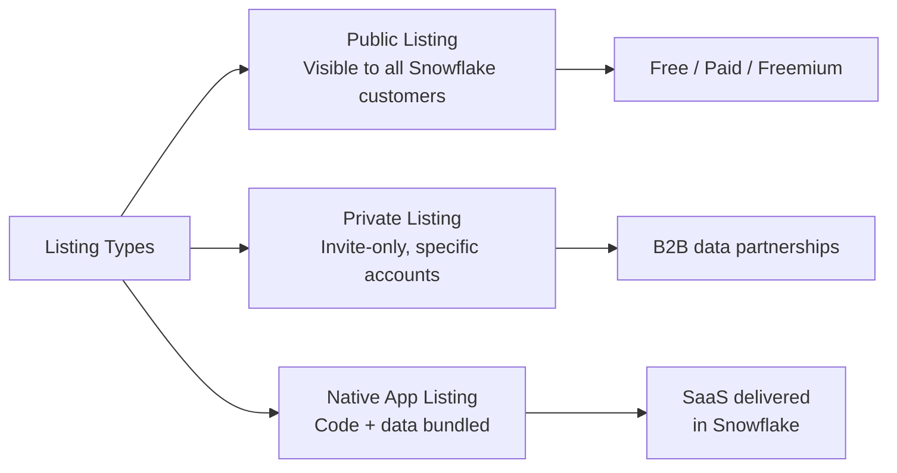
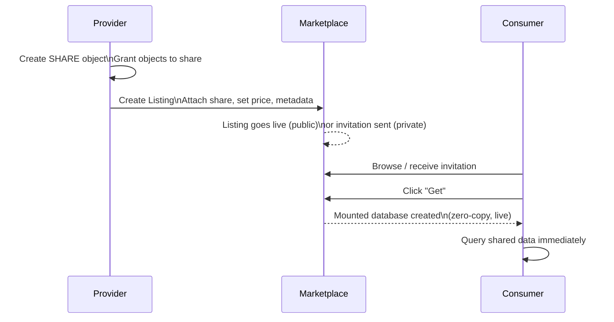
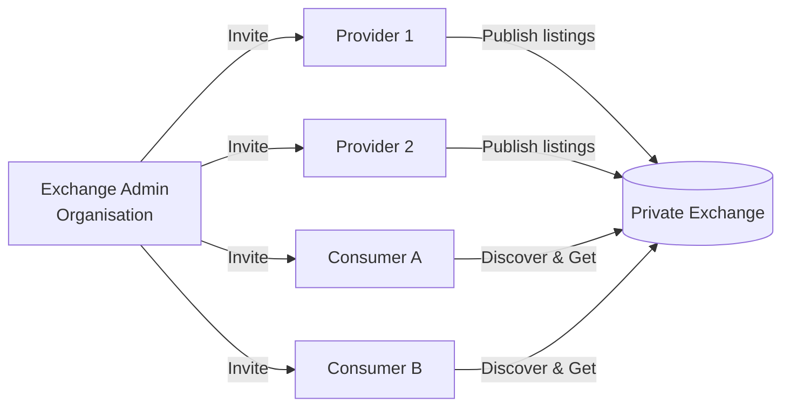
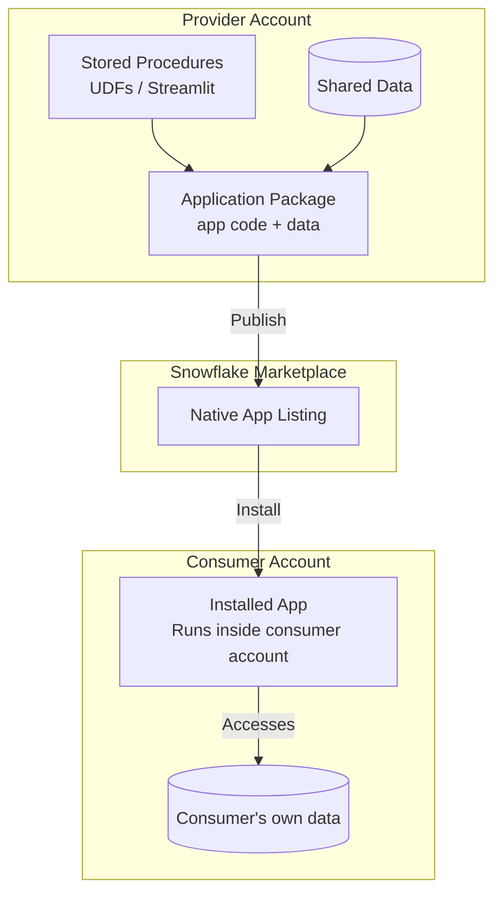
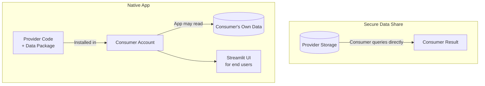
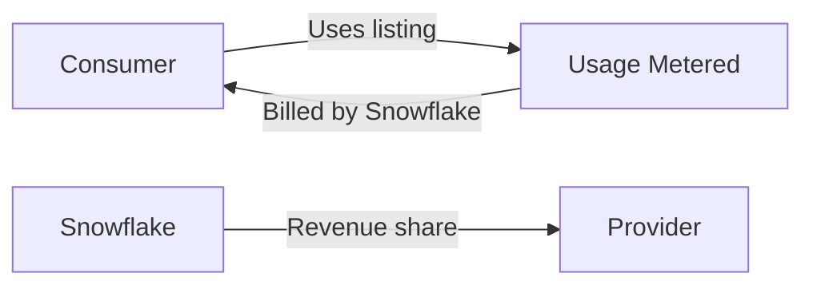

# Domain 5.3 — Snowflake Marketplace and Native Apps

> [!NOTE]
> **Exam Domain 5.3** — *Snowflake Marketplace and Data Exchange* contributes to the **Data Collaboration** domain, which is **10%** of the COF-C03 exam.

---

## The Data Collaboration Ecosystem



---

## 1. What Is the Snowflake Marketplace?

The **Snowflake Marketplace** is a global catalogue of live, ready-to-query data products accessible directly within Snowflake. Consumers can discover, trial, and attach datasets without any ETL — the data lives in the provider's account and is served via Secure Data Sharing.

### Key Characteristics

| Property | Detail |
|---|---|
| Data movement | **Zero** — no copy, no pipeline |
| Freshness | **Live** — always the provider's latest data |
| Onboarding | Seconds — "Get" → database mounted instantly |
| Trial data | Providers can offer free sample datasets |
| Paid listings | Billed through Snowflake; provider sets price |

---

## 2. Listing Types



### Public Listings

Open to any Snowflake customer. Consumers search the Marketplace, click **Get**, and receive an imported database — no approval step required for free listings.

### Private Listings

Targeted at specific consumer accounts. The provider sends an invitation; the consumer claims the listing. Ideal for:
- B2B data partnerships
- Distributing proprietary data to a controlled audience
- Beta programmes

```sql
-- Provider: create a private listing (done via Snowsight UI or SQL)
-- Check existing listings
SHOW LISTINGS;
```

### Freemium/Trial Data

Providers can attach a **sample dataset** to any listing. Consumers try the sample for free, then upgrade to the paid full dataset.

---

## 3. Publishing a Listing (Provider Workflow)



Requirements for providers:
- Must be on **Business Critical** edition for HIPAA-compliant data products.
- Provider and consumer must be on the **same cloud/region** for direct sharing, or replication must be configured for cross-region.
- Listing metadata: title, description, sample queries, documentation, data dictionary.

---

## 4. Consuming a Listing (Consumer Workflow)

```sql
-- After clicking "Get" in the Snowsight Marketplace UI,
-- a database is automatically created. You can also reference it immediately:

USE DATABASE my_marketplace_data;

SHOW TABLES;

-- Query — no warehouse cost for provider, consumer pays their own compute
SELECT * FROM my_marketplace_data.public.weather_observations
WHERE date >= CURRENT_DATE - 7;
```

> [!NOTE]
> The **consumer pays compute** (virtual warehouse credits) to query marketplace data. The **provider pays storage** for the underlying data. There are no per-query royalty charges at the infrastructure level — licensing/pricing is handled at the listing level.

---

## 5. Data Exchange

A **Data Exchange** is a **private, invitation-only marketplace** that an organisation sets up for a defined group of providers and consumers — for example, a consortium of industry partners.



| | Marketplace | Data Exchange |
|---|---|---|
| Open to | All Snowflake customers | Invited members only |
| Run by | Snowflake | Customer organisation |
| Use case | Public data products | Industry consortium, internal org |

---

## 6. Native App Framework

The **Snowflake Native App Framework** enables providers to bundle **application logic** (stored procedures, UDFs, Streamlit UI) together with data into a single installable app — delivered via the Marketplace.

### Architecture



### Key Properties

| Property | Detail |
|---|---|
| Runs in | **Consumer's account** — provider code executes there |
| Data access | App can access consumer's data (with permission) |
| Provider visibility | Provider **cannot** see consumer's data |
| Versioning | Provider pushes updates; consumer upgrades |
| UI | Can include a **Streamlit** front-end |

```sql
-- Provider: create an application package
CREATE APPLICATION PACKAGE my_app_pkg;

-- Add a version from a stage containing the app manifest
ALTER APPLICATION PACKAGE my_app_pkg
  ADD VERSION v1_0 USING @my_app_stage;

-- Release the version
ALTER APPLICATION PACKAGE my_app_pkg
  SET DEFAULT RELEASE DIRECTIVE VERSION = v1_0 PATCH = 0;

-- Consumer: install the app
CREATE APPLICATION my_installed_app
  FROM APPLICATION PACKAGE provider_org.my_app_pkg
  USING VERSION v1_0;
```

### Native App vs. Traditional Sharing



| | Secure Data Share | Native App |
|---|---|---|
| What is delivered | Data only | Data + code + UI |
| Runs in consumer account? | No — consumer queries provider storage | **Yes** |
| Consumer data access | None | App can request access |
| Streamlit UI | No | **Yes** |
| Versioning | Not applicable | **Yes** |

---

## 7. Monetisation and Billing



- **Free listings**: no charge to consumer.
- **Paid listings**: consumer billed through Snowflake; provider receives a revenue share.
- **Usage-based**: some listings charge per-query or per-row accessed.
- Providers set pricing; Snowflake handles billing and payment infrastructure.

---

## Summary

> [!SUCCESS]
> **Key Takeaways for the Exam**
> - Marketplace listings are **zero-copy and live** — same sharing mechanism as Secure Data Sharing.
> - **Public listings**: open to all; **Private listings**: invite-only; **Native App listings**: code + data.
> - **Data Exchange**: private marketplace run by an organisation for a controlled group.
> - **Native Apps**: provider bundles code + data into an installable app that runs in the **consumer's account**.
> - Consumer pays **compute**; provider pays **storage**.
> - Cross-region/cross-cloud marketplace access requires replication.

---

## Practice Questions

**1.** A consumer clicks "Get" on a free Marketplace listing. What happens to the data?

- A) A full copy is transferred to the consumer's account
- B) A nightly ETL pipeline is configured
- C) **A read-only database is mounted — no data is copied** ✅
- D) The consumer downloads a CSV export

---

**2.** Which listing type is visible only to specific Snowflake accounts that have been explicitly invited?

- A) Public listing
- B) **Private listing** ✅
- C) Freemium listing
- D) Native App listing

---

**3.** An organisation wants to create a private data hub for 20 industry partners — not open to all Snowflake customers. Which feature should they use?

- A) Snowflake Marketplace
- B) **Data Exchange** ✅
- C) Replication Group
- D) Private Share

---

**4.** A Native App is installed by a consumer. Where does the application code execute?

- A) In the provider's account
- B) In Snowflake's neutral hosting environment
- C) **In the consumer's account** ✅
- D) In an external compute environment

---

**5.** Which is a capability of the Native App Framework that standard Secure Data Sharing does NOT support?

- A) Zero data copy
- B) Live data access
- C) **Streamlit-based UI included in the delivered product** ✅
- D) Cross-account data access

---

**6.** Who pays the compute cost when a consumer queries data from a Marketplace listing?

- A) The provider
- B) Snowflake subsidises it
- C) **The consumer** ✅
- D) Split equally between provider and consumer

---

**7.** A provider wants to share a dataset with paying customers through the Snowflake Marketplace. Which billing model is available?

- A) Snowflake does not support paid listings
- B) Only annual flat-fee subscriptions
- C) **Free, flat-fee, or usage-based pricing — billed through Snowflake** ✅
- D) Providers must manage billing outside of Snowflake
