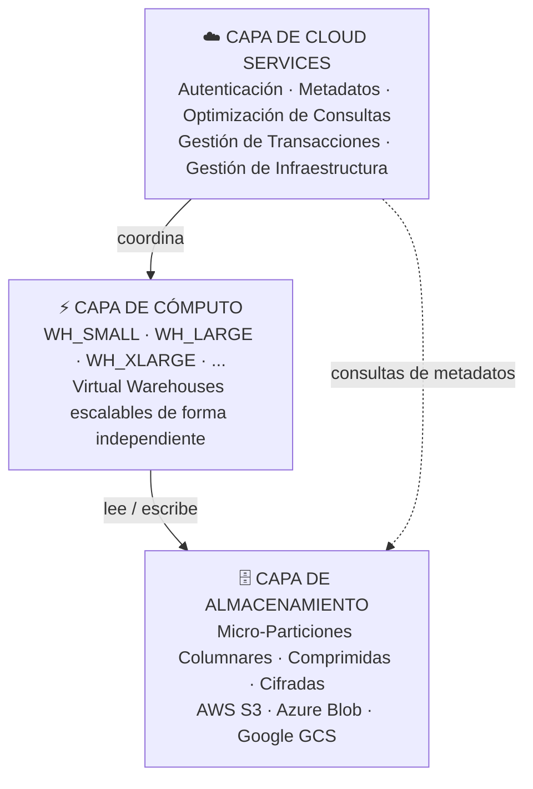

# Dominio 1.1 — Arquitectura de Snowflake

## Peso en el Examen

**Dominio 1.0 — Características y Arquitectura de Snowflake AI Data Cloud** representa aproximadamente el **~31%** del examen SnowPro Core COF-C03 — el dominio individual más grande.

> [!NOTE]
> Esta lección corresponde al **Objetivo de Examen 1.1**: *Describir y utilizar la arquitectura de Snowflake*, incluyendo la capa de Cloud Services (Servicios en la Nube), la capa de Cómputo, la capa de Almacenamiento de Base de Datos y la comparación entre ediciones de Snowflake.

---

## ¿Qué es Snowflake?

Snowflake es una **plataforma de datos nativa en la nube, completamente gestionada**, entregada como Software como Servicio (SaaS). Fue construida desde cero para la nube — no portada desde un producto local (*on-premises*).

Diferencias clave con los almacenes de datos tradicionales:

| Característica | Almacén Tradicional | Snowflake |
|---|---|---|
| Despliegue | On-premises / IaaS | SaaS puro |
| Escalado | Requiere tiempo de inactividad | En segundos, sin tiempo de inactividad |
| Cómputo y Almacenamiento | Fuertemente acoplados | Completamente separados |
| Mantenimiento | Gestionado por el cliente | Gestionado por Snowflake |
| Proveedores de nube | Único | AWS, Azure, GCP |
| Actualizaciones | Con tiempo de inactividad planificado | Automáticas y transparentes |

---

## La Arquitectura de Tres Capas

La arquitectura de Snowflake consta de tres capas escalables de forma independiente. Comprender cada capa —y los límites entre ellas— es fundamental para el examen.



---

### Capa 1 — Capa de Almacenamiento de Base de Datos

Aquí es donde **todos los datos residen permanentemente**. Características clave:

- Los datos se almacenan en el formato propietario de Snowflake de **micro-particiones columnares** — comprimido y optimizado automáticamente. Los clientes no pueden acceder directamente a los archivos subyacentes.
- El almacenamiento está construido sobre el servicio de blob storage del proveedor de nube: **Amazon S3** (AWS), **Azure Blob Storage** (Azure) o **Google Cloud Storage** (GCP).
- **La facturación es independiente del cómputo**: se paga por el almacenamiento incluso cuando no hay Virtual Warehouses (almacenes de cómputo) en ejecución.
- Snowflake gestiona automáticamente el cifrado, la redundancia y la durabilidad.
- Los datos se reorganizan en micro-particiones (50–500 MB comprimidos) con metadatos ricos sobre cada partición (valores mín/máx, conteo de distintos, conteo de NULL) para habilitar la **poda de particiones** (*partition pruning*) durante las consultas.

**Qué contiene la capa de almacenamiento:**
- Datos de tablas (micro-particiones)
- Versiones históricas de Time Travel (datos modificados)
- Copias de Fail-Safe (recuperación de emergencia)
- Datos de Stage (para stages internos)
- Caché de resultados de consultas

---

### Capa 2 — Capa de Cómputo (Virtual Warehouses)

La capa de cómputo consiste en **Virtual Warehouses (VW)** — clústeres de recursos de cómputo con nombre que ejecutan consultas SQL y operaciones DML.

Características clave:

- Cada Virtual Warehouse es un clúster de cómputo **MPP (Procesamiento Masivamente Paralelo)** compuesto por uno o más nodos.
- **Múltiples warehouses pueden leer del mismo almacenamiento simultáneamente** — sin contención de recursos entre ellos.
- Los warehouses pueden **suspenderse** (deteniendo la facturación al instante) y **reanudarse** (en segundos).
- El tamaño se expresa en tallas de camiseta: **X-Small, Small, Medium, Large, X-Large, 2X-Large, 3X-Large, 4X-Large, 5X-Large, 6X-Large**.
- Cada incremento de tamaño **duplica** los recursos de cómputo (y los créditos por hora).

**Consumo de créditos por tamaño de warehouse (edición Standard):**

| Tamaño | Créditos/Hora |
|---|---|
| X-Small | 1 |
| Small | 2 |
| Medium | 4 |
| Large | 8 |
| X-Large | 16 |
| 2X-Large | 32 |
| 3X-Large | 64 |
| 4X-Large | 128 |
| 5X-Large | 256 |
| 6X-Large | 512 |

> [!WARNING]
> Los Snowpark-Optimized Warehouses (almacenes optimizados para Snowpark) consumen **más créditos** que los warehouses Standard del mismo tamaño. No confundas los dos tipos en el examen.

**Qué hace la capa de cómputo:**
- Ejecuta consultas SQL (SELECT, DML)
- Carga datos (COPY INTO)
- Ejecuta código Snowpark
- Realiza transformaciones

**Qué NO hace la capa de cómputo:**
- Almacenar datos permanentemente
- Ejecutar operaciones de Cloud Services (estas son gratuitas hasta el 10% de los créditos de cómputo)

---

### Capa 3 — Capa de Cloud Services (Servicios en la Nube)

Este es el **cerebro de Snowflake** — una colección de servicios que coordinan toda la actividad en la plataforma. Funciona en la infraestructura gestionada por Snowflake y **siempre está disponible**, incluso cuando no hay Virtual Warehouses en ejecución.

**Responsabilidades de Cloud Services:**

| Servicio | Descripción |
|---|---|
| **Autenticación** | Valida la identidad del usuario (contraseñas, MFA, OAuth, clave-par) |
| **Gestión de Infraestructura** | Aprovisiona, monitorea y repara recursos de cómputo |
| **Gestión de Metadatos** | Rastrea definiciones de tablas, estadísticas, metadatos de particiones |
| **Análisis y Optimización de Consultas** | Analiza SQL, genera y optimiza planes de ejecución |
| **Control de Acceso** | Aplica políticas RBAC y DAC |
| **Gestión de Transacciones** | Garantiza la conformidad ACID en operaciones concurrentes |

**Nota de facturación**: El uso de Cloud Services es **gratuito hasta el 10% de los créditos de cómputo diarios consumidos**. El uso que supere ese umbral se factura por separado. Este es un detalle importante para el examen.

```sql
-- Cloud Services se usa de forma transparente — por ejemplo al ejecutar:
SHOW TABLES IN DATABASE MY_DB;
-- Esto usa Cloud Services (búsqueda de metadatos) sin necesidad de warehouse
```

---

## Separación de Almacenamiento y Cómputo — Por Qué Importa

Esta es la característica **arquitectónicamente más significativa** de Snowflake y aparece con frecuencia en el examen.

**Beneficios de la separación:**

1. **Escalado independiente** — escala el cómputo hacia arriba/abajo sin tocar el almacenamiento
2. **Optimización de costos** — suspende el cómputo cuando está inactivo; la facturación del almacenamiento continúa a tarifas bajas
3. **Aislamiento de cargas de trabajo** — múltiples equipos ejecutan sus propios warehouses contra datos compartidos
4. **Sin contención** — una consulta analítica grande en WH_ANALYTICS no afecta la ingesta en WH_INGEST

```sql
-- Ingeniería ingesta datos en su warehouse
USE WAREHOUSE WH_INGEST;
COPY INTO raw.events FROM @my_stage;

-- Mientras tanto, BI consulta los mismos datos en su propio warehouse
USE WAREHOUSE WH_BI;
SELECT date_trunc('hour', event_time), count(*)
FROM raw.events
GROUP BY 1;
-- ¡Sin colas entre estos equipos!
```

---

## Ediciones de Snowflake

La **edición** determina qué funcionalidades están disponibles y el SLA (Acuerdo de Nivel de Servicio) provisto. Debes conocerlas para el examen.

| Funcionalidad | Standard | Enterprise | Business Critical | Virtual Private Snowflake (VPS) |
|---|---|---|---|---|
| **Time Travel (máx.)** | 1 día | 90 días | 90 días | 90 días |
| **Multi-cluster Warehouses** | ❌ | ✅ | ✅ | ✅ |
| **Seguridad a nivel de columna (Masking)** | ❌ | ✅ | ✅ | ✅ |
| **Row Access Policies** | ❌ | ✅ | ✅ | ✅ |
| **Search Optimization** | ❌ | ✅ | ✅ | ✅ |
| **Conformidad HIPAA** | ❌ | ❌ | ✅ | ✅ |
| **Conformidad PCI DSS** | ❌ | ❌ | ✅ | ✅ |
| **Tri-Secret Secure (CMK)** | ❌ | ❌ | ✅ | ✅ |
| **AWS PrivateLink / Azure PE** | ❌ | ❌ | ✅ | ✅ |
| **Despliegue Privado** | ❌ | ❌ | ❌ | ✅ |
| **SLA** | 99.5% | 99.9% | 99.95% | 99.99% |

> [!WARNING]
> El examen evalúa frecuentemente los **requisitos por edición**. Recuerda: los Multi-cluster Warehouses, el Column Masking (enmascaramiento de columnas) y las Row Access Policies (políticas de acceso por fila) requieren **Enterprise o superior**.

---

## Proveedor de Nube y Consideraciones de Región

Las cuentas de Snowflake se despliegan en una combinación específica de **nube + región**. Esto se determina al crear la cuenta y no puede modificarse.

| Nube | Regiones de Ejemplo |
|---|---|
| AWS | us-east-1, us-west-2, eu-west-1, ap-southeast-1 |
| Azure | eastus2, westeurope, australiaeast |
| GCP | us-central1, europe-west4, asia-northeast1 |

**Puntos clave para el examen:**
- Una cuenta de Snowflake existe en **una sola nube y una sola región**
- Los datos pueden **replicarse** entre regiones y nubes usando Database Replication
- **Cross-Cloud Business Continuity (CCBC)** permite la conmutación por error a un proveedor de nube diferente
- La **conectividad privada** (AWS PrivateLink, Azure Private Endpoints) está disponible en Business Critical+

---

## Terminología Clave para el Examen

| Término | Definición |
|---|---|
| **Virtual Warehouse (VW)** | Clúster de cómputo MPP con nombre que ejecuta consultas |
| **Micro-partición** | Unidad fundamental de almacenamiento: 50–500 MB comprimida, columnar |
| **Capa de Cloud Services** | Capa de inteligencia: autenticación, optimización, metadatos, control de acceso |
| **SaaS** | Software como Servicio — Snowflake gestiona toda la infraestructura |
| **MPP** | Procesamiento Masivamente Paralelo — consultas distribuidas entre nodos |
| **Separación de Almacenamiento y Cómputo** | El almacenamiento y el cómputo escalan de forma independiente y se facturan por separado |
| **Crédito** | Unidad de consumo de cómputo de Snowflake |

---

## Preguntas de Práctica

**P1.** ¿Cuál capa de Snowflake es responsable de la optimización de consultas y el cumplimiento del control de acceso?

- A) Capa de Almacenamiento de Base de Datos
- B) Capa de Cómputo
- C) Capa de Cloud Services ✅
- D) Capa de Virtual Warehouse

**P2.** Una empresa quiere garantizar que sus consultas de informes de BI nunca compitan con sus pipelines ETL. ¿Qué característica arquitectónica de Snowflake lo permite?

- A) Micro-particiones
- B) Separación de almacenamiento y cómputo ✅
- C) La capa de Cloud Services
- D) Time Travel

**P3.** ¿En qué edición de Snowflake están disponibles los Multi-cluster Virtual Warehouses por primera vez?

- A) Standard
- B) Enterprise ✅
- C) Business Critical
- D) Virtual Private Snowflake

**P4.** El uso de Cloud Services se factura solo cuando supera qué porcentaje de los créditos de cómputo diarios?

- A) 5%
- B) 10% ✅
- C) 15%
- D) 20%

**P5.** Un warehouse de Snowflake está suspendido durante 4 horas. ¿Qué costos siguen acumulándose durante esta suspensión?

- A) Solo costos de cómputo
- B) Costos de cómputo y almacenamiento
- C) Solo costos de almacenamiento ✅
- D) No se acumula ningún costo

**P6.** ¿Qué edición de Snowflake es requerida para cumplir con HIPAA?

- A) Standard
- B) Enterprise
- C) Business Critical ✅
- D) Virtual Private Snowflake

**P7.** Snowflake almacena los datos en qué formato subyacente?

- A) Archivos planos orientados por filas
- B) Archivos Parquet directamente legibles por los clientes
- C) Micro-particiones columnares comprimidas ✅
- D) Documentos JSON

---

> [!SUCCESS]
> **Puntos Clave para el Día del Examen:**
> 1. Tres capas: **Cloud Services → Cómputo (VW) → Almacenamiento** — cada una independiente y facturada por separado
> 2. Cloud Services = cerebro (autenticación, optimización, metadatos) — gratuito hasta el **10%** de los créditos de cómputo
> 3. **La facturación del almacenamiento nunca se detiene** — incluso cuando los warehouses están suspendidos
> 4. Multi-cluster WH, Column Masking, Row Access Policies → **Enterprise+**
> 5. HIPAA / Tri-Secret Secure → **Business Critical+**
> 6. VPS = mayor aislamiento, SLA del 99.99%, despliegue privado
