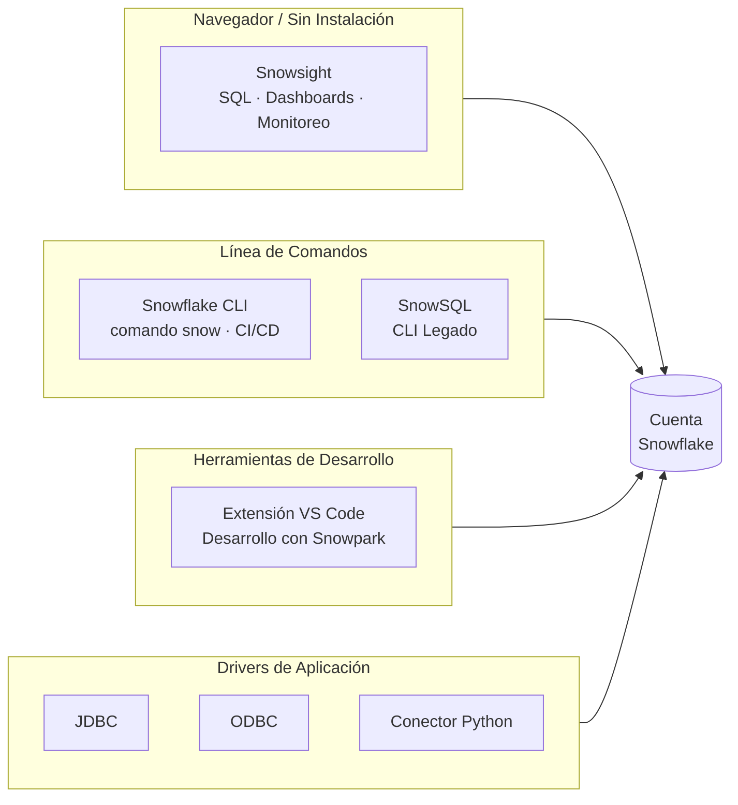

# Dominio 1.2 — Interfaces y Herramientas de Snowflake

## Peso en el Examen

El **Dominio 1.0** representa aproximadamente el **~31%** del examen. Este sub-dominio cubre las herramientas e interfaces utilizadas para interactuar con Snowflake.

> [!NOTE]
> Esta lección corresponde al **Objetivo de Examen 1.2**: *Usar interfaces y herramientas de Snowflake*, incluyendo Snowsight, Snowflake CLI e integraciones con IDEs.

---

## Visión General de las Interfaces de Snowflake

Se puede acceder a Snowflake a través de múltiples interfaces según el caso de uso — análisis interactivo, scripting, automatización o flujos de trabajo de desarrollo.



| Interfaz | Mejor Para | Requiere Instalación |
|---|---|---|
| **Snowsight** | Consultas interactivas, dashboards, monitoreo | No (basado en navegador) |
| **Snowflake CLI** | Scripting, CI/CD, automatización | Sí |
| **SnowSQL** | Cliente CLI legado | Sí |
| **Extensión VS Code** | Flujos de trabajo de desarrollo, Snowpark | Sí |
| **Drivers (JDBC, ODBC, Python)** | Integración con aplicaciones | Sí |

---

## Snowsight — La Interfaz Web

**Snowsight** es la interfaz moderna de desarrollo SQL y análisis de Snowflake, basada en navegador. Reemplazó a la antigua "Classic Console" y es ahora la interfaz web principal.

### Capacidades Clave de Snowsight

**Worksheets (Hojas de Trabajo)**
- Escribe y ejecuta SQL con resaltado de sintaxis y autocompletado
- Ejecución de múltiples sentencias — ejecuta sentencias individuales o scripts completos
- Resultados de consultas mostrados como tablas, con estadísticas de columna en línea
- Comparte worksheets con compañeros de equipo

**Dashboards**
- Construye dashboards visuales a partir de resultados de consultas — gráficos, indicadores, tablas
- Programa la actualización automática de datos del dashboard
- No se necesita herramienta de BI externa para visualizaciones básicas

**Query History (Historial de Consultas) y Monitoreo**
- Visualiza todas las consultas ejecutadas en la cuenta (con el rol apropiado)
- Filtra por usuario, warehouse, rango de tiempo, estado
- Accede al Query Profile (plan de ejecución) de cualquier consulta completada
- Identifica cuellos de botella de rendimiento: desbordamiento (*spilling*), poda de particiones (*pruning*), colas (*queuing*)

**Data Explorer (Explorador de Datos)**
- Navega bases de datos, esquemas, tablas, vistas y stages
- Previsualiza datos de tablas y visualiza estadísticas de columnas
- Gestiona propiedades y etiquetas a nivel de objeto

**Notebooks (Vista Previa)**
- Notebooks integrados al estilo Jupyter dentro de Snowsight
- Soporta celdas SQL, Python (vía Snowpark) y Markdown
- Ejecuta código sobre datos de Snowflake sin salir del navegador

**Sección de Administración**
- Gestiona usuarios, roles y warehouses
- Monitorea el uso de créditos y la atribución de costos
- Configura monitores de recursos y alertas
- Visualiza datos de ACCOUNT_USAGE de forma gráfica

```sql
-- Ejemplo: Snowsight puede ejecutar scripts de múltiples sentencias
-- Puedes ejecutar el bloque completo o seleccionar sentencias individuales

CREATE OR REPLACE TABLE customers (
    id NUMBER,
    name STRING,
    region STRING
);

INSERT INTO customers VALUES (1, 'Acme Corp', 'US-EAST');
INSERT INTO customers VALUES (2, 'GlobeCo', 'EU-WEST');

SELECT region, count(*) FROM customers GROUP BY 1;
```

---

## Snowflake CLI

El **Snowflake CLI** (`snow`) es la interfaz de línea de comandos moderna para Snowflake. Reemplaza al antiguo cliente **SnowSQL** para la mayoría de los casos de uso.

### Instalación

```bash
# Instalar via pip
pip install snowflake-cli-labs

# Verificar instalación
snow --version
```

### Configuración

Las conexiones del CLI se gestionan en un archivo `config.toml`:

```toml
[connections.my_connection]
account = "my_account.us-east-1"
user = "my_user"
authenticator = "externalbrowser"
warehouse = "WH_DEV"
database = "MY_DB"
schema = "PUBLIC"
```

### Comandos CLI Comunes

```bash
# Conectar y ejecutar una consulta SQL
snow sql -q "SELECT CURRENT_VERSION()" --connection my_connection

# Ejecutar un archivo SQL
snow sql -f ./migrations/001_create_tables.sql

# Gestionar aplicaciones Snowpark
snow app deploy
snow app run

# Gestionar Native Apps (Aplicaciones Nativas)
snow app bundle

# Funcionalidades de Cortex e IA
snow cortex complete "Resume este documento" --file doc.txt

# Gestión de stages
snow stage list @MY_STAGE
snow stage copy ./local_file.csv @MY_STAGE/
```

> [!NOTE]
> El Snowflake CLI se desarrolla activamente y es la interfaz recomendada para **flujos de trabajo DevOps y CI/CD**. Admite nativamente el desarrollo de Snowflake Native Apps, despliegues de Snowpark y flujos de trabajo integrados con Git.

---

## SnowSQL — CLI Legado

**SnowSQL** es el cliente de línea de comandos original para Snowflake. Si bien todavía está soportado y es ampliamente utilizado, el nuevo Snowflake CLI es preferido para proyectos nuevos.

```bash
# Conectar via SnowSQL
snowsql -a <identificador_de_cuenta> -u <usuario>

# Ejecutar consulta en línea
snowsql -a myaccount -u myuser -q "SELECT CURRENT_DATE()"

# Ejecutar un archivo
snowsql -a myaccount -u myuser -f script.sql

# SnowSQL con autenticación por clave-par
snowsql -a myaccount -u myuser --private-key-path rsa_key.p8
```

---

## Integraciones con IDEs

### Extensión de Visual Studio Code

La **Extensión de Snowflake para VS Code** proporciona una rica experiencia de desarrollo directamente en VS Code:

**Funcionalidades:**
- Conecta a una o más cuentas de Snowflake
- Navega objetos de Snowflake (bases de datos, esquemas, tablas) en el panel lateral
- Ejecuta consultas SQL y visualiza resultados en línea
- Desarrollo con **Snowpark** — escribe código Python/Java/Scala con autocompletado contextual de Snowflake
- Depura y ejecuta funciones Snowpark localmente antes de desplegarlas

**Instalación:**
```
VS Code → Extensions → Buscar "Snowflake" → Instalar
```

### Jupyter Notebooks con Snowpark

Snowflake se integra con Jupyter vía el conector Python de Snowflake y Snowpark:

```python
# Conectar a Snowflake desde un Jupyter Notebook
from snowflake.snowpark import Session

connection_parameters = {
    "account": "myaccount",
    "user": "myuser",
    "password": "mypassword",
    "role": "SYSADMIN",
    "warehouse": "WH_DEV",
    "database": "MY_DB",
    "schema": "PUBLIC"
}

session = Session.builder.configs(connection_parameters).create()

# Usar la API DataFrame de Snowpark
df = session.table("customers")
df.filter(df["region"] == "US-EAST").show()
```

### dbt (data build tool — herramienta de construcción de datos)

dbt se integra con Snowflake vía el adaptador `dbt-snowflake`, habilitando pipelines de transformación basados en SQL:

```yaml
# profiles.yml
my_project:
  target: dev
  outputs:
    dev:
      type: snowflake
      account: myaccount
      user: myuser
      role: TRANSFORMER
      warehouse: WH_TRANSFORM
      database: ANALYTICS
      schema: DBT_DEV
```

---

## Cómo Elegir la Interfaz Correcta

| Caso de Uso | Interfaz Recomendada |
|---|---|
| Análisis SQL exploratorio | Worksheets de Snowsight |
| Construcción de dashboards | Dashboards de Snowsight |
| Monitoreo de rendimiento de consultas | Query History de Snowsight |
| Automatización de pipeline CI/CD | Snowflake CLI |
| Despliegue de aplicaciones Snowpark | Snowflake CLI |
| Desarrollo interactivo en Python | Notebooks de Snowsight o Jupyter |
| Conectividad de aplicaciones | JDBC / ODBC / Conector Python |
| Ejecución de scripts legados | SnowSQL |
| Desarrollo basado en VS Code | Extensión VS Code |

---

## Drivers y Conectores de Snowflake (Resumen)

Para acceso programático, Snowflake proporciona drivers y conectores oficiales:

| Driver / Conector | Lenguaje / Plataforma |
|---|---|
| **Conector Python** | Python |
| **Snowpark Python** | Python (API DataFrame) |
| **Snowpark Java** | Java |
| **Snowpark Scala** | Scala |
| **Driver JDBC** | Aplicaciones Java, herramientas BI |
| **Driver ODBC** | Herramientas BI, Excel, Tableau, etc. |
| **Driver Node.js** | JavaScript/Node.js |
| **Driver .NET** | C# / .NET |
| **Driver Go** | Go |
| **Driver PHP PDO** | PHP |

---

## Preguntas de Práctica

**P1.** ¿Qué interfaz de Snowflake está basada en navegador y no requiere instalación local?

- A) SnowSQL
- B) Snowflake CLI
- C) Snowsight ✅
- D) Extensión VS Code

**P2.** Un ingeniero de datos necesita automatizar despliegues de Snowflake en un pipeline CI/CD. ¿Qué interfaz es más apropiada?

- A) Worksheets de Snowsight
- B) Snowflake CLI ✅
- C) Dashboards de Snowsight
- D) Driver ODBC

**P3.** ¿Qué funcionalidad de Snowsight permite diagnosticar cuellos de botella en consultas como el desbordamiento de datos (*spilling*) o la poda ineficiente de particiones?

- A) Data Explorer
- B) Dashboards
- C) Query Profile ✅
- D) Notebooks

**P4.** Un desarrollador Python quiere escribir código Snowpark con autocompletado de objetos de Snowflake directamente en su editor. ¿Qué herramienta lo permite?

- A) SnowSQL
- B) Snowflake CLI
- C) Extensión VS Code ✅
- D) Worksheets de Snowsight

**P5.** ¿Qué formato se usa para configurar conexiones en el Snowflake CLI?

- A) Archivos `.env`
- B) `config.toml` ✅
- C) `snowflake.json`
- D) `profiles.yml`

---

> [!SUCCESS]
> **Puntos Clave para el Día del Examen:**
> 1. **Snowsight** = interfaz web principal — worksheets, dashboards, historial de consultas, notebooks
> 2. **Snowflake CLI** (`snow`) = CLI moderno — ideal para CI/CD, despliegue de Snowpark
> 3. **SnowSQL** = CLI legado — aún válido, ejecución basada en archivos
> 4. **Extensión VS Code** = integración con IDE de desarrollador con soporte para Snowpark
> 5. **Query Profile** en Snowsight = herramienta principal para diagnosticar problemas de rendimiento en consultas
