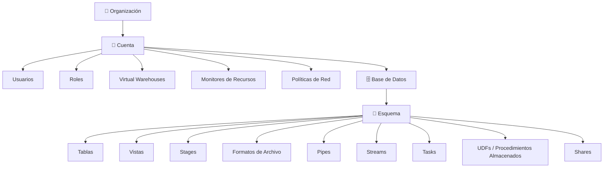

# Dominio 1.3 — Jerarquía y Tipos de Objetos de Snowflake

## Peso en el Examen

El **Dominio 1.0** representa aproximadamente el **~31%** del examen. La jerarquía y los tipos de objetos son conceptos fundamentales evaluados en todos los dominios.

> [!NOTE]
> Esta lección corresponde al **Objetivo de Examen 1.3**: *Diferenciar la jerarquía y los tipos de objetos de Snowflake*, incluyendo objetos de organización/cuenta, objetos de base de datos y variables de sesión/contexto.

---

## La Jerarquía de Objetos de Snowflake

Snowflake organiza todos los recursos en un estricto **modelo jerárquico de contenedores**:



---

## Organización

Una **Organización** es la entidad de nivel más alto en Snowflake — agrupa múltiples cuentas de Snowflake bajo un mismo paraguas:

- Habilita **funcionalidades entre cuentas**: replicación, publicación en Snowflake Marketplace, informes de uso
- Gestionada por el rol de sistema `ORGADMIN`
- Una organización tiene un **nombre de organización** único (p. ej., `MYCOMPANY`)

```sql
-- Ver todas las cuentas en tu organización
USE ROLE ORGADMIN;
SHOW ORGANIZATION ACCOUNTS;
```

---

## Objetos a Nivel de Cuenta

Estos objetos existen en el **nivel de cuenta** — no están contenidos dentro de una base de datos.

| Objeto | Descripción |
|---|---|
| **Usuario** | Una identidad individual o de servicio que puede autenticarse |
| **Rol** | Una colección de privilegios; asignado a usuarios |
| **Virtual Warehouse** | Clúster de cómputo con nombre para ejecución de consultas |
| **Monitor de Recursos** | Ejecutor de límites de presupuesto/créditos para warehouses |
| **Política de Red** | Lista de IPs permitidas/bloqueadas para acceso a la cuenta |
| **Base de Datos** | Contenedor de datos de nivel superior |
| **Share (Recurso Compartido)** | Mecanismo para compartir datos con otras cuentas |
| **Integration (Integración)** | Definición de conexión (almacenamiento, API, notificaciones) |
| **Replication Group** | Grupo de objetos para replicar entre regiones/nubes |

```sql
-- Ejemplos de objetos a nivel de cuenta
CREATE USER analyst_jane
    PASSWORD = 'SecurePass123!'
    DEFAULT_ROLE = ANALYST
    DEFAULT_WAREHOUSE = WH_REPORTING;

CREATE WAREHOUSE WH_REPORTING
    WAREHOUSE_SIZE = SMALL
    AUTO_SUSPEND = 300
    AUTO_RESUME = TRUE;

CREATE RESOURCE MONITOR monthly_cap
    CREDIT_QUOTA = 1000
    FREQUENCY = MONTHLY
    START_TIMESTAMP = IMMEDIATELY
    TRIGGERS ON 80 PERCENT DO NOTIFY
             ON 100 PERCENT DO SUSPEND;
```

---

## Objetos de Base de Datos y Esquema

### Base de Datos

Una **base de datos** es un contenedor lógico para esquemas. Soporta:
- Clonación de Copia Cero (*Zero-Copy Cloning*)
- Time Travel (viaje en el tiempo)
- Replicación entre cuentas

```sql
CREATE DATABASE ANALYTICS;
CREATE DATABASE DEV_ANALYTICS CLONE ANALYTICS;  -- clonación de copia cero
```

### Esquema

Un **esquema** es un espacio de nombres dentro de una base de datos que agrupa objetos relacionados:

```sql
CREATE SCHEMA ANALYTICS.STAGING;
CREATE SCHEMA ANALYTICS.MARTS;
```

> [!NOTE]
> Cada base de datos obtiene automáticamente dos esquemas: `INFORMATION_SCHEMA` (vistas de metadatos estándar ANSI) y `PUBLIC` (esquema predeterminado para nuevos objetos).

---

## Tipos de Objetos de Base de Datos

### Tablas

Snowflake tiene múltiples tipos de tablas — comprender las diferencias se evalúa ampliamente:

| Tipo de Tabla | Persistencia | Time Travel | Fail-Safe | Costo de Almacenamiento |
|---|---|---|---|---|
| **Permanente** | Hasta eliminación | 0–90 días | 7 días | Completo |
| **Temporal** | Solo sesión | 0–1 día | Ninguno | Completo (mientras dure la sesión) |
| **Transitoria** | Hasta eliminación | 0–1 día | Ninguno | Reducido |
| **Externa** | Nunca (solo metadatos) | Ninguno | Ninguno | Mínimo (solo metadatos) |
| **Apache Iceberg** | Hasta eliminación | Configurable | Configurable | Vía catálogo Iceberg |
| **Dinámica** | Hasta eliminación | Configurable | Configurable | Completo |

```sql
-- Tabla permanente (predeterminada)
CREATE TABLE orders (id NUMBER, amount DECIMAL(10,2));

-- Tabla temporal (con ámbito de sesión)
CREATE TEMPORARY TABLE temp_work AS SELECT * FROM orders WHERE amount > 1000;

-- Tabla transitoria (sin Fail-Safe — más económica para datos intermedios)
CREATE TRANSIENT TABLE staging_load (raw_data VARIANT);

-- Tabla externa (datos permanecen en S3/Azure/GCS)
CREATE EXTERNAL TABLE ext_logs (
    log_time TIMESTAMP,
    message STRING
)
WITH LOCATION = @my_external_stage
FILE_FORMAT = (TYPE = PARQUET);

-- Tabla dinámica (actualización incremental declarativa)
CREATE DYNAMIC TABLE daily_revenue
    TARGET_LAG = '1 hour'
    WAREHOUSE = WH_TRANSFORM
AS
SELECT date_trunc('day', order_time), sum(amount)
FROM orders
GROUP BY 1;
```

> [!WARNING]
> **Temporal vs. Transitoria**: Ambas no tienen Fail-Safe. Las tablas temporales tienen **ámbito de sesión** (se eliminan cuando termina la sesión). Las tablas transitorias **persisten** hasta que se eliminan explícitamente, pero no tienen Fail-Safe. Esta distinción se evalúa con frecuencia.

### Vistas

| Tipo de Vista | Rendimiento | Seguridad | Definición Visible |
|---|---|---|---|
| **Estándar** | La consulta se ejecuta bajo demanda | Predeterminada | Sí |
| **Materializada** | Pre-computada, auto-actualizada | Predeterminada | Sí |
| **Segura** | La consulta se ejecuta bajo demanda | Definición oculta | No |

```sql
-- Vista estándar
CREATE VIEW v_active_customers AS
SELECT * FROM customers WHERE status = 'ACTIVE';

-- Vista materializada (auto-actualizada por Snowflake)
CREATE MATERIALIZED VIEW mv_daily_sales AS
SELECT date_trunc('day', sale_time), sum(amount)
FROM sales GROUP BY 1;

-- Vista segura (oculta la definición de la vista a quienes no son propietarios)
CREATE SECURE VIEW v_sensitive_customers AS
SELECT id, name FROM customers;
```

> [!NOTE]
> Las **Vistas Materializadas** son mantenidas automáticamente por los servicios en segundo plano de Snowflake — no se necesita un warehouse para la actualización. Se usan para acelerar consultas costosas repetidas.

### Stages (Áreas de Preparación de Datos)

Un **stage** es una ubicación con nombre donde se almacenan archivos para carga o descarga:

| Tipo de Stage | Ubicación | Autenticación Gestionada Por |
|---|---|---|
| **Interno — Usuario** | Almacenamiento gestionado por Snowflake, por usuario | Snowflake |
| **Interno — Tabla** | Almacenamiento gestionado por Snowflake, por tabla | Snowflake |
| **Interno — Con nombre** | Almacenamiento gestionado por Snowflake | Snowflake |
| **Externo — Con nombre** | Bucket S3 / Azure Blob / GCS | Cliente |

```sql
-- Stage interno con nombre
CREATE STAGE my_internal_stage;

-- Stage externo apuntando a S3
CREATE STAGE my_s3_stage
    URL = 's3://my-bucket/data/'
    STORAGE_INTEGRATION = my_s3_integration
    FILE_FORMAT = (TYPE = CSV);

-- Listar archivos en un stage
LIST @my_s3_stage;

-- Atajos especiales de stage
-- @~ = stage del usuario actual
-- @%table_name = stage de la tabla
```

### Formatos de Archivo

Un objeto de **formato de archivo** define cómo analizar archivos durante la carga/descarga:

```sql
CREATE FILE FORMAT my_csv_format
    TYPE = CSV
    FIELD_DELIMITER = ','
    SKIP_HEADER = 1
    NULL_IF = ('NULL', 'null', '')
    EMPTY_FIELD_AS_NULL = TRUE;

CREATE FILE FORMAT my_json_format
    TYPE = JSON
    STRIP_OUTER_ARRAY = TRUE;

CREATE FILE FORMAT my_parquet_format
    TYPE = PARQUET
    SNAPPY_COMPRESSION = TRUE;
```

### Pipes (Tuberías de Ingesta)

Un **Pipe** es un objeto que define una sentencia `COPY INTO` usada por **Snowpipe** para la ingesta continua/automatizada de datos:

```sql
CREATE PIPE orders_pipe
    AUTO_INGEST = TRUE  -- disparado por eventos de cloud storage
AS
COPY INTO raw.orders
FROM @my_s3_stage/orders/
FILE_FORMAT = (FORMAT_NAME = my_csv_format);
```

### Streams (Flujos de Captura de Cambios)

Un **Stream** es un objeto de **CDC (Captura de Datos de Cambios)** que rastrea los cambios DML (INSERT, UPDATE, DELETE) realizados en una tabla fuente:

```sql
-- Crear un stream en una tabla
CREATE STREAM orders_stream ON TABLE raw.orders;

-- Consultar el stream para ver cambios desde la última vez que se consumió
SELECT *,
    METADATA$ACTION,      -- INSERT o DELETE
    METADATA$ISUPDATE,    -- TRUE si es parte de un UPDATE
    METADATA$ROW_ID       -- identificador único de fila
FROM orders_stream;
```

> [!NOTE]
> Los streams tienen un **desplazamiento** (*offset*) — una vez que consumes el stream (p. ej., en un Task o DML), el desplazamiento avanza. Los streams rastrean cambios usando internamente el **Time Travel** de Snowflake.

### Tasks (Tareas Programadas)

Un **Task** es un planificador gestionado por Snowflake que ejecuta una sentencia SQL o un procedimiento Snowpark:

```sql
-- Task con programación temporal (cada 5 minutos)
CREATE TASK refresh_marts
    WAREHOUSE = WH_TRANSFORM
    SCHEDULE = '5 MINUTE'
AS
INSERT INTO marts.daily_sales
SELECT * FROM staging.sales WHERE processed = FALSE;

-- Task disparada por un stream (se activa cuando el stream tiene datos)
CREATE TASK process_orders_task
    WAREHOUSE = WH_TRANSFORM
    WHEN SYSTEM$STREAM_HAS_DATA('orders_stream')
AS
CALL process_new_orders();

-- Reanudar un task (los tasks comienzan en estado SUSPENDED)
ALTER TASK process_orders_task RESUME;
```

### Sequences (Secuencias)

Una **secuencia** genera valores enteros únicos para claves sustitutas (*surrogate keys*):

```sql
CREATE SEQUENCE order_id_seq START = 1 INCREMENT = 1;

INSERT INTO orders (id, amount)
VALUES (order_id_seq.NEXTVAL, 99.99);
```

### Funciones Definidas por el Usuario (UDFs)

Las UDFs extienden SQL con lógica personalizada:

```sql
-- UDF en SQL
CREATE FUNCTION dollar_to_euro(usd FLOAT)
RETURNS FLOAT
AS $$
    usd * 0.92
$$;

-- UDF en JavaScript
CREATE FUNCTION parse_json_field(json_str STRING, field STRING)
RETURNS STRING
LANGUAGE JAVASCRIPT
AS $$
    return JSON.parse(JSON_STR)[FIELD];
$$;

-- UDF en Python (Snowpark)
CREATE FUNCTION sentiment_score(text STRING)
RETURNS FLOAT
LANGUAGE PYTHON
RUNTIME_VERSION = '3.10'
PACKAGES = ('textblob')
HANDLER = 'compute_sentiment'
AS $$
from textblob import TextBlob
def compute_sentiment(text):
    return TextBlob(text).sentiment.polarity
$$;
```

### Procedimientos Almacenados

Los procedimientos almacenados soportan lógica compleja con flujo de control:

```sql
CREATE PROCEDURE load_daily_data(target_date DATE)
RETURNS STRING
LANGUAGE SQL
AS
$$
BEGIN
    INSERT INTO daily_summary
    SELECT :target_date, sum(amount)
    FROM orders
    WHERE date(order_time) = :target_date;
    RETURN 'Hecho: ' || :target_date::STRING;
END;
$$;

CALL load_daily_data('2025-01-15');
```

### Shares (Recursos Compartidos)

Un **Share** es un objeto que habilita el **Intercambio Seguro de Datos** (*Secure Data Sharing*) — otorga acceso de solo lectura a datos en tu cuenta a otra cuenta de Snowflake sin copiar datos:

```sql
-- Lado del proveedor: crear y poblar un share
CREATE SHARE sales_share;
GRANT USAGE ON DATABASE analytics TO SHARE sales_share;
GRANT USAGE ON SCHEMA analytics.public TO SHARE sales_share;
GRANT SELECT ON TABLE analytics.public.orders TO SHARE sales_share;

-- Agregar una cuenta consumidora
ALTER SHARE sales_share ADD ACCOUNTS = consumer_account_id;
```

---

## Variables de Sesión y Contexto

### Contexto de Sesión

Snowflake mantiene el contexto para cada sesión — la cuenta activa actual, el rol, el warehouse, la base de datos y el esquema:

```sql
-- Ver el contexto actual
SELECT CURRENT_ACCOUNT(), CURRENT_ROLE(), CURRENT_WAREHOUSE(),
       CURRENT_DATABASE(), CURRENT_SCHEMA();

-- Establecer el contexto
USE ROLE SYSADMIN;
USE WAREHOUSE WH_ANALYTICS;
USE DATABASE ANALYTICS;
USE SCHEMA MARTS;
```

### Jerarquía de Parámetros

Los parámetros de Snowflake controlan el comportamiento en múltiples niveles. Los parámetros se propagan de los niveles superiores a los inferiores, y los niveles inferiores tienen prioridad sobre los superiores:

```
Parámetro a nivel de cuenta
    └── Parámetro a nivel de usuario (tiene prioridad sobre la cuenta)
        └── Parámetro a nivel de sesión (tiene prioridad sobre el usuario)
```

```sql
-- Establecer a nivel de cuenta (aplica a todos los usuarios)
ALTER ACCOUNT SET STATEMENT_TIMEOUT_IN_SECONDS = 3600;

-- Establecer a nivel de usuario
ALTER USER jane SET STATEMENT_TIMEOUT_IN_SECONDS = 1800;

-- Establecer a nivel de sesión (tiene prioridad sobre todo lo anterior)
ALTER SESSION SET STATEMENT_TIMEOUT_IN_SECONDS = 900;
```

**Parámetros comunes:**

| Parámetro | Descripción |
|---|---|
| `STATEMENT_TIMEOUT_IN_SECONDS` | Tiempo máximo que puede ejecutarse una consulta antes de cancelarse |
| `LOCK_TIMEOUT` | Tiempo máximo de espera para obtener un bloqueo |
| `QUERY_TAG` | Etiqueta aplicada a todas las consultas de la sesión |
| `DATE_INPUT_FORMAT` | Formato predeterminado para analizar literales de fecha |
| `TIMEZONE` | Zona horaria de la sesión |
| `USE_CACHED_RESULT` | Si se debe usar la caché de resultados de consultas |

---

## Preguntas de Práctica

**P1.** ¿Qué tipo de tabla se elimina automáticamente al finalizar la sesión actual?

- A) Transitoria
- B) Externa
- C) Temporal ✅
- D) Dinámica

**P2.** Un equipo de datos quiere rastrear todas las operaciones INSERT y DELETE en una tabla `sales` para construir un pipeline incremental. ¿Qué objeto de Snowflake deben usar?

- A) Task
- B) Stream ✅
- C) Pipe
- D) Sequence

**P3.** ¿Qué tipo de vista oculta la definición de la vista (sentencia SELECT) a los usuarios no autorizados?

- A) Vista Materializada
- B) Vista Estándar
- C) Vista Segura ✅
- D) Vista Externa

**P4.** ¿En qué aspecto clave difiere una tabla transitoria de una tabla permanente?

- A) Las tablas transitorias tienen ámbito de sesión
- B) Las tablas transitorias no tienen período de Fail-Safe ✅
- C) Las tablas transitorias no pueden consultarse con SQL
- D) Las tablas transitorias no admiten Time Travel

**P5.** ¿En qué nivel de la jerarquía de parámetros tiene prioridad un parámetro a nivel de usuario?

- A) Nivel de cuenta
- B) Nivel de base de datos
- C) Nivel de sesión ✅
- D) Nivel de esquema

**P6.** ¿Qué objeto de Snowflake automatiza la carga de datos usando notificaciones de eventos del cloud storage?

- A) Task
- B) Stream
- C) Pipe ✅
- D) Formato de Archivo

**P7.** ¿Qué columnas de metadatos están disponibles automáticamente al consultar un stream de Snowflake?

- A) `ROW_ID`, `CHANGE_TYPE`, `TIMESTAMP`
- B) `METADATA$ACTION`, `METADATA$ISUPDATE`, `METADATA$ROW_ID` ✅
- C) `CDC_TYPE`, `OPERATION`, `VERSION`
- D) `EVENT_TYPE`, `MODIFIED_AT`, `PARTITION_ID`

---

> [!SUCCESS]
> **Puntos Clave para el Día del Examen:**
> 1. Jerarquía de objetos: **Organización → Cuenta → Base de Datos → Esquema → Objetos**
> 2. Temporal = ámbito de sesión, sin Fail-Safe | Transitoria = persiste, sin Fail-Safe | Permanente = funcionalidades completas
> 3. **Stream** = rastreador de CDC | **Task** = planificador | **Pipe** = automatización de Snowpipe
> 4. **Vista Segura** oculta su definición a quienes no son propietarios
> 5. Los parámetros se propagan: Cuenta → Usuario → Sesión (los inferiores tienen prioridad)
> 6. Stages: Internos (gestionados por Snowflake) vs. Externos (cloud storage del cliente)
