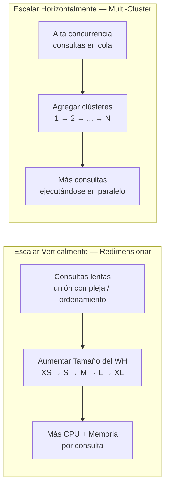

# Dominio 1.4 — Configuración de Virtual Warehouses

## Peso en el Examen

El **Dominio 1.0** representa aproximadamente el **~31%** del examen. La configuración de Virtual Warehouses es uno de los temas más evaluados en múltiples dominios.

> [!NOTE]
> Esta lección corresponde al **Objetivo de Examen 1.4**: *Configurar Virtual Warehouses*, incluyendo tipos, políticas de escalado, configuraciones para diferentes casos de uso y mejores prácticas.

---

## ¿Qué es un Virtual Warehouse?

Un **Virtual Warehouse (VW)** es un clúster de cómputo bajo demanda con nombre que ejecuta:
- Consultas SQL (SELECT)
- Sentencias DML (INSERT, UPDATE, DELETE, MERGE)
- Carga de datos (COPY INTO)
- Código Snowpark

Los Virtual Warehouses son la **única fuente de facturación de cómputo** en Snowflake (además de los excedentes de Cloud Services). El almacenamiento se factura por separado.

```sql
-- Crear un warehouse
CREATE WAREHOUSE WH_ANALYTICS
    WAREHOUSE_SIZE = MEDIUM
    AUTO_SUSPEND = 300          -- suspender tras 5 minutos de inactividad
    AUTO_RESUME = TRUE          -- reanudar automáticamente cuando se envíe una consulta
    INITIALLY_SUSPENDED = TRUE  -- no iniciar inmediatamente
    COMMENT = 'Warehouse de informes BI';

-- Usar un warehouse
USE WAREHOUSE WH_ANALYTICS;

-- Suspender/reanudar manualmente
ALTER WAREHOUSE WH_ANALYTICS SUSPEND;
ALTER WAREHOUSE WH_ANALYTICS RESUME;
```

---

## Tipos de Virtual Warehouse

### Warehouses Estándar (Gen 1 y Gen 2)

Los warehouses estándar son el **tipo predeterminado** y son adecuados para la mayoría de las cargas de trabajo SQL:
- Consultas SQL generales, BI, informes, ETL
- Dos generaciones: **Gen 1** (legado) y **Gen 2** (más reciente, mejor rendimiento)
- Los warehouses Gen 2 ofrecen mejor relación precio/rendimiento para consultas con uso intensivo de CPU

### Snowpark-Optimized Warehouses (Almacenes Optimizados para Snowpark)

Los Snowpark-Optimized Warehouses están diseñados para **cargas de trabajo de Snowpark con uso intensivo de memoria** (DataFrames de Python/Java/Scala, entrenamiento de modelos ML):

- Proporcionan **16 veces más memoria** por nodo en comparación con los warehouses estándar
- Cada nodo tiene más RAM para grandes operaciones en memoria con Snowpark
- **Más costosos** por crédito — úsalos solo cuando la memoria sea el cuello de botella
- Ideales para: entrenamiento de modelos ML, ciencia de datos a gran escala, transformaciones complejas con Snowpark

```sql
CREATE WAREHOUSE WH_ML_TRAINING
    WAREHOUSE_SIZE = LARGE
    WAREHOUSE_TYPE = 'SNOWPARK-OPTIMIZED'
    AUTO_SUSPEND = 600;
```

| Característica | Estándar | Snowpark-Optimized |
|---|---|---|
| Ideal para | SQL, DML, ETL | Python/Java/Scala ML |
| Memoria por nodo | Estándar | 16x Estándar |
| Costo en créditos | Tarifa base | Tarifa mayor |
| Auto-suspensión | ✅ | ✅ |
| Multi-cluster | ✅ | ✅ |

---

## Dimensionamiento de Warehouses

Cada tamaño **duplica** los recursos de cómputo (nodos) y el consumo de créditos:

| Tamaño | Créditos/Hora | Caso de Uso Típico |
|---|---|---|
| X-Small | 1 | Desarrollo, consultas pequeñas |
| Small | 2 | ETL pequeño, consultas ad-hoc |
| Medium | 4 | ETL moderado, BI estándar |
| Large | 8 | ETL intensivo, analítica compleja |
| X-Large | 16 | Conjuntos de datos muy grandes |
| 2X-Large | 32 | Cargas de trabajo con datos intensivos |
| 3X-Large | 64 | Procesamiento de muy alto volumen |
| 4X-Large | 128 | Cargas de trabajo masivamente paralelas |
| 5X-Large | 256 | Escala extrema (solo AWS/Azure) |
| 6X-Large | 512 | Escala extrema (solo AWS/Azure) |

> [!NOTE]
> Snowflake factura por **segundo** con un **mínimo de 60 segundos** por inicio de warehouse. Suspender y reanudar frecuentemente puede acumular cargos mínimos. Considera el valor de `AUTO_SUSPEND` cuidadosamente.

---

## Auto-Suspensión y Auto-Reanudación

### Auto-Suspensión

`AUTO_SUSPEND` define el número de **segundos inactivos** antes de que el warehouse se suspenda automáticamente:

```sql
-- Suspender tras 5 minutos (300 segundos) de inactividad
ALTER WAREHOUSE WH_BI SET AUTO_SUSPEND = 300;

-- Deshabilitar la auto-suspensión (el warehouse funciona hasta ser suspendido manualmente)
ALTER WAREHOUSE WH_BI SET AUTO_SUSPEND = 0;
```

**Mejores prácticas:**
- Establece la auto-suspensión **baja** (60–300 segundos) para cargas de trabajo intermitentes o impredecibles
- Establece la auto-suspensión **más alta** para warehouses con consultas frecuentes y consecutivas (evita el cargo mínimo de 60 segundos en cada reinicio)
- **Nunca deshabilites** la auto-suspensión para warehouses de desarrollo o pruebas

### Auto-Reanudación

`AUTO_RESUME = TRUE` significa que el warehouse **se inicia automáticamente** en el momento en que se envía una consulta — el usuario no necesita reanudarlo manualmente:

```sql
ALTER WAREHOUSE WH_BI SET AUTO_RESUME = TRUE;
```

> [!WARNING]
> Si `AUTO_RESUME = FALSE`, cualquier consulta enviada a un warehouse suspendido **fallará con un error**. Siempre establece `AUTO_RESUME = TRUE` a menos que desees control explícito del ciclo de vida del warehouse.

---

## Escalado: Escalar Verticalmente vs. Escalar Horizontalmente

Snowflake ofrece dos dimensiones de escalado:



### Escalar Verticalmente (Redimensionar)

**Cambia el tamaño del warehouse** cuando las consultas individuales son lentas (más recursos por consulta):

```sql
-- Escalar verticalmente para un trabajo ETL nocturno pesado
ALTER WAREHOUSE WH_ETL SET WAREHOUSE_SIZE = 'X-LARGE';

-- Reducir el tamaño después del trabajo
ALTER WAREHOUSE WH_ETL SET WAREHOUSE_SIZE = 'SMALL';
```

**Cuándo escalar verticalmente:**
- Las consultas tardan demasiado (no hay suficiente CPU/memoria por consulta)
- Uniones complejas, grandes agregaciones, ordenamientos
- Cargas de trabajo de un solo usuario o baja concurrencia con muchas consultas

### Escalar Horizontalmente (Multi-Cluster)

**Agregar más clústeres** cuando muchas consultas concurrentes están en cola:

> [!WARNING]
> Los Multi-cluster Warehouses requieren **edición Enterprise o superior**.

```sql
CREATE WAREHOUSE WH_REPORTING
    WAREHOUSE_SIZE = MEDIUM
    MAX_CLUSTER_COUNT = 5   -- hasta 5 clústeres
    MIN_CLUSTER_COUNT = 1   -- al menos 1 siempre activo
    SCALING_POLICY = 'ECONOMY';  -- o 'STANDARD'
```

**Cuándo escalar horizontalmente:**
- Muchos usuarios consultando concurrentemente → las consultas están en cola
- Dashboards de BI con muchos usuarios simultáneos
- Cargas de trabajo de alta concurrencia donde las consultas individuales son rápidas

---

## Multi-Cluster Warehouses (Warehouses de Múltiples Clústeres)

Un **multi-cluster warehouse** activa automáticamente clústeres de cómputo adicionales cuando la demanda de consultas supera la capacidad del clúster actual:

```
Modo de un solo clúster:     [Clúster 1] ← todas las consultas en cola aquí

Modo multi-cluster:          [Clúster 1] [Clúster 2] [Clúster 3]
                                  ↑            ↑            ↑
                         Consultas distribuidas entre clústeres
```

### Políticas de Escalado

| Política | Comportamiento | Ideal Para |
|---|---|---|
| **Standard** | Agrega clústeres inmediatamente al detectar colas | Cargas de trabajo sensibles a la latencia |
| **Economy** | Espera hasta que el clúster esté ocupado durante 6 minutos antes de agregar otro | Cargas de trabajo con control de costos |

### Modo Auto-Scale vs. Modo Maximized

| Modo | Descripción | Cuándo Usarlo |
|---|---|---|
| **Auto-Scale** | `MIN ≠ MAX` — los clústeres escalan dinámicamente | Concurrencia variable |
| **Maximized (Maximizado)** | `MIN = MAX` — todos los clústeres siempre activos | Alta concurrencia predecible |

```sql
-- Auto-scale: de 1 a 5 clústeres
CREATE WAREHOUSE WH_CONCURRENT
    WAREHOUSE_SIZE = SMALL
    MIN_CLUSTER_COUNT = 1
    MAX_CLUSTER_COUNT = 5
    SCALING_POLICY = STANDARD;

-- Maximized: siempre 3 clústeres
CREATE WAREHOUSE WH_ALWAYS_ON
    WAREHOUSE_SIZE = MEDIUM
    MIN_CLUSTER_COUNT = 3
    MAX_CLUSTER_COUNT = 3;
```

---

## Configuración de Warehouse por Caso de Uso

### Consultas Ad-Hoc

**Objetivo:** Respuesta rápida para consultas interactivas e impredecibles de analistas.

```sql
CREATE WAREHOUSE WH_ADHOC
    WAREHOUSE_SIZE = MEDIUM       -- suficiente potencia para consultas ad-hoc típicas
    AUTO_SUSPEND = 120            -- suspender rápido — el uso es esporádico
    AUTO_RESUME = TRUE
    MAX_CLUSTER_COUNT = 3         -- manejar picos de usuarios concurrentes
    SCALING_POLICY = STANDARD;   -- responder inmediatamente a la concurrencia
```

### Carga de Datos (ETL/ELT)

**Objetivo:** Maximizar el rendimiento para grandes operaciones COPY INTO.

```sql
CREATE WAREHOUSE WH_INGEST
    WAREHOUSE_SIZE = LARGE        -- más nodos = más carga paralela de archivos
    AUTO_SUSPEND = 60             -- suspender justo después de que termine el lote de carga
    AUTO_RESUME = TRUE
    MAX_CLUSTER_COUNT = 1;        -- la carga no se trata de concurrencia, sino de tamaño
```

> [!NOTE]
> Para cargas de datos, un **clúster único más grande** es mejor que más clústeres. Snowflake distribuye la carga de archivos entre los nodos dentro de un único clúster. El multi-cluster ayuda con la concurrencia, no con el rendimiento de una sola consulta.

### BI e Informes

**Objetivo:** Respuesta consistente y rápida para muchos usuarios de dashboard simultáneos.

```sql
CREATE WAREHOUSE WH_BI
    WAREHOUSE_SIZE = SMALL        -- las consultas individuales de BI son típicamente pequeñas
    AUTO_SUSPEND = 300
    AUTO_RESUME = TRUE
    MIN_CLUSTER_COUNT = 1
    MAX_CLUSTER_COUNT = 6         -- escalar horizontalmente para muchos usuarios concurrentes
    SCALING_POLICY = ECONOMY;    -- eficiente en costos para cargas de trabajo estables
```

---

## Resumen de Mejores Prácticas para Warehouses

| Escenario | Recomendación |
|---|---|
| Consultas individuales lentas | **Escalar verticalmente** (tamaño mayor) |
| Muchas consultas concurrentes en cola | **Escalar horizontalmente** (multi-cluster) |
| Desarrollo/pruebas | Tamaño pequeño, auto-suspensión 60–120s |
| Entrenamiento de modelos ML con Snowpark | Snowpark-Optimized Warehouse |
| Lotes ETL nocturnos | Tamaño grande, deshabilitar durante el día |
| Equipos diferentes | Warehouses dedicados y separados |
| Control de costos | Auto-suspensión baja + Monitor de Recursos |

---

## Preguntas de Práctica

**P1.** Un equipo de BI tiene 50 usuarios que ejecutan dashboards simultáneamente cada mañana. Las consultas individuales son rápidas, pero los usuarios experimentan demoras. ¿Cuál es la MEJOR solución?

- A) Aumentar el tamaño del warehouse a X-Large
- B) Habilitar multi-cluster warehouse (escalar horizontalmente) ✅
- C) Habilitar la caché de resultados de consultas
- D) Crear una vista materializada

**P2.** Un warehouse está configurado con `AUTO_SUSPEND = 300`. La última consulta se completó a las 10:00 AM. ¿Qué sucede a las 10:05 AM si no llegan nuevas consultas?

- A) El warehouse se reanuda automáticamente
- B) El warehouse se suspende automáticamente ✅
- C) El warehouse genera una alerta
- D) El warehouse se elimina solo

**P3.** ¿Qué tipo de warehouse proporciona 16 veces más memoria por nodo, adecuado para el entrenamiento de modelos ML?

- A) Standard Gen 2
- B) X-Large Standard
- C) Snowpark-Optimized ✅
- D) Multi-cluster Economy

**P4.** ¿Cuál es el período mínimo de facturación cada vez que un Virtual Warehouse inicia?

- A) 30 segundos
- B) 60 segundos ✅
- C) 5 minutos
- D) 1 hora

**P5.** La política de escalado `ECONOMY` para multi-cluster warehouses agrega un nuevo clúster cuando:

- A) La primera consulta entra en cola
- B) Más de 10 consultas están en cola
- C) El clúster permanecería ocupado durante al menos 6 minutos ✅
- D) La utilización de CPU supera el 80%

**P6.** Un desarrollador establece `AUTO_RESUME = FALSE` en un warehouse. ¿Qué sucede cuando un usuario envía una consulta mientras el warehouse está suspendido?

- A) El warehouse se reanuda y ejecuta la consulta
- B) La consulta entra en cola hasta que el warehouse se reanude manualmente
- C) La consulta falla con un error ✅
- D) La consulta se ejecuta en la capa de Cloud Services

---

> [!SUCCESS]
> **Puntos Clave para el Día del Examen:**
> 1. Dos dimensiones de escalado: **Vertical** (tamaño mayor, consultas lentas) vs. **Horizontal** (multi-cluster, usuarios concurrentes)
> 2. Multi-cluster requiere **edición Enterprise**
> 3. Facturación: **por segundo, mínimo 60 segundos** por inicio
> 4. **Snowpark-Optimized** = 16x memoria, para ML/ciencia de datos
> 5. Política `STANDARD` = agregar clúster inmediatamente | `ECONOMY` = esperar carga sostenida
> 6. `AUTO_RESUME = FALSE` + warehouse suspendido = consulta **falla** (no entra en cola)
