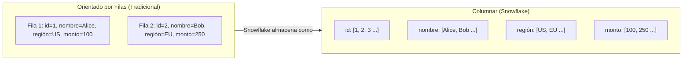
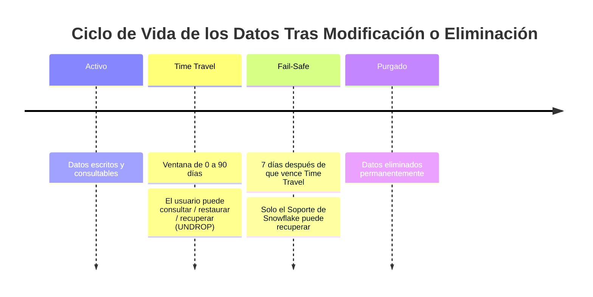

# Dominio 1.5 — Conceptos de Almacenamiento en Snowflake

## Peso en el Examen

El **Dominio 1.0** representa aproximadamente el **~31%** del examen. Los conceptos de almacenamiento son fundamentales y también aparecen en los dominios de rendimiento, gobernanza y carga de datos.

> [!NOTE]
> Esta lección corresponde al **Objetivo de Examen 1.5**: *Explicar los conceptos de almacenamiento de Snowflake*, incluyendo micro-particiones, clustering de datos y todos los tipos de tablas y vistas.

---

## Micro-Particiones

Las **micro-particiones** son la unidad fundamental de almacenamiento en Snowflake. Los datos de cada tabla se dividen automáticamente en micro-particiones — no se requiere particionamiento manual.

### Características Clave

| Propiedad | Valor |
|---|---|
| **Tamaño** | 50–500 MB (comprimido) |
| **Formato** | Columnar (orientado por columnas) |
| **Compresión** | Automática (Snowflake elige el algoritmo) |
| **Cifrado** | AES-256, automático |
| **Inmutabilidad** | Inmutables — el DML crea nuevas particiones |
| **Metadatos** | Valores mín/máx, conteo de distintos, conteo de NULL por columna por partición |

### Almacenamiento Columnar

Snowflake almacena datos **por columna, no por fila**. Esto tiene importantes implicaciones en el rendimiento:



**Beneficios para la analítica:**
- Solo se leen del disco las **columnas consultadas** → menos E/S (entrada/salida)
- Los valores similares en una columna se comprimen extremadamente bien → almacenamiento más pequeño
- Las consultas de agregación sobre una columna omiten todas las demás columnas

### Poda de Particiones (*Partition Pruning*)

Dado que Snowflake almacena **metadatos de mín/máx por columna por micro-partición**, puede **omitir particiones enteras** que no coincidan con una cláusula WHERE:

```sql
-- El optimizador de Snowflake sabe qué micro-particiones contienen
-- pedidos de enero de 2025 y omite todos los demás
SELECT sum(amount)
FROM orders
WHERE order_date BETWEEN '2025-01-01' AND '2025-01-31';
```

Esto se llama **poda de particiones** y es fundamental para el rendimiento de las consultas.

---

## Clustering de Datos

### Clustering Natural

Cuando los datos se cargan en un orden consistente (p. ej., cronológicamente por `created_at`), las micro-particiones están naturalmente bien agrupadas — las consultas que filtran por esa columna se benefician de la poda.

### Claves de Clúster (*Cluster Keys*)

Para tablas donde el **orden natural de carga no coincide con los patrones de consulta**, puedes definir una **Clave de Clúster** explícita:

```sql
-- Definir una clave de clúster en las columnas región y tipo_de_evento
ALTER TABLE events CLUSTER BY (region, event_type);

-- Verificar la calidad del clustering (0 = perfectamente agrupado, 1 = sin agrupamiento)
SELECT SYSTEM$CLUSTERING_INFORMATION('events', '(region, event_type)');
```

### Clustering Automático

Cuando se define una clave de clúster, el servicio de **Clustering Automático** de Snowflake se ejecuta en segundo plano para **reorganizar micro-particiones** — esto consume créditos en tu nombre.

| Concepto | Descripción |
|---|---|
| **Profundidad del Clúster** | Número promedio de particiones superpuestas por valor — menor es mejor |
| **Ratio de Clustering** | Fracción de columnas ordenadas dentro de las particiones — mayor es mejor |
| **Clustering Automático** | Servicio en segundo plano que mantiene el clustering; se factura por separado |

> [!WARNING]
> Definir una clave de clúster en una tabla pequeña o poco consultada es **un desperdicio** — el Clustering Automático consume créditos. Solo agrupa tablas grandes (cientos de GB+) que se consultan frecuentemente por la(s) columna(s) de clave de clúster.

---

## Time Travel (Viaje en el Tiempo)

**Time Travel** permite consultar versiones históricas de tus datos — hasta 90 días en el pasado (dependiendo de la edición):

| Edición | Time Travel Máximo |
|---|---|
| Standard | 1 día (24 horas) |
| Enterprise | Hasta 90 días |
| Business Critical | Hasta 90 días |
| VPS | Hasta 90 días |

```sql
-- Consultar datos como estaban hace 1 hora
SELECT * FROM orders AT (OFFSET => -3600);

-- Consultar datos en un timestamp específico
SELECT * FROM orders AT (TIMESTAMP => '2025-06-01 12:00:00'::TIMESTAMP_TZ);

-- Consultar usando un ID de consulta (antes de que se ejecutara esa consulta)
SELECT * FROM orders BEFORE (STATEMENT => '019f18ba-0804-0...');

-- Restaurar una tabla eliminada
UNDROP TABLE orders;

-- Clonar una tabla en un punto en el tiempo
CREATE TABLE orders_backup CLONE orders
    AT (TIMESTAMP => '2025-06-01 00:00:00'::TIMESTAMP_TZ);
```

### Configuración de Time Travel

```sql
-- Establecer la retención de Time Travel para una tabla específica
ALTER TABLE orders SET DATA_RETENTION_TIME_IN_DAYS = 30;

-- Establecer a nivel de esquema o base de datos
ALTER DATABASE my_db SET DATA_RETENTION_TIME_IN_DAYS = 7;

-- Deshabilitar Time Travel (reduce el costo de almacenamiento)
ALTER TABLE staging_table SET DATA_RETENTION_TIME_IN_DAYS = 0;
```

> [!NOTE]
> Los datos de Time Travel **sí cuentan para la facturación del almacenamiento**. Establecer la retención en 0 para tablas que no necesitan recuperación histórica es una estrategia de optimización de costos.

---

## Fail-Safe (Seguridad de Recuperación de Emergencia)

**Fail-Safe** es una ventana de recuperación ante desastres de **7 días no configurable** que comienza después de que vence el período de Time Travel.



**Hechos críticos del examen sobre Fail-Safe:**

| Propiedad | Valor |
|---|---|
| Duración | Siempre 7 días (no configurable) |
| ¿Quién puede recuperar los datos? | **Solo el Soporte de Snowflake** (no el cliente) |
| Costo | Incluido en el almacenamiento — sin cargo adicional |
| ¿Autoservicio? | **No** — contactar al soporte |
| Aplica a | Solo tablas permanentes (no Temporales ni Transitorias) |

> [!WARNING]
> Fail-Safe **no** es una herramienta de recuperación de autoservicio. Si necesitas recuperación puntual de autoservicio, usa **Time Travel** (UNDROP / AT / BEFORE). Fail-Safe es un último recurso que requiere la intervención del Soporte de Snowflake.

---

## Clonación de Copia Cero (*Zero-Copy Cloning*)

La **Clonación de Copia Cero** crea una copia instantánea de una base de datos, esquema o tabla **sin duplicar ningún dato subyacente**:

```sql
-- Clonar base de datos completa al instante
CREATE DATABASE DEV_DB CLONE PROD_DB;

-- Clonar un esquema
CREATE SCHEMA dev.staging CLONE prod.staging;

-- Clonar una tabla
CREATE TABLE orders_backup CLONE orders;

-- Clonar en un punto en el tiempo (usando Time Travel)
CREATE TABLE orders_jan CLONE orders
    AT (TIMESTAMP => '2025-01-31 23:59:59'::TIMESTAMP_TZ);
```

### Cómo Funciona la Clonación de Copia Cero

Después de clonar, el clon **comparte las mismas micro-particiones** que el original. Cuando el original o el clon se modifican, la **Copia en Escritura** (*Copy-on-Write*) crea nuevas micro-particiones solo para los datos modificados:

```
Estado inicial:   [Partición A] [Partición B] [Partición C]
                       ↑              ↑              ↑
                  ORIGINAL     ORIGINAL + CLON   ORIGINAL + CLON

Después de UPDATE en el clon:
Clon:       [Nueva Partición A'] [Partición B] [Partición C]
Original:   [Partición A]        [Partición B] [Partición C]
```

**Beneficios:**
- **Instantáneo** — no se copian datos
- **Sin costo adicional de almacenamiento** inicialmente
- El almacenamiento solo aumenta cuando los datos divergen entre el original y el clon
- Perfecto para entornos de desarrollo/prueba, instantáneas previas a migraciones, auditorías

---

## Tipos de Tablas (Revisión Completa)

| Tipo | Persistencia | Time Travel | Fail-Safe | Caso de Uso |
|---|---|---|---|---|
| **Permanente** | Hasta eliminación | 0–90 días | 7 días | Tablas de producción |
| **Temporal** | Fin de sesión | 0–1 día | Ninguno | Trabajo con ámbito de sesión |
| **Transitoria** | Hasta eliminación | 0–1 día | Ninguno | Staging, ETL intermedio |
| **Externa** | Nunca (sin datos) | Ninguno | Ninguno | Consultar archivos en cloud storage |
| **Apache Iceberg** | Hasta eliminación | Vía Iceberg | Vía Iceberg | Formato abierto, multi-motor |
| **Dinámica** | Hasta eliminación | Configurable | Configurable | Materialización incremental declarativa |

### Tablas Apache Iceberg

Snowflake soporta **Apache Iceberg** como formato de tabla abierto — los datos residen en tu propio cloud storage y son accesibles por múltiples motores (Spark, Trino, Snowflake):

```sql
-- Tabla Iceberg usando Snowflake como catálogo
CREATE ICEBERG TABLE icebergtable (id NUMBER, name STRING)
    CATALOG = SNOWFLAKE
    EXTERNAL_VOLUME = 'my_external_volume'
    BASE_LOCATION = 'iceberg_data/';
```

### Tablas Dinámicas (*Dynamic Tables*)

Las **Tablas Dinámicas** proporcionan **materialización incremental declarativa** — define el resultado de consulta que deseas, y Snowflake lo mantiene actualizado automáticamente:

```sql
CREATE DYNAMIC TABLE customer_summary
    TARGET_LAG = '1 hour'   -- los datos deben tener como máximo 1 hora de antigüedad
    WAREHOUSE = WH_TRANSFORM
AS
SELECT
    customer_id,
    count(*) as order_count,
    sum(amount) as total_spent
FROM orders
GROUP BY customer_id;
```

**Tablas Dinámicas vs. Streams + Tasks:**
- Tablas Dinámicas: **enfoque declarativo más simple** — Snowflake gestiona la lógica de actualización
- Streams + Tasks: **imperativo** — tú escribes la lógica de merge/insert explícitamente

---

## Tipos de Vistas (Revisión Completa)

| Tipo de Vista | Definición Oculta | Pre-Computada | Auto-Actualización | Notas |
|---|---|---|---|---|
| **Estándar** | No | No | N/A | Envoltorio lógico simple |
| **Segura** | Sí | No | N/A | Oculta la lógica de consulta a los consumidores |
| **Materializada** | No | Sí | Sí (en segundo plano) | Optimización de rendimiento |

```sql
-- Vista materializada: Snowflake la actualiza automáticamente
CREATE MATERIALIZED VIEW mv_hourly_sales AS
SELECT
    date_trunc('hour', sale_time) AS sale_hour,
    sum(amount) AS total_amount
FROM sales
GROUP BY 1;

-- Consultar la vista materializada (lee el resultado pre-computado)
SELECT * FROM mv_hourly_sales WHERE sale_hour > DATEADD('hour', -24, CURRENT_TIMESTAMP);
```

**Limitaciones de las Vistas Materializadas:**
- No pueden referenciar otras vistas materializadas ni tablas externas
- No pueden usar funciones no deterministas
- Mantenidas por el servicio en segundo plano de Snowflake (consume créditos)
- Solo disponibles en **Enterprise+**

---

## Cifrado en Reposo y en Tránsito

Todos los datos de Snowflake están cifrados por defecto — no se requiere configuración:

| Protección | Método |
|---|---|
| **Datos en reposo** | AES-256 (todas las micro-particiones) |
| **Datos en tránsito** | TLS 1.2+ (todas las conexiones) |
| **Gestión de claves** | Gestionada por Snowflake por defecto |
| **Tri-Secret Secure** | Clave gestionada por el cliente (Business Critical+) |

---

## Preguntas de Práctica

**P1.** ¿Cuál es el rango de tamaño de una micro-partición de Snowflake?

- A) 1–10 MB sin comprimir
- B) 50–500 MB comprimido ✅
- C) 1–5 GB sin comprimir
- D) Fijo en 128 MB

**P2.** Después de que vence el Time Travel, ¿quién puede recuperar datos durante el período de Fail-Safe?

- A) El cliente usando UNDROP
- B) El rol ACCOUNTADMIN
- C) Solo el Soporte de Snowflake ✅
- D) Nadie — los datos se purgan inmediatamente

**P3.** Un ingeniero de datos clona una tabla de producción (`CREATE TABLE dev CLONE prod`). No se realizan modificaciones aún. ¿Cuánto almacenamiento adicional consume el clon?

- A) 100% del tamaño de la tabla original
- B) 50% del tamaño de la tabla original
- C) Ninguno — las micro-particiones se comparten ✅
- D) Solo almacenamiento de metadatos

**P4.** ¿Qué tipo de tabla es apropiado para almacenar resultados ETL intermedios que no necesitan Fail-Safe pero deben persistir más allá de la sesión actual?

- A) Temporal
- B) Transitoria ✅
- C) Permanente
- D) Externa

**P5.** Una Tabla Dinámica está configurada con `TARGET_LAG = '1 hour'`. ¿Qué significa esto?

- A) La tabla se actualiza cada hora en punto
- B) Los datos en la tabla no deben tener más de 1 hora de retraso respecto a la fuente ✅
- C) La tabla retiene 1 hora de Time Travel
- D) El warehouse se ejecuta durante 1 hora por actualización

**P6.** ¿Qué tipo de vista de Snowflake oculta su definición SELECT subyacente a los usuarios que no han obtenido acceso del propietario?

- A) Vista Materializada
- B) Vista Estándar
- C) Vista Segura ✅
- D) Vista Externa

**P7.** El Clustering Automático está habilitado en una tabla. ¿Cuál afirmación es VERDADERA?

- A) El clustering se ejecuta en el Virtual Warehouse del cliente
- B) El clustering es gratuito e ilimitado
- C) El clustering consume créditos en el servicio en segundo plano de Snowflake ✅
- D) El clustering requiere que la tabla sea recreada

---

> [!SUCCESS]
> **Puntos Clave para el Día del Examen:**
> 1. Micro-particiones: **50–500 MB comprimidas, columnares, inmutables, con metadatos automáticos**
> 2. Fail-Safe: **7 días, no configurable, solo el Soporte de Snowflake puede recuperar**
> 3. Time Travel: **Standard = máximo 1 día | Enterprise+ = máximo 90 días**
> 4. Clonación de Copia Cero: **instantánea, sin costo inicial de almacenamiento, Copy-on-Write para divergencia**
> 5. Transitoria vs. Temporal: ambas sin Fail-Safe, pero Transitoria **persiste** más allá del fin de sesión
> 6. Tablas Dinámicas: `TARGET_LAG` declarativo — más simple que Streams + Tasks
