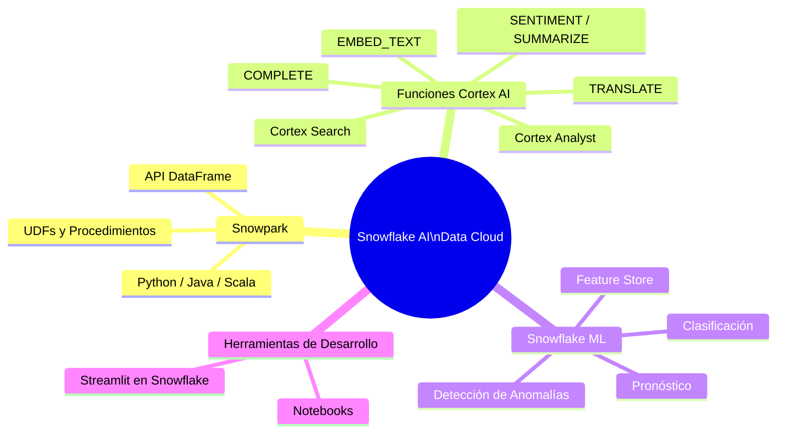

# Dominio 1.6 — Funcionalidades de IA/ML y Desarrollo de Aplicaciones

## Peso en el Examen

El **Dominio 1.0** representa aproximadamente el **~31%** del examen. Las funcionalidades de IA/ML son un enfoque creciente en el examen COF-C03, reflejando el posicionamiento de Snowflake como "AI Data Cloud".

> [!NOTE]
> Esta lección corresponde al **Objetivo de Examen 1.6**: *Explicar las funcionalidades de IA/ML y desarrollo de aplicaciones*, incluyendo Snowflake Notebooks, Streamlit, Snowpark, Snowflake Cortex y Snowflake ML.



---

## Snowpark

**Snowpark** es el framework de desarrollo de Snowflake que permite escribir pipelines de datos y transformaciones en **Python, Java o Scala** usando una API DataFrame — sin mover datos fuera de Snowflake.

### Conceptos Clave de Snowpark

- El código se escribe en Python/Java/Scala usando la librería Snowpark
- La ejecución ocurre **dentro de Snowflake** — los datos nunca salen
- Utiliza **evaluación perezosa** (*lazy evaluation*) — las operaciones se construyen como un plan de consulta y se ejecutan cuando se activa una acción
- Soporta Funciones Definidas por el Usuario (UDFs), UDTFs (funciones de tabla) y Procedimientos Almacenados

```python
# Ejemplo de Snowpark en Python
from snowflake.snowpark import Session
from snowflake.snowpark.functions import col, sum as snow_sum

# Crear una sesión
session = Session.builder.configs({
    "account": "myaccount",
    "user": "myuser",
    "password": "mypassword",
    "warehouse": "WH_DS",
    "database": "ANALYTICS",
    "schema": "PUBLIC"
}).create()

# Construir un DataFrame (aún no se mueven datos — evaluación perezosa)
df = session.table("orders")

# Transformar
result = (df
    .filter(col("status") == "COMPLETED")
    .group_by("region")
    .agg(snow_sum("amount").alias("total_revenue"))
    .sort("total_revenue", ascending=False)
)

# Ejecutar y mostrar resultados (activa el cómputo)
result.show()

# Escribir resultados de vuelta a Snowflake
result.write.mode("overwrite").save_as_table("revenue_by_region")
```

### UDFs y UDTFs con Snowpark

```python
# Registrar una UDF de Python en Snowflake
from snowflake.snowpark.functions import udf
from snowflake.snowpark.types import StringType, FloatType

@udf(return_type=FloatType(), input_types=[StringType()])
def sentiment_score(text: str) -> float:
    # Esto se ejecuta dentro del sandbox de Python de Snowflake
    from textblob import TextBlob
    return TextBlob(text).sentiment.polarity

# Usar la UDF en una consulta
df.select(sentiment_score(col("review_text")).alias("sentiment")).show()
```

### Snowpark para Machine Learning

```python
from snowflake.ml.modeling.linear_model import LinearRegression
from snowflake.ml.modeling.preprocessing import StandardScaler

# Entrenar un modelo usando Snowflake ML
scaler = StandardScaler(input_cols=["age", "income"], output_cols=["age_scaled", "income_scaled"])
df_scaled = scaler.fit(df).transform(df)

model = LinearRegression(input_cols=["age_scaled", "income_scaled"], label_cols=["churn"])
model.fit(df_scaled)

# Desplegar el modelo como UDF dentro de Snowflake
```

---

## Snowflake Cortex — Funciones SQL de IA

**Snowflake Cortex** proporciona **funciones SQL potenciadas por LLM** (*Large Language Models*, modelos de lenguaje de gran escala) que se ejecutan directamente sobre datos de Snowflake — sin necesidad de llamadas a API externas desde la perspectiva del usuario.

### Funciones SQL de Cortex AI

| Función | Descripción | Caso de Uso Ejemplo |
|---|---|---|
| `COMPLETE()` | Genera texto con un LLM | Resumir, clasificar, responder preguntas |
| `EMBED_TEXT_768()` / `EMBED_TEXT_1024()` | Genera incrustaciones vectoriales (*embeddings*) | Búsqueda semántica, similitud |
| `CLASSIFY_TEXT()` | Clasifica texto en categorías | Análisis de sentimiento, clasificación por tema |
| `EXTRACT_ANSWER()` | Extrae una respuesta del texto de contexto | Q&A sobre documentos |
| `SENTIMENT()` | Devuelve puntuación de sentimiento (-1 a 1) | Análisis de reseñas de productos |
| `SUMMARIZE()` | Resume texto largo | Artículos de noticias, documentos |
| `TRANSLATE()` | Traduce texto entre idiomas | Datos multilingües |
| `PARSE_DOCUMENT()` | Extrae texto de PDFs/imágenes | Procesamiento de documentos |

```sql
-- Resumir reseñas de clientes
SELECT
    review_id,
    SNOWFLAKE.CORTEX.SUMMARIZE(review_text) AS resumen
FROM customer_reviews;

-- Análisis de sentimiento
SELECT
    review_id,
    SNOWFLAKE.CORTEX.SENTIMENT(review_text) AS puntuacion_sentimiento
FROM customer_reviews;

-- Clasificar tickets de soporte
SELECT
    ticket_id,
    SNOWFLAKE.CORTEX.CLASSIFY_TEXT(
        ticket_body,
        ['facturacion', 'tecnico', 'cuenta', 'general']
    ):label::STRING AS categoria
FROM support_tickets;

-- Generar completaciones con LLM
SELECT
    SNOWFLAKE.CORTEX.COMPLETE(
        'mistral-7b',   -- o 'llama3-70b', 'mixtral-8x7b', 'snowflake-arctic'
        'Resume lo siguiente en una oración: ' || description
    ) AS resumen_ia
FROM products;
```

### Cortex Search (Búsqueda Semántica)

**Cortex Search** proporciona capacidades de **búsqueda semántica (vectorial)** sobre datos de Snowflake sin necesidad de gestionar incrustaciones (*embeddings*) manualmente:

```sql
-- Crear un servicio de Cortex Search
CREATE CORTEX SEARCH SERVICE product_search
    ON COLUMN product_description
    WAREHOUSE = WH_SEARCH
    TARGET_LAG = '1 hour'
AS (
    SELECT product_id, product_name, product_description
    FROM products
    WHERE is_active = TRUE
);

-- Consultar el servicio de búsqueda (vía API o función SQL)
SELECT SNOWFLAKE.CORTEX.SEARCH_PREVIEW(
    'product_search',
    '{"query": "auriculares inalámbricos con cancelación de ruido", "limit": 5}'
);
```

### Cortex Analyst (Analista de Cortex)

**Cortex Analyst** habilita la **generación de SQL a partir de lenguaje natural** — los usuarios de negocio hacen preguntas en español o inglés y Cortex Analyst devuelve consultas SQL y resultados:

- Construido sobre LLMs ajustados para generación de SQL
- Comprende tu esquema de Snowflake y modelo semántico
- Potencia interfaces de BI conversacional
- Accesible vía REST API o integración con Streamlit

---

## Snowflake ML

**Snowflake ML** es un conjunto de capacidades de ML integradas en Snowflake:

### Feature Store (Almacén de Características)

Almacena, gestiona y comparte características (*features*) de ML como objetos de Snowflake:

```python
from snowflake.ml.feature_store import FeatureStore, Entity, FeatureView

fs = FeatureStore(session=session, database="ML_DB", name="MY_FEATURE_STORE", ...)

# Definir una entidad
customer_entity = Entity(name="customer", join_keys=["customer_id"])

# Crear una vista de características
fv = FeatureView(
    name="customer_features",
    entities=[customer_entity],
    feature_df=df_features,
    refresh_freq="1 day"
)
fs.register_feature_view(fv, version="v1")
```

### Model Registry (Registro de Modelos)

Almacena, versiona y despliega modelos ML dentro de Snowflake:

```python
from snowflake.ml.registry import Registry

reg = Registry(session=session, database_name="ML_DB", schema_name="PUBLIC")

# Registrar un modelo
mv = reg.log_model(
    model=trained_sklearn_model,
    model_name="churn_predictor",
    version_name="v1",
    sample_input_data=df_sample
)

# Ejecutar inferencia
predictions = mv.run(df_new_customers, function_name="predict")
```

### AutoML con Snowflake ML

```python
from snowflake.ml.modeling.linear_model import LogisticRegression
from snowflake.ml.modeling.model_selection import GridSearchCV

# Validación cruzada de hiperparámetros dentro de Snowflake
param_grid = {"C": [0.1, 1, 10], "max_iter": [100, 200]}
cv = GridSearchCV(estimator=LogisticRegression(), param_grid=param_grid, cv=5)
cv.fit(df_train)
```

---

## Snowflake Notebooks

Los **Snowflake Notebooks** son **notebooks interactivos al estilo Jupyter** integrados directamente en Snowsight:

- Soporta celdas de **SQL, Python (Snowpark) y Markdown** en el mismo notebook
- Las celdas de Python se ejecutan dentro de Snowflake — los datos nunca salen
- Accede a datos de Snowflake directamente sin configurar una conexión
- Con control de versiones vía **integración con Git**
- Puede visualizar resultados con librerías populares de Python (matplotlib, plotly, altair)

```python
# En una celda Python de un Snowflake Notebook
import streamlit as st
import matplotlib.pyplot as plt

# Cargar datos usando Snowpark (ya conectado)
df = session.table("orders").to_pandas()

# Visualizar
fig, ax = plt.subplots()
df.groupby("region")["amount"].sum().plot(kind="bar", ax=ax)
st.pyplot(fig)
```

```sql
-- En una celda SQL dentro del mismo notebook
SELECT region, count(*) as total_pedidos
FROM orders
WHERE order_date >= DATEADD('month', -3, CURRENT_DATE)
GROUP BY 1
ORDER BY 2 DESC;
```

---

## Streamlit en Snowflake

**Streamlit en Snowflake** te permite **desplegar aplicaciones Python de Streamlit directamente dentro de Snowflake** — sin necesidad de hosting externo:

- Las aplicaciones Python de datos se ejecutan de forma nativa en Snowflake
- Accede a datos de Snowflake de forma segura sin claves API
- Comparte con usuarios dentro de tu cuenta de Snowflake
- Usa RBAC de Snowflake para controlar quién puede acceder a la aplicación
- Construye dashboards, exploradores de datos, aplicaciones potenciadas por IA

```python
# streamlit_app.py — se ejecuta dentro de Snowflake
import streamlit as st
from snowflake.snowpark.context import get_active_session

# Obtener la sesión activa de Snowflake (pre-autenticada)
session = get_active_session()

st.title("Dashboard de Ventas")

# Consultar datos de Snowflake
df = session.sql("SELECT region, sum(amount) as ingresos FROM orders GROUP BY 1").to_pandas()

st.bar_chart(df.set_index("REGION")["INGRESOS"])

# Usar Cortex para funcionalidades de IA
pregunta = st.text_input("Haz una pregunta sobre tus datos:")
if pregunta:
    respuesta = session.sql(f"""
        SELECT SNOWFLAKE.CORTEX.COMPLETE('mistral-7b', '{pregunta}')
    """).collect()[0][0]
    st.write(respuesta)
```

```sql
-- Desplegar una aplicación Streamlit
CREATE STREAMLIT my_dashboard
    ROOT_LOCATION = '@my_stage/streamlit_app'
    MAIN_FILE = 'streamlit_app.py'
    QUERY_WAREHOUSE = WH_BI;
```

---

## Tabla Resumen de Funcionalidades IA/ML

| Funcionalidad | Qué Hace | Dónde Se Ejecuta |
|---|---|---|
| **Snowpark** | API DataFrame para Python/Java/Scala | Dentro de Snowflake (capa de cómputo) |
| **Cortex COMPLETE()** | Generación de texto con LLM | Endpoints LLM gestionados por Snowflake |
| **Cortex SENTIMENT()** | Análisis de sentimiento | Endpoints LLM gestionados por Snowflake |
| **Cortex SUMMARIZE()** | Resumen de texto | Endpoints LLM gestionados por Snowflake |
| **Cortex Search** | Servicio de búsqueda semántica/vectorial | Índice vectorial gestionado por Snowflake |
| **Cortex Analyst** | Conversión de lenguaje natural a SQL | LLM gestionado por Snowflake |
| **Snowflake ML** | ML compatible con Sklearn en Snowflake | Cómputo de Snowflake |
| **Feature Store** | Gestión de características ML | Almacenamiento + cómputo de Snowflake |
| **Model Registry** | Versionado y despliegue de modelos ML | Almacenamiento + cómputo de Snowflake |
| **Notebooks** | IDE interactivo SQL + Python | Cómputo de Snowflake |
| **Streamlit en Snowflake** | Hosting de aplicaciones web Python | Cómputo de Snowflake |

---

## Preguntas de Práctica

**P1.** Un científico de datos quiere entrenar un modelo de machine learning usando Python sin mover datos fuera de Snowflake. ¿Qué funcionalidad lo permite?

- A) External functions (funciones externas)
- B) Snowpark ✅
- C) Dashboards de Snowsight
- D) COPY INTO

**P2.** ¿Qué función de Snowflake Cortex usarías para devolver una puntuación de sentimiento entre -1 y 1 para reseñas de clientes?

- A) `COMPLETE()`
- B) `SUMMARIZE()`
- C) `SENTIMENT()` ✅
- D) `EXTRACT_ANSWER()`

**P3.** Un analista de negocio quiere preguntar "¿Cuáles fueron los 5 productos con más ingresos el último trimestre?" en lenguaje natural y obtener una consulta SQL de vuelta. ¿Qué funcionalidad de Cortex soporta esto?

- A) Cortex Search
- B) Cortex Analyst ✅
- C) Cortex COMPLETE()
- D) Snowflake ML Registry

**P4.** Las aplicaciones de Streamlit en Snowflake están aseguradas usando qué mecanismo de Snowflake?

- A) Claves API en el código de la aplicación
- B) Control de Acceso Basado en Roles (RBAC) de Snowflake ✅
- C) Solo OAuth de terceros
- D) Acceso público a internet sin autenticación

**P5.** Snowpark usa evaluación perezosa (*lazy evaluation*). ¿Qué activa el cómputo real?

- A) Crear el objeto DataFrame
- B) Llamar a `.filter()` o `.group_by()`
- C) Llamar a una acción como `.show()`, `.collect()` o `.write` ✅
- D) Conectarse a la sesión

---

> [!SUCCESS]
> **Puntos Clave para el Día del Examen:**
> 1. **Snowpark** = API DataFrame para Python/Java/Scala ejecutándose DENTRO de Snowflake
> 2. **Funciones SQL de Cortex** = capacidades LLM como SQL (`SENTIMENT`, `SUMMARIZE`, `COMPLETE`, etc.)
> 3. **Cortex Analyst** = lenguaje natural → SQL para usuarios de negocio
> 4. **Cortex Search** = servicio gestionado de búsqueda semántica/vectorial
> 5. **Streamlit en Snowflake** = aplicaciones web Python hospedadas y aseguradas dentro de Snowflake
> 6. **Snowflake Notebooks** = notebooks al estilo Jupyter con celdas SQL + Python en Snowsight
