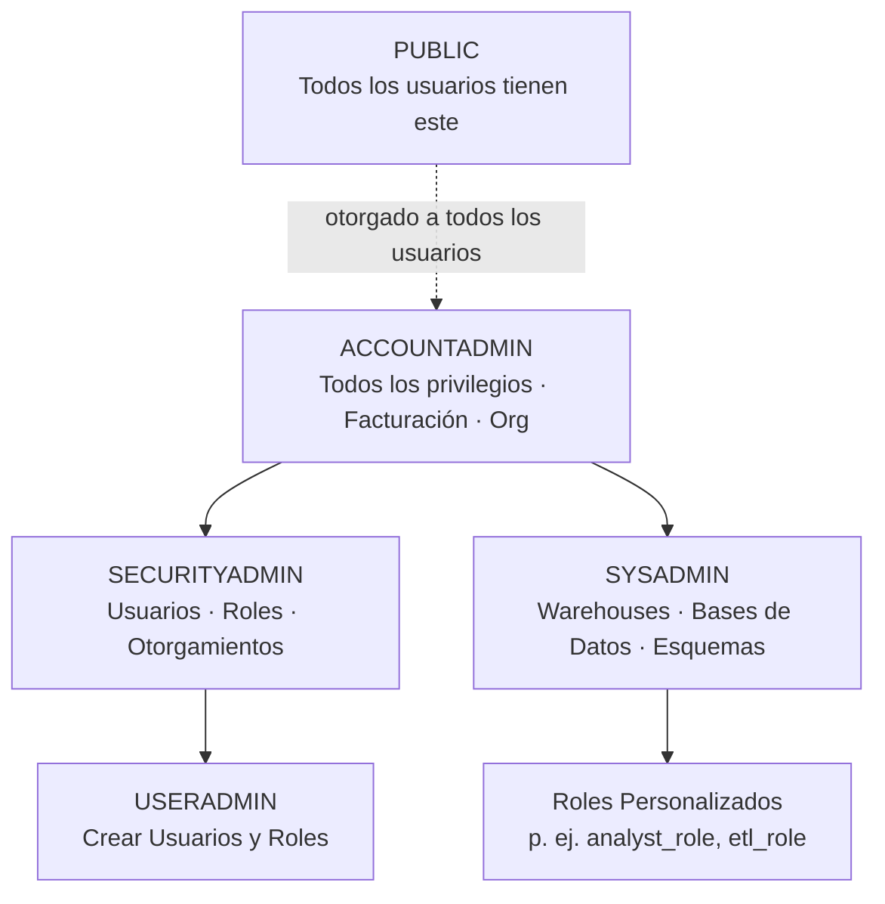

# Dominio 2.1 — Modelo y Principios de Seguridad de Snowflake

## Peso en el Examen

El **Dominio 2.0 — Gestión de Cuenta y Gobernanza de Datos** representa aproximadamente el **~20%** del examen. La seguridad es uno de los temas más evaluados.

> [!NOTE]
> Esta lección corresponde al **Objetivo de Examen 2.1**: *Explicar el modelo y principios de seguridad de Snowflake*, incluyendo RBAC, DAC, jerarquía de objetos asegurables, políticas de red, métodos de autenticación, roles definidos por el sistema, roles funcionales, roles secundarios, identificadores de cuenta y registro/rastreo.

---

## El Marco de Control de Acceso de Snowflake

Snowflake usa **dos modelos complementarios de control de acceso** que trabajan juntos:

| Modelo | Sigla | Cómo Funciona |
|---|---|---|
| **Control de Acceso Basado en Roles** | RBAC | Los privilegios se otorgan a **roles**, los roles se otorgan a **usuarios** |
| **Control de Acceso Discrecional** | DAC | El **propietario de un objeto** puede otorgar acceso a ese objeto a otros roles |

### RBAC en la Práctica

```sql
-- Otorgar privilegio a un rol
GRANT SELECT ON TABLE analytics.public.orders TO ROLE analyst_role;

-- Otorgar rol a un usuario
GRANT ROLE analyst_role TO USER jane;

-- Cuando Jane inicia sesión, puede activar su rol y ejecutar consultas
USE ROLE analyst_role;
SELECT * FROM analytics.public.orders;
```

### DAC en la Práctica

El rol que **es propietario** (creó) de un objeto puede otorgar acceso al mismo:

```sql
-- El rol de Jane (data_owner) creó esta tabla — es su "propietario"
CREATE TABLE analytics.public.customer_data (...);

-- Como propietario, data_owner puede otorgar acceso a otros
GRANT SELECT ON TABLE analytics.public.customer_data TO ROLE analyst_role;
```

> [!NOTE]
> El DAC significa que no necesitas a SYSADMIN para gestionar cada otorgamiento. Los propietarios de objetos pueden auto-gestionar el acceso a sus objetos — esto habilita la **administración federada**.

---

## Jerarquía de Objetos Asegurables

Cada objeto de Snowflake es un **objeto asegurable** — se pueden otorgar privilegios sobre él. Los objetos heredan de su contenedor padre:

```
Organización
└── Cuenta
    ├── Warehouse
    ├── Base de Datos
    │   └── Esquema
    │       ├── Tabla
    │       ├── Vista
    │       ├── Stage
    │       ├── Función (UDF)
    │       ├── Procedimiento
    │       └── Stream / Task / Pipe
    ├── Usuario
    └── Rol
```

Para acceder a un objeto, un rol típicamente necesita:
1. `USAGE` sobre la **base de datos**
2. `USAGE` sobre el **esquema**
3. El privilegio específico sobre el **objeto** (p. ej., `SELECT`, `INSERT`)

```sql
-- Otorgamientos mínimos para acceso de lectura a una tabla
GRANT USAGE ON DATABASE analytics TO ROLE analyst_role;
GRANT USAGE ON SCHEMA analytics.public TO ROLE analyst_role;
GRANT SELECT ON TABLE analytics.public.orders TO ROLE analyst_role;

-- Otorgar sobre todos los objetos actuales
GRANT SELECT ON ALL TABLES IN SCHEMA analytics.public TO ROLE analyst_role;

-- Otorgar sobre futuros objetos también
GRANT SELECT ON FUTURE TABLES IN SCHEMA analytics.public TO ROLE analyst_role;
```

---

## Roles Definidos por el Sistema

Snowflake proporciona roles integrados con una jerarquía de privilegios fija:

| Rol | Descripción | Privilegios Clave |
|---|---|---|
| `ACCOUNTADMIN` | Rol de más alto nivel | Todos los privilegios; gestiona facturación, replicación, organización |
| `SECURITYADMIN` | Gestiona usuarios y roles | Crear/gestionar usuarios, roles, otorgamientos |
| `SYSADMIN` | Gestiona warehouses y bases de datos | Crear warehouses, bases de datos, esquemas, tablas |
| `USERADMIN` | Gestión limitada de usuarios | Solo crear usuarios y roles |
| `PUBLIC` | Rol predeterminado para todos los usuarios | Mínimo — todos los usuarios tienen este rol |

**Jerarquía de herencia de roles:**



> [!WARNING]
> Mejor práctica: **Nunca uses ACCOUNTADMIN para tareas diarias**. Crea roles personalizados para flujos de trabajo específicos. ACCOUNTADMIN debe usarse solo para administración a nivel de cuenta. Evita iniciar sesión como un usuario cuyo rol predeterminado sea ACCOUNTADMIN.

---

## Roles Funcionales: Roles de Cuenta, Roles de Base de Datos y Roles Personalizados

### Roles de Cuenta

Los roles de cuenta tienen alcance en toda la **cuenta** — pueden otorgar acceso a cualquier objeto en la cuenta:

```sql
-- Crear un rol de cuenta personalizado
CREATE ROLE analyst_role;
GRANT ROLE analyst_role TO ROLE SYSADMIN;  -- ¡siempre otorgar roles personalizados a SYSADMIN!

-- Otorgar privilegios
GRANT USAGE ON DATABASE analytics TO ROLE analyst_role;
GRANT SELECT ON ALL TABLES IN SCHEMA analytics.marts TO ROLE analyst_role;
```

> [!WARNING]
> Siempre otorga los roles personalizados a `SYSADMIN` (o superior) para que el rol SYSADMIN mantenga la visibilidad y el control sobre todos los objetos creados por roles personalizados.

### Roles de Base de Datos

Los **roles de base de datos** tienen alcance en una **base de datos específica** y pueden compartirse vía Intercambio Seguro de Datos:

```sql
-- Crear un rol de base de datos
CREATE DATABASE ROLE analytics.reader_role;

-- Otorgar privilegios solo dentro de la base de datos
GRANT USAGE ON SCHEMA analytics.public TO DATABASE ROLE analytics.reader_role;
GRANT SELECT ON ALL TABLES IN SCHEMA analytics.public TO DATABASE ROLE analytics.reader_role;

-- Otorgar rol de base de datos a un rol de cuenta
GRANT DATABASE ROLE analytics.reader_role TO ROLE analyst_account_role;

-- Los roles de base de datos también pueden incluirse en shares
GRANT DATABASE ROLE analytics.reader_role TO SHARE my_data_share;
```

### Roles Secundarios (*Secondary Roles*)

Un usuario puede activar **un rol primario** y múltiples **roles secundarios** simultáneamente:

```sql
-- Activar rol primario + roles secundarios
USE SECONDARY ROLES ALL;  -- activa todos los roles otorgados al usuario

-- O especificar roles secundarios específicos
USE SECONDARY ROLES analyst_role, loader_role;
```

Cuando los roles secundarios están activos, el usuario tiene la **unión de todos los privilegios** de su rol primario + roles secundarios.

---

## Métodos de Autenticación

### Usuario + Contraseña

Autenticación básica — nombre de usuario y contraseña. La menos segura pero la más simple.

```sql
CREATE USER jane PASSWORD = 'SecurePass123!' MUST_CHANGE_PASSWORD = TRUE;
```

### Autenticación Multi-Factor (MFA)

La MFA agrega un segundo factor (Duo Security) a la autenticación con contraseña:

```sql
-- Forzar MFA para un usuario
ALTER USER jane SET MINS_TO_BYPASS_MFA = 0;  -- exigir siempre

-- Imposición de MFA basada en política (nivel de cuenta)
ALTER ACCOUNT SET MFA_ENROLLMENT = REQUIRED;
```

### Autenticación Federada / SSO (Inicio de Sesión Único)

Snowflake se integra con **Proveedores de Identidad (IdPs)** empresariales vía **SAML 2.0**:
- Okta, Azure AD, OneLogin, Ping Identity, etc.
- Los usuarios se autentican vía el IdP — Snowflake valida la afirmación SAML
- No se requiere contraseña de Snowflake

```sql
-- Configurar SSO con SAML
CREATE SECURITY INTEGRATION my_saml_sso
    TYPE = SAML2
    SAML2_ISSUER = 'https://idp.example.com'
    SAML2_SSO_URL = 'https://idp.example.com/sso/saml'
    SAML2_PROVIDER = 'OKTA'
    SAML2_X509_CERT = '<contenido_del_certificado>';
```

### OAuth

Snowflake soporta OAuth 2.0 para aplicaciones de terceros y herramientas BI:

| Tipo de OAuth | Caso de Uso |
|---|---|
| **Snowflake OAuth** | Aplicaciones cliente (Tableau, PowerBI, apps personalizadas) |
| **External OAuth** | Okta, Azure AD como servidor OAuth (SSO vía token) |

```sql
-- Crear una integración OAuth para una herramienta BI
CREATE SECURITY INTEGRATION tableau_oauth
    TYPE = OAUTH
    OAUTH_CLIENT = TABLEAU_DESKTOP
    OAUTH_REDIRECT_URI = 'https://localhost:5000';
```

### Autenticación por Clave-Par RSA

La autenticación por clave-par RSA es para **cuentas de servicio y acceso programático** — más segura que las contraseñas para la automatización:

```bash
# Generar par de claves
openssl genrsa 2048 | openssl pkcs8 -topk8 -v2 des3 -inform PEM -out rsa_key.p8
openssl rsa -in rsa_key.p8 -pubout -out rsa_key.pub
```

```sql
-- Asignar clave pública al usuario
ALTER USER svc_account SET RSA_PUBLIC_KEY = '<contenido_de_clave_publica>';
```

---

## Políticas de Red (*Network Policies*)

Una **Política de Red** controla qué direcciones IP pueden conectarse a Snowflake:

```sql
-- Crear una política de red (lista de permitidos + lista de bloqueados)
CREATE NETWORK POLICY corp_policy
    ALLOWED_IP_LIST = ('203.0.113.0/24', '198.51.100.50')
    BLOCKED_IP_LIST = ('198.51.100.100');

-- Aplicar a nivel de cuenta
ALTER ACCOUNT SET NETWORK_POLICY = corp_policy;

-- Aplicar a nivel de usuario (reemplaza la política de cuenta para ese usuario)
ALTER USER jane SET NETWORK_POLICY = corp_policy;
```

> [!NOTE]
> Las políticas de red soportan **notación CIDR IPv4**. Cuando se aplica a nivel de usuario, la política de usuario reemplaza la política de cuenta. Las políticas de red se evalúan **antes** de la autenticación.

---

## Identificadores de Cuenta

Cada cuenta de Snowflake tiene identificadores únicos:

| Formato | Ejemplo | Descripción |
|---|---|---|
| **Localizador de cuenta** | `xy12345.us-east-1` | Formato legado (específico de nube+región) |
| **Nombre de cuenta** | `myorg-myaccount` | Formato moderno (nombre_org-nombre_cuenta) |
| **URL de conexión** | `xy12345.us-east-1.snowflakecomputing.com` | URL completa para JDBC/conexión |

```python
# Conectar usando el nombre de cuenta (preferido)
conn = snowflake.connector.connect(
    account="myorg-myaccount",
    user="jane",
    password="secret"
)

# Conectar usando el localizador de cuenta (legado)
conn = snowflake.connector.connect(
    account="xy12345.us-east-1",
    user="jane",
    password="secret"
)
```

---

## Registro y Rastreo

### Historial de Acceso

`SNOWFLAKE.ACCOUNT_USAGE.ACCESS_HISTORY` rastrea quién accedió a qué datos:

```sql
-- ¿Quién consultó la tabla customers en los últimos 7 días?
SELECT
    user_name,
    query_start_time,
    query_text
FROM SNOWFLAKE.ACCOUNT_USAGE.ACCESS_HISTORY
WHERE EXISTS (
    SELECT 1 FROM TABLE(FLATTEN(BASE_OBJECTS_ACCESSED)) f
    WHERE f.value:objectName::STRING = 'ANALYTICS.PUBLIC.CUSTOMERS'
)
AND query_start_time > DATEADD('day', -7, CURRENT_TIMESTAMP);
```

### Tablas de Eventos (Registro y Rastreo)

Snowflake soporta **registro y rastreo compatible con OpenTelemetry** vía tablas de eventos:

```sql
-- Crear una tabla de eventos
CREATE EVENT TABLE my_events;

-- Establecer a nivel de cuenta
ALTER ACCOUNT SET EVENT_TABLE = my_events;

-- Consultar eventos registrados
SELECT *
FROM my_events
WHERE TIMESTAMP > DATEADD('hour', -1, CURRENT_TIMESTAMP)
ORDER BY TIMESTAMP DESC;
```

---

## Preguntas de Práctica

**P1.** Un equipo quiere que el propietario de una tabla pueda otorgar acceso SELECT a otros roles sin involucrar a SYSADMIN. ¿Qué modelo de control de acceso lo permite?

- A) Control de Acceso Basado en Roles (RBAC)
- B) Control de Acceso Discrecional (DAC) ✅
- C) Control de Acceso Obligatorio (MAC)
- D) Control de Acceso Basado en Atributos (ABAC)

**P2.** ¿Qué rol de sistema debería usarse para la administración diaria de warehouses y bases de datos?

- A) ACCOUNTADMIN
- B) SECURITYADMIN
- C) SYSADMIN ✅
- D) USERADMIN

**P3.** Una cuenta de servicio necesita autenticarse sin contraseña para automatización CI/CD. ¿Qué método de autenticación es más apropiado?

- A) Usuario + Contraseña
- B) MFA con Duo
- C) Autenticación por clave-par ✅
- D) SSO con SAML

**P4.** Jane tiene el rol primario `ANALYST` y todos los roles secundarios activados. ¿Cuál afirmación es VERDADERA?

- A) Jane solo puede usar los privilegios del rol ANALYST
- B) Jane tiene la unión de privilegios de todos sus roles otorgados ✅
- C) Jane no puede ejecutar consultas con roles secundarios activos
- D) Los roles secundarios anulan los privilegios del rol primario

**P5.** Se aplica una política de red tanto a nivel de cuenta como a nivel de usuario para el usuario Bob. ¿Qué política aplica a Bob?

- A) La política a nivel de cuenta
- B) La política más restrictiva
- C) La política a nivel de usuario ✅
- D) Ambas políticas se aplican simultáneamente

**P6.** Para agregar un nuevo rol personalizado a la jerarquía de roles de manera que SYSADMIN pueda gestionar los objetos que crea, el rol personalizado debe otorgarse a qué rol?

- A) ACCOUNTADMIN
- B) PUBLIC
- C) SYSADMIN ✅
- D) SECURITYADMIN

---

> [!SUCCESS]
> **Puntos Clave para el Día del Examen:**
> 1. **RBAC**: privilegios → roles → usuarios | **DAC**: el propietario del objeto otorga acceso
> 2. Jerarquía de roles: ACCOUNTADMIN > SYSADMIN > roles personalizados | SECURITYADMIN > USERADMIN
> 3. Siempre otorgar roles personalizados a **SYSADMIN**
> 4. Política de red a **nivel de usuario reemplaza** la política a nivel de cuenta
> 5. Autenticación por clave-par = ideal para cuentas de servicio y automatización
> 6. Roles secundarios = el usuario activa la unión de privilegios de todos los roles otorgados
