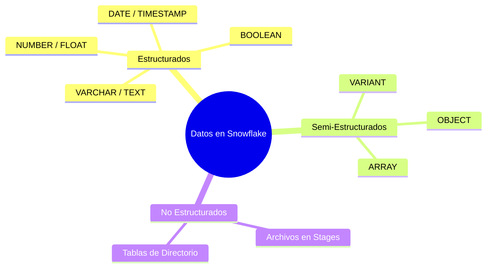
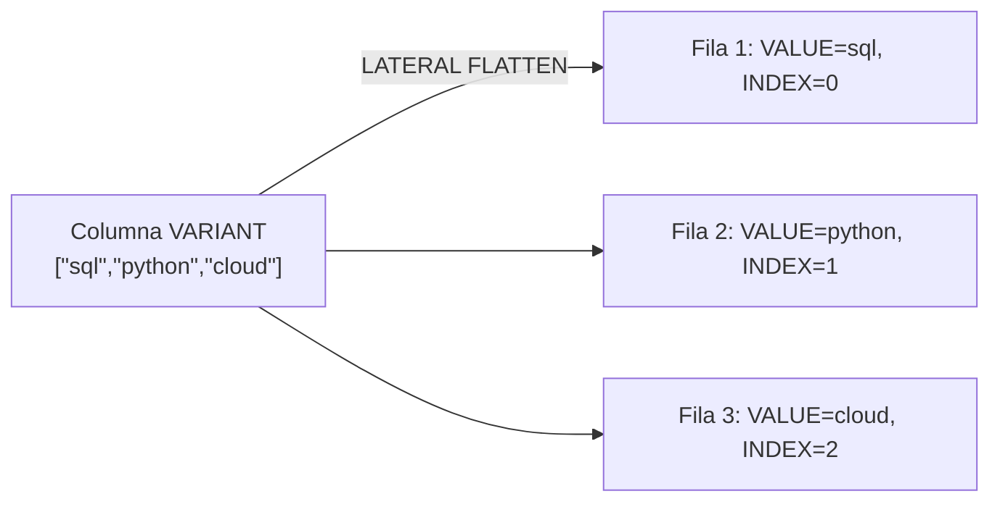
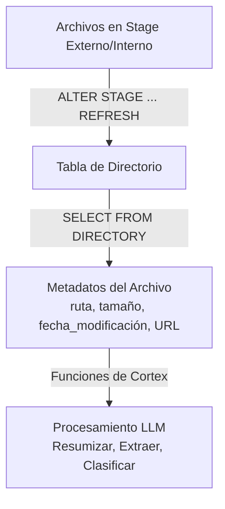
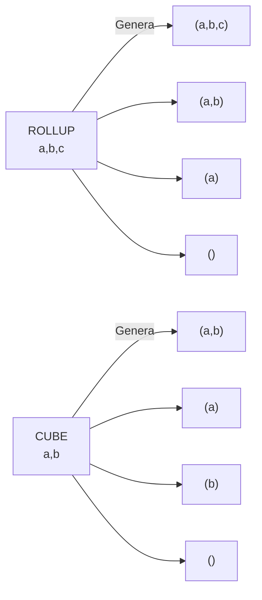
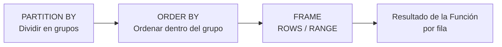
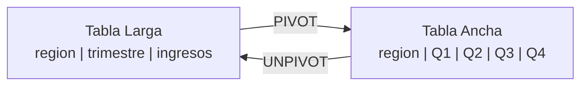
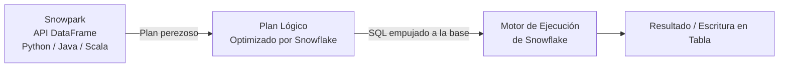
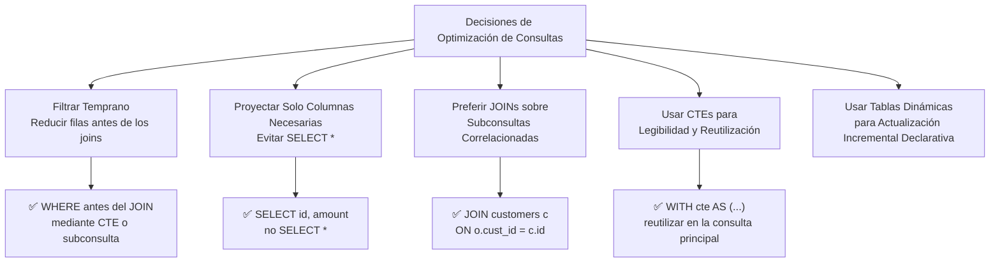

# Dominio 4.4 — Transformación de Datos en Snowflake

> [!NOTE]
> **Dominio de Examen 4.4** — *Transformación de Datos* contribuye al dominio de **Optimización de Rendimiento, Consultas y Transformación**, que representa el **21%** del examen COF-C03.

---

## Panorama de Tipos de Datos



---

## 1. Datos Semi-Estructurados — VARIANT

Snowflake almacena JSON, Avro, ORC, Parquet y XML de forma nativa en una columna **VARIANT**. No se necesita definición de esquema en el momento de la carga.

### Operadores de Navegación

| Operador | Propósito | Ejemplo |
|---|---|---|
| `:` | Navegar por clave | `v:address:city` |
| `[n]` | Índice de arreglo | `v:tags[0]` |
| `::TYPE` | Convertir al tipo SQL | `v:amount::FLOAT` |

```sql
-- Cargar JSON y consultar con notación de dos puntos
CREATE TABLE events (v VARIANT);
COPY INTO events FROM @my_stage/events.json.gz
  FILE_FORMAT = (TYPE = 'JSON');

SELECT
  v:user_id::INTEGER         AS user_id,
  v:event_name::VARCHAR      AS event_name,
  v:properties:page::VARCHAR AS pagina   -- clave anidada
FROM events;
```

> [!WARNING]
> Sin la conversión `::TYPE`, las expresiones devuelven un **VARIANT** — las comparaciones, el ordenamiento y el GROUP BY pueden comportarse de forma inesperada.

### FLATTEN — Explotar Arreglos



```sql
SELECT
  e.v:user_id::INT  AS user_id,
  f.value::VARCHAR  AS etiqueta,
  f.index           AS indice_etiqueta
FROM events e,
     LATERAL FLATTEN(INPUT => e.v:tags) f;
```

Columnas de salida clave de FLATTEN: `VALUE` (valor), `KEY` (clave), `INDEX` (índice), `PATH` (ruta), `THIS`.

```sql
-- FLATTEN recursivo (todos los niveles de profundidad)
SELECT path, value
FROM events,
     LATERAL FLATTEN(INPUT => v, RECURSIVE => TRUE);
```

### Construir Salida VARIANT

```sql
-- Construir un objeto VARIANT a partir de columnas
SELECT OBJECT_CONSTRUCT('id', id, 'name', name) AS json_row
FROM customers;

-- Agregar filas en un arreglo JSON
SELECT ARRAY_AGG(OBJECT_CONSTRUCT('id', id, 'city', city)) AS ciudades
FROM customers GROUP BY country;
```

---

## 2. Datos No Estructurados y Tablas de Directorio



```sql
-- Habilitar tabla de directorio en un stage
CREATE STAGE my_docs
  URL = 's3://bucket/docs/'
  DIRECTORY = (ENABLE = TRUE);

ALTER STAGE my_docs REFRESH;

SELECT RELATIVE_PATH, SIZE, LAST_MODIFIED, FILE_URL
FROM DIRECTORY(@my_docs);
```

---

## 3. Funciones de Agregación

### Agregaciones Estándar

```sql
SELECT
  region,
  COUNT(*)                          AS total_pedidos,
  COUNT(DISTINCT customer_id)       AS clientes_unicos,
  SUM(amount)                       AS ingresos,
  AVG(amount)                       AS pedido_promedio,
  MEDIAN(amount)                    AS monto_mediana,
  APPROX_COUNT_DISTINCT(session_id) AS sesiones_aprox  -- HyperLogLog
FROM orders
GROUP BY region;
```

### GROUPING SETS, ROLLUP y CUBE



```sql
-- ROLLUP: subtotales a lo largo de la jerarquía (de derecha a izquierda)
SELECT region, country, SUM(revenue)
FROM sales
GROUP BY ROLLUP(region, country);

-- CUBE: cada combinación posible
SELECT region, product, SUM(revenue)
FROM sales
GROUP BY CUBE(region, product);

-- GROUPING SETS: combinaciones exactas que tú defines
SELECT region, product, SUM(revenue)
FROM sales
GROUP BY GROUPING SETS ((region), (product), (region, product), ());
```

> [!WARNING]
> `ROLLUP(a, b)` ≠ `ROLLUP(b, a)`. Los subtotales se generan **de derecha a izquierda** en la lista — el orden importa.

---

## 4. Funciones de Ventana (*Window Functions*)

Las funciones de ventana calculan valores **sobre filas relacionadas** sin colapsar los resultados en una sola fila de salida.

### Anatomía de la Cláusula OVER



```sql
nombre_funcion(args)
  OVER (
    [PARTITION BY expresion_particion]
    [ORDER BY expresion_orden]
    [ROWS|RANGE BETWEEN inicio_frame AND fin_frame]
  )
```

### Funciones de Clasificación (*Ranking*)

```sql
SELECT
  product, region, revenue,
  ROW_NUMBER()   OVER (PARTITION BY region ORDER BY revenue DESC) AS num_fila,
  RANK()         OVER (PARTITION BY region ORDER BY revenue DESC) AS rango,
  DENSE_RANK()   OVER (PARTITION BY region ORDER BY revenue DESC) AS rango_denso,
  NTILE(4)       OVER (PARTITION BY region ORDER BY revenue DESC) AS cuartil
FROM sales;
```

| Función | ¿Los empates obtienen el mismo rango? | ¿Hay saltos después de empates? |
|---|---|---|
| `ROW_NUMBER` | No — desempate arbitrario | No |
| `RANK` | **Sí** | **Sí** |
| `DENSE_RANK` | **Sí** | **No** |

### Funciones de Valor / Desplazamiento (*Offset*)

```sql
SELECT
  order_date, amount,
  LAG(amount,  1, 0) OVER (ORDER BY order_date) AS monto_anterior,
  LEAD(amount, 1, 0) OVER (ORDER BY order_date) AS monto_siguiente,
  FIRST_VALUE(amount) OVER (ORDER BY order_date
    ROWS BETWEEN UNBOUNDED PRECEDING AND CURRENT ROW) AS primer_monto,
  LAST_VALUE(amount)  OVER (ORDER BY order_date
    ROWS BETWEEN CURRENT ROW AND UNBOUNDED FOLLOWING) AS ultimo_monto
FROM orders;
```

> [!WARNING]
> El frame predeterminado de `LAST_VALUE` es `RANGE BETWEEN UNBOUNDED PRECEDING AND CURRENT ROW` — devuelve la fila **actual**, no la última. Siempre agrega `ROWS BETWEEN CURRENT ROW AND UNBOUNDED FOLLOWING`.

### Agregaciones Acumulativas (*Running Aggregates*)

```sql
SELECT
  order_date, amount,
  SUM(amount) OVER (ORDER BY order_date
    ROWS BETWEEN UNBOUNDED PRECEDING AND CURRENT ROW) AS total_acumulado,
  AVG(amount) OVER (ORDER BY order_date
    ROWS BETWEEN 6 PRECEDING AND CURRENT ROW)         AS promedio_movil_7dias
FROM orders;
```

---

## 5. PIVOT y UNPIVOT



```sql
-- PIVOT: filas → columnas
SELECT *
FROM (SELECT region, quarter, revenue FROM sales)
PIVOT (SUM(revenue) FOR quarter IN ('Q1','Q2','Q3','Q4'))
AS p (region, q1, q2, q3, q4);

-- UNPIVOT: columnas → filas
SELECT region, quarter, revenue
FROM quarterly_summary
UNPIVOT (revenue FOR quarter IN (q1, q2, q3, q4));
```

---

## 6. CTEs Recursivas (*Recursive CTEs*)

Las **CTEs Recursivas** (*Common Table Expressions* recursivas) permiten iterar sobre relaciones jerárquicas, como organigramas o estructuras de árbol.

```sql
WITH RECURSIVE org AS (
  -- Ancla: empleados de nivel superior (sin gerente)
  SELECT employee_id, manager_id, name, 1 AS profundidad
  FROM employees WHERE manager_id IS NULL
  UNION ALL
  -- Recursivo: cada subordinado
  SELECT e.employee_id, e.manager_id, e.name, o.profundidad + 1
  FROM employees e
  JOIN org o ON e.manager_id = o.employee_id
)
SELECT * FROM org ORDER BY profundidad, name;
```

---

## 7. Transformaciones con Snowpark



```python
from snowflake.snowpark import Session
from snowflake.snowpark.functions import col, sum as sum_, when

session = Session.builder.configs(connection_params).create()

result = (
    session.table("orders")
    .filter(col("status") == "COMPLETED")
    .with_column("banda",
        when(col("amount") < 100, "bajo")
        .when(col("amount") < 500, "medio")
        .otherwise("alto"))
    .group_by("region", "banda")
    .agg(sum_("amount").alias("total"))
    .sort("region", "total")
)

result.write.mode("overwrite").save_as_table("resumen_ingresos")
```

> [!NOTE]
> Snowpark usa **evaluación perezosa** (*lazy evaluation*) — las transformaciones construyen un plan lógico. La ejecución solo ocurre en las llamadas de acción: `.collect()`, `.show()` o una operación de escritura.

---

## 8. Patrones de Optimización de Transformaciones SQL

Comprender cómo escribir SQL de transformación eficiente es un objetivo del examen. El motor columnar de micro-particiones de Snowflake favorece ciertos patrones.



### Filtrar Temprano — Empujar Predicados Hacia Arriba

```sql
-- ❌ Lento: une todas las filas y luego filtra
SELECT a.*, b.city
FROM large_orders a
JOIN customers b ON a.cust_id = b.id
WHERE a.order_date > '2024-01-01';

-- ✅ Mejor: CTE filtra antes del join
WITH recent AS (
    SELECT * FROM large_orders
    WHERE order_date > '2024-01-01'   -- poda micro-particiones temprano
)
SELECT r.*, c.city
FROM recent r
JOIN customers c ON r.cust_id = c.id;
```

### Evitar SELECT \*

```sql
-- ❌ Lee cada columna del disco (penalización columnar)
SELECT * FROM orders;

-- ✅ Lee solo lo que necesitas
SELECT order_id, amount, status FROM orders;
```

### Subconsultas Correlacionadas vs. JOINs

```sql
-- ❌ Subconsulta escalar correlacionada — se re-ejecuta por cada fila
SELECT o.*, (SELECT name FROM customers WHERE id = o.cust_id) AS cname
FROM orders o;

-- ✅ JOIN equivalente — un solo paso
SELECT o.*, c.name AS cname
FROM orders o
JOIN customers c ON o.cust_id = c.id;
```

### Tablas Dinámicas — Actualización Incremental Declarativa

Las Tablas Dinámicas definen un conjunto de resultados de transformación y dejan que Snowflake determine cómo actualizarlo incrementalmente.

```sql
CREATE DYNAMIC TABLE orders_summary
    TARGET_LAG = '10 minutes'          -- obsolescencia aceptable
    WAREHOUSE = wh_pipeline
AS
    SELECT
        region,
        DATE_TRUNC('day', order_date) AS dia_pedido,
        COUNT(*)       AS total_pedidos,
        SUM(amount)    AS monto_total
    FROM raw.orders
    GROUP BY 1, 2;
```

> [!NOTE]
> Las Tablas Dinámicas son **elegibles para cómputo sin servidor** y rastrean automáticamente los cambios aguas arriba. Son el patrón preferido para pipelines ELT declarativos sobre Streams + Tasks mantenidos manualmente.

---

## Resumen

> [!SUCCESS]
> **Puntos Clave para el Examen**
> - `v:clave::TYPE` — notación de dos puntos para navegar claves, `[n]` para índice de arreglo, `::` para convertir VARIANT al tipo SQL.
> - `LATERAL FLATTEN` explota arreglos/objetos en filas; columnas de salida clave: `VALUE`, `KEY`, `INDEX`, `PATH`.
> - `ROLLUP` genera subtotales de derecha a izquierda; `CUBE` genera todas las combinaciones; `GROUPING SETS` define agrupaciones explícitas.
> - `RANK` tiene saltos después de empates; `DENSE_RANK` no; `ROW_NUMBER` siempre es único.
> - El frame predeterminado de `LAST_VALUE` se detiene en la fila actual — siempre agrega `ROWS BETWEEN CURRENT ROW AND UNBOUNDED FOLLOWING`.
> - Snowpark = evaluación perezosa; el cómputo solo se activa en llamadas de acción (`.collect()`, `.show()`, escritura).
> - Las Tablas de Directorio exponen metadatos de archivos de los stages; habilitadas con `DIRECTORY = (ENABLE = TRUE)`.
> - Filtra temprano y proyecta solo las columnas necesarias para maximizar la poda de micro-particiones.
> - Prefiere JOINs sobre subconsultas correlacionadas; usa Tablas Dinámicas para pipelines incrementales declarativos.

---

## Preguntas de Práctica

**1.** JSON: `{"tags":["sql","python","cloud"]}`. ¿Cuál devuelve `"python"`?

- A) `v:tags::VARCHAR`
- B) `v:tags[1]::VARCHAR` ✅
- C) `v:tags[2]::VARCHAR`
- D) `v.tags[1]::VARCHAR`

---

**2.** `LATERAL FLATTEN(INPUT => v:tags)` — ¿qué columna contiene el valor real de la etiqueta?

- A) `KEY`
- B) `INDEX`
- C) `VALUE` ✅
- D) `PATH`

---

**3.** Datos: `(A,100),(A,100),(B,200)` DESC. ¿Qué devuelve `RANK()` para ambas filas `A`?

- A) 2, 3
- B) 2, 2 ✅
- C) 1, 2
- D) 1, 1

---

**4.** `GROUP BY ROLLUP(region, country)` con 3 regiones × 4 países produce ¿cuántas agrupaciones?

- A) 12
- B) 16
- C) 17 ✅ *(12 detalle + 3 subtotales de región + 1 gran total)*
- D) 24

---

**5.** `LAST_VALUE` devuelve la fila actual en lugar de la última fila de una partición. ¿Cuál es la causa?

- A) Falta la cláusula `PARTITION BY`
- B) El frame predeterminado termina en `CURRENT ROW` ✅
- C) `ORDER BY` es descendente
- D) `LAST_VALUE` solo funciona con `RANK()`

---

**6.** Un script Snowpark llama a `.filter().group_by().agg()` pero no se devuelven datos hasta llamar a `.collect()`. Esto describe:

- A) Evaluación ansiosa (*eager evaluation*)
- B) Evaluación perezosa (*lazy evaluation*) ✅
- C) Compilación diferida
- D) Encadenamiento asíncrono

---

**7.** ¿Qué función convierte un arreglo almacenado en una columna VARIANT en filas individuales?

- A) `PARSE_JSON`
- B) `ARRAY_AGG`
- C) `LATERAL FLATTEN` ✅
- D) `OBJECT_CONSTRUCT`

---

**8.** Un desarrollador escribe una consulta que une dos tablas grandes y luego aplica una cláusula WHERE para filtrar por fecha. Un colega reescribe el filtro en una CTE aplicada antes del join. ¿Cuál es el beneficio principal de la reescritura?

- A) La reescritura habilita el uso de la caché de resultados
- B) La reescritura permite a Snowflake podar micro-particiones antes del join, reduciendo los datos escaneados ✅
- C) La reescritura evita costos de Cloud Services
- D) Las CTEs siempre se ejecutan más rápido que las subconsultas independientemente de su posición

---

**9.** ¿Qué funcionalidad de Snowflake te permite definir una transformación como una consulta SQL y configurar un retardo objetivo (*target lag*), con Snowflake manejando automáticamente la actualización incremental?

- A) Streams y Tasks
- B) Snowpipe Streaming
- C) Vistas Materializadas
- D) Tablas Dinámicas ✅
