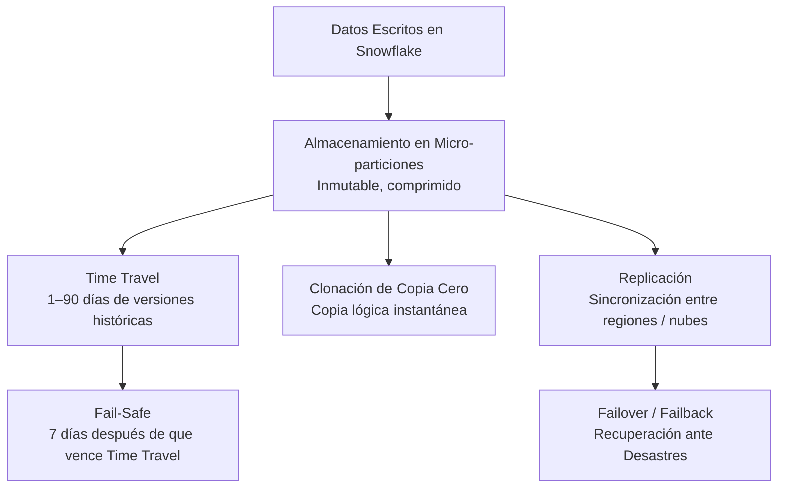
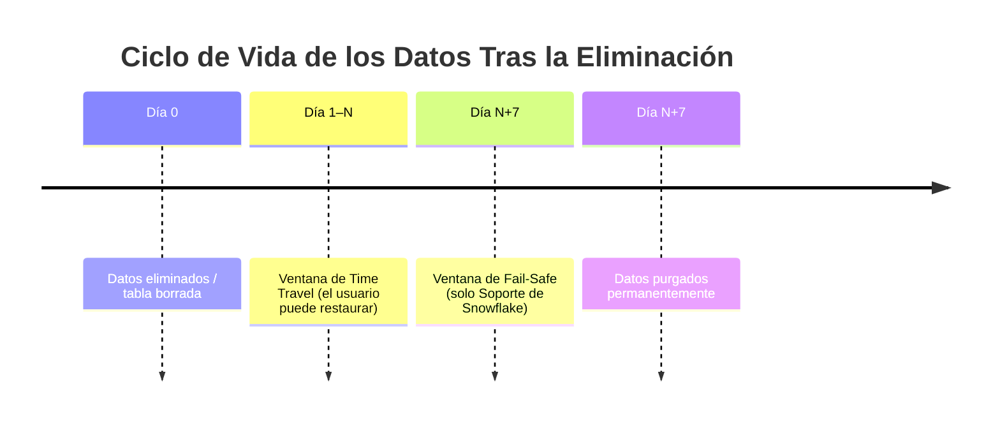
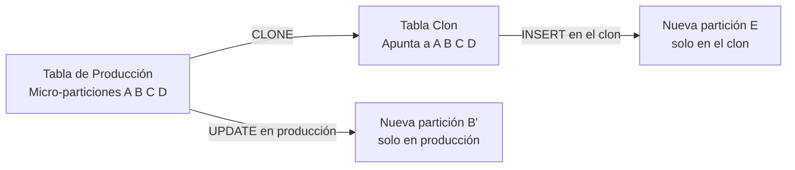
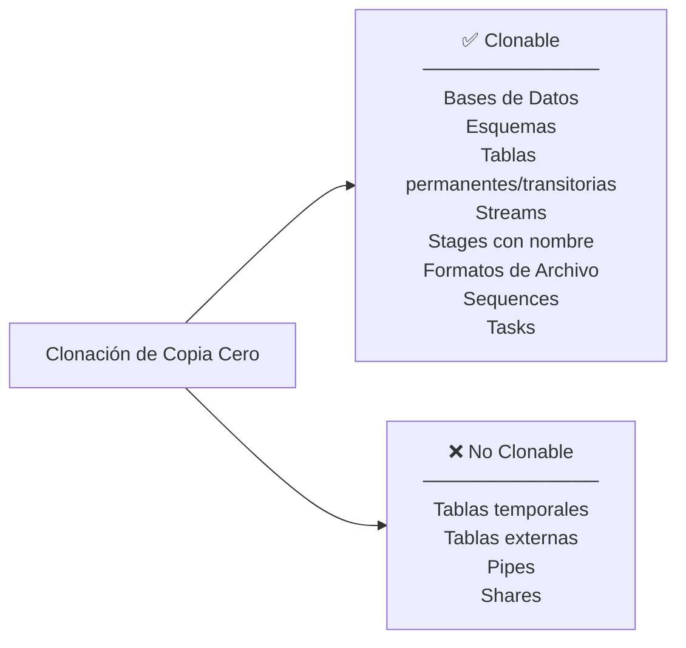
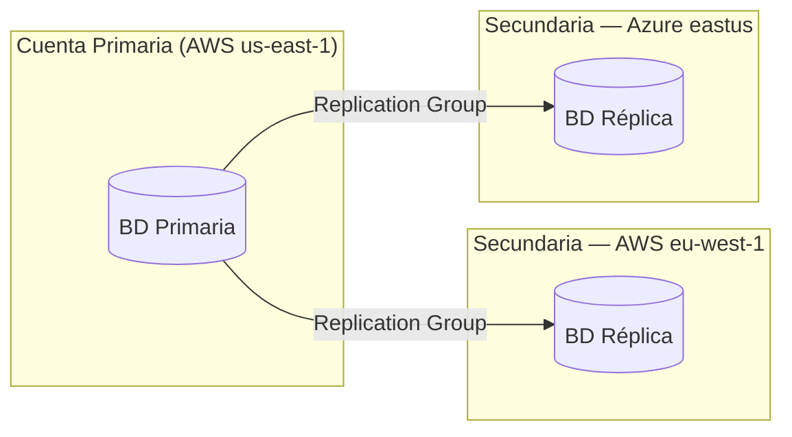
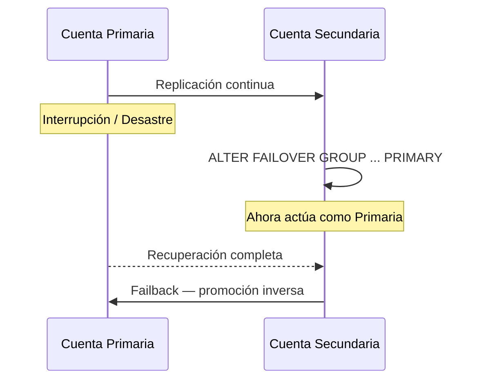
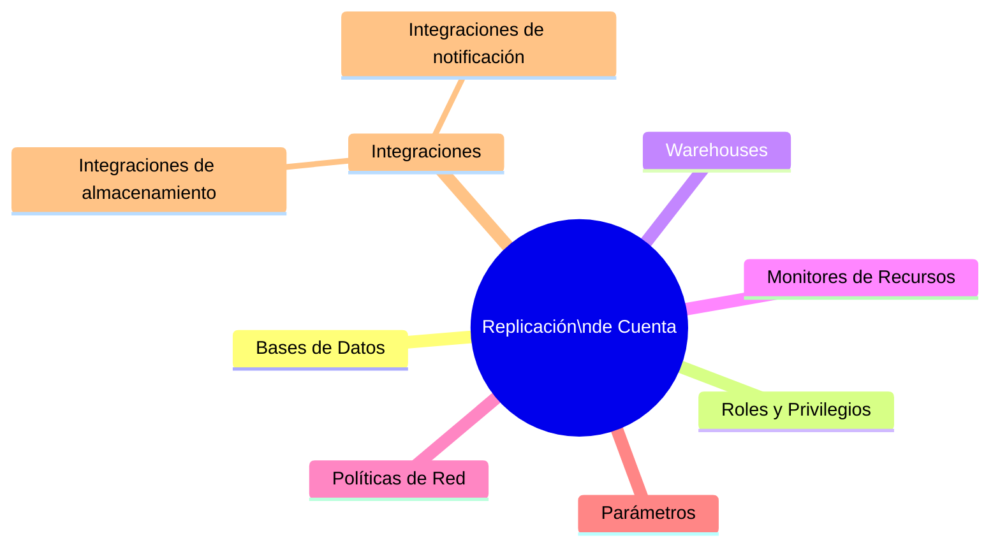

# Dominio 5.1 — Colaboración de Datos, Replicación y Continuidad de Negocio

> [!NOTE]
> **Dominio de Examen 5.1** — *Colaboración de Datos y Protección de Datos* contribuye al dominio de **Colaboración de Datos**, que representa el **10%** del examen COF-C03.

La arquitectura multi-nube de Snowflake permite a las organizaciones replicar datos y objetos de cuenta entre regiones y proveedores de nube, soportar la recuperación ante desastres con conmutación por error y recuperación (*failover/failback*), y compartir instantáneas de Time Travel — todo sin movimiento manual de datos.

---

## Panorama General: Capas de Protección de Datos



---

## 1. Time Travel (Contexto de Colaboración)

Time Travel te permite consultar, clonar o restaurar datos **tal como existían en un punto del tiempo pasado** — útil tanto para recuperación de errores como para compartir instantáneas históricas con consumidores.

```sql
-- Consultar datos de hace 2 horas
SELECT * FROM orders AT (OFFSET => -7200);

-- Consultar en un timestamp específico
SELECT * FROM orders AT (TIMESTAMP => '2024-06-01 09:00:00'::TIMESTAMP);

-- Consultar por ID de sentencia (antes de que un DML específico se ejecutara)
SELECT * FROM orders BEFORE (STATEMENT => '<query_id>');

-- Clonar a partir de un momento específico (compartir instantánea histórica)
CREATE TABLE orders_snapshot CLONE orders
  AT (TIMESTAMP => '2024-06-01 00:00:00'::TIMESTAMP);
```

### Retención de Time Travel por Edición

| Edición | Retención Máxima | Predeterminada |
|---|---|---|
| Standard | **1 día** | 1 día |
| Enterprise+ | **90 días** | 1 día |

```sql
-- Cambiar la retención para una tabla
ALTER TABLE orders SET DATA_RETENTION_TIME_IN_DAYS = 30;

-- Deshabilitar Time Travel
ALTER TABLE orders SET DATA_RETENTION_TIME_IN_DAYS = 0;
```

> [!WARNING]
> Las tablas con `DATA_RETENTION_TIME_IN_DAYS = 0` **no tienen Time Travel**. Fail-Safe sigue aplicando durante 7 días, pero solo es accesible por el Soporte de Snowflake.

---

## 2. Fail-Safe (Recuperación de Emergencia)



| Propiedad | Valor |
|---|---|
| Duración | **7 días** — siempre, no configurable |
| Accesible por | **Solo el Soporte de Snowflake** |
| Aplica a | Tablas permanentes |
| NO aplica a | Tablas transitorias, tablas temporales |
| ¿Se cobra almacenamiento? | **Sí** — a tarifas estándar de almacenamiento |

> [!WARNING]
> **Las tablas Transitorias y Temporales NO tienen Fail-Safe.** Esto es una compensación deliberada entre costo y riesgo: úsalas solo para datos efímeros donde la recuperación no es necesaria.

---

## 3. Clonación de Copia Cero (*Zero-Copy Cloning*)

La clonación crea una **copia lógica instantánea** de una base de datos, esquema o tabla — sin duplicar datos físicos en el momento de la creación. El clon y la fuente comparten las mismas micro-particiones subyacentes hasta que cualquiera de los dos modifique datos.



```sql
-- Clonar una tabla
CREATE TABLE orders_dev CLONE orders;

-- Clonar un esquema
CREATE SCHEMA dev_schema CLONE prod_schema;

-- Clonar una base de datos
CREATE DATABASE dev_db CLONE prod_db;

-- Clonar en un punto histórico (instantánea para colaboración)
CREATE TABLE orders_q1_snapshot CLONE orders
  AT (TIMESTAMP => '2024-03-31 23:59:59'::TIMESTAMP);
```

### ¿Qué Puede Clonarse?



Hechos clave:
- La clonación es **instantánea** independientemente del tamaño de los datos.
- No se cobra almacenamiento adicional hasta que el clon diverja.
- Los clones **heredan** el historial de Time Travel de la fuente hasta el punto de clonación.
- La clonación respeta los **privilegios** — el que clona necesita `CREATE` en el destino y `SELECT` en la fuente.

---

## 4. Replicación

La replicación sincroniza **bases de datos u objetos de cuenta** desde una cuenta **primaria** a una o más cuentas **secundarias** (réplicas) entre regiones o proveedores de nube.

### Arquitectura de Replicación



### Replication Groups vs. Failover Groups

| Funcionalidad | Replication Group | Failover Group |
|---|---|---|
| Propósito | Réplicas de solo lectura | Recuperación ante desastres (con capacidad de failover) |
| ¿La secundaria es escribible? | No | Sí — después del failover |
| ¿Soporta failover/failback? | **No** | **Sí** |
| ¿Incluye objetos de cuenta? | Opcional | Sí |

```sql
-- Crear un Replication Group en la cuenta primaria
CREATE REPLICATION GROUP my_rg
  OBJECT_TYPES = DATABASES, ROLES, WAREHOUSES
  ALLOWED_DATABASES = prod_db
  ALLOWED_ACCOUNTS = myorg.secondary_account;

-- Actualizar la réplica (en la cuenta secundaria)
ALTER REPLICATION GROUP my_rg REFRESH;
```

### Costo de la Replicación

- El almacenamiento de las réplicas se cobra a tarifas estándar.
- Se aplican **tarifas de transferencia de datos** para replicación entre regiones/nubes.
- Las operaciones de actualización consumen **créditos de cómputo**.

---

## 5. Failover y Failback (Conmutación por Error y Recuperación)

Los Failover Groups habilitan la **promoción automática o manual** de una cuenta secundaria a primaria — proporcionando continuidad de negocio.



```sql
-- En la cuenta PRIMARIA: crear un Failover Group
CREATE FAILOVER GROUP my_fg
  OBJECT_TYPES = DATABASES, ROLES, WAREHOUSES, RESOURCE MONITORS
  ALLOWED_DATABASES = prod_db
  ALLOWED_ACCOUNTS = myorg.dr_account
  REPLICATION SCHEDULE = '10 MINUTE';

-- En la cuenta SECUNDARIA: promover a primaria (failover)
ALTER FAILOVER GROUP my_fg PRIMARY;

-- Failback: promover la primaria original de vuelta
ALTER FAILOVER GROUP my_fg PRIMARY;  -- ejecutar en la cuenta primaria original
```

> [!NOTE]
> Los Failover Groups soportan una `REPLICATION SCHEDULE` — Snowflake actualiza automáticamente la secundaria en el intervalo definido (mínimo 1 minuto).

---

## 6. Replicación de Cuenta (Objetos de Cuenta)

Más allá de las bases de datos, Snowflake puede replicar **objetos a nivel de cuenta**:



Esto asegura que después del failover, la cuenta secundaria tenga los mismos roles, warehouses y políticas — no solo los datos.

---

## Resumen

> [!SUCCESS]
> **Puntos Clave para el Examen**
> - **Time Travel**: Standard = máximo 1 día, Enterprise+ = máximo 90 días. Configurable por tabla con `DATA_RETENTION_TIME_IN_DAYS`.
> - **Fail-Safe**: Siempre 7 días, no configurable, solo el Soporte de Snowflake. Tablas transitorias/temporales = SIN Fail-Safe.
> - **Clonación de Copia Cero**: Instantánea, sin costo de almacenamiento hasta la divergencia, hereda el historial de Time Travel.
> - **Replication Group**: Réplicas de solo lectura; **Failover Group**: recuperación ante desastres, la secundaria puede convertirse en primaria.
> - La replicación incurre en costos de almacenamiento + transferencia + cómputo.
> - Los Failover Groups soportan actualización automática programada.

---

## Preguntas de Práctica

**1.** Una cuenta de edición Standard elimina una tabla con retención predeterminada. ¿Durante cuántos días puede un usuario restaurarla vía Time Travel?

- A) 0
- B) **1** ✅
- C) 7
- D) 90

---

**2.** Después de que vence el Time Travel en una tabla eliminada, ¿qué protección adicional existe?

- A) Respaldo del Replication Group
- B) Fail-Safe de Snowflake por 7 días ✅
- C) Respaldo automático de Clonación de Copia Cero
- D) Sin protección adicional

---

**3.** Un desarrollador clona una tabla de producción de 500 GB. ¿Cuánto almacenamiento adicional se cobra en el momento de la creación del clon?

- A) 500 GB inmediatamente
- B) 250 GB (deduplicación del 50%)
- C) **0 GB — no se cobra almacenamiento hasta que el clon diverja** ✅
- D) Depende del período de retención

---

**4.** ¿Qué tipo de objeto soporta el **failover** (promoción de la secundaria a primaria)?

- A) Replication Group — incorrecto, este es el Failover Group
- B) **Failover Group** ✅
- C) External Replication Policy
- D) Clone Group

---

**5.** Se elimina una tabla transitoria. ¿Qué opciones de recuperación existen?

- A) Solo Time Travel
- B) Time Travel y Fail-Safe
- C) **Solo Time Travel — las tablas transitorias no tienen Fail-Safe** ✅
- D) Ni Time Travel ni Fail-Safe

---

**6.** ¿Cuál afirmación sobre la replicación entre nubes es VERDADERA?

- A) Es gratuita — Snowflake no cobra tarifas de transferencia
- B) Requiere que ambas cuentas usen el mismo proveedor de nube
- C) **Se aplican tarifas de transferencia de datos para replicación entre regiones y entre nubes** ✅
- D) Las cuentas secundarias pueden escribirse sin failover

---

**7.** Un Failover Group está configurado con `REPLICATION SCHEDULE = '10 MINUTE'`. ¿Qué significa esto?

- A) La actualización manual debe activarse cada 10 minutos
- B) **Snowflake actualiza automáticamente la secundaria cada 10 minutos** ✅
- C) El failover ocurre automáticamente después de 10 minutos de inactividad de la primaria
- D) La replicación se agrupa en ventanas de 10 minutos sin sincronización intermedia
