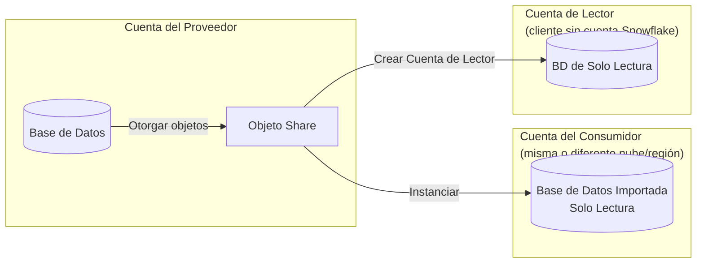
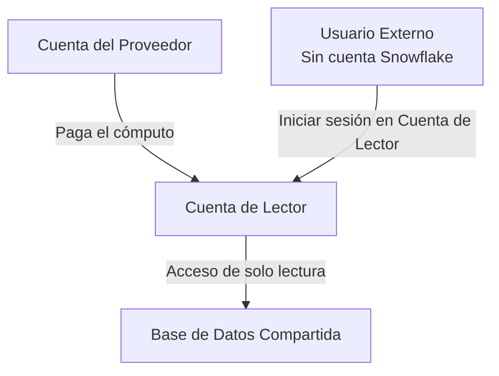
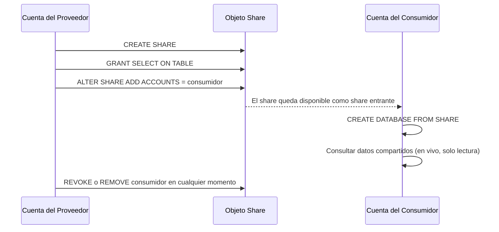
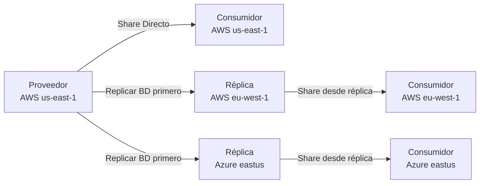
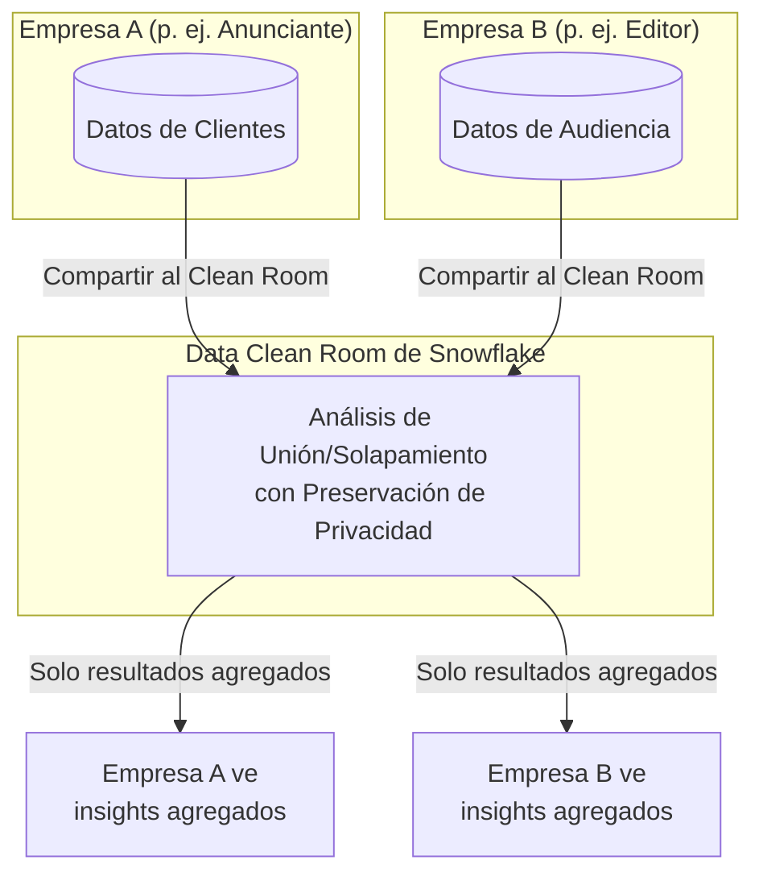
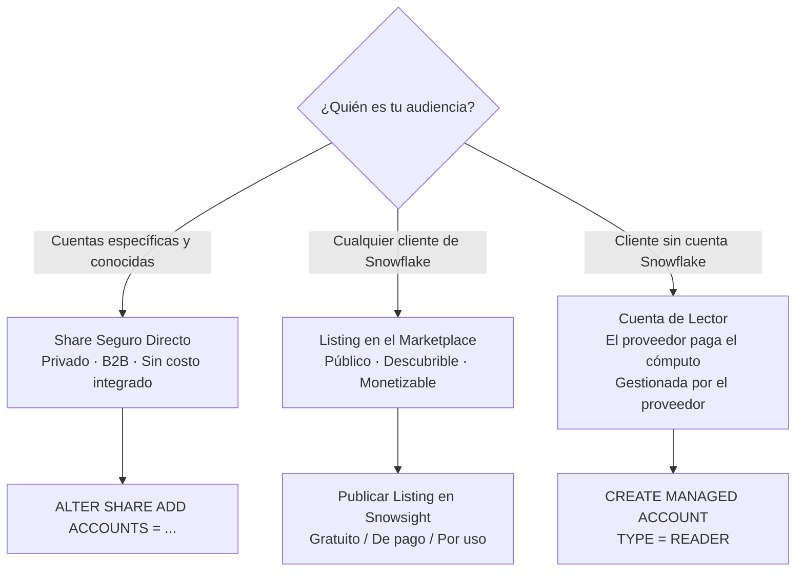

# Dominio 5.2 — Intercambio Seguro de Datos y Data Clean Rooms

> [!NOTE]
> **Dominio de Examen 5.2** — *Intercambio Seguro de Datos* contribuye al dominio de **Colaboración de Datos**, que representa el **10%** del examen COF-C03.

---

## Resumen: Cómo Funciona el Intercambio de Datos

El Intercambio Seguro de Datos de Snowflake permite a un **proveedor** compartir datos **en vivo y de solo lectura** con un **consumidor** — sin copiar datos, sin necesidad de ETL.



Características clave:
- **Copia cero de datos** — el consumidor lee directamente desde el almacenamiento del proveedor.
- **Siempre en vivo** — los consumidores ven inserciones/actualizaciones en tiempo real.
- **Solo lectura** — los consumidores no pueden modificar los datos compartidos.
- El intercambio **entre nubes/entre regiones** requiere replicación (cubierto en la Lección 17).

---

## 1. Shares Seguros (*Secure Shares*)

### Crear y Gestionar un Share

```sql
-- Crear un share
CREATE SHARE sales_share;

-- Otorgar uso en la base de datos y el esquema
GRANT USAGE ON DATABASE prod_db TO SHARE sales_share;
GRANT USAGE ON SCHEMA prod_db.public TO SHARE sales_share;

-- Otorgar acceso a objetos específicos
GRANT SELECT ON TABLE prod_db.public.orders TO SHARE sales_share;
GRANT SELECT ON VIEW  prod_db.public.orders_summary TO SHARE sales_share;

-- Agregar una cuenta consumidora
ALTER SHARE sales_share ADD ACCOUNTS = org1.consumer_account;

-- Eliminar un consumidor
ALTER SHARE sales_share REMOVE ACCOUNTS = org1.consumer_account;

-- Ver los shares actuales
SHOW SHARES;
```

### Consumidor: Montar un Share

```sql
-- El consumidor crea una base de datos local a partir del share entrante
CREATE DATABASE shared_sales
  FROM SHARE provider_org.sales_share;

-- Consultar como cualquier otra tabla (solo lectura)
SELECT * FROM shared_sales.public.orders;
```

### ¿Qué Puede Compartirse?

| Objeto | ¿Compartible? |
|---|---|
| Tablas | ✅ |
| Tablas externas | ✅ |
| Vistas seguras | ✅ |
| Vistas materializadas seguras | ✅ |
| UDFs (seguras) | ✅ |
| Vistas regulares (no seguras) | ❌ |
| Stages, pipes, streams | ❌ |

> [!WARNING]
> Solo las **vistas SEGURAS** y las funciones seguras pueden agregarse a un share. Una vista regular expone la definición de la consulta subyacente, lo que representa un riesgo de privacidad para los proveedores.

---

## 2. Vistas Seguras (*Secure Views*)

Una **Vista Segura** oculta la definición de la vista al consumidor. Sin la palabra clave `SECURE`, un consumidor podría inferir el modelo de datos del proveedor.

```sql
-- Vista regular — la definición es visible para los consumidores
CREATE VIEW orders_summary AS
  SELECT region, SUM(amount) FROM orders GROUP BY region;

-- Vista segura — la definición está oculta
CREATE SECURE VIEW orders_summary AS
  SELECT region, SUM(amount) FROM orders GROUP BY region;
```

> [!NOTE]
> Las vistas seguras deshabilitan ciertos atajos del optimizador de consultas. Esto puede hacerlas **ligeramente más lentas** que las vistas regulares equivalentes. Usa `SECURE` solo cuando la vista vaya a compartirse o cuando la privacidad de la definición sea necesaria.

---

## 3. Cuentas de Lector (*Reader Accounts*)

Una **Cuenta de Lector** permite a los proveedores compartir datos con **clientes que no tienen una cuenta de Snowflake**. El proveedor crea y gestiona la cuenta de lector.



```sql
-- Crear una cuenta de lector (cuenta administrada)
CREATE MANAGED ACCOUNT my_reader_account
  ADMIN_NAME = 'reader_admin'
  ADMIN_PASSWORD = 'SecurePass123!'
  TYPE = READER;

-- Agregar la cuenta de lector a un share
ALTER SHARE sales_share ADD ACCOUNTS = my_reader_account;
```

Hechos clave sobre las cuentas de lector:
- El **proveedor paga** todos los costos de cómputo de la cuenta de lector.
- Las cuentas de lector son **completamente gestionadas** por el proveedor.
- Solo pueden acceder a datos del **proveedor que las creó**.
- Las cuentas de lector no pueden crear sus propios shares.

---

## 4. Roles de Intercambio de Datos y el Modelo Proveedor/Consumidor



---

## 5. Intercambio Entre Nubes y Entre Regiones

El intercambio directo funciona entre cuentas en la **misma nube + región** sin configuración adicional. El intercambio entre nubes o entre regiones requiere un paso de **replicación**.



---

## 6. Data Clean Rooms (Salas de Datos Limpios)

Un **Data Clean Room** es un entorno que preserva la privacidad donde dos o más partes pueden realizar análisis conjuntos sobre **conjuntos de datos combinados** sin que ninguna parte vea los datos crudos de la otra.

### Cómo Funcionan los Clean Rooms de Snowflake



Garantías clave de privacidad:
- Ninguna parte puede ver los registros **individuales** de la otra.
- Los analistas reciben solo resultados **agregados o estadísticos**.
- Las políticas de acceso por fila y los controles de privacidad diferencial limitan la precisión de los resultados.
- Construido sobre el estándar de Snowflake de **RBAC + Row Access Policies**.

### Casos de Uso

| Industria | Caso de Uso |
|---|---|
| Publicidad | Análisis de solapamiento de audiencias entre anunciante y editor |
| Servicios financieros | Detección de fraude entre instituciones |
| Salud | Investigación multi-hospital sin exponer registros de pacientes |
| Retail | Colaboración de datos con socios de la cadena de suministro |

> [!NOTE]
> La capacidad nativa de Clean Room de Snowflake está construida sobre el **Native App Framework** (Marco de Aplicaciones Nativas) y el intercambio seguro. En el examen, recuerda que los clean rooms aplican la privacidad mediante **umbrales de agregación** y **vistas seguras**, no mediante cifrado de las entradas de las consultas.

---

## 7. Publicar en el Marketplace vs. Share Directo



| | Share Seguro (Directo) | Listing en el Marketplace |
|---|---|---|
| Audiencia | Cuentas específicas conocidas | Cualquier cliente de Snowflake |
| Descubrimiento | Privado | Público (o listing privado) |
| Aprobación | Automática | El proveedor puede requerir aprobación |
| Monetización | No integrada | Vía integración de facturación de Snowflake |
| Caso de uso | Asociaciones B2B | Productos de datos, conjuntos de datos SaaS |

---

## Resumen

> [!SUCCESS]
> **Puntos Clave para el Examen**
> - El intercambio es **de copia cero y en vivo** — sin ETL, sin movimiento de datos.
> - Los consumidores obtienen acceso **de solo lectura**; no pueden escribir en los objetos compartidos.
> - Solo las **vistas SEGURAS** y las UDFs seguras pueden agregarse a shares.
> - **Cuentas de Lector**: para consumidores sin Snowflake; el proveedor paga el cómputo.
> - El intercambio entre nubes/entre regiones requiere **replicación** primero.
> - Los **Data Clean Rooms** habilitan el análisis conjunto sin exponer registros crudos — los resultados son solo agregados.

---

## Preguntas de Práctica

**1.** Un proveedor agrega una vista regular (no segura) a un share. ¿Qué sucede?

- A) Tiene éxito — todas las vistas pueden compartirse
- B) **Falla — solo las vistas SEGURAS pueden agregarse a shares** ✅
- C) La vista se convierte automáticamente en una vista segura
- D) Los consumidores ven los datos pero no la definición

---

**2.** Un consumidor monta el share de un proveedor. 10 minutos después el proveedor inserta nuevas filas. ¿Cuándo ve el consumidor las nuevas filas?

- A) Después de la próxima actualización programada (diaria)
- B) Después de que el consumidor vuelva a ejecutar `CREATE DATABASE FROM SHARE`
- C) **Inmediatamente — el intercambio es en vivo y de copia cero** ✅
- D) Después de que el proveedor ejecute ALTER SHARE REFRESH

---

**3.** ¿Qué tipo de cuenta permite a un proveedor compartir datos con un cliente que no tiene cuenta de Snowflake?

- A) Cuenta secundaria
- B) Cuenta administrada
- C) **Cuenta de lector** ✅
- D) Cuenta Business Critical

---

**4.** ¿Quién paga los costos de cómputo en una Cuenta de Lector?

- A) El lector/consumidor
- B) Snowflake automáticamente
- C) **El proveedor** ✅
- D) Dividido 50/50 entre proveedor y consumidor

---

**5.** El proveedor está en AWS us-east-1. El consumidor está en Azure eastus. ¿Puede el proveedor compartir directamente?

- A) Sí — el intercambio funciona entre todas las nubes de forma nativa
- B) **No — el intercambio entre nubes requiere la replicación de la base de datos primero** ✅
- C) No — el intercambio entre nubes no está soportado en absoluto
- D) Sí, pero solo para proveedores de edición Enterprise

---

**6.** En un Data Clean Room, ¿por qué ninguna de las partes puede ver los datos crudos de la otra?

- A) Los datos están cifrados con diferentes claves
- B) Los resultados son enrutados a través de un intermediario de terceros
- C) **Los umbrales de agregación y las vistas seguras restringen la salida a resultados agregados** ✅
- D) Las filas individuales se hashean antes de compartirse

---

**7.** ¿Qué tipos de objetos de Snowflake pueden incluirse en un share? (Selecciona todos los que apliquen)

- A) Tablas ✅
- B) Vistas seguras ✅
- C) Stages
- D) Tablas externas ✅
- E) Streams
