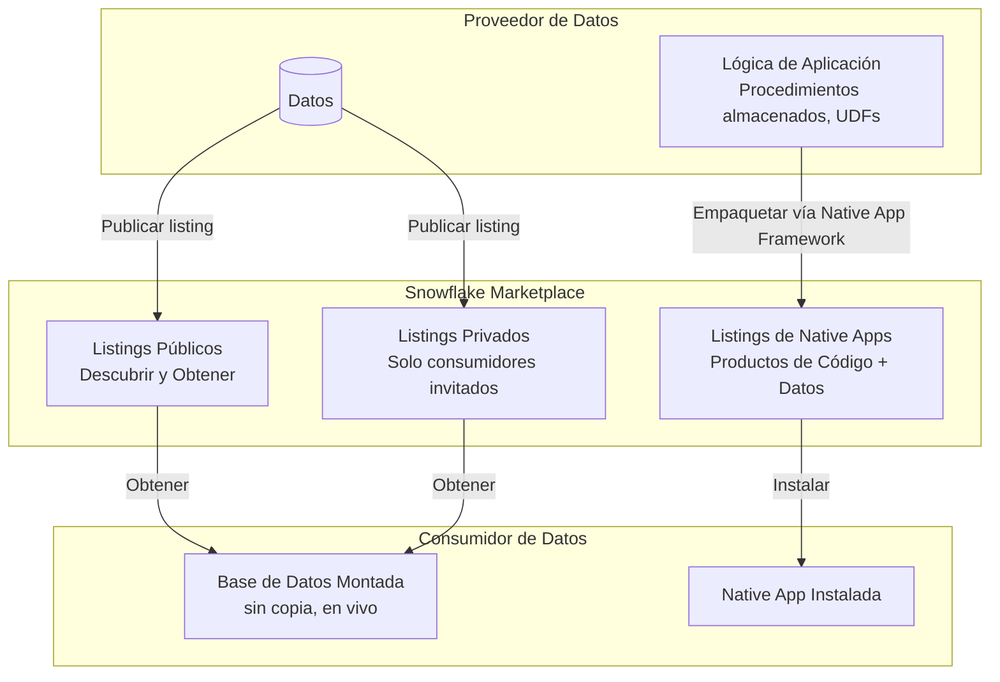
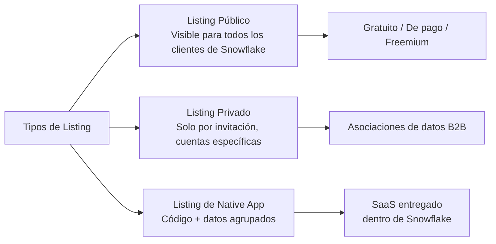
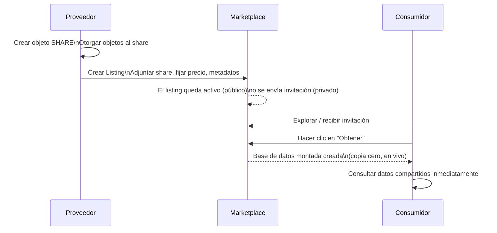
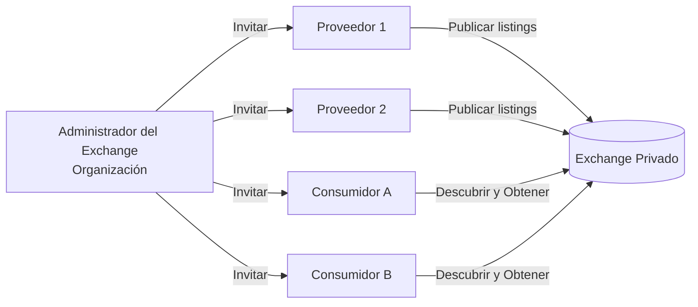
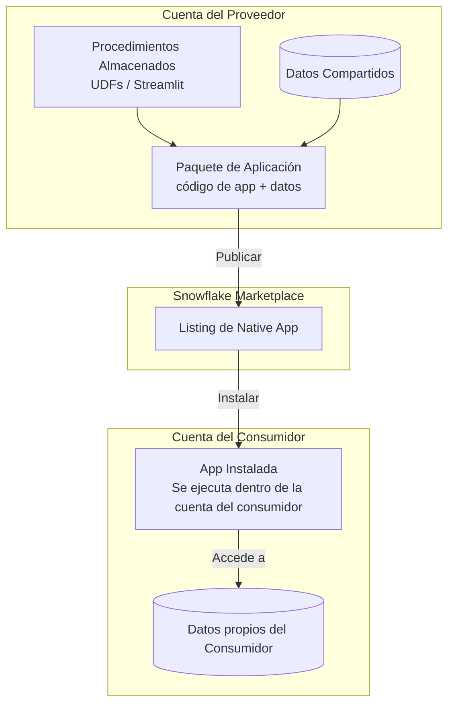
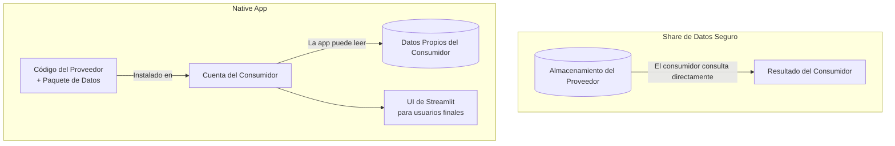
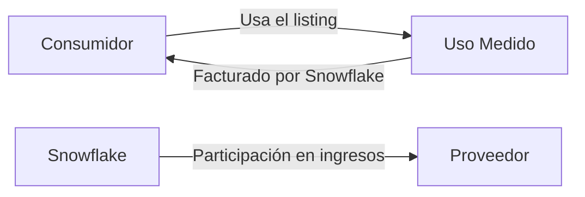

# Dominio 5.3 — Snowflake Marketplace y Native Apps

> [!NOTE]
> **Dominio de Examen 5.3** — *Snowflake Marketplace e Intercambio de Datos* contribuye al dominio de **Colaboración de Datos**, que representa el **10%** del examen COF-C03.

---

## El Ecosistema de Colaboración de Datos



---

## 1. ¿Qué es el Snowflake Marketplace?

El **Snowflake Marketplace** es un catálogo global de productos de datos en vivo y listos para consultar, accesibles directamente dentro de Snowflake. Los consumidores pueden descubrir, probar y adjuntar conjuntos de datos sin ningún ETL — los datos viven en la cuenta del proveedor y se sirven vía Intercambio Seguro de Datos.

### Características Clave

| Propiedad | Detalle |
|---|---|
| Movimiento de datos | **Cero** — sin copia, sin pipeline |
| Frescura | **En vivo** — siempre los datos más recientes del proveedor |
| Incorporación | Segundos — "Obtener" → base de datos montada instantáneamente |
| Datos de prueba | Los proveedores pueden ofrecer conjuntos de datos de muestra gratuitos |
| Listings de pago | Facturados a través de Snowflake; el proveedor fija el precio |

---

## 2. Tipos de Listings



### Listings Públicos

Abiertos a cualquier cliente de Snowflake. Los consumidores buscan en el Marketplace, hacen clic en **Obtener** y reciben una base de datos importada — no se requiere paso de aprobación para listings gratuitos.

### Listings Privados

Dirigidos a cuentas de consumidores específicas. El proveedor envía una invitación; el consumidor reclama el listing. Ideales para:
- Asociaciones de datos B2B
- Distribución de datos propietarios a una audiencia controlada
- Programas beta

```sql
-- Proveedor: crear un listing privado (hecho vía la UI de Snowsight o SQL)
-- Verificar listings existentes
SHOW LISTINGS;
```

### Datos Freemium/de Prueba

Los proveedores pueden adjuntar un **conjunto de datos de muestra** a cualquier listing. Los consumidores prueban la muestra de forma gratuita y luego actualizan al conjunto de datos completo de pago.

---

## 3. Publicar un Listing (Flujo de Trabajo del Proveedor)



Requisitos para proveedores:
- Deben estar en edición **Business Critical** para productos de datos con conformidad HIPAA.
- El proveedor y el consumidor deben estar en la **misma nube/región** para el intercambio directo, o la replicación debe estar configurada para acceso entre regiones.
- Metadatos del listing: título, descripción, consultas de ejemplo, documentación, diccionario de datos.

---

## 4. Consumir un Listing (Flujo de Trabajo del Consumidor)

```sql
-- Después de hacer clic en "Obtener" en la UI del Marketplace en Snowsight,
-- se crea automáticamente una base de datos. También puedes referenciarla inmediatamente:

USE DATABASE my_marketplace_data;

SHOW TABLES;

-- Consultar — sin costo de warehouse para el proveedor, el consumidor paga su propio cómputo
SELECT * FROM my_marketplace_data.public.weather_observations
WHERE date >= CURRENT_DATE - 7;
```

> [!NOTE]
> El **consumidor paga el cómputo** (créditos del Virtual Warehouse) para consultar datos del marketplace. El **proveedor paga el almacenamiento** de los datos subyacentes. No hay cargos de regalías por consulta a nivel de infraestructura — el licenciamiento/precio se gestiona a nivel del listing.

---

## 5. Data Exchange (Intercambio de Datos Privado)

Un **Data Exchange** es un **marketplace privado solo por invitación** que una organización configura para un grupo definido de proveedores y consumidores — por ejemplo, un consorcio de socios de la industria.



| | Marketplace | Data Exchange |
|---|---|---|
| Abierto a | Todos los clientes de Snowflake | Solo miembros invitados |
| Gestionado por | Snowflake | Organización del cliente |
| Caso de uso | Productos de datos públicos | Consorcio de la industria, organización interna |

---

## 6. Native App Framework (Marco de Aplicaciones Nativas)

El **Snowflake Native App Framework** permite a los proveedores agrupar **lógica de aplicación** (procedimientos almacenados, UDFs, UI de Streamlit) junto con datos en una única aplicación instalable — entregada vía el Marketplace.

### Arquitectura



### Propiedades Clave

| Propiedad | Detalle |
|---|---|
| Se ejecuta en | **La cuenta del consumidor** — el código del proveedor se ejecuta allí |
| Acceso a datos | La app puede acceder a los datos del consumidor (con permiso) |
| Visibilidad del proveedor | El proveedor **no puede** ver los datos del consumidor |
| Versionado | El proveedor publica actualizaciones; el consumidor actualiza |
| UI | Puede incluir una interfaz de **Streamlit** |

```sql
-- Proveedor: crear un paquete de aplicación
CREATE APPLICATION PACKAGE my_app_pkg;

-- Agregar una versión desde un stage con el manifiesto de la app
ALTER APPLICATION PACKAGE my_app_pkg
  ADD VERSION v1_0 USING @my_app_stage;

-- Lanzar la versión
ALTER APPLICATION PACKAGE my_app_pkg
  SET DEFAULT RELEASE DIRECTIVE VERSION = v1_0 PATCH = 0;

-- Consumidor: instalar la app
CREATE APPLICATION my_installed_app
  FROM APPLICATION PACKAGE provider_org.my_app_pkg
  USING VERSION v1_0;
```

### Native App vs. Intercambio de Datos Tradicional



| | Share de Datos Seguro | Native App |
|---|---|---|
| Qué se entrega | Solo datos | Datos + código + UI |
| ¿Se ejecuta en la cuenta del consumidor? | No — el consumidor consulta el almacenamiento del proveedor | **Sí** |
| Acceso a datos del consumidor | Ninguno | La app puede solicitar acceso |
| UI de Streamlit | No | **Sí** |
| Versionado | No aplica | **Sí** |

---

## 7. Monetización y Facturación



- **Listings gratuitos**: sin cargo para el consumidor.
- **Listings de pago**: el consumidor es facturado a través de Snowflake; el proveedor recibe una participación en los ingresos.
- **Basado en uso**: algunos listings cobran por consulta o por fila accedida.
- Los proveedores fijan los precios; Snowflake gestiona la facturación y la infraestructura de pago.

---

## Resumen

> [!SUCCESS]
> **Puntos Clave para el Examen**
> - Los listings del Marketplace son **de copia cero y en vivo** — mismo mecanismo de intercambio que el Intercambio Seguro de Datos.
> - **Listings públicos**: abiertos a todos; **Listings privados**: solo por invitación; **Listings de Native App**: código + datos.
> - **Data Exchange**: marketplace privado gestionado por una organización para un grupo controlado.
> - **Native Apps**: el proveedor agrupa código + datos en una app instalable que se ejecuta en la **cuenta del consumidor**.
> - El consumidor paga el **cómputo**; el proveedor paga el **almacenamiento**.
> - El acceso al marketplace entre regiones/nubes requiere replicación.

---

## Preguntas de Práctica

**1.** Un consumidor hace clic en "Obtener" en un listing gratuito del Marketplace. ¿Qué sucede con los datos?

- A) Se transfiere una copia completa a la cuenta del consumidor
- B) Se configura un pipeline ETL nocturno
- C) **Se monta una base de datos de solo lectura — no se copian datos** ✅
- D) El consumidor descarga una exportación CSV

---

**2.** ¿Qué tipo de listing es visible solo para cuentas de Snowflake específicas que han sido explícitamente invitadas?

- A) Listing público
- B) **Listing privado** ✅
- C) Listing freemium
- D) Listing de Native App

---

**3.** Una organización quiere crear un hub de datos privado para 20 socios de la industria — no abierto a todos los clientes de Snowflake. ¿Qué funcionalidad deben usar?

- A) Snowflake Marketplace
- B) **Data Exchange** ✅
- C) Replication Group
- D) Private Share

---

**4.** Una Native App es instalada por un consumidor. ¿Dónde se ejecuta el código de la aplicación?

- A) En la cuenta del proveedor
- B) En el entorno de hosting neutral de Snowflake
- C) **En la cuenta del consumidor** ✅
- D) En un entorno de cómputo externo

---

**5.** ¿Qué capacidad tiene el Native App Framework que el Intercambio Seguro de Datos estándar NO soporta?

- A) Copia cero de datos
- B) Acceso a datos en vivo
- C) **UI basada en Streamlit incluida en el producto entregado** ✅
- D) Acceso a datos entre cuentas

---

**6.** ¿Quién paga el costo de cómputo cuando un consumidor consulta datos de un listing del Marketplace?

- A) El proveedor
- B) Snowflake lo subsidia
- C) **El consumidor** ✅
- D) Dividido equitativamente entre proveedor y consumidor

---

**7.** Un proveedor quiere compartir un conjunto de datos con clientes de pago a través del Snowflake Marketplace. ¿Qué modelo de facturación está disponible?

- A) Snowflake no soporta listings de pago
- B) Solo suscripciones anuales de tarifa plana
- C) **Precios gratuitos, de tarifa plana o basados en uso — facturados a través de Snowflake** ✅
- D) Los proveedores deben gestionar la facturación fuera de Snowflake
