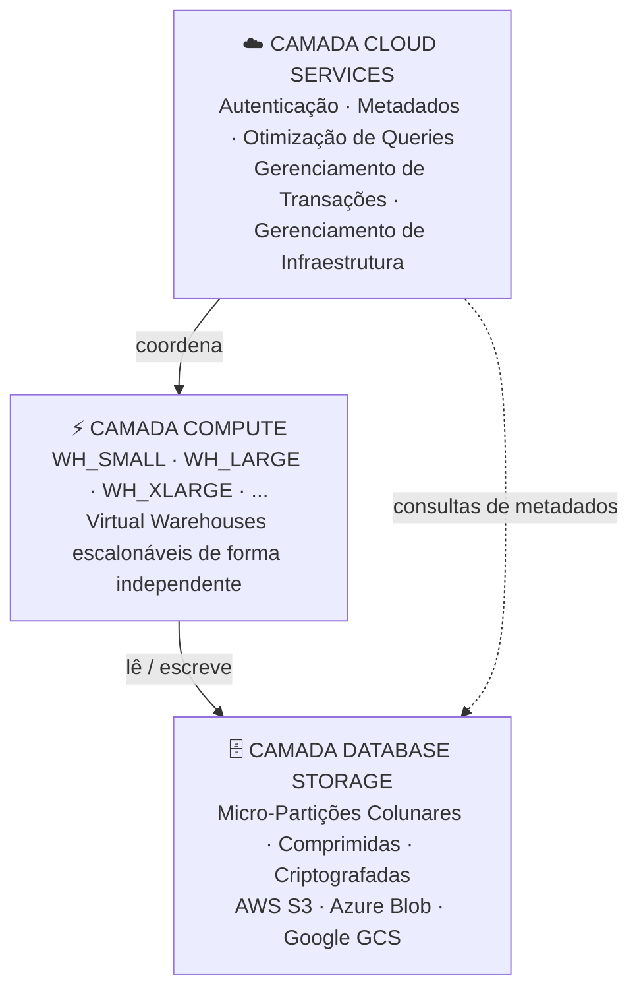

# Domínio 1.1 — Arquitetura do Snowflake

## Peso no Exame

**Domínio 1.0 — Recursos de Arquitetura do Snowflake AI Data Cloud** representa **~31%** do exame SnowPro Core COF-C03 — o maior domínio individual.

> [!NOTE]
> Esta lição corresponde ao **Objetivo de Exame 1.1**: *Descrever e utilizar a arquitetura do Snowflake*, incluindo a camada Cloud Services, a camada Compute, a camada Database Storage e a comparação entre as edições do Snowflake.

---

## O que é o Snowflake?

O Snowflake é uma **plataforma de dados nativa em nuvem, totalmente gerenciada**, entregue como Software como Serviço (SaaS — *Software-as-a-Service*). Foi construído do zero para a nuvem — não portado de um produto local (*on-premises*).

Principais diferenças em relação aos data warehouses tradicionais:

| Característica | Warehouse Tradicional | Snowflake |
|---|---|---|
| Implantação | Local / IaaS | SaaS puro |
| Escalabilidade | Requer indisponibilidade | Em segundos, sem paradas |
| Computação e Armazenamento | Fortemente acoplados | Totalmente separados |
| Manutenção | Gerenciada pelo cliente | Gerenciada pelo Snowflake |
| Provedores de nuvem | Único | AWS, Azure, GCP |
| Atualizações | Janelas de manutenção planejadas | Automáticas e transparentes |

---

## A Arquitetura de Três Camadas

A arquitetura do Snowflake é composta por três camadas escalonáveis de forma independente. Entender cada camada — e os limites entre elas — é essencial para o exame.



---

### Camada 1 — Database Storage (Armazenamento)

É onde **todos os dados residem permanentemente**. Características principais:

- Os dados são armazenados no formato proprietário de **micro-partições colunares** do Snowflake — comprimidas e otimizadas automaticamente. Os clientes não têm acesso direto aos arquivos subjacentes.
- O armazenamento é construído sobre o blob storage do provedor de nuvem: **Amazon S3** (AWS), **Azure Blob Storage** (Azure) ou **Google Cloud Storage** (GCP).
- **A cobrança é separada da computação**: você paga pelo armazenamento mesmo quando nenhum warehouse está em execução.
- O Snowflake gerencia criptografia, redundância e durabilidade automaticamente.
- Os dados são reorganizados em micro-partições (50–500 MB comprimidos) com metadados ricos por partição (valores mín./máx., contagem distinta, contagem de NULLs) para habilitar o **partition pruning** (poda de partições) durante as queries.

**O que a camada de armazenamento contém:**
- Dados de tabelas (micro-partições)
- Versões históricas do Time Travel
- Cópias do Fail-Safe
- Dados de Stage (para stages internos)
- Cache de resultados de queries

---

### Camada 2 — Compute Layer (Virtual Warehouses)

A camada de computação consiste em **Virtual Warehouses (VWs)** — clusters de recursos de computação nomeados que executam queries SQL e operações DML.

Características principais:

- Cada Virtual Warehouse é um cluster de computação **MPP (Massively Parallel Processing — Processamento Massivamente Paralelo)** composto por um ou mais nós.
- **Múltiplos warehouses podem ler do mesmo armazenamento simultaneamente** — sem contenção de recursos entre eles.
- Warehouses podem ser **suspensos** (interrompendo a cobrança instantaneamente) e **retomados** (em segundos).
- O tamanho é expresso em tamanhos de camiseta: **X-Small, Small, Medium, Large, X-Large, 2X-Large, 3X-Large, 4X-Large, 5X-Large, 6X-Large**.
- Cada aumento de tamanho **dobra** os recursos de computação (e os créditos por hora).

**Consumo de créditos por tamanho de warehouse (Standard):**

| Tamanho | Créditos/Hora |
|---|---|
| X-Small | 1 |
| Small | 2 |
| Medium | 4 |
| Large | 8 |
| X-Large | 16 |
| 2X-Large | 32 |
| 3X-Large | 64 |
| 4X-Large | 128 |
| 5X-Large | 256 |
| 6X-Large | 512 |

> [!WARNING]
> Warehouses do tipo Snowpark-Optimized consomem **mais créditos** do que warehouses Standard do mesmo tamanho. Não confunda os dois tipos no exame.

**O que a camada compute faz:**
- Executa queries SQL (SELECT, DML)
- Carrega dados (COPY INTO)
- Executa código Snowpark
- Realiza transformações

**O que a camada compute NÃO faz:**
- Armazenar dados permanentemente
- Executar operações da Cloud Services (que são gratuitas até 10% dos créditos de computação)

---

### Camada 3 — Cloud Services Layer

Esta é o **cérebro do Snowflake** — uma coleção de serviços que coordenam toda a atividade na plataforma. Funciona em infraestrutura gerenciada pelo Snowflake e está **sempre disponível**, mesmo quando nenhum virtual warehouse está em execução.

**Responsabilidades da Cloud Services:**

| Serviço | Descrição |
|---|---|
| **Autenticação** | Valida a identidade do usuário (senhas, MFA, OAuth, par de chaves) |
| **Gerenciamento de Infraestrutura** | Provisiona, monitora e repara recursos de computação |
| **Gerenciamento de Metadados** | Rastreia definições de tabelas, estatísticas, metadados de partições |
| **Parsing e Otimização de Queries** | Analisa SQL, gera e otimiza planos de execução |
| **Controle de Acesso** | Aplica políticas RBAC e DAC |
| **Gerenciamento de Transações** | Garante conformidade ACID em operações concorrentes |

**Nota de cobrança**: O uso da Cloud Services é **gratuito até 10% dos créditos de computação diários consumidos**. O uso além desse limite é cobrado separadamente. Este é um detalhe importante para o exame.

```sql
-- A Cloud Services é utilizada de forma transparente — por exemplo, ao executar:
SHOW TABLES IN DATABASE MY_DB;
-- Isso usa a Cloud Services (consulta de metadados) sem necessidade de warehouse
```

---

## Separação de Armazenamento e Computação — Por que Isso Importa

Esta é a **característica arquiteturalmente mais significativa** do Snowflake e aparece frequentemente no exame.

**Benefícios da separação:**

1. **Escalabilidade independente** — escale a computação para cima/baixo sem tocar no armazenamento
2. **Otimização de custos** — suspenda a computação quando ociosa; o armazenamento continua sendo cobrado a taxas baixas
3. **Isolamento de workload** — várias equipes executam seus próprios warehouses sobre dados compartilhados
4. **Sem contenção** — uma query analítica grande no WH_ANALYTICS não afeta a ingestão no WH_INGEST

```sql
-- Engenharia ingere dados em seu warehouse
USE WAREHOUSE WH_INGEST;
COPY INTO raw.events FROM @my_stage;

-- Enquanto isso, BI consulta os mesmos dados em seu próprio warehouse
USE WAREHOUSE WH_BI;
SELECT date_trunc('hour', event_time), count(*)
FROM raw.events
GROUP BY 1;
-- Sem filas entre essas equipes!
```

---

## Edições do Snowflake

A **edição** determina quais recursos estão disponíveis e o SLA fornecido. Você precisa conhecê-las para o exame.

| Recurso | Standard | Enterprise | Business Critical | Virtual Private Snowflake (VPS) |
|---|---|---|---|---|
| **Time Travel (máx.)** | 1 dia | 90 dias | 90 dias | 90 dias |
| **Multi-cluster Warehouses** | ❌ | ✅ | ✅ | ✅ |
| **Segurança em nível de coluna (Masking)** | ❌ | ✅ | ✅ | ✅ |
| **Row Access Policies** | ❌ | ✅ | ✅ | ✅ |
| **Search Optimization** | ❌ | ✅ | ✅ | ✅ |
| **Conformidade HIPAA** | ❌ | ❌ | ✅ | ✅ |
| **Conformidade PCI DSS** | ❌ | ❌ | ✅ | ✅ |
| **Tri-Secret Secure (CMK)** | ❌ | ❌ | ✅ | ✅ |
| **AWS PrivateLink / Azure PE** | ❌ | ❌ | ✅ | ✅ |
| **Implantação Privada** | ❌ | ❌ | ❌ | ✅ |
| **SLA** | 99,5% | 99,9% | 99,95% | 99,99% |

> [!WARNING]
> O exame frequentemente testa **os requisitos de edição**. Lembre-se: Multi-cluster Warehouses, Column Masking e Row Access Policies exigem **Enterprise ou superior**.

---

## Provedor de Nuvem e Considerações de Região

As contas do Snowflake são implantadas em uma combinação específica de **nuvem + região**. Isso é definido na criação da conta e não pode ser alterado.

| Nuvem | Regiões de Exemplo |
|---|---|
| AWS | us-east-1, us-west-2, eu-west-1, ap-southeast-1 |
| Azure | eastus2, westeurope, australiaeast |
| GCP | us-central1, europe-west4, asia-northeast1 |

**Pontos-chave para o exame:**
- Uma única conta Snowflake existe em **uma nuvem e uma região**
- Os dados podem ser **replicados** entre regiões e nuvens usando Database Replication
- O **Cross-Cloud Business Continuity (CCBC)** permite failover para um provedor de nuvem diferente
- **Conectividade privada** (AWS PrivateLink, Azure Private Endpoints) está disponível no Business Critical e superior

---

## Terminologia-Chave para o Exame

| Termo | Definição |
|---|---|
| **Virtual Warehouse (VW)** | Cluster de computação MPP nomeado que executa queries |
| **Micro-partição** | Unidade fundamental de armazenamento: 50–500 MB comprimidos, colunar |
| **Cloud Services Layer** | Camada de inteligência: autenticação, otimização, metadados, controle de acesso |
| **SaaS** | Software como Serviço — o Snowflake gerencia toda a infraestrutura |
| **MPP** | Processamento Massivamente Paralelo — queries distribuídas entre nós |
| **Separação de Armazenamento e Computação** | Armazenamento e computação escalonam de forma independente, cobrados separadamente |
| **Crédito** | Unidade de consumo de computação do Snowflake |

---

## Questões de Prática

**Q1.** Qual camada do Snowflake é responsável pela otimização de queries e pela aplicação do controle de acesso?

- A) Camada Database Storage
- B) Camada Compute
- C) Camada Cloud Services ✅
- D) Camada Virtual Warehouse

**Q2.** Uma empresa quer garantir que suas queries de relatórios de BI nunca concorram com seus pipelines de ETL. Qual recurso arquitetural do Snowflake possibilita isso?

- A) Micro-partições
- B) Separação de armazenamento e computação ✅
- C) A camada Cloud Services
- D) Time Travel

**Q3.** Em qual edição do Snowflake os Multi-cluster Virtual Warehouses ficam disponíveis pela primeira vez?

- A) Standard
- B) Enterprise ✅
- C) Business Critical
- D) Virtual Private Snowflake

**Q4.** O uso da Cloud Services é cobrado somente quando excede qual percentual dos créditos de computação diários?

- A) 5%
- B) 10% ✅
- C) 15%
- D) 20%

**Q5.** Um warehouse do Snowflake fica suspenso por 4 horas. Quais custos continuam acumulando durante essa suspensão?

- A) Apenas custos de computação
- B) Custos de computação e armazenamento
- C) Apenas custos de armazenamento ✅
- D) Nenhum custo é acumulado

**Q6.** Qual edição do Snowflake é necessária para conformidade com HIPAA?

- A) Standard
- B) Enterprise
- C) Business Critical ✅
- D) Virtual Private Snowflake

**Q7.** O Snowflake armazena dados em qual formato subjacente?

- A) Arquivos planos orientados a linhas
- B) Arquivos Parquet diretamente legíveis pelos clientes
- C) Micro-partições colunares comprimidas ✅
- D) Documentos JSON

---

> [!SUCCESS]
> **Pontos-Chave para o Dia do Exame:**
> 1. Três camadas: **Cloud Services → Compute (VW) → Storage** — cada uma independente e cobrada separadamente
> 2. Cloud Services = cérebro (autenticação, otimização, metadados) — gratuito até **10%** dos créditos de computação
> 3. **O armazenamento nunca para de ser cobrado** — mesmo quando os warehouses estão suspensos
> 4. Multi-cluster WH, Column Masking, Row Access Policies → **Enterprise+**
> 5. HIPAA / Tri-Secret Secure → **Business Critical+**
> 6. VPS = maior isolamento, SLA de 99,99%, implantação privada
