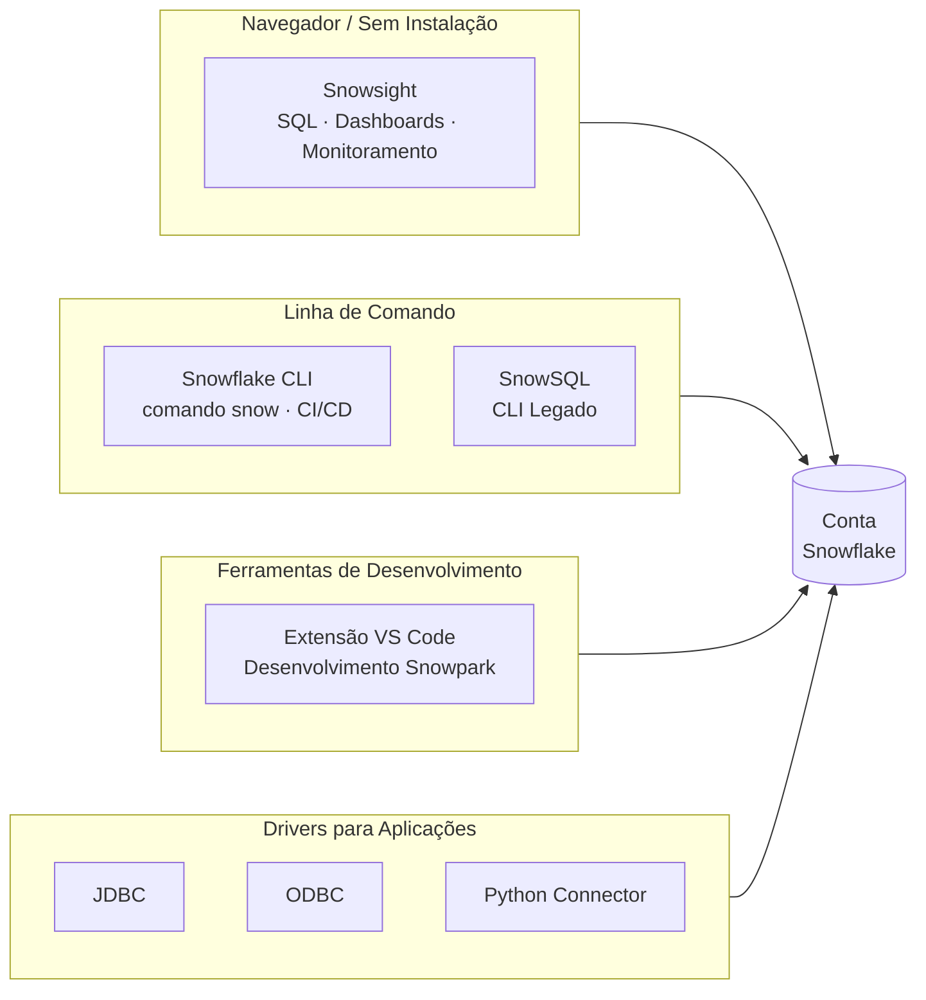

# Domínio 1.2 — Interfaces e Ferramentas do Snowflake

## Peso no Exame

O **Domínio 1.0** representa **~31%** do exame. Este subdomínio cobre as ferramentas e interfaces usadas para interagir com o Snowflake.

> [!NOTE]
> Esta lição corresponde ao **Objetivo de Exame 1.2**: *Utilizar interfaces e ferramentas do Snowflake*, incluindo Snowsight, Snowflake CLI e integrações com IDEs.

---

## Visão Geral das Interfaces do Snowflake

O Snowflake pode ser acessado por múltiplas interfaces dependendo do caso de uso — análise interativa, scripting, automação ou fluxos de trabalho de desenvolvimento.



| Interface | Melhor Para | Requer Instalação |
|---|---|---|
| **Snowsight** | Queries interativas, dashboards, monitoramento | Não (baseado em navegador) |
| **Snowflake CLI** | Scripting, CI/CD, automação | Sim |
| **SnowSQL** | CLI legado | Sim |
| **Extensão VS Code** | Fluxos de desenvolvimento, Snowpark | Sim |
| **Drivers (JDBC, ODBC, Python)** | Integração com aplicações | Sim |

---

## Snowsight — A Interface Web

O **Snowsight** é a interface moderna do Snowflake baseada em navegador para desenvolvimento SQL e análise de dados. Substituiu o antigo "Classic Console" e é agora a principal interface web.

### Principais Recursos do Snowsight

**Worksheets (Planilhas de Trabalho)**
- Escreva e execute SQL com realce de sintaxe e autocompletar
- Execução de múltiplas instruções — execute instruções individuais ou scripts completos
- Resultados de queries exibidos como tabelas, com estatísticas de colunas integradas
- Compartilhe worksheets com colegas de equipe

**Dashboards**
- Crie dashboards visuais a partir dos resultados de queries — gráficos, scorecards, tabelas
- Programe atualização automática dos dados do dashboard
- Não é necessária uma ferramenta de BI externa para visualizações básicas

**Histórico e Monitoramento de Queries**
- Visualize todas as queries executadas na conta (com a role adequada)
- Filtre por usuário, warehouse, intervalo de tempo, status
- Acesse o Query Profile (plano de execução) de qualquer query concluída
- Identifique gargalos de desempenho: spilling (derramamento), pruning (poda), queuing (fila)

**Data Explorer (Explorador de Dados)**
- Navegue por bancos de dados, schemas, tabelas, views e stages
- Visualize dados de tabelas e estatísticas de colunas
- Gerencie propriedades e tags de objetos

**Notebooks (Pré-visualização)**
- Notebooks integrados no estilo Jupyter dentro do Snowsight
- Suporte a células SQL, Python (via Snowpark) e Markdown
- Execute código sobre dados do Snowflake sem sair do navegador

**Seção Admin (Administração)**
- Gerencie usuários, roles e warehouses
- Monitore o uso de créditos e atribuição de custos
- Configure Resource Monitors e alertas
- Visualize dados do ACCOUNT_USAGE graficamente

```sql
-- Exemplo: o Snowsight pode executar scripts com múltiplas instruções
-- Você pode executar o bloco completo ou destacar instruções individuais

CREATE OR REPLACE TABLE customers (
    id NUMBER,
    name STRING,
    region STRING
);

INSERT INTO customers VALUES (1, 'Acme Corp', 'US-EAST');
INSERT INTO customers VALUES (2, 'GlobeCo', 'EU-WEST');

SELECT region, count(*) FROM customers GROUP BY 1;
```

---

## Snowflake CLI

O **Snowflake CLI** (`snow`) é a interface de linha de comando moderna para o Snowflake. Ele substitui o antigo cliente **SnowSQL** para a maioria dos casos de uso.

### Instalação

```bash
# Instale via pip
pip install snowflake-cli-labs

# Verifique a instalação
snow --version
```

### Configuração

As conexões do CLI são gerenciadas em um arquivo `config.toml`:

```toml
[connections.minha_conexao]
account = "minha_conta.us-east-1"
user = "meu_usuario"
authenticator = "externalbrowser"
warehouse = "WH_DEV"
database = "MEU_BD"
schema = "PUBLIC"
```

### Comandos Comuns do CLI

```bash
# Conectar e executar uma query SQL
snow sql -q "SELECT CURRENT_VERSION()" --connection minha_conexao

# Executar um arquivo SQL
snow sql -f ./migrations/001_criar_tabelas.sql

# Gerenciar aplicações Snowpark
snow app deploy
snow app run

# Gerenciar Native Apps
snow app bundle

# Recursos Cortex e AI
snow cortex complete "Resuma este documento" --file doc.txt

# Gerenciamento de Stage
snow stage list @MEU_STAGE
snow stage copy ./arquivo_local.csv @MEU_STAGE/
```

> [!NOTE]
> O Snowflake CLI está em desenvolvimento ativo e é a interface recomendada para **fluxos de trabalho DevOps e CI/CD**. Ele suporta nativamente o desenvolvimento de Native Apps, implantações Snowpark e fluxos de trabalho integrados ao Git.

---

## SnowSQL — CLI Legado

O **SnowSQL** é o cliente de linha de comando original para o Snowflake. Embora ainda seja suportado e amplamente utilizado, o novo Snowflake CLI é preferido para novos projetos.

```bash
# Conectar via SnowSQL
snowsql -a <identificador_da_conta> -u <nome_do_usuario>

# Executar query inline
snowsql -a minhaconta -u meuusuario -q "SELECT CURRENT_DATE()"

# Executar um arquivo
snowsql -a minhaconta -u meuusuario -f script.sql

# SnowSQL com autenticação por par de chaves
snowsql -a minhaconta -u meuusuario --private-key-path rsa_key.p8
```

---

## Integrações com IDEs

### Extensão do Visual Studio Code

A **Extensão Snowflake para VS Code** oferece uma experiência de desenvolvimento rica diretamente no VS Code:

**Recursos:**
- Conecte-se a uma ou mais contas Snowflake
- Navegue pelos objetos do Snowflake (bancos de dados, schemas, tabelas) na barra lateral
- Execute queries SQL e visualize os resultados inline
- Desenvolvimento **Snowpark** — escreva código Python/Java/Scala com autocompletar ciente do contexto do Snowflake
- Depure e execute funções Snowpark localmente antes de implantar

**Instalação:**
```
VS Code → Extensões → Pesquise "Snowflake" → Instalar
```

### Jupyter Notebooks com Snowpark

O Snowflake se integra ao Jupyter via Snowflake Python Connector e Snowpark:

```python
# Conectar ao Snowflake a partir de um notebook Jupyter
from snowflake.snowpark import Session

parametros_conexao = {
    "account": "minhaconta",
    "user": "meuusuario",
    "password": "minhasenha",
    "role": "SYSADMIN",
    "warehouse": "WH_DEV",
    "database": "MEU_BD",
    "schema": "PUBLIC"
}

session = Session.builder.configs(parametros_conexao).create()

# Usar a API DataFrame do Snowpark
df = session.table("customers")
df.filter(df["region"] == "US-EAST").show()
```

### dbt (data build tool — ferramenta de transformação de dados)

O dbt se integra ao Snowflake via adaptador `dbt-snowflake`, possibilitando pipelines de transformação baseados em SQL:

```yaml
# profiles.yml
meu_projeto:
  target: dev
  outputs:
    dev:
      type: snowflake
      account: minhaconta
      user: meuusuario
      role: TRANSFORMER
      warehouse: WH_TRANSFORM
      database: ANALYTICS
      schema: DBT_DEV
```

---

## Escolhendo a Interface Correta

| Caso de Uso | Interface Recomendada |
|---|---|
| Análise SQL exploratória | Worksheets do Snowsight |
| Construção de dashboards | Dashboards do Snowsight |
| Monitoramento de desempenho de queries | Histórico de Queries do Snowsight |
| Automação de pipelines CI/CD | Snowflake CLI |
| Implantação de app Snowpark | Snowflake CLI |
| Desenvolvimento interativo em Python | Notebooks do Snowsight ou Jupyter |
| Conectividade com aplicações | JDBC / ODBC / Python Connector |
| Execução de scripts legados | SnowSQL |
| Desenvolvimento baseado em VS Code | Extensão VS Code |

---

## Drivers e Conectores do Snowflake (Visão Geral)

Para acesso programático, o Snowflake fornece drivers e conectores oficiais:

| Driver / Conector | Linguagem / Plataforma |
|---|---|
| **Python Connector** | Python |
| **Snowpark Python** | Python (API DataFrame) |
| **Snowpark Java** | Java |
| **Snowpark Scala** | Scala |
| **Driver JDBC** | Aplicações Java, ferramentas de BI |
| **Driver ODBC** | Ferramentas de BI, Excel, Tableau, etc. |
| **Driver Node.js** | JavaScript/Node.js |
| **Driver .NET** | C# / .NET |
| **Driver Go** | Go |
| **Driver PHP PDO** | PHP |

---

## Questões de Prática

**Q1.** Qual interface do Snowflake é baseada em navegador e não requer instalação local?

- A) SnowSQL
- B) Snowflake CLI
- C) Snowsight ✅
- D) Extensão VS Code

**Q2.** Um engenheiro de dados precisa automatizar implantações do Snowflake em um pipeline CI/CD. Qual interface é mais adequada?

- A) Worksheets do Snowsight
- B) Snowflake CLI ✅
- C) Dashboards do Snowsight
- D) Driver ODBC

**Q3.** Qual recurso do Snowsight permite diagnosticar gargalos de queries, como derramamento de dados (data spilling) ou poda ineficiente (inefficient pruning)?

- A) Data Explorer
- B) Dashboards
- C) Query Profile ✅
- D) Notebooks

**Q4.** Um desenvolvedor Python quer escrever código Snowpark com autocompletar de objetos do Snowflake diretamente em seu editor. Qual ferramenta habilita isso?

- A) SnowSQL
- B) Snowflake CLI
- C) Extensão VS Code ✅
- D) Worksheets do Snowsight

**Q5.** Qual formato é usado para configurar conexões para o Snowflake CLI?

- A) Arquivos `.env`
- B) `config.toml` ✅
- C) `snowflake.json`
- D) `profiles.yml`

---

> [!SUCCESS]
> **Pontos-Chave para o Dia do Exame:**
> 1. **Snowsight** = principal interface web — worksheets, dashboards, histórico de queries, notebooks
> 2. **Snowflake CLI** (`snow`) = CLI moderno — ideal para CI/CD, implantação Snowpark
> 3. **SnowSQL** = CLI legado — ainda válido, execução baseada em arquivo
> 4. **Extensão VS Code** = integração com IDE para desenvolvimento com suporte a Snowpark
> 5. **Query Profile** no Snowsight = ferramenta principal para diagnosticar problemas de desempenho de queries
