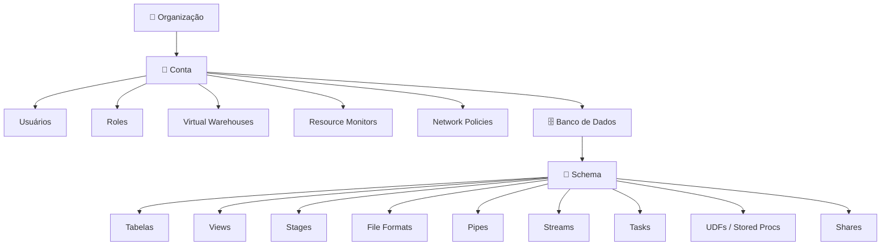

# Domínio 1.3 — Hierarquia e Tipos de Objetos do Snowflake

## Peso no Exame

O **Domínio 1.0** representa **~31%** do exame. A hierarquia e os tipos de objetos são conceitos fundamentais testados em todos os domínios.

> [!NOTE]
> Esta lição corresponde ao **Objetivo de Exame 1.3**: *Diferenciar a hierarquia e os tipos de objetos do Snowflake*, incluindo objetos de organização/conta, objetos de banco de dados e variáveis de sessão/contexto.

---

## A Hierarquia de Objetos do Snowflake

O Snowflake organiza todos os recursos em um **modelo hierárquico de contêineres** estrito:



---

## Organização

Uma **Organização** é a entidade de nível mais alto do Snowflake — ela agrupa múltiplas contas Snowflake sob um único guarda-chuva:

- Habilita **recursos entre contas**: replicação, publicação no Snowflake Marketplace, relatórios de uso
- Gerenciada pela role de sistema `ORGADMIN`
- Uma organização tem um **nome de organização** único (ex.: `MINHAEMPRESA`)

```sql
-- Visualize todas as contas da sua organização
USE ROLE ORGADMIN;
SHOW ORGANIZATION ACCOUNTS;
```

---

## Objetos de Nível de Conta

Esses objetos existem no **nível de conta** — não estão contidos dentro de um banco de dados.

| Objeto | Descrição |
|---|---|
| **Usuário (User)** | Identidade individual ou de serviço que pode se autenticar |
| **Role** | Coleção de privilégios; atribuída a usuários |
| **Virtual Warehouse** | Cluster de computação nomeado para execução de queries |
| **Resource Monitor** | Controlador de orçamento/limite de créditos para warehouses |
| **Network Policy** | Lista de IPs permitidos/bloqueados para acesso à conta |
| **Banco de Dados (Database)** | Contêiner de dados de nível mais alto |
| **Share** | Mecanismo para compartilhar dados com outras contas |
| **Integration** | Definição de conexão (armazenamento, API, notificação) |
| **Replication Group** | Grupo de objetos a replicar entre regiões/nuvens |

```sql
-- Exemplos de objetos de nível de conta
CREATE USER analista_joana
    PASSWORD = 'SenhaSegura123!'
    DEFAULT_ROLE = ANALYST
    DEFAULT_WAREHOUSE = WH_REPORTING;

CREATE WAREHOUSE WH_REPORTING
    WAREHOUSE_SIZE = SMALL
    AUTO_SUSPEND = 300
    AUTO_RESUME = TRUE;

CREATE RESOURCE MONITOR limite_mensal
    CREDIT_QUOTA = 1000
    FREQUENCY = MONTHLY
    START_TIMESTAMP = IMMEDIATELY
    TRIGGERS ON 80 PERCENT DO NOTIFY
             ON 100 PERCENT DO SUSPEND;
```

---

## Objetos de Banco de Dados e Schema

### Banco de Dados (Database)

Um **banco de dados** é um contêiner lógico para schemas. Suporta:
- Clonagem Zero-Cópia (Zero-Copy Cloning)
- Time Travel
- Replicação entre contas

```sql
CREATE DATABASE ANALYTICS;
CREATE DATABASE DEV_ANALYTICS CLONE ANALYTICS;  -- clone zero-cópia
```

### Schema

Um **schema** é um namespace dentro de um banco de dados que agrupa objetos relacionados:

```sql
CREATE SCHEMA ANALYTICS.STAGING;
CREATE SCHEMA ANALYTICS.MARTS;
```

> [!NOTE]
> Todo banco de dados recebe automaticamente dois schemas: `INFORMATION_SCHEMA` (views de metadados padrão ANSI) e `PUBLIC` (schema padrão para novos objetos).

---

## Tipos de Objetos de Banco de Dados

### Tabelas (Tables)

O Snowflake possui múltiplos tipos de tabelas — compreender as diferenças é amplamente testado:

| Tipo de Tabela | Persistência | Time Travel | Fail-Safe | Custo de Armazenamento |
|---|---|---|---|---|
| **Permanente (Permanent)** | Até ser descartada | 0–90 dias | 7 dias | Completo |
| **Temporária (Temporary)** | Apenas na sessão | 0–1 dia | Nenhum | Completo (enquanto a sessão estiver ativa) |
| **Transitória (Transient)** | Até ser descartada | 0–1 dia | Nenhum | Reduzido |
| **Externa (External)** | Nunca (somente metadados) | Nenhum | Nenhum | Mínimo (apenas metadados) |
| **Apache Iceberg** | Até ser descartada | Configurável | Configurável | Via catálogo Iceberg |
| **Dinâmica (Dynamic)** | Até ser descartada | Configurável | Configurável | Completo |

```sql
-- Tabela permanente (padrão)
CREATE TABLE pedidos (id NUMBER, valor DECIMAL(10,2));

-- Tabela temporária (escopo de sessão)
CREATE TEMPORARY TABLE trabalho_temp AS SELECT * FROM pedidos WHERE valor > 1000;

-- Tabela transitória (sem Fail-Safe — mais barata para dados intermediários)
CREATE TRANSIENT TABLE staging_carga (dados_brutos VARIANT);

-- Tabela externa (dados permanecem no S3/Azure/GCS)
CREATE EXTERNAL TABLE ext_logs (
    horario_log TIMESTAMP,
    mensagem STRING
)
WITH LOCATION = @meu_stage_externo
FILE_FORMAT = (TYPE = PARQUET);

-- Tabela dinâmica (atualização incremental declarativa)
CREATE DYNAMIC TABLE receita_diaria
    TARGET_LAG = '1 hour'
    WAREHOUSE = WH_TRANSFORM
AS
SELECT date_trunc('day', horario_pedido), sum(valor)
FROM pedidos
GROUP BY 1;
```

> [!WARNING]
> **Temporária vs. Transitória**: Ambas não possuem Fail-Safe. Tabelas temporárias têm **escopo de sessão** (descartadas quando a sessão termina). Tabelas transitórias **persistem** até serem descartadas explicitamente, mas não têm Fail-Safe. Essa distinção é testada com frequência.

### Views

| Tipo de View | Desempenho | Segurança | Definição Visível |
|---|---|---|---|
| **Padrão (Standard)** | Query executada sob demanda | Padrão | Sim |
| **Materializada (Materialized)** | Pré-computada, auto-atualizada | Padrão | Sim |
| **Segura (Secure)** | Query executada sob demanda | Definição oculta | Não |

```sql
-- View padrão
CREATE VIEW v_clientes_ativos AS
SELECT * FROM clientes WHERE status = 'ATIVO';

-- View materializada (atualizada automaticamente pelo Snowflake)
CREATE MATERIALIZED VIEW mv_vendas_diarias AS
SELECT date_trunc('day', horario_venda), sum(valor)
FROM vendas GROUP BY 1;

-- View segura (oculta a definição da view de não-proprietários)
CREATE SECURE VIEW v_clientes_sensiveis AS
SELECT id, nome FROM clientes;
```

> [!NOTE]
> **Views Materializadas** são mantidas automaticamente pelos serviços em segundo plano do Snowflake — nenhum warehouse é necessário para a atualização. São usadas para acelerar queries caras e repetidas.

### Stages

Um **stage** é uma localização nomeada onde os arquivos de dados são armazenados para carregamento ou exportação:

| Tipo de Stage | Localização | Autenticação Gerenciada Por |
|---|---|---|
| **Interno — Usuário** | Armazenamento gerenciado pelo Snowflake, por usuário | Snowflake |
| **Interno — Tabela** | Armazenamento gerenciado pelo Snowflake, por tabela | Snowflake |
| **Interno — Nomeado** | Armazenamento gerenciado pelo Snowflake | Snowflake |
| **Externo — Nomeado** | Bucket S3 / Azure Blob / GCS | Cliente |

```sql
-- Stage interno nomeado
CREATE STAGE meu_stage_interno;

-- Stage externo apontando para S3
CREATE STAGE meu_stage_s3
    URL = 's3://meu-bucket/dados/'
    STORAGE_INTEGRATION = minha_integracao_s3
    FILE_FORMAT = (TYPE = CSV);

-- Listar arquivos em um stage
LIST @meu_stage_s3;

-- Atalhos especiais de stage
-- @~ = stage do usuário atual
-- @%nome_tabela = stage da tabela
```

### File Formats (Formatos de Arquivo)

Um objeto **file format** define como os arquivos são analisados durante o carregamento/exportação:

```sql
CREATE FILE FORMAT meu_formato_csv
    TYPE = CSV
    FIELD_DELIMITER = ','
    SKIP_HEADER = 1
    NULL_IF = ('NULL', 'null', '')
    EMPTY_FIELD_AS_NULL = TRUE;

CREATE FILE FORMAT meu_formato_json
    TYPE = JSON
    STRIP_OUTER_ARRAY = TRUE;

CREATE FILE FORMAT meu_formato_parquet
    TYPE = PARQUET
    SNAPPY_COMPRESSION = TRUE;
```

### Pipes

Um **Pipe** é um objeto que define uma instrução `COPY INTO` usada pelo **Snowpipe** para ingestão contínua/automatizada de dados:

```sql
CREATE PIPE pipe_pedidos
    AUTO_INGEST = TRUE  -- ativado por eventos de armazenamento em nuvem
AS
COPY INTO raw.pedidos
FROM @meu_stage_s3/pedidos/
FILE_FORMAT = (FORMAT_NAME = meu_formato_csv);
```

### Streams

Um **Stream** é um objeto de **CDC (Change Data Capture — Captura de Alterações de Dados)** que rastreia alterações DML (INSERT, UPDATE, DELETE) feitas em uma tabela de origem:

```sql
-- Criar um stream em uma tabela
CREATE STREAM stream_pedidos ON TABLE raw.pedidos;

-- Consultar o stream para ver alterações desde o último consumo
SELECT *,
    METADATA$ACTION,      -- INSERT ou DELETE
    METADATA$ISUPDATE,    -- TRUE se for uma atualização
    METADATA$ROW_ID       -- identificador único de linha
FROM stream_pedidos;
```

> [!NOTE]
> Streams possuem um **offset** (posição de leitura) — uma vez consumido o stream (ex.: em uma Task ou DML), o offset avança. Streams rastreiam alterações usando internamente o **Time Travel** do Snowflake.

### Tasks (Tarefas Agendadas)

Uma **Task** é um agendador gerenciado pelo Snowflake que executa uma instrução SQL ou um procedimento Snowpark:

```sql
-- Task agendada por tempo (a cada 5 minutos)
CREATE TASK atualizar_marts
    WAREHOUSE = WH_TRANSFORM
    SCHEDULE = '5 MINUTE'
AS
INSERT INTO marts.vendas_diarias
SELECT * FROM staging.vendas WHERE processado = FALSE;

-- Task acionada por stream (dispara quando o stream tem dados)
CREATE TASK processar_task_pedidos
    WAREHOUSE = WH_TRANSFORM
    WHEN SYSTEM$STREAM_HAS_DATA('stream_pedidos')
AS
CALL processar_novos_pedidos();

-- Retomar uma task (tasks iniciam no estado SUSPENDED)
ALTER TASK processar_task_pedidos RESUME;
```

### Sequences (Sequências)

Uma **Sequence** gera valores inteiros únicos para chaves substitutas (*surrogate keys*):

```sql
CREATE SEQUENCE seq_id_pedido START = 1 INCREMENT = 1;

INSERT INTO pedidos (id, valor)
VALUES (seq_id_pedido.NEXTVAL, 99.99);
```

### UDFs — User-Defined Functions (Funções Definidas pelo Usuário)

UDFs estendem o SQL com lógica personalizada:

```sql
-- UDF em SQL
CREATE FUNCTION dolar_para_real(usd FLOAT)
RETURNS FLOAT
AS $$
    usd * 5.00
$$;

-- UDF em JavaScript
CREATE FUNCTION extrair_campo_json(json_str STRING, campo STRING)
RETURNS STRING
LANGUAGE JAVASCRIPT
AS $$
    return JSON.parse(JSON_STR)[CAMPO];
$$;

-- UDF em Python (Snowpark)
CREATE FUNCTION pontuacao_sentimento(texto STRING)
RETURNS FLOAT
LANGUAGE PYTHON
RUNTIME_VERSION = '3.10'
PACKAGES = ('textblob')
HANDLER = 'calcular_sentimento'
AS $$
from textblob import TextBlob
def calcular_sentimento(texto):
    return TextBlob(texto).sentiment.polarity
$$;
```

### Stored Procedures (Procedimentos Armazenados)

Stored procedures suportam lógica complexa com fluxo de controle:

```sql
CREATE PROCEDURE carregar_dados_diarios(data_alvo DATE)
RETURNS STRING
LANGUAGE SQL
AS
$$
BEGIN
    INSERT INTO resumo_diario
    SELECT :data_alvo, sum(valor)
    FROM pedidos
    WHERE date(horario_pedido) = :data_alvo;
    RETURN 'Concluído: ' || :data_alvo::STRING;
END;
$$;

CALL carregar_dados_diarios('2025-01-15');
```

### Shares (Compartilhamentos)

Um **Share** é um objeto que habilita o **Compartilhamento Seguro de Dados (Secure Data Sharing)** — concedendo acesso somente leitura aos dados da sua conta para outra conta Snowflake sem copiar os dados:

```sql
-- Lado do provedor: criar e popular um share
CREATE SHARE compartilhamento_vendas;
GRANT USAGE ON DATABASE analytics TO SHARE compartilhamento_vendas;
GRANT USAGE ON SCHEMA analytics.public TO SHARE compartilhamento_vendas;
GRANT SELECT ON TABLE analytics.public.pedidos TO SHARE compartilhamento_vendas;

-- Adicionar uma conta consumidora
ALTER SHARE compartilhamento_vendas ADD ACCOUNTS = id_conta_consumidor;
```

---

## Variáveis de Sessão e Contexto

### Contexto de Sessão

O Snowflake mantém o contexto de cada sessão — a conta, role, warehouse, banco de dados e schema ativos:

```sql
-- Ver o contexto atual
SELECT CURRENT_ACCOUNT(), CURRENT_ROLE(), CURRENT_WAREHOUSE(),
       CURRENT_DATABASE(), CURRENT_SCHEMA();

-- Definir o contexto
USE ROLE SYSADMIN;
USE WAREHOUSE WH_ANALYTICS;
USE DATABASE ANALYTICS;
USE SCHEMA MARTS;
```

### Hierarquia de Parâmetros

Os parâmetros do Snowflake controlam o comportamento em múltiplos níveis. Os parâmetros se propagam de níveis mais altos para mais baixos, com os níveis mais baixos sobrescrevendo os mais altos:

```
Parâmetro de nível de conta
    └── Parâmetro de nível de usuário (sobrescreve a conta)
        └── Parâmetro de nível de sessão (sobrescreve o usuário)
```

```sql
-- Definir no nível da conta (aplica a todos os usuários)
ALTER ACCOUNT SET STATEMENT_TIMEOUT_IN_SECONDS = 3600;

-- Definir no nível do usuário
ALTER USER joana SET STATEMENT_TIMEOUT_IN_SECONDS = 1800;

-- Definir no nível da sessão (sobrescreve todos os acima)
ALTER SESSION SET STATEMENT_TIMEOUT_IN_SECONDS = 900;
```

**Parâmetros comuns:**

| Parâmetro | Descrição |
|---|---|
| `STATEMENT_TIMEOUT_IN_SECONDS` | Tempo máximo que uma query pode ser executada antes de ser cancelada |
| `LOCK_TIMEOUT` | Tempo máximo de espera por um bloqueio (lock) |
| `QUERY_TAG` | Tag aplicada a todas as queries da sessão |
| `DATE_INPUT_FORMAT` | Formato padrão para analisar literais de data |
| `TIMEZONE` | Fuso horário da sessão |
| `USE_CACHED_RESULT` | Se deve usar o cache de resultados de queries |

---

## Questões de Prática

**Q1.** Qual tipo de tabela é descartado automaticamente ao final da sessão atual?

- A) Transitória (Transient)
- B) Externa (External)
- C) Temporária (Temporary) ✅
- D) Dinâmica (Dynamic)

**Q2.** Uma equipe de dados quer rastrear todas as operações INSERT e DELETE em uma tabela `vendas` para construir um pipeline incremental. Qual objeto do Snowflake deve ser usado?

- A) Task
- B) Stream ✅
- C) Pipe
- D) Sequence

**Q3.** Qual tipo de view oculta a definição da view (instrução SELECT) de usuários não autorizados?

- A) Materialized View
- B) View Padrão (Standard View)
- C) Secure View ✅
- D) External View

**Q4.** Uma tabela transitória (transient) difere de uma tabela permanente de qual forma principal?

- A) Tabelas transitórias têm escopo de sessão
- B) Tabelas transitórias não possuem período de Fail-Safe ✅
- C) Tabelas transitórias não podem ser consultadas com SQL
- D) Tabelas transitórias não suportam Time Travel

**Q5.** Em qual nível da hierarquia de parâmetros um parâmetro de nível de usuário é sobrescrito?

- A) Nível de conta
- B) Nível de banco de dados
- C) Nível de sessão ✅
- D) Nível de schema

**Q6.** Qual objeto do Snowflake automatiza o carregamento de dados usando notificações de eventos de armazenamento em nuvem?

- A) Task
- B) Stream
- C) Pipe ✅
- D) File Format

**Q7.** Quais colunas de metadados estão disponíveis automaticamente ao consultar um stream do Snowflake?

- A) `ROW_ID`, `CHANGE_TYPE`, `TIMESTAMP`
- B) `METADATA$ACTION`, `METADATA$ISUPDATE`, `METADATA$ROW_ID` ✅
- C) `CDC_TYPE`, `OPERATION`, `VERSION`
- D) `EVENT_TYPE`, `MODIFIED_AT`, `PARTITION_ID`

---

> [!SUCCESS]
> **Pontos-Chave para o Dia do Exame:**
> 1. Hierarquia de objetos: **Organização → Conta → Banco de Dados → Schema → Objetos**
> 2. Temporária = escopo de sessão, sem Fail-Safe | Transitória = persiste, sem Fail-Safe | Permanente = todos os recursos
> 3. **Stream** = rastreador de CDC | **Task** = agendador | **Pipe** = automação Snowpipe
> 4. **Secure View** oculta sua definição de não-proprietários
> 5. Parâmetros se propagam: Conta → Usuário → Sessão (o nível mais baixo sobrescreve os mais altos)
> 6. Stages: Internos (gerenciados pelo Snowflake) vs. Externos (armazenamento em nuvem do cliente)
