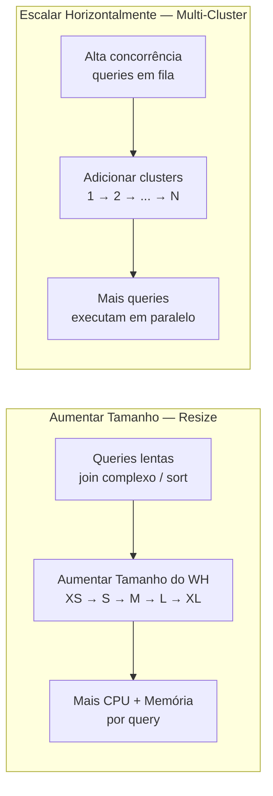

# Domínio 1.4 — Configurando Virtual Warehouses

## Peso no Exame

O **Domínio 1.0** representa **~31%** do exame. A configuração de Virtual Warehouses é um dos tópicos mais testados em múltiplos domínios.

> [!NOTE]
> Esta lição corresponde ao **Objetivo de Exame 1.4**: *Configurar virtual warehouses*, incluindo tipos, políticas de escalabilidade, configurações para diferentes casos de uso e boas práticas.

---

## O que é um Virtual Warehouse?

Um **Virtual Warehouse (VW)** é um cluster de computação on-demand nomeado que executa:
- Queries SQL (SELECT)
- Instruções DML (INSERT, UPDATE, DELETE, MERGE)
- Carregamento de dados (COPY INTO)
- Código Snowpark

Virtual warehouses são a **única fonte de cobrança de computação** no Snowflake (além de excessos da Cloud Services). O armazenamento é cobrado separadamente.

```sql
-- Criar um warehouse
CREATE WAREHOUSE WH_ANALYTICS
    WAREHOUSE_SIZE = MEDIUM
    AUTO_SUSPEND = 300          -- suspender após 5 minutos de inatividade
    AUTO_RESUME = TRUE          -- retomar automaticamente ao receber uma query
    INITIALLY_SUSPENDED = TRUE  -- não iniciar imediatamente
    COMMENT = 'Warehouse de relatórios de BI';

-- Usar um warehouse
USE WAREHOUSE WH_ANALYTICS;

-- Suspender/retomar manualmente
ALTER WAREHOUSE WH_ANALYTICS SUSPEND;
ALTER WAREHOUSE WH_ANALYTICS RESUME;
```

---

## Tipos de Virtual Warehouse

### Warehouses Standard (Gen 1 e Gen 2)

Warehouses Standard são o **tipo padrão** e adequados para a maioria dos workloads SQL:
- Queries SQL gerais, BI, relatórios, ETL
- Duas gerações: **Gen 1** (legado) e **Gen 2** (mais novo, melhor desempenho)
- Warehouses Gen 2 oferecem melhor custo-benefício para queries intensivas em CPU

### Warehouses Snowpark-Optimized (Otimizados para Snowpark)

Warehouses Snowpark-Optimized são projetados para **workloads Snowpark intensivos em memória** (DataFrames Python/Java/Scala, treinamento de modelos ML):

- Fornecem **16x mais memória** por nó em comparação com warehouses standard
- Cada nó tem mais RAM para operações Snowpark de grande escala em memória
- **Mais caros** por crédito — use somente quando a memória for o gargalo
- Ideais para: treinamento de modelos ML, ciência de dados de grande escala, transformações Snowpark complexas

```sql
CREATE WAREHOUSE WH_TREINAMENTO_ML
    WAREHOUSE_SIZE = LARGE
    WAREHOUSE_TYPE = 'SNOWPARK-OPTIMIZED'
    AUTO_SUSPEND = 600;
```

| Recurso | Standard | Snowpark-Optimized |
|---|---|---|
| Melhor para | SQL, DML, ETL | ML em Python/Java/Scala |
| Memória por nó | Padrão | 16x o padrão |
| Custo por crédito | Taxa base | Taxa mais alta |
| Auto-suspend | ✅ | ✅ |
| Multi-cluster | ✅ | ✅ |

---

## Dimensionamento de Warehouses

Cada tamanho **dobra** os recursos de computação (nós) e o consumo de créditos:

| Tamanho | Créditos/Hora | Caso de Uso Típico |
|---|---|---|
| X-Small | 1 | Desenvolvimento, queries pequenas |
| Small | 2 | ETL pequeno, queries ad-hoc |
| Medium | 4 | ETL moderado, BI padrão |
| Large | 8 | ETL pesado, analytics complexas |
| X-Large | 16 | Datasets muito grandes |
| 2X-Large | 32 | Workloads de alto volume de dados |
| 3X-Large | 64 | Processamento de altíssimo volume |
| 4X-Large | 128 | Workloads massivamente paralelos |
| 5X-Large | 256 | Escala extrema (apenas AWS/Azure) |
| 6X-Large | 512 | Escala extrema (apenas AWS/Azure) |

> [!NOTE]
> O Snowflake cobra por **segundo** com um **mínimo de 60 segundos** por inicialização de warehouse. Suspender e retomar com frequência pode gerar acúmulo de cobranças mínimas. Configure o `AUTO_SUSPEND` com cuidado.

---

## Auto-Suspend e Auto-Resume

### Auto-Suspend

`AUTO_SUSPEND` define o número de **segundos de inatividade** antes de o warehouse ser suspenso automaticamente:

```sql
-- Suspender após 5 minutos (300 segundos) de inatividade
ALTER WAREHOUSE WH_BI SET AUTO_SUSPEND = 300;

-- Desativar auto-suspend (warehouse executa até ser suspenso manualmente)
ALTER WAREHOUSE WH_BI SET AUTO_SUSPEND = 0;
```

**Boas práticas:**
- Defina auto-suspend **baixo** (60–300 segundos) para workloads intermitentes ou imprevisíveis
- Defina auto-suspend **mais alto** para warehouses com queries frequentes e consecutivas (evita a cobrança mínima de 60 segundos em cada reinicialização)
- **Nunca desative** o auto-suspend para warehouses de desenvolvimento ou teste

### Auto-Resume

`AUTO_RESUME = TRUE` significa que o warehouse **inicia automaticamente** assim que uma query é submetida — o usuário não precisa retomá-lo manualmente:

```sql
ALTER WAREHOUSE WH_BI SET AUTO_RESUME = TRUE;
```

> [!WARNING]
> Se `AUTO_RESUME = FALSE`, qualquer query submetida a um warehouse suspenso **falhará com erro**. Sempre defina `AUTO_RESUME = TRUE`, a menos que queira controle explícito sobre o ciclo de vida do warehouse.

---

## Escalabilidade: Aumentar o Tamanho vs. Escalar Horizontalmente

O Snowflake oferece duas dimensões de escalabilidade:



### Aumentar o Tamanho (Resize)

**Altere o tamanho do warehouse** quando queries individuais estão lentas (mais recursos por query):

```sql
-- Aumentar o tamanho para um ETL pesado noturno
ALTER WAREHOUSE WH_ETL SET WAREHOUSE_SIZE = 'X-LARGE';

-- Reduzir o tamanho após o job
ALTER WAREHOUSE WH_ETL SET WAREHOUSE_SIZE = 'SMALL';
```

**Quando aumentar o tamanho:**
- Queries estão demorando muito (CPU/memória insuficientes por query)
- Joins complexos, grandes agregações, ordenações
- Workloads de baixa concorrência e alto processamento por query

### Escalar Horizontalmente (Multi-Cluster)

**Adicione mais clusters** quando muitas queries concorrentes estão em fila:

> [!WARNING]
> Multi-cluster warehouses requerem **edição Enterprise ou superior**.

```sql
CREATE WAREHOUSE WH_REPORTING
    WAREHOUSE_SIZE = MEDIUM
    MAX_CLUSTER_COUNT = 5   -- até 5 clusters
    MIN_CLUSTER_COUNT = 1   -- pelo menos 1 sempre ativo
    SCALING_POLICY = 'ECONOMY';  -- ou 'STANDARD'
```

**Quando escalar horizontalmente:**
- Muitos usuários fazendo queries concorrentemente → queries em fila
- Dashboards de BI com muitos usuários simultâneos
- Workloads de alta concorrência onde queries individuais são rápidas

---

## Multi-Cluster Warehouses

Um **multi-cluster warehouse** inicia automaticamente clusters de computação adicionais quando a demanda de queries excede a capacidade do cluster atual:

```
Modo single-cluster:  [Cluster 1] ← todas as queries ficam na fila aqui

Modo multi-cluster:   [Cluster 1] [Cluster 2] [Cluster 3]
                           ↑            ↑            ↑
                     Queries distribuídas entre os clusters
```

### Políticas de Escalabilidade

| Política | Comportamento | Melhor Para |
|---|---|---|
| **Standard** | Adiciona clusters imediatamente quando filas são detectadas | Workloads sensíveis à latência |
| **Economy** | Aguarda até o cluster estar ocupado por 6 minutos antes de adicionar | Workloads com foco em custo |

### Modo Auto-Scale vs. Modo Maximized

| Modo | Descrição | Quando Usar |
|---|---|---|
| **Auto-Scale** | `MIN ≠ MAX` — clusters sobem/descem dinamicamente | Concorrência variável |
| **Maximized** | `MIN = MAX` — todos os clusters sempre ativos | Alta concorrência previsível |

```sql
-- Auto-scale: 1 a 5 clusters
CREATE WAREHOUSE WH_CONCORRENTE
    WAREHOUSE_SIZE = SMALL
    MIN_CLUSTER_COUNT = 1
    MAX_CLUSTER_COUNT = 5
    SCALING_POLICY = STANDARD;

-- Maximized: sempre 3 clusters
CREATE WAREHOUSE WH_SEMPRE_ATIVO
    WAREHOUSE_SIZE = MEDIUM
    MIN_CLUSTER_COUNT = 3
    MAX_CLUSTER_COUNT = 3;
```

---

## Configuração de Warehouse por Caso de Uso

### Queries Ad-Hoc

**Objetivo:** Resposta rápida para queries interativas imprevisíveis de analistas.

```sql
CREATE WAREHOUSE WH_ADHOC
    WAREHOUSE_SIZE = MEDIUM       -- potência suficiente para queries ad-hoc típicas
    AUTO_SUSPEND = 120            -- suspender rapidamente — uso é esporádico
    AUTO_RESUME = TRUE
    MAX_CLUSTER_COUNT = 3         -- lidar com picos de usuários concorrentes
    SCALING_POLICY = STANDARD;   -- responder imediatamente à concorrência
```

### Carregamento de Dados (ETL/ELT)

**Objetivo:** Maximizar o throughput para grandes operações de COPY INTO.

```sql
CREATE WAREHOUSE WH_INGEST
    WAREHOUSE_SIZE = LARGE        -- mais nós = mais carregamento paralelo de arquivos
    AUTO_SUSPEND = 60             -- suspender logo após o lote de carregamento concluir
    AUTO_RESUME = TRUE
    MAX_CLUSTER_COUNT = 1;        -- carregamento é sobre tamanho, não concorrência
```

> [!NOTE]
> Para carregamento, um **cluster único maior** é melhor do que mais clusters. O Snowflake distribui o carregamento de arquivos entre os nós de um único cluster. Multi-cluster ajuda na concorrência, não no throughput de uma única query.

### BI e Relatórios

**Objetivo:** Resposta consistente e rápida para muitos usuários simultâneos de dashboard.

```sql
CREATE WAREHOUSE WH_BI
    WAREHOUSE_SIZE = SMALL        -- queries individuais de BI são tipicamente pequenas
    AUTO_SUSPEND = 300
    AUTO_RESUME = TRUE
    MIN_CLUSTER_COUNT = 1
    MAX_CLUSTER_COUNT = 6         -- escalar horizontalmente para muitos usuários concorrentes
    SCALING_POLICY = ECONOMY;    -- eficiente em custo para workloads estáveis
```

---

## Resumo de Boas Práticas para Warehouses

| Cenário | Recomendação |
|---|---|
| Queries individuais lentas | **Aumentar o tamanho** (tamanho maior) |
| Muitas queries concorrentes em fila | **Escalar horizontalmente** (multi-cluster) |
| Desenvolvimento/teste | Tamanho pequeno, auto-suspend 60–120s |
| Treinamento de modelos ML com Snowpark | Warehouse Snowpark-Optimized |
| ETL em lote noturno | Tamanho grande, desativar durante o dia |
| Equipes diferentes | Warehouses dedicados separados |
| Controle de custos | Auto-suspend baixo + Resource Monitor |

---

## Questões de Prática

**Q1.** Uma equipe de BI tem 50 usuários que executam dashboards simultaneamente toda manhã. As queries são rápidas individualmente, mas os usuários experimentam atrasos. Qual é a MELHOR solução?

- A) Aumentar o tamanho do warehouse para X-Large
- B) Habilitar multi-cluster warehouse (escalar horizontalmente) ✅
- C) Habilitar o cache de resultados de queries
- D) Criar uma materialized view

**Q2.** Um warehouse está configurado com `AUTO_SUSPEND = 300`. A última query foi concluída às 10h. O que acontece às 10h05 se nenhuma nova query chegar?

- A) O warehouse retoma automaticamente
- B) O warehouse é suspenso automaticamente ✅
- C) O warehouse gera um alerta
- D) O warehouse é descartado

**Q3.** Qual tipo de warehouse fornece 16x mais memória por nó, adequado para treinamento de modelos ML?

- A) Standard Gen 2
- B) X-Large Standard
- C) Snowpark-Optimized ✅
- D) Multi-cluster Economy

**Q4.** Qual é o período mínimo de cobrança cada vez que um virtual warehouse é iniciado?

- A) 30 segundos
- B) 60 segundos ✅
- C) 5 minutos
- D) 1 hora

**Q5.** A política de escalabilidade `ECONOMY` para multi-cluster warehouses adiciona um novo cluster quando:

- A) A primeira query fica em fila
- B) Mais de 10 queries estão em fila
- C) O cluster ficaria ocupado por pelo menos 6 minutos ✅
- D) A utilização de CPU excede 80%

**Q6.** Um desenvolvedor define `AUTO_RESUME = FALSE` em um warehouse. O que acontece quando um usuário submete uma query enquanto o warehouse está suspenso?

- A) O warehouse retoma e executa a query
- B) A query fica em fila até o warehouse ser retomado manualmente
- C) A query falha com um erro ✅
- D) A query é executada na camada Cloud Services

---

> [!SUCCESS]
> **Pontos-Chave para o Dia do Exame:**
> 1. Duas dimensões de escalabilidade: **Aumentar tamanho** (queries lentas) vs. **Escalar horizontalmente** (usuários concorrentes)
> 2. Multi-cluster requer **edição Enterprise**
> 3. Cobrança: **por segundo, mínimo de 60 segundos** por inicialização
> 4. **Snowpark-Optimized** = 16x memória, para ML/ciência de dados
> 5. Política `STANDARD` = adiciona cluster imediatamente | `ECONOMY` = aguarda carga sustentada
> 6. `AUTO_RESUME = FALSE` + warehouse suspenso = query **falha** (não fica em fila)
