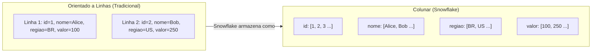
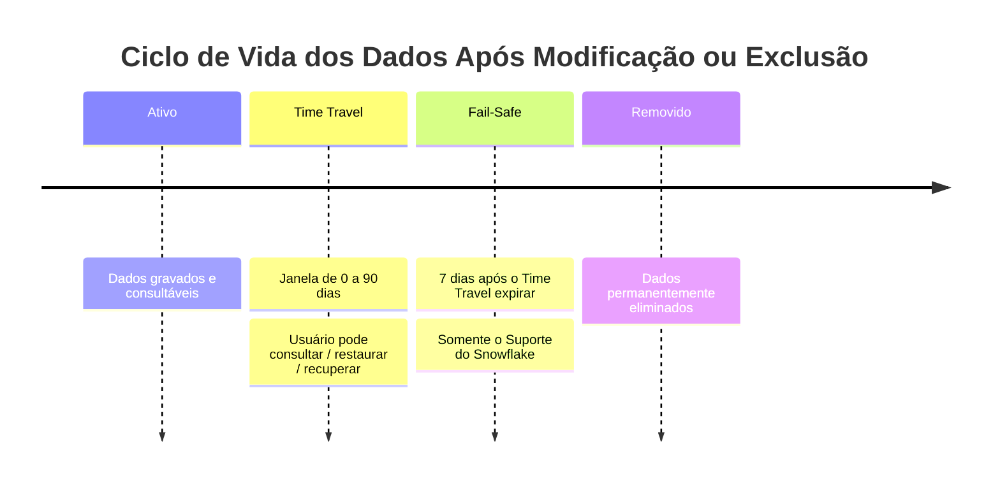

# Domínio 1.5 — Conceitos de Armazenamento do Snowflake

## Peso no Exame

O **Domínio 1.0** representa **~31%** do exame. Os conceitos de armazenamento são fundamentais e aparecem também nos domínios de desempenho, governança e carregamento de dados.

> [!NOTE]
> Esta lição corresponde ao **Objetivo de Exame 1.5**: *Explicar conceitos de armazenamento do Snowflake*, incluindo micro-partições, clustering de dados e todos os tipos de tabelas e views.

---

## Micro-Partições

As **micro-partições** são a unidade fundamental de armazenamento no Snowflake. Os dados de cada tabela são divididos em micro-partições automaticamente — sem necessidade de particionamento manual.

### Características Principais

| Propriedade | Valor |
|---|---|
| **Tamanho** | 50–500 MB (comprimidos) |
| **Formato** | Colunar (orientado a colunas) |
| **Compressão** | Automática (o Snowflake escolhe o algoritmo) |
| **Criptografia** | AES-256, automática |
| **Imutabilidade** | Imutáveis — o DML cria novas partições |
| **Metadados** | Valores mín./máx., contagem distinta, contagem de NULLs por coluna por partição |

### Armazenamento Colunar

O Snowflake armazena dados **por coluna, não por linha**. Isso tem grandes implicações no desempenho:



**Benefícios para analytics:**
- Apenas as **colunas consultadas** são lidas do disco → menos I/O
- Valores similares em uma coluna se comprimem extremamente bem → armazenamento menor
- Queries de agregação em uma coluna ignoram todas as outras colunas

### Partition Pruning (Poda de Partições)

Como o Snowflake armazena **metadados de mín./máx. por coluna por micro-partição**, ele pode **ignorar partições inteiras** que não correspondem a uma cláusula WHERE:

```sql
-- O otimizador do Snowflake sabe quais micro-partições contêm
-- pedidos de janeiro de 2025 e ignora todas as outras
SELECT sum(valor)
FROM pedidos
WHERE data_pedido BETWEEN '2025-01-01' AND '2025-01-31';
```

Isso se chama **partition pruning** e é crítico para o desempenho de queries.

---

## Clustering de Dados

### Clustering Natural

Quando os dados são carregados em uma ordem consistente (ex.: cronologicamente por `criado_em`), as micro-partições são naturalmente bem agrupadas — queries que filtram nessa coluna se beneficiam da poda.

### Cluster Keys (Chaves de Agrupamento)

Para tabelas onde a **ordem de carga natural não corresponde aos padrões de query**, você pode definir uma **Cluster Key** explícita:

```sql
-- Definir uma cluster key nas colunas regiao e tipo_evento
ALTER TABLE eventos CLUSTER BY (regiao, tipo_evento);

-- Verificar a qualidade do clustering (0 = perfeitamente agrupado, 1 = sem agrupamento)
SELECT SYSTEM$CLUSTERING_INFORMATION('eventos', '(regiao, tipo_evento)');
```

### Automatic Clustering (Agrupamento Automático)

Quando uma cluster key é definida, o serviço de **Automatic Clustering** do Snowflake executa em segundo plano para **reorganizar as micro-partições** — isso consome créditos em seu nome.

| Conceito | Descrição |
|---|---|
| **Cluster Depth (Profundidade do Cluster)** | Número médio de partições sobrepostas por valor — quanto menor, melhor |
| **Clustering Ratio (Proporção de Clustering)** | Fração das colunas ordenadas dentro das partições — quanto maior, melhor |
| **Automatic Clustering** | Serviço em segundo plano que mantém o agrupamento; cobrado separadamente |

> [!WARNING]
> Definir uma cluster key em uma tabela pequena ou raramente consultada é **desperdício** — o Automatic Clustering consome créditos. Agrupe apenas tabelas grandes (centenas de GBs+) frequentemente consultadas na coluna de cluster key.

---

## Time Travel

O **Time Travel** permite consultar versões históricas dos seus dados — até 90 dias no passado (dependendo da edição):

| Edição | Time Travel Máximo |
|---|---|
| Standard | 1 dia (24 horas) |
| Enterprise | Até 90 dias |
| Business Critical | Até 90 dias |
| VPS | Até 90 dias |

```sql
-- Consultar dados como eram há 1 hora
SELECT * FROM pedidos AT (OFFSET => -3600);

-- Consultar dados em um timestamp específico
SELECT * FROM pedidos AT (TIMESTAMP => '2025-06-01 12:00:00'::TIMESTAMP_TZ);

-- Consultar usando um ID de query (antes de essa query executar)
SELECT * FROM pedidos BEFORE (STATEMENT => '019f18ba-0804-0...');

-- Restaurar uma tabela descartada
UNDROP TABLE pedidos;

-- Clonar uma tabela em um ponto no tempo
CREATE TABLE backup_pedidos CLONE pedidos
    AT (TIMESTAMP => '2025-06-01 00:00:00'::TIMESTAMP_TZ);
```

### Configuração do Time Travel

```sql
-- Definir retenção do Time Travel para uma tabela específica
ALTER TABLE pedidos SET DATA_RETENTION_TIME_IN_DAYS = 30;

-- Definir no nível de schema ou banco de dados
ALTER DATABASE meu_bd SET DATA_RETENTION_TIME_IN_DAYS = 7;

-- Desativar o Time Travel (reduz custo de armazenamento)
ALTER TABLE tabela_staging SET DATA_RETENTION_TIME_IN_DAYS = 0;
```

> [!NOTE]
> Os dados do Time Travel **contam para a cobrança de armazenamento**. Definir a retenção como 0 para tabelas que não precisam de recuperação histórica é uma estratégia de otimização de custos.

---

## Fail-Safe

O **Fail-Safe** é uma janela de recuperação de desastres **de 7 dias não configurável** que começa após o período de Time Travel expirar.



**Fatos críticos do Fail-Safe para o exame:**

| Propriedade | Valor |
|---|---|
| Duração | Sempre 7 dias (não configurável) |
| Quem pode recuperar os dados | **Apenas o Suporte do Snowflake** (não o cliente) |
| Custo | Incluído no armazenamento — sem cobrança extra |
| Autoatendimento? | **Não** — contate o suporte |
| Aplica-se a | Apenas tabelas permanentes (não Temporárias ou Transitórias) |

> [!WARNING]
> O Fail-Safe **não** é uma ferramenta de recuperação de autoatendimento. Se você precisar de recuperação pontual por autoatendimento, use o **Time Travel** (UNDROP / AT / BEFORE). O Fail-Safe é um último recurso que requer a intervenção do Suporte do Snowflake.

---

## Zero-Copy Cloning (Clonagem Zero-Cópia)

O **Zero-Copy Cloning** cria uma cópia instantânea de um banco de dados, schema ou tabela **sem duplicar nenhum dado subjacente**:

```sql
-- Clonar banco de dados inteiro instantaneamente
CREATE DATABASE BD_DEV CLONE BD_PROD;

-- Clonar um schema
CREATE SCHEMA dev.staging CLONE prod.staging;

-- Clonar uma tabela
CREATE TABLE backup_pedidos CLONE pedidos;

-- Clonar em um ponto no tempo (usando Time Travel)
CREATE TABLE pedidos_jan CLONE pedidos
    AT (TIMESTAMP => '2025-01-31 23:59:59'::TIMESTAMP_TZ);
```

### Como Funciona o Zero-Copy Cloning

Após a clonagem, o clone **compartilha as mesmas micro-partições** que a origem. Quando a origem ou o clone é modificado, a estratégia **Copy-on-Write** (cópia na escrita) cria novas micro-partições apenas para os dados modificados:

```
Estado inicial:   [Partição A] [Partição B] [Partição C]
                       ↑              ↑              ↑
                   ORIGEM       ORIGEM + CLONE   ORIGEM + CLONE

Após UPDATE no clone:
Clone:        [Nova Partição A'] [Partição B] [Partição C]
Origem:       [Partição A]       [Partição B] [Partição C]
```

**Benefícios:**
- **Instantâneo** — nenhum dado é copiado
- **Sem custo extra de armazenamento** inicialmente
- O armazenamento só aumenta quando os dados divergem entre origem e clone
- Perfeito para ambientes de dev/test, snapshots pré-migração, auditoria

---

## Tipos de Tabelas (Revisão Completa)

| Tipo | Persistência | Time Travel | Fail-Safe | Caso de Uso |
|---|---|---|---|---|
| **Permanente (Permanent)** | Até ser descartada | 0–90 dias | 7 dias | Tabelas de produção |
| **Temporária (Temporary)** | Fim da sessão | 0–1 dia | Nenhum | Trabalho com escopo de sessão |
| **Transitória (Transient)** | Até ser descartada | 0–1 dia | Nenhum | Staging, ETL intermediário |
| **Externa (External)** | Nunca (sem dados) | Nenhum | Nenhum | Consultar arquivos no armazenamento em nuvem |
| **Apache Iceberg** | Até ser descartada | Via Iceberg | Via Iceberg | Formato aberto, multi-engine |
| **Dinâmica (Dynamic)** | Até ser descartada | Configurável | Configurável | Incrementalização declarativa |

### Tabelas Apache Iceberg

O Snowflake suporta o **Apache Iceberg** como um formato de tabela aberto — os dados ficam no seu próprio armazenamento em nuvem e são acessíveis por múltiplos engines (Spark, Trino, Snowflake):

```sql
-- Tabela Iceberg usando Snowflake como catálogo
CREATE ICEBERG TABLE tabela_iceberg (id NUMBER, nome STRING)
    CATALOG = SNOWFLAKE
    EXTERNAL_VOLUME = 'meu_volume_externo'
    BASE_LOCATION = 'dados_iceberg/';
```

### Tabelas Dinâmicas (Dynamic Tables)

As **Dynamic Tables** fornecem **materialização incremental declarativa** — defina o resultado de query desejado e o Snowflake o mantém atualizado automaticamente:

```sql
CREATE DYNAMIC TABLE resumo_clientes
    TARGET_LAG = '1 hour'   -- dados devem ter no máximo 1 hora de atraso
    WAREHOUSE = WH_TRANSFORM
AS
SELECT
    id_cliente,
    count(*) as qtd_pedidos,
    sum(valor) as total_gasto
FROM pedidos
GROUP BY id_cliente;
```

**Dynamic Tables vs. Streams + Tasks:**
- Dynamic Tables: **abordagem declarativa mais simples** — o Snowflake gerencia a lógica de atualização
- Streams + Tasks: **imperativo** — você escreve explicitamente a lógica de merge/insert

---

## Tipos de Views (Revisão Completa)

| Tipo de View | Definição Oculta | Pré-computada | Auto-Atualização | Notas |
|---|---|---|---|---|
| **Padrão (Standard)** | Não | Não | N/A | Wrapper lógico simples |
| **Segura (Secure)** | Sim | Não | N/A | Oculta a lógica da query dos consumidores |
| **Materializada (Materialized)** | Não | Sim | Sim (em segundo plano) | Otimização de desempenho |

```sql
-- Materialized view: o Snowflake atualiza isso automaticamente
CREATE MATERIALIZED VIEW mv_vendas_horarias AS
SELECT
    date_trunc('hour', horario_venda) AS hora_venda,
    sum(valor) AS valor_total
FROM vendas
GROUP BY 1;

-- Consultar a MV (lê o resultado pré-computado)
SELECT * FROM mv_vendas_horarias WHERE hora_venda > DATEADD('hour', -24, CURRENT_TIMESTAMP);
```

**Limitações das Materialized Views:**
- Não podem referenciar outras MVs ou tabelas externas
- Não podem usar funções não-determinísticas
- Mantidas pelo serviço em segundo plano do Snowflake (consome créditos)
- Disponíveis apenas em **Enterprise+**

---

## Criptografia em Repouso e em Trânsito

Todos os dados do Snowflake são criptografados por padrão — sem necessidade de configuração:

| Proteção | Método |
|---|---|
| **Dados em repouso** | AES-256 (todas as micro-partições) |
| **Dados em trânsito** | TLS 1.2+ (todas as conexões) |
| **Gerenciamento de chaves** | Gerenciado pelo Snowflake por padrão |
| **Tri-Secret Secure** | Chave gerenciada pelo cliente (Business Critical+) |

---

## Questões de Prática

**Q1.** Qual é o intervalo de tamanho de uma micro-partição do Snowflake?

- A) 1–10 MB descomprimidos
- B) 50–500 MB comprimidos ✅
- C) 1–5 GB descomprimidos
- D) Fixo em 128 MB

**Q2.** Após o Time Travel expirar, quem pode recuperar dados durante o período de Fail-Safe?

- A) O cliente usando UNDROP
- B) A role ACCOUNTADMIN
- C) Apenas o Suporte do Snowflake ✅
- D) Ninguém — os dados são imediatamente purgados

**Q3.** Um engenheiro de dados clona uma tabela de produção (`CREATE TABLE dev CLONE prod`). Nenhuma modificação foi feita ainda. Quanto armazenamento adicional o clone consome?

- A) 100% do tamanho da tabela original
- B) 50% do tamanho da tabela original
- C) Nenhum — as micro-partições são compartilhadas ✅
- D) Apenas armazenamento de metadados

**Q4.** Qual tipo de tabela é adequado para armazenar resultados intermediários de ETL que não precisam de Fail-Safe, mas devem persistir além da sessão atual?

- A) Temporária (Temporary)
- B) Transitória (Transient) ✅
- C) Permanente (Permanent)
- D) Externa (External)

**Q5.** Uma Dynamic Table é configurada com `TARGET_LAG = '1 hour'`. O que isso significa?

- A) A tabela é atualizada a cada hora no topo da hora
- B) Os dados na tabela devem ter no máximo 1 hora de atraso em relação à origem ✅
- C) A tabela retém 1 hora de Time Travel
- D) O warehouse executa por 1 hora por atualização

**Q6.** Qual tipo de view do Snowflake oculta seu SELECT subjacente de usuários que não foram autorizados pelo proprietário?

- A) Materialized View
- B) View Padrão (Standard View)
- C) Secure View ✅
- D) External View

**Q7.** O Automatic Clustering está habilitado em uma tabela. Qual afirmação é VERDADEIRA?

- A) O clustering executa no virtual warehouse do cliente
- B) O clustering é gratuito e ilimitado
- C) O clustering consome créditos no serviço em segundo plano do Snowflake ✅
- D) O clustering requer que a tabela seja recriada

---

> [!SUCCESS]
> **Pontos-Chave para o Dia do Exame:**
> 1. Micro-partições: **50–500 MB comprimidos, colunares, imutáveis, com metadados automáticos**
> 2. Fail-Safe: **7 dias, não configurável, apenas o Suporte do Snowflake**
> 3. Time Travel: **Standard = máx. 1 dia | Enterprise+ = máx. 90 dias**
> 4. Zero-Copy Cloning: **instantâneo, sem custo inicial de armazenamento, Copy-on-Write para divergência**
> 5. Transitória vs. Temporária: ambas sem Fail-Safe, mas Transitória **persiste** após o fim da sessão
> 6. Dynamic Tables: `TARGET_LAG` declarativo — mais simples que Streams + Tasks
