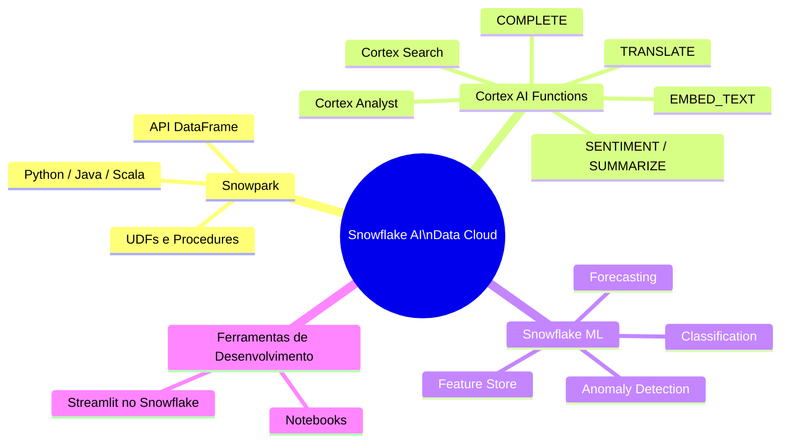

# Domínio 1.6 — Recursos de IA/ML e Desenvolvimento de Aplicações

## Peso no Exame

O **Domínio 1.0** representa **~31%** do exame. Os recursos de IA/ML são um foco crescente no exame COF-C03, refletindo o posicionamento do Snowflake como "AI Data Cloud".

> [!NOTE]
> Esta lição corresponde ao **Objetivo de Exame 1.6**: *Explicar recursos de IA/ML e desenvolvimento de aplicações*, incluindo Snowflake Notebooks, Streamlit, Snowpark, Snowflake Cortex e Snowflake ML.



---

## Snowpark

O **Snowpark** é o framework de desenvolvimento do Snowflake que permite escrever pipelines de dados e transformações em **Python, Java ou Scala** usando uma API DataFrame — sem mover dados para fora do Snowflake.

### Conceitos-Chave do Snowpark

- O código é escrito em Python/Java/Scala usando a biblioteca Snowpark
- A execução acontece **dentro do Snowflake** — os dados nunca saem
- Usa **avaliação preguiçosa (lazy evaluation)** — as operações são construídas como um plano de query e executadas quando uma ação é disparada
- Suporta User-Defined Functions (UDFs), User-Defined Table Functions (UDTFs) e Stored Procedures

```python
# Exemplo Python com Snowpark
from snowflake.snowpark import Session
from snowflake.snowpark.functions import col, sum as snow_sum

# Criar uma sessão
session = Session.builder.configs({
    "account": "minhaconta",
    "user": "meuusuario",
    "password": "minhasenha",
    "warehouse": "WH_DS",
    "database": "ANALYTICS",
    "schema": "PUBLIC"
}).create()

# Construir um DataFrame (nenhum dado é movido ainda — lazy evaluation)
df = session.table("pedidos")

# Transformar
resultado = (df
    .filter(col("status") == "CONCLUIDO")
    .group_by("regiao")
    .agg(snow_sum("valor").alias("receita_total"))
    .sort("receita_total", ascending=False)
)

# Executar e mostrar resultados (dispara a computação)
resultado.show()

# Gravar resultados de volta no Snowflake
resultado.write.mode("overwrite").save_as_table("receita_por_regiao")
```

### UDFs e UDTFs com Snowpark

```python
# Registrar uma UDF Python no Snowflake
from snowflake.snowpark.functions import udf
from snowflake.snowpark.types import StringType, FloatType

@udf(return_type=FloatType(), input_types=[StringType()])
def pontuacao_sentimento(texto: str) -> float:
    # Isso executa dentro do sandbox Python do Snowflake
    from textblob import TextBlob
    return TextBlob(texto).sentiment.polarity

# Usar a UDF em uma query
df.select(pontuacao_sentimento(col("texto_avaliacao")).alias("sentimento")).show()
```

### Snowpark para Machine Learning

```python
from snowflake.ml.modeling.linear_model import LinearRegression
from snowflake.ml.modeling.preprocessing import StandardScaler

# Treinar um modelo usando Snowflake ML
scaler = StandardScaler(input_cols=["idade", "renda"], output_cols=["idade_norm", "renda_norm"])
df_normalizado = scaler.fit(df).transform(df)

model = LinearRegression(input_cols=["idade_norm", "renda_norm"], label_cols=["churn"])
model.fit(df_normalizado)

# Implantar modelo como UDF dentro do Snowflake
```

---

## Snowflake Cortex — Funções SQL de IA

O **Snowflake Cortex** fornece **funções SQL com LLM (Large Language Model — Modelo de Linguagem de Grande Escala)** que executam diretamente sobre dados do Snowflake — sem chamadas de API externas do ponto de vista do usuário.

### Funções SQL do Cortex AI

| Função | Descrição | Caso de Uso de Exemplo |
|---|---|---|
| `COMPLETE()` | Gera texto com um LLM | Resumir, classificar, responder perguntas |
| `EMBED_TEXT_768()` / `EMBED_TEXT_1024()` | Gera embeddings (representações vetoriais) | Busca semântica, similaridade |
| `CLASSIFY_TEXT()` | Classifica texto em categorias | Análise de sentimento, classificação por tópico |
| `EXTRACT_ANSWER()` | Extrai uma resposta de um texto de contexto | Perguntas e respostas sobre documentos |
| `SENTIMENT()` | Retorna pontuação de sentimento (-1 a 1) | Análise de avaliações de produtos |
| `SUMMARIZE()` | Resume textos longos | Artigos de notícias, documentos |
| `TRANSLATE()` | Traduz texto entre idiomas | Dados multilíngues |
| `PARSE_DOCUMENT()` | Extrai texto de PDFs/imagens | Processamento de documentos |

```sql
-- Resumir avaliações de clientes
SELECT
    id_avaliacao,
    SNOWFLAKE.CORTEX.SUMMARIZE(texto_avaliacao) AS resumo
FROM avaliacoes_clientes;

-- Análise de sentimento
SELECT
    id_avaliacao,
    SNOWFLAKE.CORTEX.SENTIMENT(texto_avaliacao) AS pontuacao_sentimento
FROM avaliacoes_clientes;

-- Classificar tickets de suporte
SELECT
    id_ticket,
    SNOWFLAKE.CORTEX.CLASSIFY_TEXT(
        corpo_ticket,
        ['cobranca', 'tecnico', 'conta', 'geral']
    ):label::STRING AS categoria
FROM tickets_suporte;

-- Gerar completions com LLM
SELECT
    SNOWFLAKE.CORTEX.COMPLETE(
        'mistral-7b',   -- ou 'llama3-70b', 'mixtral-8x7b', 'snowflake-arctic'
        'Resuma em uma frase: ' || descricao
    ) AS resumo_ia
FROM produtos;
```

### Cortex Search

O **Cortex Search** fornece capacidades de **busca semântica (vetorial)** sobre dados do Snowflake sem gerenciar embeddings manualmente:

```sql
-- Criar um serviço Cortex Search
CREATE CORTEX SEARCH SERVICE busca_produtos
    ON COLUMN descricao_produto
    WAREHOUSE = WH_SEARCH
    TARGET_LAG = '1 hour'
AS (
    SELECT id_produto, nome_produto, descricao_produto
    FROM produtos
    WHERE ativo = TRUE
);

-- Consultar o serviço de busca
SELECT SNOWFLAKE.CORTEX.SEARCH_PREVIEW(
    'busca_produtos',
    '{"query": "fones de ouvido sem fio com cancelamento de ruído", "limit": 5}'
);
```

### Cortex Analyst

O **Cortex Analyst** habilita a **geração de SQL a partir de linguagem natural** — usuários de negócio fazem perguntas em português e o Cortex Analyst retorna queries SQL e resultados:

- Construído sobre LLMs ajustados para geração de SQL
- Entende o schema do Snowflake e o modelo semântico
- Alimenta interfaces de BI conversacional
- Acessado via API REST ou integração com Streamlit

---

## Snowflake ML

O **Snowflake ML** é um conjunto de capacidades de Machine Learning integradas ao Snowflake:

### Feature Store (Repositório de Features)

Armazene, gerencie e compartilhe features de ML como objetos do Snowflake:

```python
from snowflake.ml.feature_store import FeatureStore, Entity, FeatureView

fs = FeatureStore(session=session, database="BD_ML", name="MEU_FEATURE_STORE", ...)

# Definir uma entidade
entidade_cliente = Entity(name="cliente", join_keys=["id_cliente"])

# Criar uma feature view
fv = FeatureView(
    name="features_clientes",
    entities=[entidade_cliente],
    feature_df=df_features,
    refresh_freq="1 day"
)
fs.register_feature_view(fv, version="v1")
```

### Model Registry (Registro de Modelos)

Armazene, versione e implante modelos de ML dentro do Snowflake:

```python
from snowflake.ml.registry import Registry

reg = Registry(session=session, database_name="BD_ML", schema_name="PUBLIC")

# Registrar um modelo
mv = reg.log_model(
    model=modelo_sklearn_treinado,
    model_name="preditor_churn",
    version_name="v1",
    sample_input_data=df_amostra
)

# Executar inferência
predicoes = mv.run(df_novos_clientes, function_name="predict")
```

### AutoML com Snowflake ML

```python
from snowflake.ml.modeling.linear_model import LogisticRegression
from snowflake.ml.modeling.model_selection import GridSearchCV

# Validar hiperparâmetros dentro do Snowflake
grade_parametros = {"C": [0.1, 1, 10], "max_iter": [100, 200]}
cv = GridSearchCV(estimator=LogisticRegression(), param_grid=grade_parametros, cv=5)
cv.fit(df_treino)
```

---

## Snowflake Notebooks

Os **Snowflake Notebooks** são **notebooks interativos no estilo Jupyter** embutidos diretamente no Snowsight:

- Suporta células **SQL, Python (Snowpark) e Markdown** no mesmo notebook
- Células Python executam dentro do Snowflake — os dados nunca saem
- Acesse dados do Snowflake diretamente sem configuração de conexão
- Versionados via **integração com Git**
- Pode visualizar resultados com bibliotecas Python populares (matplotlib, plotly, altair)

```python
# Em uma célula Python de um Snowflake Notebook
import streamlit as st
import matplotlib.pyplot as plt

# Carregar dados usando Snowpark (já conectado)
df = session.table("pedidos").to_pandas()

# Visualizar
fig, ax = plt.subplots()
df.groupby("regiao")["valor"].sum().plot(kind="bar", ax=ax)
st.pyplot(fig)
```

```sql
-- Em uma célula SQL dentro do mesmo notebook
SELECT regiao, count(*) as qtd_pedidos
FROM pedidos
WHERE data_pedido >= DATEADD('month', -3, CURRENT_DATE)
GROUP BY 1
ORDER BY 2 DESC;
```

---

## Streamlit no Snowflake

O **Streamlit no Snowflake** permite **implantar aplicações Python Streamlit diretamente dentro do Snowflake** — sem necessidade de hospedagem externa:

- Aplicações Python de dados executam nativamente no Snowflake
- Acesse dados do Snowflake com segurança sem chaves de API
- Compartilhe com usuários dentro da sua conta Snowflake
- Use o RBAC do Snowflake para controlar quem pode acessar o app
- Construa dashboards, exploradores de dados, apps com IA

```python
# streamlit_app.py — executa dentro do Snowflake
import streamlit as st
from snowflake.snowpark.context import get_active_session

# Obter a sessão ativa do Snowflake (pré-autenticada)
session = get_active_session()

st.title("Dashboard de Vendas")

# Consultar dados do Snowflake
df = session.sql("SELECT regiao, sum(valor) as receita FROM pedidos GROUP BY 1").to_pandas()

st.bar_chart(df.set_index("REGIAO")["RECEITA"])

# Usar Cortex para recursos de IA
pergunta = st.text_input("Faça uma pergunta sobre seus dados:")
if pergunta:
    resposta = session.sql(f"""
        SELECT SNOWFLAKE.CORTEX.COMPLETE('mistral-7b', '{pergunta}')
    """).collect()[0][0]
    st.write(resposta)
```

```sql
-- Implantar um app Streamlit
CREATE STREAMLIT meu_dashboard
    ROOT_LOCATION = '@meu_stage/streamlit_app'
    MAIN_FILE = 'streamlit_app.py'
    QUERY_WAREHOUSE = WH_BI;
```

---

## Tabela Resumo de Recursos de IA/ML

| Recurso | O que Faz | Onde Executa |
|---|---|---|
| **Snowpark** | API DataFrame para Python/Java/Scala | Dentro do Snowflake (camada compute) |
| **Cortex COMPLETE()** | Geração de texto com LLM | Endpoints LLM gerenciados pelo Snowflake |
| **Cortex SENTIMENT()** | Análise de sentimento | Endpoints LLM gerenciados pelo Snowflake |
| **Cortex SUMMARIZE()** | Sumarização de texto | Endpoints LLM gerenciados pelo Snowflake |
| **Cortex Search** | Serviço de busca semântica | Índice vetorial gerenciado pelo Snowflake |
| **Cortex Analyst** | Conversão de linguagem natural → SQL | LLM gerenciado pelo Snowflake |
| **Snowflake ML** | ML compatível com Sklearn no Snowflake | Computação do Snowflake |
| **Feature Store** | Gerenciamento de features de ML | Armazenamento + computação do Snowflake |
| **Model Registry** | Versionamento e implantação de modelos ML | Armazenamento + computação do Snowflake |
| **Notebooks** | IDE interativo SQL + Python | Computação do Snowflake |
| **Streamlit no Snowflake** | Hospedagem de apps web Python | Computação do Snowflake |

---

## Questões de Prática

**Q1.** Um cientista de dados quer treinar um modelo de machine learning usando Python sem mover dados para fora do Snowflake. Qual recurso possibilita isso?

- A) External functions
- B) Snowpark ✅
- C) Dashboards do Snowsight
- D) COPY INTO

**Q2.** Qual função do Snowflake Cortex retornaria uma pontuação de sentimento entre -1 e 1 para avaliações de clientes?

- A) `COMPLETE()`
- B) `SUMMARIZE()`
- C) `SENTIMENT()` ✅
- D) `EXTRACT_ANSWER()`

**Q3.** Um analista de negócios quer perguntar "Quais foram os 5 principais produtos por receita no último trimestre?" em linguagem natural e obter de volta uma query SQL. Qual recurso Cortex suporta isso?

- A) Cortex Search
- B) Cortex Analyst ✅
- C) Cortex COMPLETE()
- D) Snowflake ML Registry

**Q4.** As aplicações Streamlit no Snowflake são protegidas usando qual mecanismo do Snowflake?

- A) Chaves de API no código do app
- B) Controle de Acesso Baseado em Funções do Snowflake (RBAC) ✅
- C) Somente OAuth de terceiros
- D) Acesso à internet pública sem autenticação

**Q5.** O Snowpark usa avaliação preguiçosa (lazy evaluation). O que dispara a computação real?

- A) Criar o objeto DataFrame
- B) Chamar `.filter()` ou `.group_by()`
- C) Chamar uma ação como `.show()`, `.collect()` ou `.write` ✅
- D) Conectar-se à sessão

---

> [!SUCCESS]
> **Pontos-Chave para o Dia do Exame:**
> 1. **Snowpark** = API DataFrame para Python/Java/Scala executando DENTRO do Snowflake
> 2. **Funções SQL do Cortex** = capacidades de LLM como SQL (`SENTIMENT`, `SUMMARIZE`, `COMPLETE`, etc.)
> 3. **Cortex Analyst** = linguagem natural → SQL para usuários de negócio
> 4. **Cortex Search** = serviço gerenciado de busca semântica/vetorial
> 5. **Streamlit no Snowflake** = apps web Python hospedados e protegidos dentro do Snowflake
> 6. **Snowflake Notebooks** = notebooks no estilo Jupyter com células SQL + Python no Snowsight
