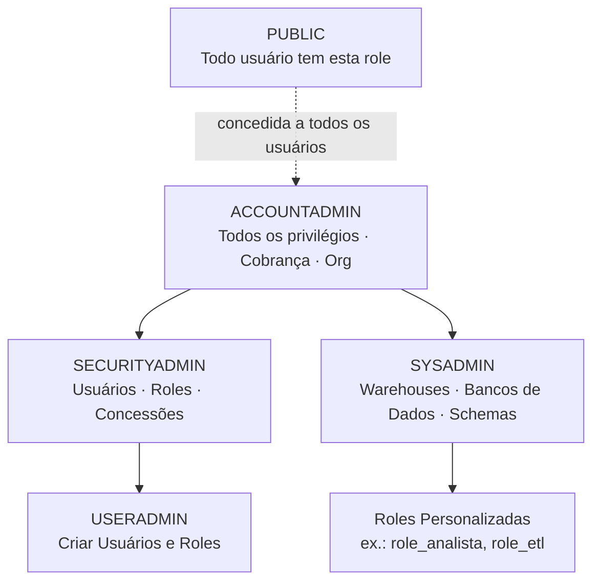

# Domínio 2.1 — Modelo e Princípios de Segurança do Snowflake

## Peso no Exame

O **Domínio 2.0 — Gerenciamento de Conta e Governança de Dados** representa **~20%** do exame. Segurança é um dos tópicos mais testados.

> [!NOTE]
> Esta lição corresponde ao **Objetivo de Exame 2.1**: *Explicar o modelo e os princípios de segurança do Snowflake*, incluindo RBAC, DAC, hierarquia de objetos seguráveis, network policies, métodos de autenticação, roles de sistema, roles funcionais, roles secundárias, identificadores de conta e logging/tracing.

---

## Framework de Controle de Acesso do Snowflake

O Snowflake usa **dois modelos complementares de controle de acesso** que trabalham juntos:

| Modelo | Sigla | Como Funciona |
|---|---|---|
| **Controle de Acesso Baseado em Funções** | RBAC (*Role-Based Access Control*) | Privilégios são concedidos a **roles**, roles são concedidas a **usuários** |
| **Controle de Acesso Discricionário** | DAC (*Discretionary Access Control*) | O **proprietário de um objeto** pode conceder acesso a esse objeto a outras roles |

### RBAC na Prática

```sql
-- Conceder privilégio a uma role
GRANT SELECT ON TABLE analytics.public.pedidos TO ROLE role_analista;

-- Conceder role a um usuário
GRANT ROLE role_analista TO USER joana;

-- Quando Joana faz login, ela pode ativar sua role e executar queries
USE ROLE role_analista;
SELECT * FROM analytics.public.pedidos;
```

### DAC na Prática

A role que **possui** (criou) um objeto pode conceder acesso a ele:

```sql
-- A role de Joana (proprietario_dados) criou esta tabela — ela é a "proprietária"
CREATE TABLE analytics.public.dados_clientes (...);

-- Como proprietária, a proprietario_dados pode conceder acesso a outras roles
GRANT SELECT ON TABLE analytics.public.dados_clientes TO ROLE role_analista;
```

> [!NOTE]
> O DAC significa que você não precisa do SYSADMIN para gerenciar cada concessão. Os proprietários de objetos podem autogerenciar o acesso a seus objetos — isso habilita a **administração federada**.

---

## Hierarquia de Objetos Seguráveis

Todo objeto do Snowflake é um **objeto segurável** — privilégios podem ser concedidos nele. Os objetos herdam do seu contêiner pai:

```
Organização
└── Conta
    ├── Warehouse
    ├── Banco de Dados
    │   └── Schema
    │       ├── Tabela
    │       ├── View
    │       ├── Stage
    │       ├── Função (UDF)
    │       ├── Procedure
    │       └── Stream / Task / Pipe
    ├── Usuário
    └── Role
```

Para acessar um objeto, uma role normalmente precisa de:
1. `USAGE` no **banco de dados**
2. `USAGE` no **schema**
3. O privilégio específico no **objeto** (ex.: `SELECT`, `INSERT`)

```sql
-- Concessões mínimas para acesso de leitura a uma tabela
GRANT USAGE ON DATABASE analytics TO ROLE role_analista;
GRANT USAGE ON SCHEMA analytics.public TO ROLE role_analista;
GRANT SELECT ON TABLE analytics.public.pedidos TO ROLE role_analista;

-- Conceder em todos os objetos atuais
GRANT SELECT ON ALL TABLES IN SCHEMA analytics.public TO ROLE role_analista;

-- Conceder também em objetos futuros
GRANT SELECT ON FUTURE TABLES IN SCHEMA analytics.public TO ROLE role_analista;
```

---

## Roles de Sistema (System-Defined Roles)

O Snowflake fornece roles de sistema pré-construídas com uma hierarquia de privilégios fixa:

| Role | Descrição | Privilégios Principais |
|---|---|---|
| `ACCOUNTADMIN` | Role de mais alto nível | Todos os privilégios; gerencia cobrança, replicação, org |
| `SECURITYADMIN` | Gerencia usuários e roles | Criar/gerenciar usuários, roles, concessões |
| `SYSADMIN` | Gerencia warehouses e bancos de dados | Criar warehouses, bancos de dados, schemas, tabelas |
| `USERADMIN` | Gerenciamento limitado de usuários | Apenas criar usuários e roles |
| `PUBLIC` | Role padrão para todos os usuários | Mínimo — todo usuário tem esta role |

**Hierarquia de herança de roles:**



> [!WARNING]
> Boa prática: **Nunca use o ACCOUNTADMIN para tarefas diárias**. Crie roles personalizadas para fluxos de trabalho específicos. O ACCOUNTADMIN deve ser usado apenas para administração no nível de conta. Evite fazer login como um usuário cuja role padrão é ACCOUNTADMIN.

---

## Roles Funcionais: Roles de Conta, Roles de Banco de Dados e Roles Personalizadas

### Roles de Conta (Account Roles)

As roles de conta têm escopo para a **conta inteira** — podem conceder acesso a qualquer objeto na conta:

```sql
-- Criar uma role de conta personalizada
CREATE ROLE role_analista;
GRANT ROLE role_analista TO ROLE SYSADMIN;  -- sempre conceda roles personalizadas ao SYSADMIN!

-- Conceder privilégios
GRANT USAGE ON DATABASE analytics TO ROLE role_analista;
GRANT SELECT ON ALL TABLES IN SCHEMA analytics.marts TO ROLE role_analista;
```

> [!WARNING]
> Sempre conceda roles personalizadas ao `SYSADMIN` (ou superior) para que o SYSADMIN mantenha visibilidade e controle sobre todos os objetos pertencentes a roles personalizadas.

### Roles de Banco de Dados (Database Roles)

As **database roles** têm escopo para um **banco de dados específico** e podem ser compartilhadas via Secure Data Sharing:

```sql
-- Criar uma database role
CREATE DATABASE ROLE analytics.role_leitura;

-- Conceder privilégios apenas dentro do banco de dados
GRANT USAGE ON SCHEMA analytics.public TO DATABASE ROLE analytics.role_leitura;
GRANT SELECT ON ALL TABLES IN SCHEMA analytics.public TO DATABASE ROLE analytics.role_leitura;

-- Conceder database role a uma account role
GRANT DATABASE ROLE analytics.role_leitura TO ROLE role_conta_analista;

-- Database roles também podem ser incluídas em shares
GRANT DATABASE ROLE analytics.role_leitura TO SHARE meu_compartilhamento;
```

### Roles Secundárias (Secondary Roles)

Um usuário pode ativar **uma role primária** e múltiplas **roles secundárias** simultaneamente:

```sql
-- Ativar role primária + roles secundárias
USE SECONDARY ROLES ALL;  -- ativa todas as roles concedidas ao usuário

-- Ou especificar roles secundárias específicas
USE SECONDARY ROLES role_analista, role_loader;
```

Quando as roles secundárias estão ativas, o usuário tem a **união de todos os privilégios** de suas roles primária + secundárias.

---

## Métodos de Autenticação

### Nome de Usuário + Senha

Autenticação básica — nome de usuário e senha. Menos seguro, mas mais simples.

```sql
CREATE USER joana PASSWORD = 'SenhaSegura123!' MUST_CHANGE_PASSWORD = TRUE;
```

### MFA — Multi-Factor Authentication (Autenticação Multifator)

O MFA adiciona um segundo fator (Duo Security) à autenticação por senha:

```sql
-- Impor MFA para um usuário
ALTER USER joana SET MINS_TO_BYPASS_MFA = 0;  -- sempre impor

-- Imposição de MFA baseada em política (nível de conta)
ALTER ACCOUNT SET MFA_ENROLLMENT = REQUIRED;
```

### Autenticação Federada / SSO (Single Sign-On)

O Snowflake integra-se com **Provedores de Identidade (IdPs)** corporativos via **SAML 2.0**:
- Okta, Azure AD, OneLogin, Ping Identity, etc.
- Os usuários se autenticam via IdP — o Snowflake valida a asserção SAML
- Nenhuma senha do Snowflake é necessária

```sql
-- Configurar SSO SAML
CREATE SECURITY INTEGRATION meu_sso_saml
    TYPE = SAML2
    SAML2_ISSUER = 'https://idp.exemplo.com'
    SAML2_SSO_URL = 'https://idp.exemplo.com/sso/saml'
    SAML2_PROVIDER = 'OKTA'
    SAML2_X509_CERT = '<conteudo_certificado>';
```

### OAuth

O Snowflake suporta OAuth 2.0 para aplicações de terceiros e ferramentas de BI:

| Tipo de OAuth | Caso de Uso |
|---|---|
| **Snowflake OAuth** | Aplicações cliente (Tableau, PowerBI, apps personalizados) |
| **External OAuth** | Okta, Azure AD como servidor OAuth (SSO via token) |

```sql
-- Criar uma integração OAuth para uma ferramenta de BI
CREATE SECURITY INTEGRATION tableau_oauth
    TYPE = OAUTH
    OAUTH_CLIENT = TABLEAU_DESKTOP
    OAUTH_REDIRECT_URI = 'https://localhost:5000';
```

### Autenticação por Par de Chaves (Key-Pair Authentication)

A autenticação por par de chaves RSA é para **contas de serviço e acesso programático** — mais segura do que senhas para automação:

```bash
# Gerar par de chaves
openssl genrsa 2048 | openssl pkcs8 -topk8 -v2 des3 -inform PEM -out rsa_chave.p8
openssl rsa -in rsa_chave.p8 -pubout -out rsa_chave.pub
```

```sql
-- Atribuir chave pública ao usuário
ALTER USER conta_servico SET RSA_PUBLIC_KEY = '<conteudo_chave_publica>';
```

---

## Network Policies (Políticas de Rede)

Uma **Network Policy** controla quais endereços IP podem se conectar ao Snowflake:

```sql
-- Criar uma network policy (lista de IPs permitidos + bloqueados)
CREATE NETWORK POLICY politica_corp
    ALLOWED_IP_LIST = ('203.0.113.0/24', '198.51.100.50')
    BLOCKED_IP_LIST = ('198.51.100.100');

-- Aplicar no nível da conta
ALTER ACCOUNT SET NETWORK_POLICY = politica_corp;

-- Aplicar no nível do usuário (sobrescreve a política da conta para esse usuário)
ALTER USER joana SET NETWORK_POLICY = politica_corp;
```

> [!NOTE]
> As network policies suportam **notação CIDR IPv4**. Quando aplicada no nível do usuário, a política do usuário sobrescreve a política da conta. As network policies são avaliadas **antes** da autenticação.

---

## Identificadores de Conta

Cada conta do Snowflake tem identificadores únicos:

| Formato | Exemplo | Descrição |
|---|---|---|
| **Account locator** | `xy12345.us-east-1` | Formato legado (específico de nuvem+região) |
| **Account name** | `minhaorg-minhaconta` | Formato moderno (nome_org-nome_conta) |
| **URL de conexão** | `xy12345.us-east-1.snowflakecomputing.com` | URL completa para JDBC/conexão |

```python
# Conectar usando account name (preferido)
conn = snowflake.connector.connect(
    account="minhaorg-minhaconta",
    user="joana",
    password="segredo"
)

# Conectar usando account locator (legado)
conn = snowflake.connector.connect(
    account="xy12345.us-east-1",
    user="joana",
    password="segredo"
)
```

---

## Logging e Tracing (Registro e Rastreamento)

### Access History (Histórico de Acesso)

`SNOWFLAKE.ACCOUNT_USAGE.ACCESS_HISTORY` rastreia quem acessou quais dados:

```sql
-- Quem consultou a tabela de clientes nos últimos 7 dias?
SELECT
    user_name,
    query_start_time,
    query_text
FROM SNOWFLAKE.ACCOUNT_USAGE.ACCESS_HISTORY
WHERE EXISTS (
    SELECT 1 FROM TABLE(FLATTEN(BASE_OBJECTS_ACCESSED)) f
    WHERE f.value:objectName::STRING = 'ANALYTICS.PUBLIC.CLIENTES'
)
AND query_start_time > DATEADD('day', -7, CURRENT_TIMESTAMP);
```

### Event Tables (Tabelas de Eventos para Logging e Tracing)

O Snowflake suporta **logging e tracing compatíveis com OpenTelemetry** via tabelas de eventos:

```sql
-- Criar uma tabela de eventos
CREATE EVENT TABLE meus_eventos;

-- Definir no nível da conta
ALTER ACCOUNT SET EVENT_TABLE = meus_eventos;

-- Consultar eventos registrados
SELECT *
FROM meus_eventos
WHERE TIMESTAMP > DATEADD('hour', -1, CURRENT_TIMESTAMP)
ORDER BY TIMESTAMP DESC;
```

---

## Questões de Prática

**Q1.** Uma equipe quer que o proprietário de uma tabela possa conceder acesso SELECT a outras roles sem envolver o SYSADMIN. Qual modelo de controle de acesso possibilita isso?

- A) Controle de Acesso Baseado em Funções (RBAC)
- B) Controle de Acesso Discricionário (DAC) ✅
- C) Controle de Acesso Obrigatório (MAC)
- D) Controle de Acesso Baseado em Atributos (ABAC)

**Q2.** Qual role de sistema deve ser usada para a administração diária de warehouses e bancos de dados?

- A) ACCOUNTADMIN
- B) SECURITYADMIN
- C) SYSADMIN ✅
- D) USERADMIN

**Q3.** Uma conta de serviço precisa se autenticar sem senha para automação CI/CD. Qual método de autenticação é mais adequado?

- A) Nome de Usuário + Senha
- B) MFA com Duo
- C) Autenticação por par de chaves (Key-pair) ✅
- D) SSO SAML

**Q4.** Joana tem como role primária `ANALYST` e as roles secundárias ALL ativadas. Qual afirmação é VERDADEIRA?

- A) Joana só pode usar privilégios da role ANALYST
- B) Joana tem a união de privilégios de todas as suas roles concedidas ✅
- C) Joana não pode executar queries com roles secundárias ativas
- D) As roles secundárias sobrescrevem os privilégios da role primária

**Q5.** Uma network policy é aplicada no nível da conta e no nível do usuário para o usuário Bob. Qual política se aplica a Bob?

- A) A política do nível de conta
- B) A política mais restritiva
- C) A política do nível de usuário ✅
- D) Ambas as políticas são aplicadas simultaneamente

**Q6.** Para adicionar uma nova role personalizada à hierarquia de roles de modo que o SYSADMIN possa gerenciar os objetos que ela cria, a role personalizada deve ser concedida a qual role?

- A) ACCOUNTADMIN
- B) PUBLIC
- C) SYSADMIN ✅
- D) SECURITYADMIN

---

> [!SUCCESS]
> **Pontos-Chave para o Dia do Exame:**
> 1. **RBAC**: privilégios → roles → usuários | **DAC**: o proprietário do objeto concede acesso
> 2. Hierarquia de roles: ACCOUNTADMIN > SYSADMIN > roles personalizadas | SECURITYADMIN > USERADMIN
> 3. Sempre conceda roles personalizadas ao **SYSADMIN**
> 4. Network policy no **nível de usuário sobrescreve** a política no nível de conta
> 5. Autenticação por par de chaves = ideal para contas de serviço e automação
> 6. Roles secundárias = usuário ativa a união dos privilégios de todas as roles concedidas
