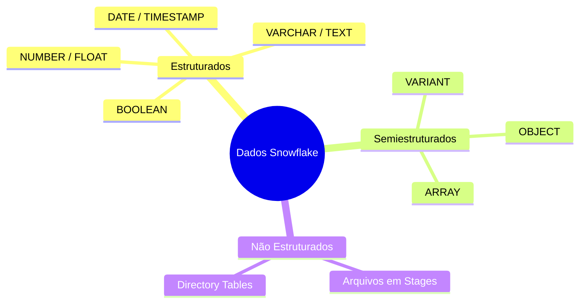
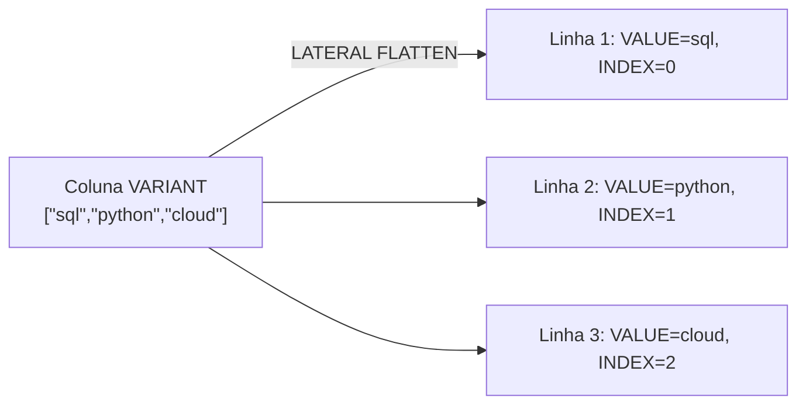
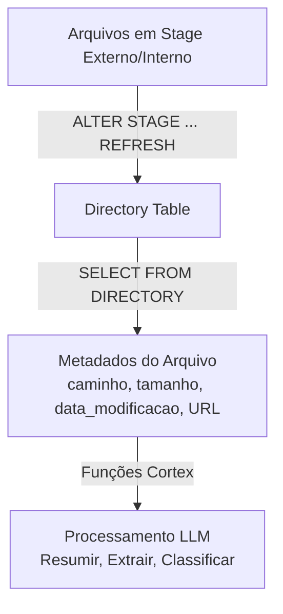
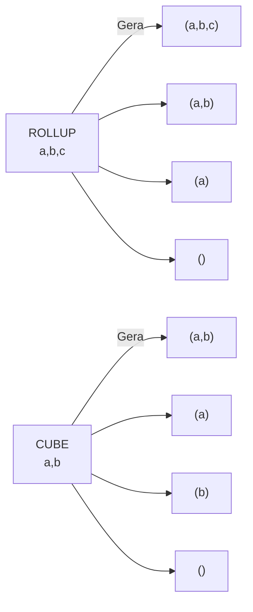
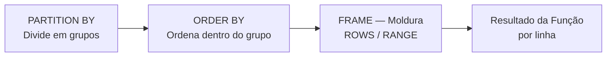
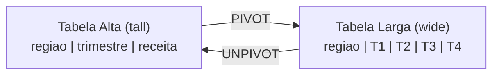
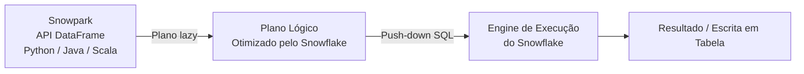
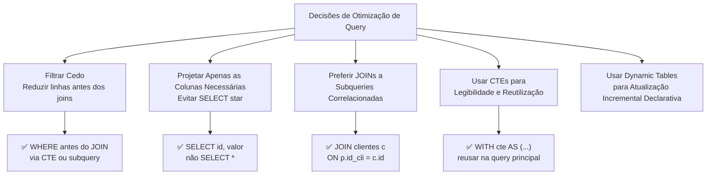

# Domínio 4.4 — Transformação de Dados no Snowflake

> [!NOTE]
> **Domínio de Exame 4.4** — *Transformação de Dados* contribui para o domínio **Otimização de Desempenho, Consultas e Transformação**, que representa **21%** do exame COF-C03.

---

## Panorama dos Tipos de Dados



---

## 1. Dados Semiestruturados — VARIANT

O Snowflake armazena JSON, Avro, ORC, Parquet e XML nativamente em uma coluna **VARIANT**. Nenhuma definição de schema é necessária no momento do carregamento.

### Operadores de Navegação

| Operador | Finalidade | Exemplo |
|---|---|---|
| `:` | Navegar por chave | `v:endereco:cidade` |
| `[n]` | Índice de array | `v:tags[0]` |
| `::TIPO` | Converter para tipo SQL | `v:valor::FLOAT` |

```sql
-- Carregar JSON e consultar com notação de dois pontos
CREATE TABLE eventos (v VARIANT);
COPY INTO eventos FROM @meu_stage/eventos.json.gz
  FILE_FORMAT = (TYPE = 'JSON');

SELECT
  v:id_usuario::INTEGER          AS id_usuario,
  v:nome_evento::VARCHAR         AS nome_evento,
  v:propriedades:pagina::VARCHAR AS pagina   -- chave aninhada
FROM eventos;
```

> [!WARNING]
> Sem a conversão `::TIPO`, as expressões retornam um **VARIANT** — comparações, ordenações e GROUP BY podem se comportar de forma inesperada.

### FLATTEN — Expandindo Arrays em Linhas



```sql
SELECT
  e.v:id_usuario::INT  AS id_usuario,
  f.value::VARCHAR     AS tag,
  f.index              AS indice_tag
FROM eventos e,
     LATERAL FLATTEN(INPUT => e.v:tags) f;
```

Colunas de saída principais do FLATTEN: `VALUE`, `KEY`, `INDEX`, `PATH`, `THIS`.

```sql
-- Flatten recursivo (todos os níveis de profundidade)
SELECT path, value
FROM eventos,
     LATERAL FLATTEN(INPUT => v, RECURSIVE => TRUE);
```

### Construindo Saída VARIANT

```sql
-- Construir um objeto VARIANT a partir de colunas
SELECT OBJECT_CONSTRUCT('id', id, 'nome', nome) AS linha_json
FROM clientes;

-- Agregar linhas em um array JSON
SELECT ARRAY_AGG(OBJECT_CONSTRUCT('id', id, 'cidade', cidade)) AS cidades
FROM clientes GROUP BY pais;
```

---

## 2. Dados Não Estruturados e Directory Tables



```sql
-- Habilitar directory table em um stage
CREATE STAGE meus_docs
  URL = 's3://bucket/docs/'
  DIRECTORY = (ENABLE = TRUE);

ALTER STAGE meus_docs REFRESH;

SELECT RELATIVE_PATH, SIZE, LAST_MODIFIED, FILE_URL
FROM DIRECTORY(@meus_docs);
```

---

## 3. Funções de Agregação

### Agregações Padrão

```sql
SELECT
  regiao,
  COUNT(*)                          AS total_pedidos,
  COUNT(DISTINCT id_cliente)        AS clientes_unicos,
  SUM(valor)                        AS receita,
  AVG(valor)                        AS media_pedido,
  MEDIAN(valor)                     AS mediana_valor,
  APPROX_COUNT_DISTINCT(id_sessao)  AS sessoes_aprox  -- HyperLogLog
FROM pedidos
GROUP BY regiao;
```

### GROUPING SETS, ROLLUP e CUBE



```sql
-- ROLLUP: subtotais ao longo de uma hierarquia (direita para esquerda)
SELECT regiao, pais, SUM(receita)
FROM vendas
GROUP BY ROLLUP(regiao, pais);

-- CUBE: toda combinação possível
SELECT regiao, produto, SUM(receita)
FROM vendas
GROUP BY CUBE(regiao, produto);

-- GROUPING SETS: combinações exatas que você define
SELECT regiao, produto, SUM(receita)
FROM vendas
GROUP BY GROUPING SETS ((regiao), (produto), (regiao, produto), ());
```

> [!WARNING]
> `ROLLUP(a, b)` ≠ `ROLLUP(b, a)`. Os subtotais são gerados **da direita para a esquerda** na lista — a ordem importa.

---

## 4. Funções de Janela (Window Functions)

As funções de janela calculam valores **em linhas relacionadas** sem reduzi-las a uma única linha de saída.

### Anatomia da Cláusula OVER



```sql
nome_funcao(args)
  OVER (
    [PARTITION BY expr_particao]
    [ORDER BY expr_ordenacao]
    [ROWS|RANGE BETWEEN inicio_moldura AND fim_moldura]
  )
```

### Funções de Ranking (Classificação)

```sql
SELECT
  produto, regiao, receita,
  ROW_NUMBER()   OVER (PARTITION BY regiao ORDER BY receita DESC) AS num_linha,
  RANK()         OVER (PARTITION BY regiao ORDER BY receita DESC) AS ranking,
  DENSE_RANK()   OVER (PARTITION BY regiao ORDER BY receita DESC) AS ranking_denso,
  NTILE(4)       OVER (PARTITION BY regiao ORDER BY receita DESC) AS quartil
FROM vendas;
```

| Função | Empates recebem mesmo ranking? | Lacunas após empates? |
|---|---|---|
| `ROW_NUMBER` | Não — desempate arbitrário | Não |
| `RANK` | **Sim** | **Sim** |
| `DENSE_RANK` | **Sim** | **Não** |

### Funções de Valor / Deslocamento (Offset)

```sql
SELECT
  data_pedido, valor,
  LAG(valor,  1, 0) OVER (ORDER BY data_pedido) AS valor_anterior,
  LEAD(valor, 1, 0) OVER (ORDER BY data_pedido) AS valor_seguinte,
  FIRST_VALUE(valor) OVER (ORDER BY data_pedido
    ROWS BETWEEN UNBOUNDED PRECEDING AND CURRENT ROW) AS primeiro_valor,
  LAST_VALUE(valor)  OVER (ORDER BY data_pedido
    ROWS BETWEEN CURRENT ROW AND UNBOUNDED FOLLOWING) AS ultimo_valor
FROM pedidos;
```

> [!WARNING]
> A moldura padrão do `LAST_VALUE` é `RANGE BETWEEN UNBOUNDED PRECEDING AND CURRENT ROW` — ele retorna a linha **atual**, não a última. Sempre adicione `ROWS BETWEEN CURRENT ROW AND UNBOUNDED FOLLOWING`.

### Agregações Acumuladas (Running Aggregates)

```sql
SELECT
  data_pedido, valor,
  SUM(valor) OVER (ORDER BY data_pedido
    ROWS BETWEEN UNBOUNDED PRECEDING AND CURRENT ROW) AS total_acumulado,
  AVG(valor) OVER (ORDER BY data_pedido
    ROWS BETWEEN 6 PRECEDING AND CURRENT ROW)         AS media_movel_7dias
FROM pedidos;
```

---

## 5. PIVOT e UNPIVOT



```sql
-- PIVOT: linhas → colunas
SELECT *
FROM (SELECT regiao, trimestre, receita FROM vendas)
PIVOT (SUM(receita) FOR trimestre IN ('T1','T2','T3','T4'))
AS p (regiao, t1, t2, t3, t4);

-- UNPIVOT: colunas → linhas
SELECT regiao, trimestre, receita
FROM resumo_trimestral
UNPIVOT (receita FOR trimestre IN (t1, t2, t3, t4));
```

---

## 6. CTEs Recursivas (Common Table Expressions Recursivas)

```sql
WITH RECURSIVE org AS (
  -- Âncora: funcionários de nível mais alto (sem gerente)
  SELECT id_funcionario, id_gerente, nome, 1 AS nivel
  FROM funcionarios WHERE id_gerente IS NULL
  UNION ALL
  -- Recursivo: cada subordinado
  SELECT f.id_funcionario, f.id_gerente, f.nome, o.nivel + 1
  FROM funcionarios f
  JOIN org o ON f.id_gerente = o.id_funcionario
)
SELECT * FROM org ORDER BY nivel, nome;
```

---

## 7. Transformações com Snowpark



```python
from snowflake.snowpark import Session
from snowflake.snowpark.functions import col, sum as sum_, when

session = Session.builder.configs(params_conexao).create()

resultado = (
    session.table("pedidos")
    .filter(col("status") == "CONCLUIDO")
    .with_column("faixa",
        when(col("valor") < 100, "baixo")
        .when(col("valor") < 500, "medio")
        .otherwise("alto"))
    .group_by("regiao", "faixa")
    .agg(sum_("valor").alias("total"))
    .sort("regiao", "total")
)

resultado.write.mode("overwrite").save_as_table("resumo_receita")
```

> [!NOTE]
> O Snowpark usa **avaliação preguiçosa (lazy evaluation)** — as transformações constroem um plano lógico. A execução só ocorre em chamadas de ação: `.collect()`, `.show()` ou uma operação de escrita.

---

## 8. Padrões de Otimização de SQL para Transformação

Saber escrever SQL de transformação eficiente é um objetivo do exame. O engine colunar de micro-partições do Snowflake recompensa certos padrões.



### Filtrar Cedo — Empurrar Predicados para Cima

```sql
-- ❌ Lento: faz join de todas as linhas, depois filtra
SELECT a.*, b.cidade
FROM pedidos_grandes a
JOIN clientes b ON a.id_cli = b.id
WHERE a.data_pedido > '2024-01-01';

-- ✅ Melhor: CTE filtra antes do join
WITH recentes AS (
    SELECT * FROM pedidos_grandes
    WHERE data_pedido > '2024-01-01'   -- poda micro-partições antecipadamente
)
SELECT r.*, c.cidade
FROM recentes r
JOIN clientes c ON r.id_cli = c.id;
```

### Evitar SELECT \*

```sql
-- ❌ Lê todas as colunas do disco (penalidade colunar)
SELECT * FROM pedidos;

-- ✅ Leia apenas o que você precisa
SELECT id_pedido, valor, status FROM pedidos;
```

### Subqueries Correlacionadas vs. JOINs

```sql
-- ❌ Subquery escalar correlacionada — reexecuta por linha
SELECT o.*, (SELECT nome FROM clientes WHERE id = o.id_cli) AS nome_cli
FROM pedidos o;

-- ✅ JOIN equivalente — passagem única
SELECT o.*, c.nome AS nome_cli
FROM pedidos o
JOIN clientes c ON o.id_cli = c.id;
```

### Dynamic Tables — Atualização Incremental Declarativa

As Dynamic Tables definem um conjunto de resultados de transformação e deixam o Snowflake determinar como atualizá-lo incrementalmente.

```sql
CREATE DYNAMIC TABLE resumo_pedidos
    TARGET_LAG = '10 minutes'          -- atraso aceitável
    WAREHOUSE = wh_pipeline
AS
    SELECT
        regiao,
        DATE_TRUNC('day', data_pedido) AS dia_pedido,
        COUNT(*)    AS qtd_pedidos,
        SUM(valor)  AS valor_total
    FROM raw.pedidos
    GROUP BY 1, 2;
```

> [!NOTE]
> As Dynamic Tables são **elegíveis para serverless** e rastreiam automaticamente as mudanças upstream. São o padrão preferido para pipelines ELT declarativos em vez de Streams + Tasks mantidos manualmente.

---

## Resumo

> [!SUCCESS]
> **Pontos-Chave para o Exame**
> - `v:chave::TIPO` — notação de dois pontos para navegar por chave, `[n]` para índice de array, `::` para converter VARIANT em tipo SQL.
> - `LATERAL FLATTEN` expande arrays/objetos em linhas; colunas de saída principais: `VALUE`, `KEY`, `INDEX`, `PATH`.
> - `ROLLUP` gera subtotais da direita para a esquerda; `CUBE` gera todas as combinações; `GROUPING SETS` define agrupamentos explícitos.
> - `RANK` tem lacunas após empates; `DENSE_RANK` não tem; `ROW_NUMBER` é sempre único.
> - A moldura padrão do `LAST_VALUE` para na linha atual — sempre adicione `ROWS BETWEEN CURRENT ROW AND UNBOUNDED FOLLOWING`.
> - Snowpark = avaliação preguiçosa; a computação só é disparada em chamadas de ação (`.collect()`, `.show()`, escrita).
> - Directory Tables expõem metadados de arquivos de stages; habilitadas com `DIRECTORY = (ENABLE = TRUE)`.
> - Filtre cedo e projete apenas as colunas necessárias para maximizar o pruning de micro-partições.
> - Prefira JOINs a subqueries correlacionadas; use Dynamic Tables para pipelines incrementais declarativos.

---

## Questões de Prática

**1.** JSON: `{"tags":["sql","python","cloud"]}`. Qual expressão retorna `"python"`?

- A) `v:tags::VARCHAR`
- B) `v:tags[1]::VARCHAR` ✅
- C) `v:tags[2]::VARCHAR`
- D) `v.tags[1]::VARCHAR`

---

**2.** `LATERAL FLATTEN(INPUT => v:tags)` — qual coluna contém o valor real da tag?

- A) `KEY`
- B) `INDEX`
- C) `VALUE` ✅
- D) `PATH`

---

**3.** Dados: `(A,100),(A,100),(B,200)` DESC. O que `RANK()` retorna para as duas linhas `A`?

- A) 2, 3
- B) 2, 2 ✅
- C) 1, 2
- D) 1, 1

---

**4.** `GROUP BY ROLLUP(regiao, pais)` com 3 regiões × 4 países produz quantos agrupamentos?

- A) 12
- B) 16
- C) 17 ✅ *(12 detalhes + 3 subtotais de região + 1 total geral)*
- D) 24

---

**5.** `LAST_VALUE` retorna a linha atual em vez da última linha em uma partição. Qual é a causa?

- A) Cláusula `PARTITION BY` ausente
- B) A moldura padrão termina em `CURRENT ROW` ✅
- C) `ORDER BY` é decrescente
- D) `LAST_VALUE` só funciona com `RANK()`

---

**6.** Um script Snowpark chama `.filter().group_by().agg()`, mas nenhum dado é retornado até `.collect()`. Isso descreve:

- A) Avaliação ansiosa (eager evaluation)
- B) Avaliação preguiçosa (lazy evaluation) ✅
- C) Compilação adiada
- D) Pipeline assíncrono

---

**7.** Qual função converte um array armazenado em uma coluna VARIANT em linhas individuais?

- A) `PARSE_JSON`
- B) `ARRAY_AGG`
- C) `LATERAL FLATTEN` ✅
- D) `OBJECT_CONSTRUCT`

---

**8.** Um desenvolvedor escreve uma query que faz join de duas tabelas grandes e depois aplica uma cláusula WHERE para filtrar por data. Um colega reescreve o filtro em uma CTE aplicada antes do join. Qual é o principal benefício da reescrita?

- A) A reescrita habilita o uso do cache de resultados
- B) A reescrita permite ao Snowflake podar micro-partições antes do join, reduzindo os dados escaneados ✅
- C) A reescrita evita custos da Cloud Services
- D) CTEs sempre executam mais rápido do que subqueries, independentemente da posição

---

**9.** Qual recurso do Snowflake permite definir uma transformação como uma query SQL e configurar um target lag, com o Snowflake gerenciando automaticamente a atualização incremental?

- A) Streams e Tasks
- B) Snowpipe Streaming
- C) Materialized Views
- D) Dynamic Tables ✅
