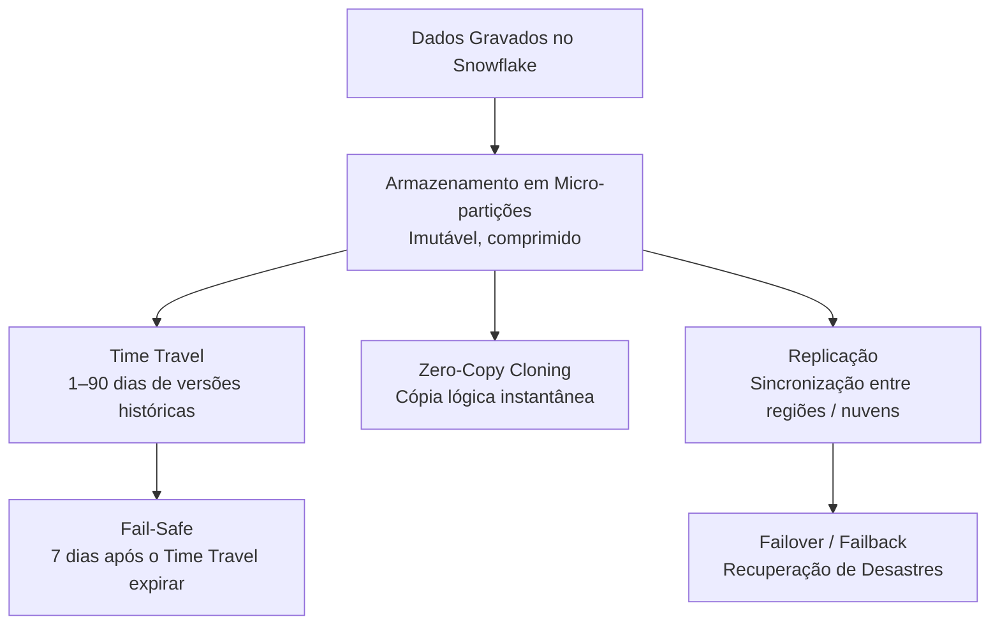
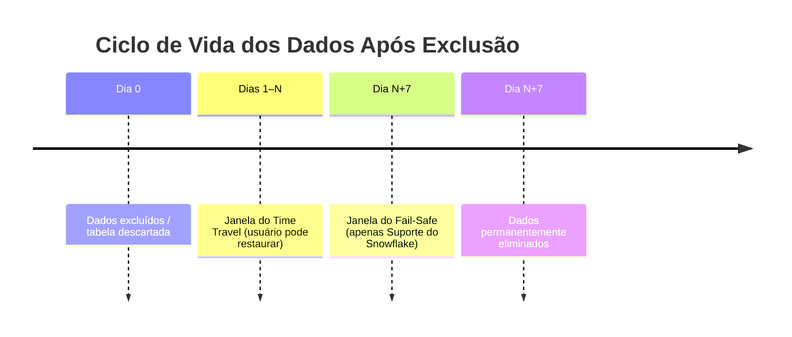
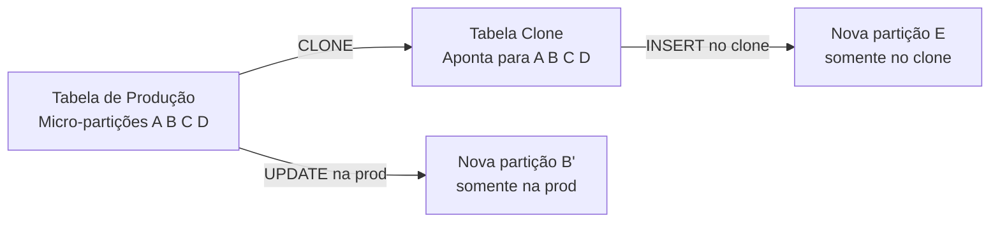
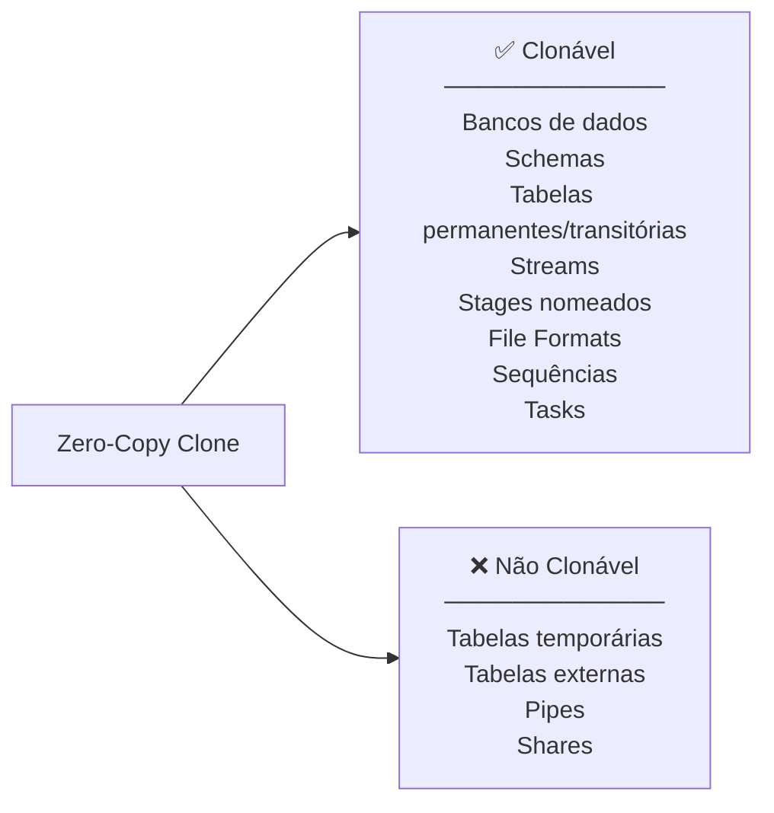
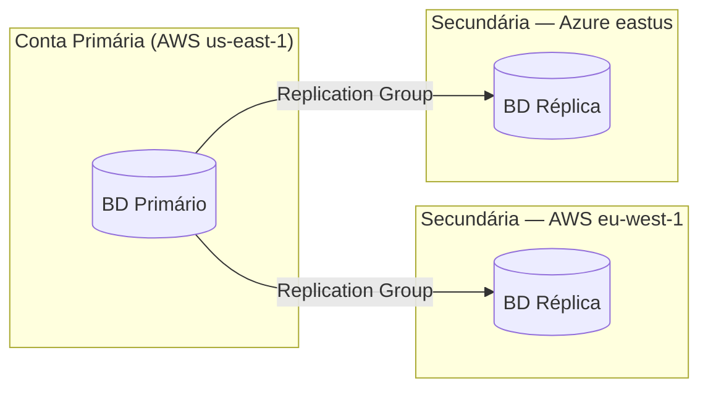
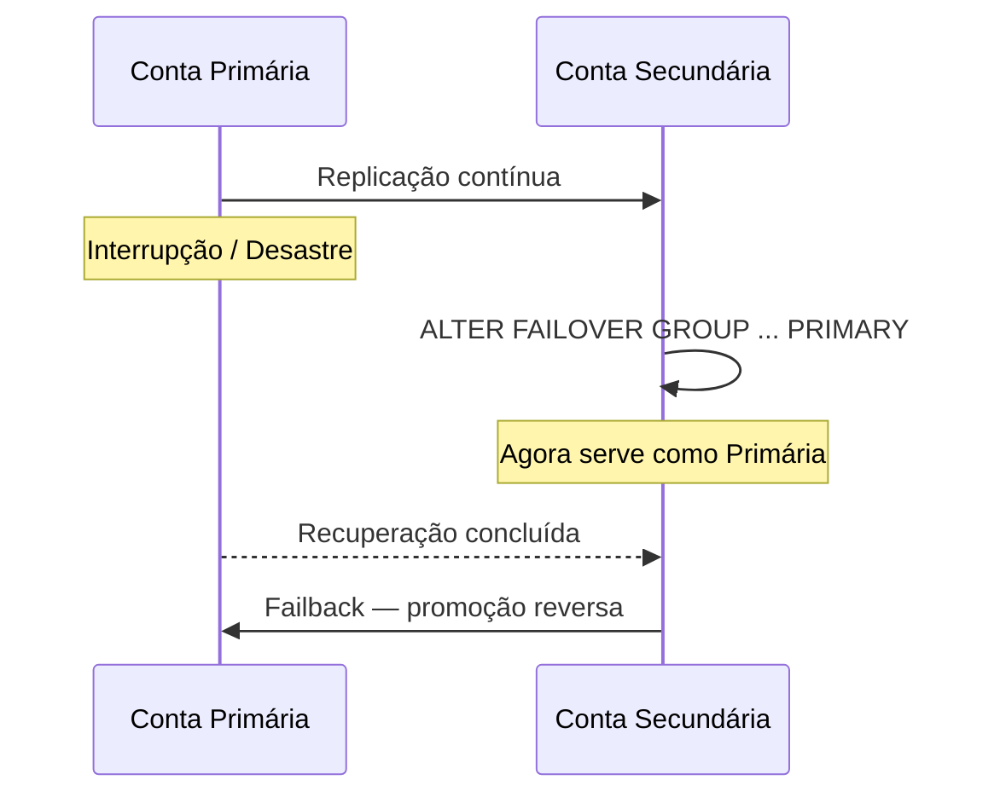
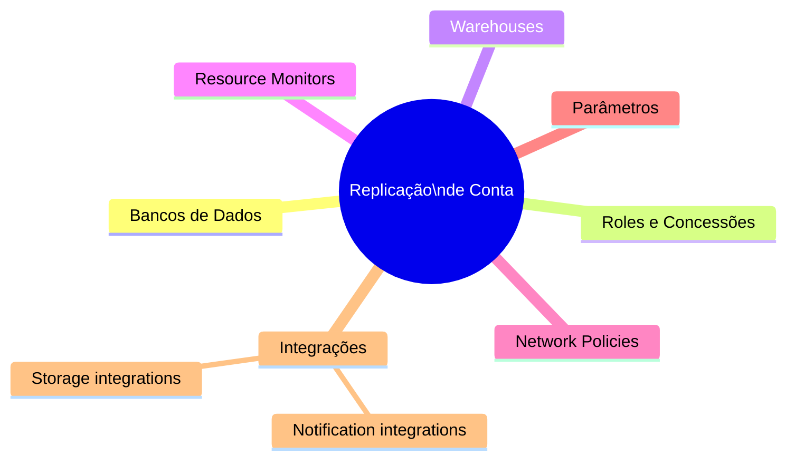

# Domínio 5.1 — Colaboração de Dados, Replicação e Continuidade de Negócios

> [!NOTE]
> **Domínio de Exame 5.1** — *Colaboração e Proteção de Dados* contribui para o domínio **Colaboração de Dados**, que representa **10%** do exame COF-C03.

A arquitetura multi-nuvem do Snowflake permite que organizações repliquem dados e objetos de conta entre regiões e provedores de nuvem, suportem recuperação de desastres com failover/failback e compartilhem snapshots do Time Travel — tudo sem movimentação manual de dados.

---

## Visão Geral: Camadas de Proteção de Dados



---

## 1. Time Travel (Contexto de Colaboração)

O Time Travel permite consultar, clonar ou restaurar dados **como existiam em um ponto passado no tempo** — útil tanto para recuperação de erros quanto para compartilhar snapshots históricos com consumidores.

```sql
-- Consultar dados de 2 horas atrás
SELECT * FROM pedidos AT (OFFSET => -7200);

-- Consultar em um timestamp específico
SELECT * FROM pedidos AT (TIMESTAMP => '2024-06-01 09:00:00'::TIMESTAMP);

-- Consultar pelo ID de instrução (antes de um DML específico executar)
SELECT * FROM pedidos BEFORE (STATEMENT => '<id_query>');

-- Clonar como em um momento específico (compartilhar snapshot histórico)
CREATE TABLE snapshot_pedidos CLONE pedidos
  AT (TIMESTAMP => '2024-06-01 00:00:00'::TIMESTAMP);
```

### Retenção do Time Travel por Edição

| Edição | Retenção Máxima | Padrão |
|---|---|---|
| Standard | **1 dia** | 1 dia |
| Enterprise+ | **90 dias** | 1 dia |

```sql
-- Alterar a retenção de uma tabela
ALTER TABLE pedidos SET DATA_RETENTION_TIME_IN_DAYS = 30;

-- Desabilitar o Time Travel
ALTER TABLE pedidos SET DATA_RETENTION_TIME_IN_DAYS = 0;
```

> [!WARNING]
> Tabelas com `DATA_RETENTION_TIME_IN_DAYS = 0` **não têm Time Travel**. O Fail-Safe ainda se aplica por 7 dias, mas é acessível apenas pelo Suporte do Snowflake.

---

## 2. Fail-Safe



| Propriedade | Valor |
|---|---|
| Duração | **7 dias** — sempre, não configurável |
| Acessível por | **Apenas Suporte do Snowflake** |
| Aplica-se a | Tabelas permanentes |
| NÃO se aplica a | Tabelas transitórias, tabelas temporárias |
| Armazenamento cobrado? | **Sim** — às taxas padrão de armazenamento |

> [!WARNING]
> **Tabelas Transient e Temporary NÃO têm Fail-Safe.** Esta é uma compensação deliberada de custo/risco: use-as apenas para dados efêmeros onde a recuperação não é necessária.

---

## 3. Zero-Copy Cloning (Clonagem Zero-Cópia)

A clonagem cria uma **cópia lógica instantânea** de um banco de dados, schema ou tabela — nenhum dado físico é duplicado no momento da criação. Clone e origem compartilham as mesmas micro-partições subjacentes até que qualquer um dos lados modifique os dados.



```sql
-- Clonar uma tabela
CREATE TABLE pedidos_dev CLONE pedidos;

-- Clonar um schema
CREATE SCHEMA schema_dev CLONE schema_prod;

-- Clonar um banco de dados
CREATE DATABASE bd_dev CLONE bd_prod;

-- Clonar em um ponto histórico (snapshot para colaboração)
CREATE TABLE snapshot_pedidos_t1 CLONE pedidos
  AT (TIMESTAMP => '2024-03-31 23:59:59'::TIMESTAMP);
```

### O que Pode Ser Clonado?



Fatos importantes:
- A clonagem é **instantânea** independentemente do tamanho dos dados.
- Nenhum armazenamento adicional é cobrado até que o clone divirja.
- Clones **herdam** o histórico de Time Travel da origem até o ponto de clone.
- A clonagem respeita **privilégios** — o clonador precisa de `CREATE` no destino e `SELECT` na origem.

---

## 4. Replicação

A replicação sincroniza **bancos de dados ou objetos de conta** de uma conta **primária** para uma ou mais contas **secundárias** (réplicas) entre regiões ou provedores de nuvem.

### Arquitetura de Replicação



### Replication Groups vs. Failover Groups

| Recurso | Replication Group | Failover Group |
|---|---|---|
| Finalidade | Réplicas somente leitura | Recuperação de desastres (failover) |
| Secundária gravável? | Não | Sim — após o failover |
| Suporta failover/failback? | **Não** | **Sim** |
| Objetos de conta incluídos? | Opcional | Sim |

```sql
-- Criar um replication group na primária
CREATE REPLICATION GROUP meu_rg
  OBJECT_TYPES = DATABASES, ROLES, WAREHOUSES
  ALLOWED_DATABASES = bd_prod
  ALLOWED_ACCOUNTS = minhaorg.conta_secundaria;

-- Atualizar a secundária (na conta secundária)
ALTER REPLICATION GROUP meu_rg REFRESH;
```

### Custo da Replicação

- O armazenamento para réplicas é cobrado às taxas padrão.
- **Taxas de transferência** de dados se aplicam para replicação entre regiões/nuvens.
- As operações de atualização consomem **créditos de computação**.

---

## 5. Failover e Failback

Os Failover Groups habilitam a **promoção automática ou manual** de uma conta secundária para primária — fornecendo continuidade de negócios.



```sql
-- Na PRIMÁRIA: criar um failover group
CREATE FAILOVER GROUP meu_fg
  OBJECT_TYPES = DATABASES, ROLES, WAREHOUSES, RESOURCE MONITORS
  ALLOWED_DATABASES = bd_prod
  ALLOWED_ACCOUNTS = minhaorg.conta_dr
  REPLICATION SCHEDULE = '10 MINUTE';

-- Na SECUNDÁRIA: promover para primária (failover)
ALTER FAILOVER GROUP meu_fg PRIMARY;

-- Failback: promover a primária original de volta
ALTER FAILOVER GROUP meu_fg PRIMARY;  -- executar na conta primária original
```

> [!NOTE]
> Os Failover Groups suportam um `REPLICATION SCHEDULE` — o Snowflake atualiza automaticamente a secundária no intervalo definido (mínimo 1 minuto).

---

## 6. Replicação de Conta (Objetos de Conta)

Além dos bancos de dados, o Snowflake pode replicar **objetos de nível de conta**:



Isso garante que, após o failover, a conta secundária tenha as mesmas roles, warehouses e políticas — não apenas os dados.

---

## Resumo

> [!SUCCESS]
> **Pontos-Chave para o Exame**
> - **Time Travel**: Standard = máx. 1 dia, Enterprise+ = máx. 90 dias. Definido por tabela com `DATA_RETENTION_TIME_IN_DAYS`.
> - **Fail-Safe**: Sempre 7 dias, não configurável, apenas Suporte do Snowflake. Tabelas transient/temp = SEM Fail-Safe.
> - **Zero-Copy Clone**: Instantâneo, sem custo de armazenamento até a divergência, herda o histórico de Time Travel.
> - **Replication Group**: Réplicas somente leitura; **Failover Group**: recuperação de desastres, secundária pode se tornar primária.
> - A replicação incorre em custos de armazenamento + transferência + computação.
> - Os Failover Groups suportam atualização automática agendada.

---

## Questões de Prática

**1.** Uma conta na edição Standard descarta uma tabela com retenção padrão. Por quantos dias um usuário pode restaurá-la via Time Travel?

- A) 0
- B) **1** ✅
- C) 7
- D) 90

---

**2.** Após o Time Travel expirar em uma tabela descartada, qual proteção adicional existe?

- A) Backup do replication group
- B) Fail-Safe do Snowflake por 7 dias ✅
- C) Backup automático por Zero-Copy Clone
- D) Nenhuma proteção adicional

---

**3.** Um desenvolvedor clona uma tabela de produção de 500 GB. Quanto armazenamento adicional é cobrado na criação do clone?

- A) 500 GB imediatamente
- B) 250 GB (50% de deduplicação)
- C) **0 GB — nenhum armazenamento é cobrado até o clone divergir** ✅
- D) Depende do período de retenção

---

**4.** Qual tipo de objeto suporta **failover** (promoção da secundária para primária)?

- A) Replication Group — incorreto, este é o Failover Group
- B) **Failover Group** ✅
- C) External Replication Policy
- D) Clone Group

---

**5.** Uma tabela transitória (transient) é descartada. Quais opções de recuperação existem?

- A) Apenas Time Travel
- B) Time Travel e Fail-Safe
- C) **Apenas Time Travel — tabelas transitórias não têm Fail-Safe** ✅
- D) Nem Time Travel nem Fail-Safe

---

**6.** Qual afirmação sobre replicação entre nuvens é VERDADEIRA?

- A) É gratuita — o Snowflake não cobra taxas de transferência
- B) Requer que ambas as contas usem o mesmo provedor de nuvem
- C) **Taxas de transferência de dados se aplicam para replicação entre regiões e entre nuvens** ✅
- D) Contas secundárias podem receber gravações sem failover

---

**7.** Um Failover Group é configurado com `REPLICATION SCHEDULE = '10 MINUTE'`. O que isso significa?

- A) A atualização manual deve ser acionada a cada 10 minutos
- B) **O Snowflake atualiza automaticamente a secundária a cada 10 minutos** ✅
- C) O failover ocorre automaticamente após 10 minutos de inatividade da primária
- D) A replicação é agrupada em janelas de 10 minutos sem sincronização intermediária
