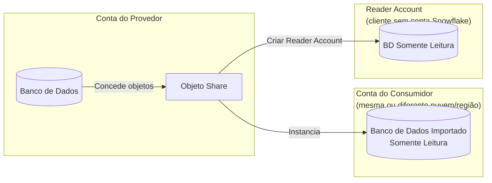
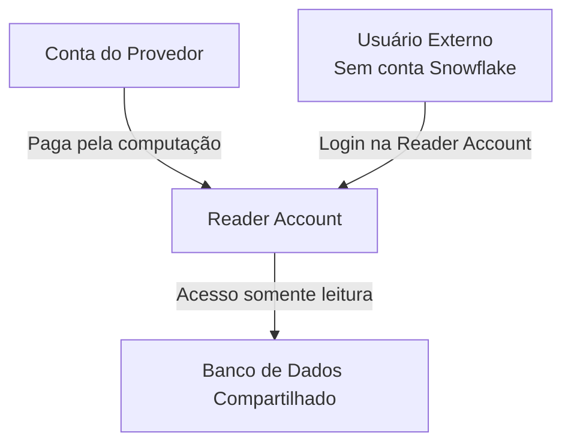
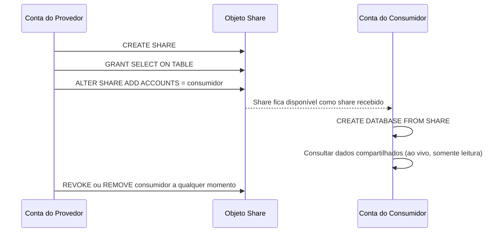
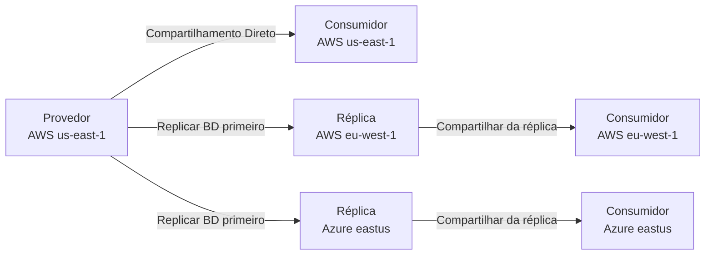
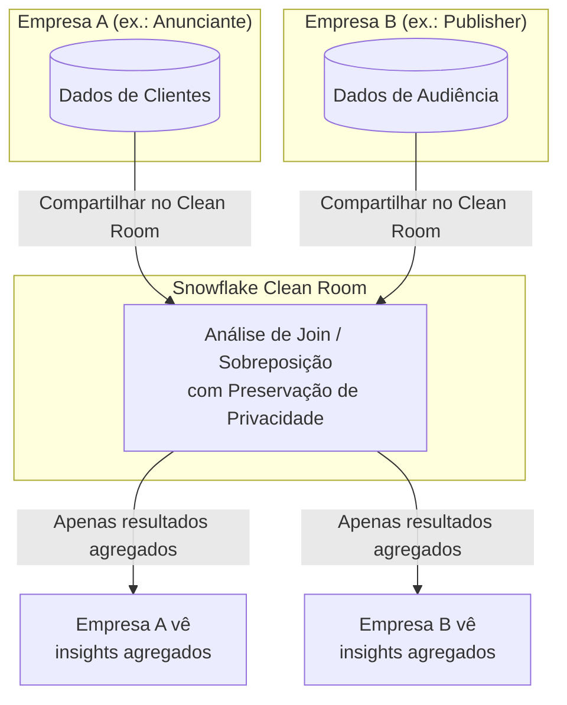
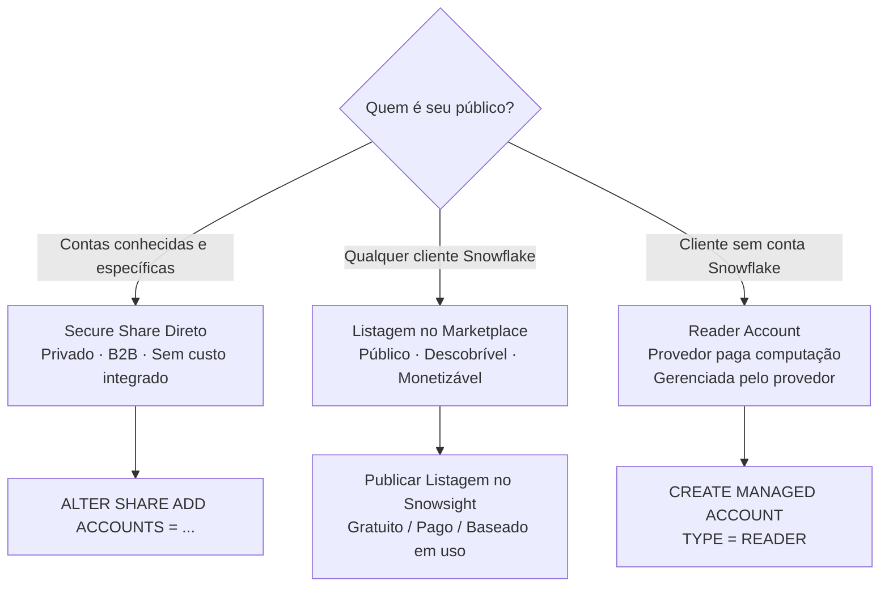

# Domínio 5.2 — Compartilhamento Seguro de Dados e Data Clean Rooms

> [!NOTE]
> **Domínio de Exame 5.2** — *Secure Data Sharing* contribui para o domínio **Colaboração de Dados**, que representa **10%** do exame COF-C03.

---

## Visão Geral: Como o Compartilhamento Funciona

O Snowflake Secure Data Sharing permite que um **provedor** compartilhe dados **ao vivo e somente leitura** com um **consumidor** — sem cópia de dados e sem necessidade de ETL.



Características principais:
- **Zero cópia de dados** — o consumidor lê diretamente do armazenamento do provedor.
- **Sempre ao vivo** — consumidores veem inserts/updates em tempo real.
- **Somente leitura** — consumidores não podem modificar os dados compartilhados.
- Compartilhamento **entre nuvens/regiões** requer replicação (abordado na Lição 17).

---

## 1. Secure Shares (Compartilhamentos Seguros)

### Criando e Gerenciando um Share

```sql
-- Criar um share
CREATE SHARE compartilhamento_vendas;

-- Conceder uso no banco de dados e schema
GRANT USAGE ON DATABASE bd_prod TO SHARE compartilhamento_vendas;
GRANT USAGE ON SCHEMA bd_prod.public TO SHARE compartilhamento_vendas;

-- Conceder acesso a objetos específicos
GRANT SELECT ON TABLE bd_prod.public.pedidos TO SHARE compartilhamento_vendas;
GRANT SELECT ON VIEW  bd_prod.public.resumo_pedidos TO SHARE compartilhamento_vendas;

-- Adicionar uma conta consumidora
ALTER SHARE compartilhamento_vendas ADD ACCOUNTS = org1.conta_consumidora;

-- Remover um consumidor
ALTER SHARE compartilhamento_vendas REMOVE ACCOUNTS = org1.conta_consumidora;

-- Ver os shares atuais
SHOW SHARES;
```

### Consumidor: Montando um Share

```sql
-- O consumidor cria um banco de dados local a partir do share recebido
CREATE DATABASE vendas_compartilhadas
  FROM SHARE org_provedora.compartilhamento_vendas;

-- Consultar como qualquer outra tabela (somente leitura)
SELECT * FROM vendas_compartilhadas.public.pedidos;
```

### O que Pode Ser Compartilhado?

| Objeto | Compartilhável? |
|---|---|
| Tabelas | ✅ |
| Tabelas externas | ✅ |
| Secure views | ✅ |
| Secure materialized views | ✅ |
| UDFs (seguras) | ✅ |
| Views regulares (não seguras) | ❌ |
| Stages, pipes, streams | ❌ |

> [!WARNING]
> Somente **SECURE** views e funções podem ser adicionadas a um share. Uma view regular expõe a definição de query subjacente, o que representa um risco de privacidade para os provedores.

---

## 2. Secure Views (Views Seguras)

Uma **Secure View** oculta a definição da view do consumidor. Sem a palavra-chave `SECURE`, um consumidor poderia inferir o modelo de dados do provedor.

```sql
-- View regular — definição visível para consumidores
CREATE VIEW resumo_pedidos AS
  SELECT regiao, SUM(valor) FROM pedidos GROUP BY regiao;

-- Secure view — definição oculta
CREATE SECURE VIEW resumo_pedidos AS
  SELECT regiao, SUM(valor) FROM pedidos GROUP BY regiao;
```

> [!NOTE]
> As Secure Views desativam certos atalhos do otimizador de queries. Isso pode torná-las **ligeiramente mais lentas** do que views regulares equivalentes. Use `SECURE` somente quando a view for compartilhada ou quando a privacidade da definição for necessária.

---

## 3. Reader Accounts (Contas de Leitura)

Uma **Reader Account** permite que provedores compartilhem dados com **clientes que não possuem uma conta Snowflake**. O provedor cria e gerencia a reader account.



```sql
-- Criar uma reader account (conta gerenciada)
CREATE MANAGED ACCOUNT minha_reader_account
  ADMIN_NAME = 'admin_reader'
  ADMIN_PASSWORD = 'SenhaSegura123!'
  TYPE = READER;

-- Adicionar a reader account ao share
ALTER SHARE compartilhamento_vendas ADD ACCOUNTS = minha_reader_account;
```

Fatos importantes sobre reader accounts:
- O **provedor paga** todos os custos de computação da reader account.
- As reader accounts são **totalmente gerenciadas** pelo provedor.
- Elas só podem acessar dados do **provedor que as criou**.
- Reader accounts não podem criar seus próprios shares.

---

## 4. Roles de Compartilhamento e o Modelo Provedor/Consumidor



---

## 5. Compartilhamento entre Nuvens e entre Regiões

O compartilhamento direto funciona entre contas na **mesma nuvem + região** sem configuração adicional. O compartilhamento entre nuvens ou entre regiões requer uma etapa de **replicação**.



---

## 6. Data Clean Rooms (Salas de Dados Limpos)

Um **Data Clean Room** é um ambiente de preservação de privacidade onde duas ou mais partes podem realizar análises conjuntas em **conjuntos de dados combinados** sem que nenhuma das partes veja os dados brutos da outra.

### Como Funcionam os Clean Rooms do Snowflake



Garantias de privacidade principais:
- Nenhuma das partes pode ver os registros **individuais** da outra.
- Analistas recebem apenas resultados **agregados ou estatísticos**.
- Políticas em nível de linha e controles de privacidade diferencial limitam a precisão dos resultados.
- Construídos sobre **RBAC + Row Access Policies** padrão do Snowflake.

### Casos de Uso

| Setor | Caso de Uso |
|---|---|
| Publicidade | Análise de sobreposição de audiência entre anunciante e publisher |
| Serviços financeiros | Detecção de fraude entre instituições |
| Saúde | Pesquisa multi-hospitalar sem expor prontuários de pacientes |
| Varejo | Colaboração de dados entre parceiros da cadeia de suprimentos |

> [!NOTE]
> A capacidade nativa de Clean Room do Snowflake é construída sobre o **Native App Framework** e o compartilhamento seguro. No exame, lembre-se de que os clean rooms impõem privacidade por meio de **limiares de agregação** e **secure views**, não por criptografia de inputs de queries.

---

## 7. Listagem no Marketplace vs. Compartilhamento Direto



| | Secure Share (Direto) | Listagem no Marketplace |
|---|---|---|
| Público | Contas específicas conhecidas | Qualquer cliente Snowflake |
| Descoberta | Privada | Pública (ou listagem privada) |
| Aprovação | Automática | Provedor pode exigir aprovação |
| Monetização | Não integrada | Via integração de cobrança do Snowflake |
| Caso de uso | Parcerias B2B | Produtos de dados, datasets SaaS |

---

## Resumo

> [!SUCCESS]
> **Pontos-Chave para o Exame**
> - O compartilhamento é **zero-cópia e ao vivo** — sem ETL, sem movimentação de dados.
> - Consumidores têm acesso **somente leitura**; não podem gravar em objetos compartilhados.
> - Apenas **secure views** e UDFs seguras podem ser adicionadas a shares.
> - **Reader Accounts**: para consumidores sem conta Snowflake; provedor paga a computação.
> - Compartilhamento entre nuvens/regiões requer **replicação** primeiro.
> - **Data Clean Rooms** habilitam análises conjuntas sem expor registros brutos — os resultados são apenas agregados.

---

## Questões de Prática

**1.** Um provedor adiciona uma view regular (não segura) a um share. O que acontece?

- A) Funciona — todas as views podem ser compartilhadas
- B) **Falha — apenas SECURE views podem ser adicionadas a shares** ✅
- C) A view é automaticamente convertida em uma secure view
- D) Os consumidores veem os dados, mas não a definição

---

**2.** Um consumidor monta o share de um provedor. 10 minutos depois o provedor insere novas linhas. Quando o consumidor vê as novas linhas?

- A) Após a próxima atualização agendada (diária)
- B) Após o consumidor reexecutar `CREATE DATABASE FROM SHARE`
- C) **Imediatamente — o compartilhamento é ao vivo e zero-cópia** ✅
- D) Após o provedor executar ALTER SHARE REFRESH

---

**3.** Qual tipo de conta permite que um provedor compartilhe dados com um cliente que não tem conta Snowflake?

- A) Conta secundária
- B) Managed account
- C) **Reader account** ✅
- D) Conta Business Critical

---

**4.** Quem paga pelos custos de computação em uma Reader Account?

- A) O reader/consumidor
- B) O Snowflake automaticamente
- C) **O provedor** ✅
- D) Dividido 50/50 entre provedor e consumidor

---

**5.** O provedor está no AWS us-east-1. O consumidor está no Azure eastus. O provedor pode compartilhar diretamente?

- A) Sim — o compartilhamento funciona entre todas as nuvens nativamente
- B) **Não — o compartilhamento entre nuvens requer replicação de banco de dados primeiro** ✅
- C) Não — o compartilhamento entre nuvens não é suportado
- D) Sim, mas apenas para provedores na edição Enterprise

---

**6.** Em um Data Clean Room, por que nenhuma das partes pode ver os dados brutos da outra?

- A) Os dados são criptografados com chaves diferentes
- B) Os resultados são roteados por um intermediário terceiro
- C) **Limiares de agregação e secure views restringem a saída a resultados agregados** ✅
- D) Linhas individuais são hash antes de serem compartilhadas

---

**7.** Quais tipos de objetos do Snowflake podem ser incluídos em um share? (Selecione todos que se aplicam)

- A) Tabelas ✅
- B) Secure views ✅
- C) Stages
- D) Tabelas externas ✅
- E) Streams
