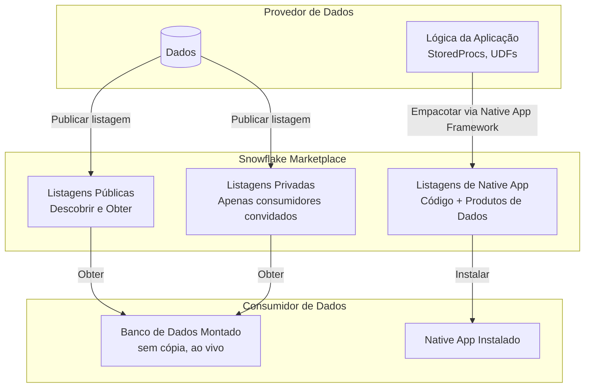
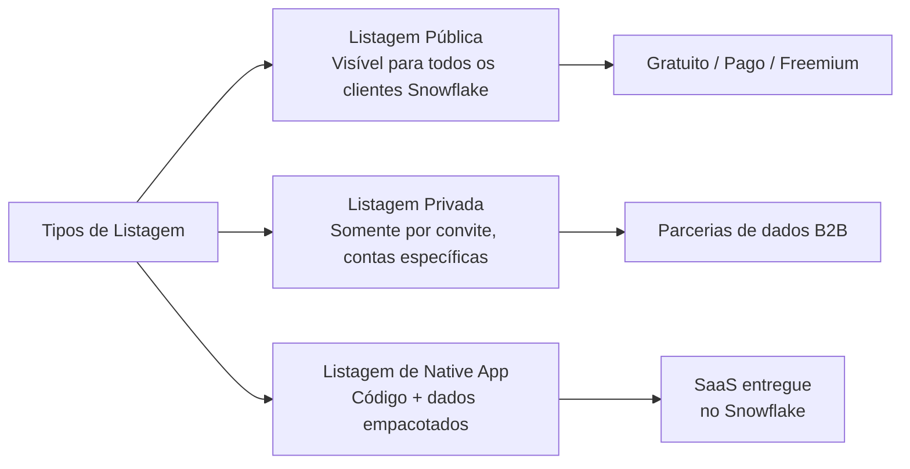
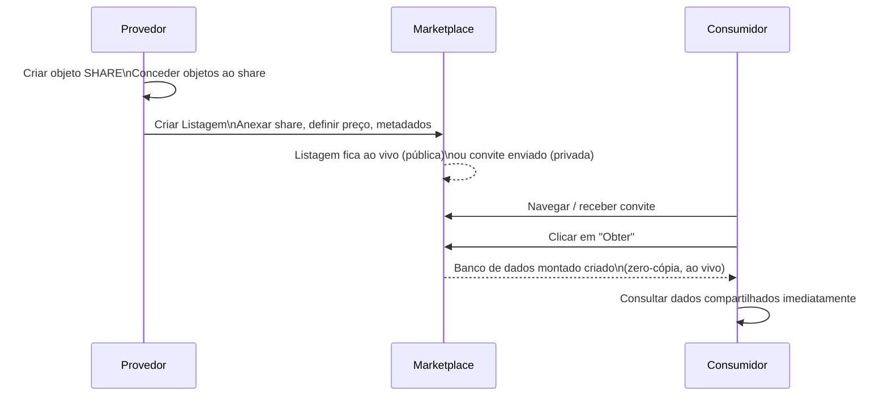
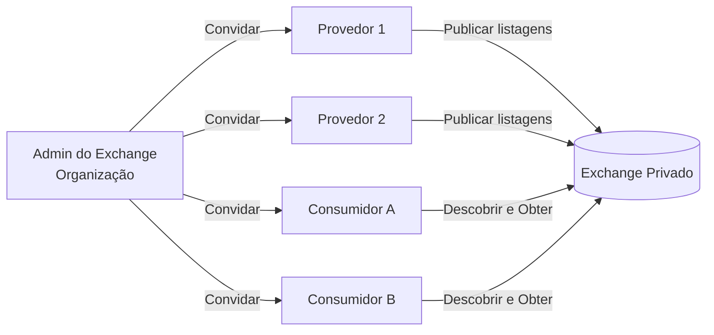
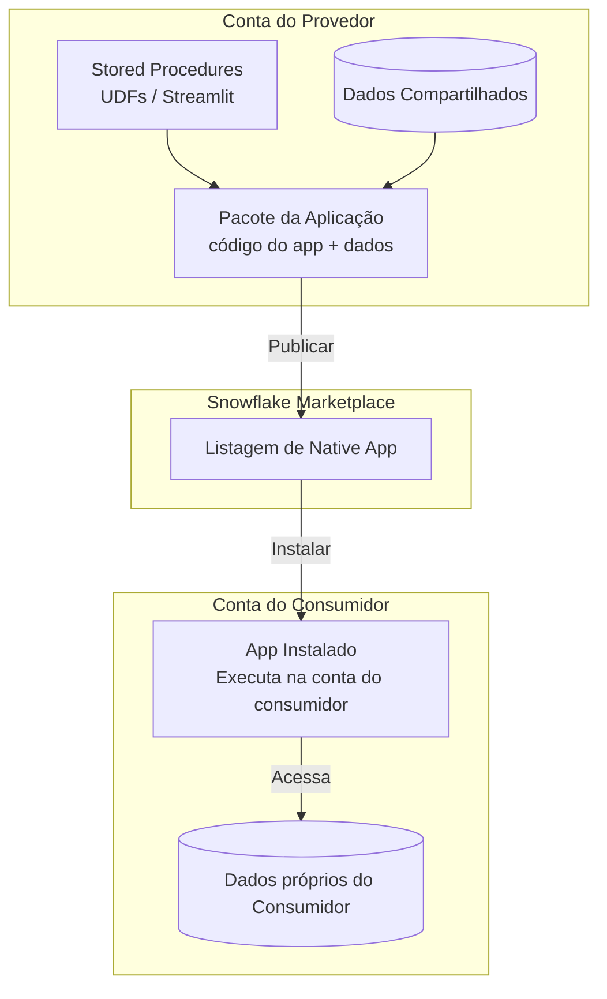
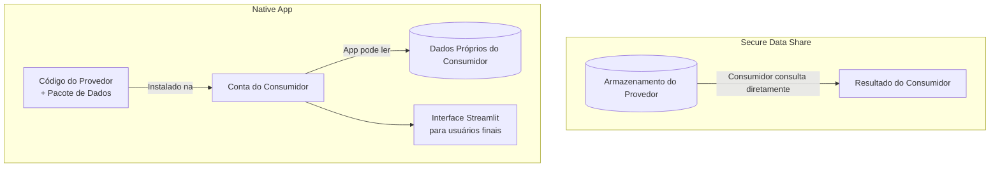
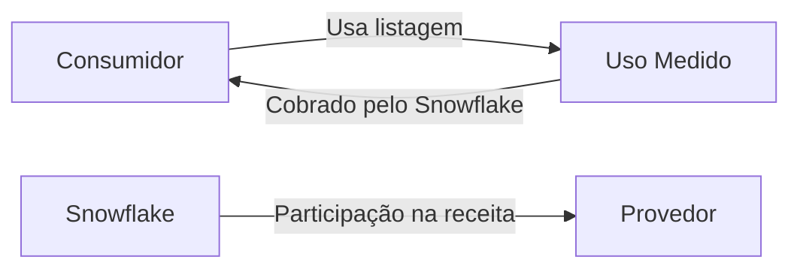

# Domínio 5.3 — Snowflake Marketplace e Native Apps

> [!NOTE]
> **Domínio de Exame 5.3** — *Snowflake Marketplace e Data Exchange* contribui para o domínio **Colaboração de Dados**, que representa **10%** do exame COF-C03.

---

## O Ecossistema de Colaboração de Dados



---

## 1. O que é o Snowflake Marketplace?

O **Snowflake Marketplace** é um catálogo global de produtos de dados ao vivo e prontos para consulta, acessíveis diretamente dentro do Snowflake. Os consumidores podem descobrir, testar e anexar conjuntos de dados sem nenhum ETL — os dados vivem na conta do provedor e são servidos via Secure Data Sharing.

### Características Principais

| Propriedade | Detalhe |
|---|---|
| Movimentação de dados | **Zero** — sem cópia, sem pipeline |
| Atualidade | **Ao vivo** — sempre os dados mais recentes do provedor |
| Integração | Segundos — "Obter" → banco de dados montado instantaneamente |
| Dados de teste | Provedores podem oferecer conjuntos de dados de amostra gratuitos |
| Listagens pagas | Cobradas pelo Snowflake; provedor define o preço |

---

## 2. Tipos de Listagem



### Listagens Públicas

Abertas a qualquer cliente Snowflake. Os consumidores pesquisam no Marketplace, clicam em **Obter** e recebem um banco de dados importado — sem etapa de aprovação para listagens gratuitas.

### Listagens Privadas

Direcionadas a contas consumidoras específicas. O provedor envia um convite; o consumidor reivindica a listagem. Ideal para:
- Parcerias de dados B2B
- Distribuição de dados proprietários para um público controlado
- Programas beta

```sql
-- Provedor: criar uma listagem privada (feito via UI do Snowsight ou SQL)
-- Verificar listagens existentes
SHOW LISTINGS;
```

### Dados Freemium / Teste

Os provedores podem anexar um **conjunto de dados de amostra** a qualquer listagem. Os consumidores testam a amostra gratuitamente e depois fazem upgrade para o conjunto de dados completo pago.

---

## 3. Publicando uma Listagem (Fluxo do Provedor)



Requisitos para provedores:
- Devem estar na edição **Business Critical** para produtos de dados em conformidade com HIPAA.
- Provedor e consumidor devem estar na **mesma nuvem/região** para compartilhamento direto, ou a replicação deve ser configurada para entre regiões.
- Metadados da listagem: título, descrição, queries de exemplo, documentação, dicionário de dados.

---

## 4. Consumindo uma Listagem (Fluxo do Consumidor)

```sql
-- Após clicar em "Obter" na UI do Marketplace do Snowsight,
-- um banco de dados é criado automaticamente. Você também pode referenciá-lo imediatamente:

USE DATABASE meus_dados_marketplace;

SHOW TABLES;

-- Query — sem custo de warehouse para o provedor, consumidor paga sua própria computação
SELECT * FROM meus_dados_marketplace.public.observacoes_clima
WHERE date >= CURRENT_DATE - 7;
```

> [!NOTE]
> O **consumidor paga pela computação** (créditos de virtual warehouse) para consultar dados do marketplace. O **provedor paga pelo armazenamento** dos dados subjacentes. Não há cobranças de royalties por query no nível de infraestrutura — o licenciamento/preço é tratado no nível da listagem.

---

## 5. Data Exchange (Troca de Dados)

Um **Data Exchange** é um **marketplace privado, apenas por convite**, que uma organização configura para um grupo definido de provedores e consumidores — por exemplo, um consórcio de parceiros do setor.



| | Marketplace | Data Exchange |
|---|---|---|
| Aberto a | Todos os clientes Snowflake | Apenas membros convidados |
| Gerenciado por | Snowflake | Organização do cliente |
| Caso de uso | Produtos de dados públicos | Consórcio do setor, org interna |

---

## 6. Native App Framework (Framework de Aplicações Nativas)

O **Snowflake Native App Framework** permite que provedores agrupem **lógica de aplicação** (stored procedures, UDFs, interface Streamlit) junto com dados em um app instalável — entregue via Marketplace.

### Arquitetura



### Propriedades Principais

| Propriedade | Detalhe |
|---|---|
| Executa em | **Conta do consumidor** — o código do provedor executa lá |
| Acesso a dados | App pode acessar os dados do consumidor (com permissão) |
| Visibilidade do provedor | Provedor **não pode** ver os dados do consumidor |
| Versionamento | Provedor envia atualizações; consumidor faz upgrade |
| Interface | Pode incluir uma interface **Streamlit** |

```sql
-- Provedor: criar um pacote de aplicação
CREATE APPLICATION PACKAGE meu_pacote_app;

-- Adicionar uma versão a partir de um stage contendo o manifesto do app
ALTER APPLICATION PACKAGE meu_pacote_app
  ADD VERSION v1_0 USING @meu_stage_app;

-- Lançar a versão
ALTER APPLICATION PACKAGE meu_pacote_app
  SET DEFAULT RELEASE DIRECTIVE VERSION = v1_0 PATCH = 0;

-- Consumidor: instalar o app
CREATE APPLICATION meu_app_instalado
  FROM APPLICATION PACKAGE org_provedora.meu_pacote_app
  USING VERSION v1_0;
```

### Native App vs. Compartilhamento Tradicional



| | Secure Data Share | Native App |
|---|---|---|
| O que é entregue | Apenas dados | Dados + código + interface |
| Executa na conta do consumidor? | Não — consumidor consulta o armazenamento do provedor | **Sim** |
| Acesso a dados do consumidor | Nenhum | App pode solicitar acesso |
| Interface Streamlit | Não | **Sim** |
| Versionamento | Não aplicável | **Sim** |

---

## 7. Monetização e Cobrança



- **Listagens gratuitas**: sem cobrança para o consumidor.
- **Listagens pagas**: consumidor cobrado pelo Snowflake; provedor recebe uma participação na receita.
- **Baseado em uso**: algumas listagens cobram por query ou por linha acessada.
- Provedores definem os preços; o Snowflake cuida da infraestrutura de cobrança e pagamento.

---

## Resumo

> [!SUCCESS]
> **Pontos-Chave para o Exame**
> - As listagens do Marketplace são **zero-cópia e ao vivo** — mesmo mecanismo de compartilhamento do Secure Data Sharing.
> - **Listagens públicas**: abertas a todos; **Listagens privadas**: apenas por convite; **Listagens de Native App**: código + dados.
> - **Data Exchange**: marketplace privado gerenciado por uma organização para um grupo controlado.
> - **Native Apps**: provedor empacota código + dados em um app instalável que executa na **conta do consumidor**.
> - Consumidor paga pela **computação**; provedor paga pelo **armazenamento**.
> - Acesso ao marketplace entre regiões/nuvens requer replicação.

---

## Questões de Prática

**1.** Um consumidor clica em "Obter" em uma listagem gratuita do Marketplace. O que acontece com os dados?

- A) Uma cópia completa é transferida para a conta do consumidor
- B) Um pipeline ETL noturno é configurado
- C) **Um banco de dados somente leitura é montado — nenhum dado é copiado** ✅
- D) O consumidor baixa um arquivo CSV

---

**2.** Qual tipo de listagem é visível apenas para contas Snowflake específicas que foram explicitamente convidadas?

- A) Listagem pública
- B) **Listagem privada** ✅
- C) Listagem freemium
- D) Listagem de Native App

---

**3.** Uma organização quer criar um hub de dados privado para 20 parceiros do setor — não aberto a todos os clientes Snowflake. Qual recurso deve ser usado?

- A) Snowflake Marketplace
- B) **Data Exchange** ✅
- C) Replication Group
- D) Private Share

---

**4.** Um Native App é instalado por um consumidor. Onde o código da aplicação é executado?

- A) Na conta do provedor
- B) Em um ambiente de hospedagem neutro do Snowflake
- C) **Na conta do consumidor** ✅
- D) Em um ambiente de computação externo

---

**5.** Qual é uma capacidade do Native App Framework que o Secure Data Sharing padrão NÃO suporta?

- A) Zero cópia de dados
- B) Acesso a dados ao vivo
- C) **Interface baseada em Streamlit incluída no produto entregue** ✅
- D) Acesso a dados entre contas

---

**6.** Quem paga o custo de computação quando um consumidor consulta dados de uma listagem do Marketplace?

- A) O provedor
- B) O Snowflake subsidia
- C) **O consumidor** ✅
- D) Dividido igualmente entre provedor e consumidor

---

**7.** Um provedor quer compartilhar um conjunto de dados com clientes pagantes pelo Snowflake Marketplace. Qual modelo de cobrança está disponível?

- A) O Snowflake não suporta listagens pagas
- B) Apenas assinaturas anuais de taxa fixa
- C) **Preços gratuito, de taxa fixa ou baseado em uso — cobrados pelo Snowflake** ✅
- D) Provedores devem gerenciar a cobrança fora do Snowflake
