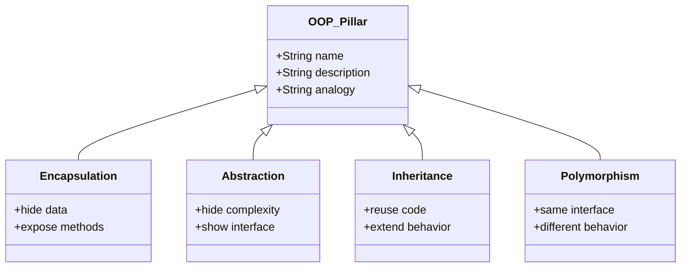
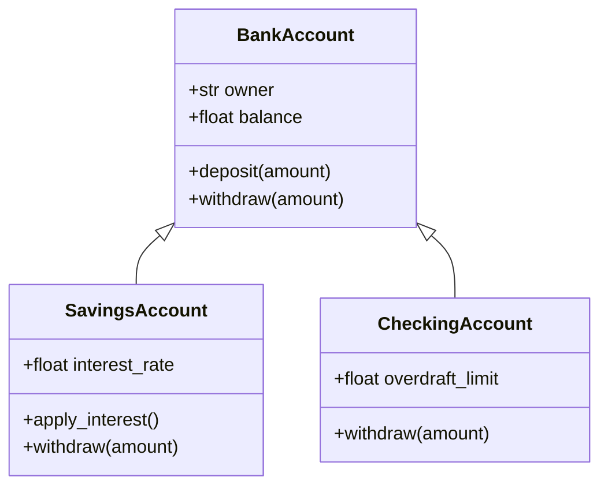
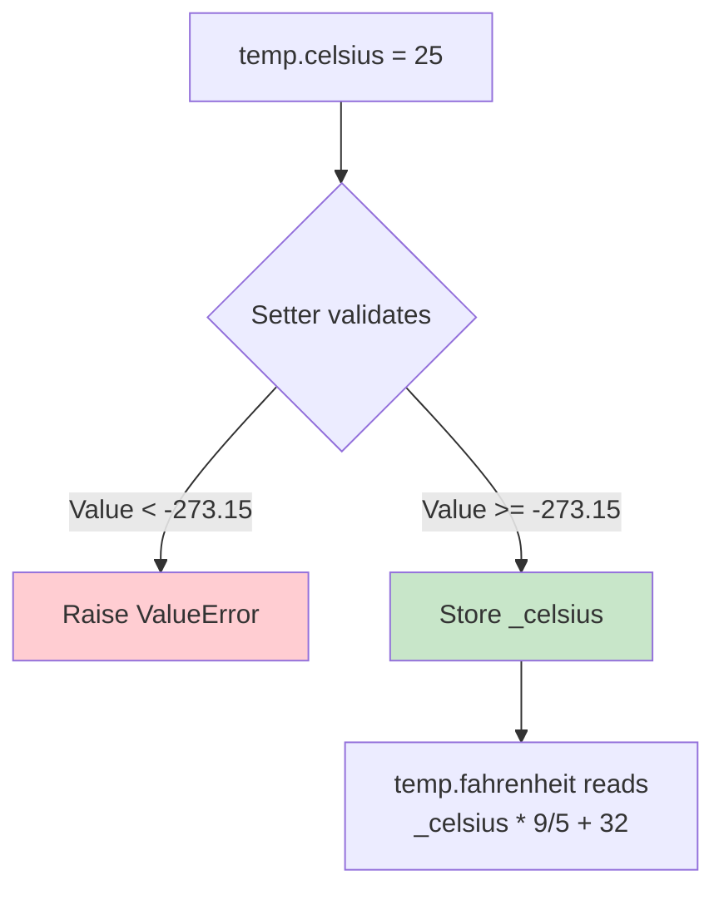
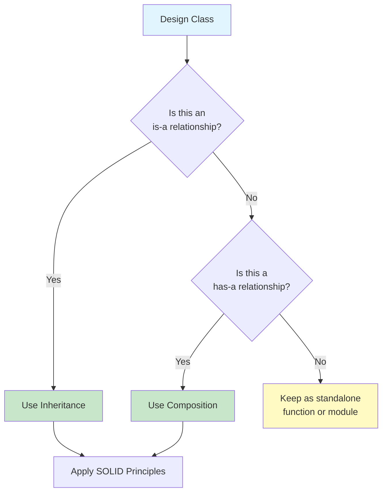

# OOP Fundamentals Review

Before diving into SOLID principles, let's solidify your understanding of Object-Oriented Programming fundamentals. This lesson reviews the four pillars of OOP and Python-specific class mechanics.

## The Four Pillars of OOP

Object-Oriented Programming rests on four core concepts:

| Pillar | Description | Real-World Analogy |
|--------|-------------|-------------------|
| **Encapsulation** | Bundle data and behavior; hide internal state | A vending machine: you press buttons, not touch the internals |
| **Abstraction** | Expose only essential details | A TV remote: buttons matter, circuits don't |
| **Inheritance** | Reuse behavior from a parent class | Children inherit traits from parents |
| **Polymorphism** | Objects of different types respond to the same interface | A cat and a dog both respond to `.speak()` |



## 1. Classes and Objects

A **class** is a blueprint. An **object** is an instance of that blueprint.

```python
class Product:
    def __init__(self, name: str, price: float, quantity: int = 0):
        self.name = name
        self.price = price
        self.quantity = quantity

    def total_value(self) -> float:
        return self.price * self.quantity

    def restock(self, amount: int) -> None:
        if amount <= 0:
            raise ValueError("Restock amount must be positive")
        self.quantity += amount

    def sell(self, amount: int) -> None:
        if amount <= 0:
            raise ValueError("Sell amount must be positive")
        if amount > self.quantity:
            raise ValueError("Insufficient stock")
        self.quantity -= amount

    def __repr__(self) -> str:
        return f"Product({self.name!r}, {self.price!r}, qty={self.quantity!r})"

laptop = Product("Laptop", 1200.00, 10)
laptop.sell(2)
laptop.restock(5)
print(laptop)                # Product('Laptop', 1200.0, qty=13)
print(laptop.total_value())  # 15600.0
```

> [!NOTE]
> `__init__` is the constructor. It's called automatically when you create an object. The `self` parameter refers to the current instance and must be the first parameter of every instance method.

## 2. Instance vs Class Attributes

```python
class Employee:
    company = "Acme Corp"       # Class attribute — shared by all instances
    pay_periods = 26            # Class attribute

    def __init__(self, name: str, salary: float):
        self.name = name        # Instance attribute — unique per instance
        self.salary = salary

    def paycheck_amount(self) -> float:
        return self.salary / self.pay_periods

alice = Employee("Alice", 78000)
bob = Employee("Bob", 65000)

print(alice.paycheck_amount())  # 3000.0
print(bob.paycheck_amount())    # 2500.0
print(alice.company)            # "Acme Corp"

alice.company = "Startup Inc"   # Shadows the class attribute — Alice only
print(alice.company)            # "Startup Inc"
print(bob.company)              # "Acme Corp" — unchanged
print(Employee.company)         # "Acme Corp" — unchanged
```

> [!WARNING]
> When you assign to an attribute via `self` or an instance, Python creates an instance attribute that *shadows* the class attribute. This can lead to subtle bugs if you're not careful.

## 3. Inheritance

Inheritance creates an "is-a" relationship between classes.

```python
class BankAccount:
    def __init__(self, owner: str, balance: float = 0.0):
        self.owner = owner
        self.balance = balance

    def deposit(self, amount: float) -> None:
        if amount <= 0:
            raise ValueError("Amount must be positive")
        self.balance += amount

    def withdraw(self, amount: float) -> None:
        if amount <= 0:
            raise ValueError("Amount must be positive")
        if amount > self.balance:
            raise ValueError("Insufficient funds")
        self.balance -= amount

    def __repr__(self) -> str:
        return f"{type(self).__name__}({self.owner!r}, {self.balance!r})"

class SavingsAccount(BankAccount):
    interest_rate = 0.04

    def apply_interest(self) -> None:
        interest = self.balance * self.interest_rate
        self.deposit(interest)

    def withdraw(self, amount: float) -> None:
        if amount > self.balance * 0.8:
            raise ValueError("Cannot withdraw more than 80% of balance")
        super().withdraw(amount)

class CheckingAccount(BankAccount):
    overdraft_limit = 500.0

    def withdraw(self, amount: float) -> None:
        if amount <= 0:
            raise ValueError("Amount must be positive")
        if amount > self.balance + self.overdraft_limit:
            raise ValueError("Overdraft limit exceeded")
        self.balance -= amount

sa = SavingsAccount("Alice", 10000)
sa.apply_interest()
print(sa.balance)  # 10400.0

ca = CheckingAccount("Bob", 1000)
ca.withdraw(1200)
print(ca.balance)  # -200.0
```



> [!SUCCESS]
> `super()` delegates to the parent class. Always call `super().__init__()` in child classes to ensure parent attributes are properly initialized.

## 4. Method Resolution Order (MRO)

Python uses C3 linearization to determine which method to call:

```python
class A:
    def identify(self):
        return "A"

class B(A):
    def identify(self):
        return "B"

class C(A):
    def identify(self):
        return "C"

class D(B, C):
    pass

d = D()
print(d.identify())  # "B"
print(D.__mro__)
# (<class 'D'>, <class 'B'>, <class 'C'>, <class 'A'>, <class 'object'>)
```

## 5. Polymorphism via ABCs

Abstract Base Classes enforce a contract across different implementations:

```python
from abc import ABC, abstractmethod
import math

class Shape(ABC):
    @abstractmethod
    def area(self) -> float:
        pass

    @abstractmethod
    def perimeter(self) -> float:
        pass

    def scale(self, factor: float) -> None:
        raise NotImplementedError

class Rectangle(Shape):
    def __init__(self, width: float, height: float):
        self.width = width
        self.height = height

    def area(self) -> float:
        return self.width * self.height

    def perimeter(self) -> float:
        return 2 * (self.width + self.height)

class Circle(Shape):
    def __init__(self, radius: float):
        self.radius = radius

    def area(self) -> float:
        return math.pi * self.radius ** 2

    def perimeter(self) -> float:
        return 2 * math.pi * self.radius

def print_shape_info(shape: Shape) -> None:
    print(f"{type(shape).__name__}: area={shape.area():.2f}, perimeter={shape.perimeter():.2f}")

shapes: list[Shape] = [Rectangle(5, 3), Circle(4)]
for s in shapes:
    print_shape_info(s)
```

## 6. Encapsulation with Properties

Use `@property` to control access to attributes:

```python
class Temperature:
    def __init__(self, celsius: float = 0.0):
        self._celsius = celsius

    @property
    def celsius(self) -> float:
        return self._celsius

    @celsius.setter
    def celsius(self, value: float) -> None:
        if value < -273.15:
            raise ValueError("Temperature below absolute zero")
        self._celsius = value

    @property
    def fahrenheit(self) -> float:
        return self._celsius * 9 / 5 + 32

    @fahrenheit.setter
    def fahrenheit(self, value: float) -> None:
        self.celsius = (value - 32) * 5 / 9

    @property
    def kelvin(self) -> float:
        return self._celsius + 273.15

t = Temperature(25)
print(t.fahrenheit)  # 77.0
t.fahrenheit = 100
print(t.celsius)     # 37.777...
# t.celsius = -300   # Raises ValueError!
```



## 7. Composition Over Inheritance

"Has-a" relationships are often more flexible than "is-a" ones:

```python
class Engine:
    def __init__(self, horsepower: int):
        self.horsepower = horsepower

    def start(self) -> str:
        return "Engine started"

    def stop(self) -> str:
        return "Engine stopped"

class Transmission:
    def __init__(self, gears: int = 6):
        self.gears = gears
        self.gear = 0

    def shift_up(self) -> str:
        if self.gear < self.gears:
            self.gear += 1
        return f"Shifted to gear {self.gear}"

    def shift_down(self) -> str:
        if self.gear > 0:
            self.gear -= 1
        return f"Shifted to gear {self.gear}"

class Car:
    def __init__(self, make: str, model: str, horsepower: int):
        self.make = make
        self.model = model
        self.engine = Engine(horsepower)
        self.transmission = Transmission()

    def drive(self) -> str:
        parts = [self.engine.start(), self.transmission.shift_up()]
        return " | ".join(parts)

    def park(self) -> str:
        parts = [self.transmission.shift_down(), self.engine.stop()]
        return " | ".join(parts)

car = Car("Honda", "Civic", 158)
print(car.drive())  # Engine started | Shifted to gear 1
```

> [!TIP]
> Prefer composition over inheritance. Inheritance creates tight coupling; composition lets you swap parts at runtime.

## 8. Dunder Methods Deep Dive

Special methods let objects integrate with Python syntax:

```python
from typing import Any

class Vector:
    def __init__(self, x: float, y: float):
        self.x = x
        self.y = y

    def __repr__(self) -> str:
        return f"Vector({self.x!r}, {self.y!r})"

    def __add__(self, other: "Vector") -> "Vector":
        if not isinstance(other, Vector):
            return NotImplemented
        return Vector(self.x + other.x, self.y + other.y)

    def __sub__(self, other: "Vector") -> "Vector":
        if not isinstance(other, Vector):
            return NotImplemented
        return Vector(self.x - other.x, self.y - other.y)

    def __mul__(self, scalar: float) -> "Vector":
        return Vector(self.x * scalar, self.y * scalar)

    def __abs__(self) -> float:
        import math
        return math.sqrt(self.x ** 2 + self.y ** 2)

    def __eq__(self, other: object) -> bool:
        if not isinstance(other, Vector):
            return NotImplemented
        return self.x == other.x and self.y == other.y

    def __bool__(self) -> bool:
        return self.x != 0 or self.y != 0

v1 = Vector(3, 4)
v2 = Vector(1, 2)
print(v1 + v2)      # Vector(4, 6)
print(v1 * 2)       # Vector(6, 8)
print(abs(v1))      # 5.0
print(v1 == Vector(3, 4))  # True
print(bool(Vector(0, 0)))  # False
```

| Method | Purpose | Trigger |
|--------|---------|---------|
| `__init__` | Constructor | `obj = Class()` |
| `__repr__` | Debug representation | `repr(obj)`, REPL |
| `__str__` | Human-readable string | `print(obj)`, `str(obj)` |
| `__add__` | Addition | `obj + other` |
| `__sub__` | Subtraction | `obj - other` |
| `__mul__` | Multiplication | `obj * other` |
| `__eq__` | Equality | `obj == other` |
| `__bool__` | Truthiness | `if obj:` |
| `__len__` | Length | `len(obj)` |
| `__getitem__` | Indexing | `obj[key]` |
| `__call__` | Callable object | `obj()` |

> [!SUCCESS]
> Implementing `__repr__` on every class is a habit that pays off enormously during debugging. The convention is to return a string that could recreate the object.

## 9. Before and After: Procedural to OOP

### Before: Procedural Code (Violation)

```python
# Procedural — scattered state and behavior
def create_account(owner, balance=0.0):
    return {"owner": owner, "balance": balance}

def deposit(account, amount):
    if amount <= 0:
        raise ValueError("Amount must be positive")
    account["balance"] += amount

def withdraw(account, amount):
    if amount <= 0:
        raise ValueError("Amount must be positive")
    if amount > account["balance"]:
        raise ValueError("Insufficient funds")
    account["balance"] -= amount

def transfer(from_acc, to_acc, amount):
    withdraw(from_acc, amount)
    deposit(to_acc, amount)

acc1 = create_account("Alice", 1000)
acc2 = create_account("Bob", 500)
deposit(acc1, 200)
transfer(acc1, acc2, 300)
print(acc1["balance"])  # 900
print(acc2["balance"])  # 800
```

### After: OOP Refactored

```python
class Account:
    def __init__(self, owner: str, balance: float = 0.0):
        self.owner = owner
        self._balance = balance

    @property
    def balance(self) -> float:
        return self._balance

    def deposit(self, amount: float) -> None:
        if amount <= 0:
            raise ValueError("Amount must be positive")
        self._balance += amount

    def withdraw(self, amount: float) -> None:
        if amount <= 0:
            raise ValueError("Amount must be positive")
        if amount > self._balance:
            raise ValueError("Insufficient funds")
        self._balance -= amount

    def transfer_to(self, target: "Account", amount: float) -> None:
        self.withdraw(amount)
        target.deposit(amount)

    def __repr__(self) -> str:
        return f"Account({self.owner!r}, balance={self._balance!r})"

acc1 = Account("Alice", 1000)
acc2 = Account("Bob", 500)
acc1.deposit(200)
acc1.transfer_to(acc2, 300)
print(acc1.balance)  # 900
print(acc2.balance)  # 800
```

## 10. Comparing Procedural vs OOP

| Aspect | Procedural | OOP |
|--------|-----------|-----|
| **State** | External dicts/variables | Encapsulated in objects |
| **Behavior** | Standalone functions | Methods on objects |
| **Reuse** | Copy-paste or helper functions | Inheritance + composition |
| **Coupling** | Tight (functions know dict structure) | Loose (interface-based) |
| **Testability** | Need to pass state manually | Self-contained objects |
| **Extensibility** | Modify existing functions | Add new classes |

## 11. Common OOP Pitfalls

```python
# PITFALL 1: Mutable default arguments
class ShoppingCart:
    def __init__(self, items: list = []):  # BAD: shared list!
        self.items = items

a = ShoppingCart()
b = ShoppingCart()
a.items.append("apple")
print(b.items)  # ['apple'] — shared!

# FIX:
class ShoppingCart:
    def __init__(self, items: list | None = None):
        self.items = items if items is not None else []

# PITFALL 2: Overusing inheritance
class Animal:
    def eat(self): ...
    def sleep(self): ...

class Car(Animal):  # BAD: Car is NOT an Animal
    ...

# FIX: Use composition
class Engine: ...
class Car:
    def __init__(self):
        self.engine = Engine()

# PITFALL 3: Breaking encapsulation
class Person:
    def __init__(self, name: str):
        self.name = name

p = Person("Alice")
p.name = ""  # Allowed — no validation!

# FIX: Use properties
class Person:
    def __init__(self, name: str):
        self._name = name

    @property
    def name(self) -> str:
        return self._name

    @name.setter
    def name(self, value: str) -> None:
        if not value.strip():
            raise ValueError("Name cannot be empty")
        self._name = value
```

> [!WARNING]
> Mutable default arguments are evaluated once at function definition time, not each time the function is called. Use `None` as the default and create a new mutable inside the method.



## Practice Exercises

1. Create a `Book` class with `title`, `author`, `isbn`, and `_available` (bool). Add methods `check_out()`, `return_book()`, and a property `available`.

2. Build an `InventoryItem` base class with `name`, `price`, `quantity`. Create `PerishableItem` (adds `expiry_date`) and `ElectronicItem` (adds `warranty_months`). Override `__repr__` on both.

3. Write a `Logger` class hierarchy: `Logger` (base, abstract), `FileLogger` (writes to file), `ConsoleLogger` (prints to stdout). Each implements `log(level, message)`.

4. Create a `Fraction` class that implements `__add__`, `__sub__`, `__mul__`, `__eq__`, and `__repr__`. Ensure fractions are always reduced (use `math.gcd`).

5. Refactor this procedural code into OOP:
   ```python
   students = {}
   def add_grade(student_id, course, grade):
       if student_id not in students:
           students[student_id] = {}
       students[student_id][course] = grade
   def gpa(student_id):
       grades = students[student_id].values()
       return sum(grades) / len(grades)
   ```

6. What is the MRO for `class E(A, B, C)` where `A` extends `object`, `B` extends `A`, and `C` extends `object`? Use `ClassName.__mro__` to verify your answer.

7. Implement a `Playlist` class with `__len__`, `__getitem__`, `__add__` (merge two playlists), and `__repr__`. Store songs as a list of `(title, artist)` tuples.

8. Explain why the following code violates encapsulation and fix it using properties:
   ```python
   class BankAccount:
       def __init__(self, owner, balance):
           self.owner = owner
           self.balance = balance  # Direct access — no validation
   ```

## Summary

- **Classes** are blueprints; **objects** are instances
- **Encapsulation** hides internal state via properties and private attributes
- **Abstraction** exposes only what's necessary (ABCs, interfaces)
- **Inheritance** enables code reuse but creates coupling
- **Polymorphism** allows different types to share the same interface
- **Composition** ("has-a") is often better than inheritance ("is-a")
- **Dunder methods** let objects integrate with Python syntax

> [!SUCCESS]
> You've refreshed your OOP knowledge. Now you're ready to apply SOLID principles to build maintainable, scalable object-oriented systems.
