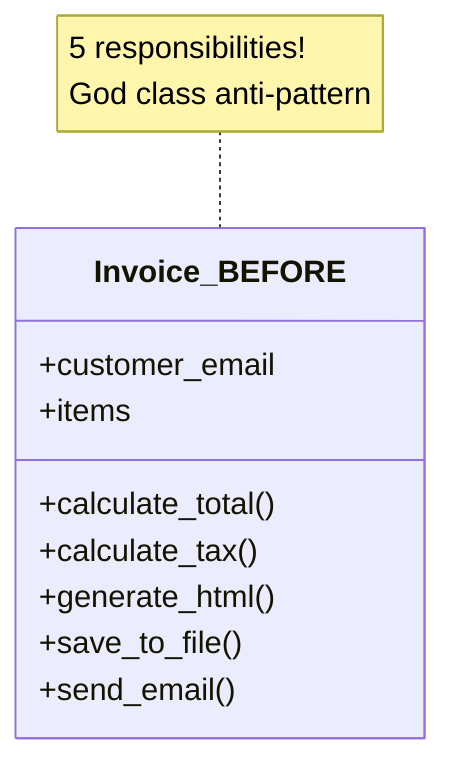
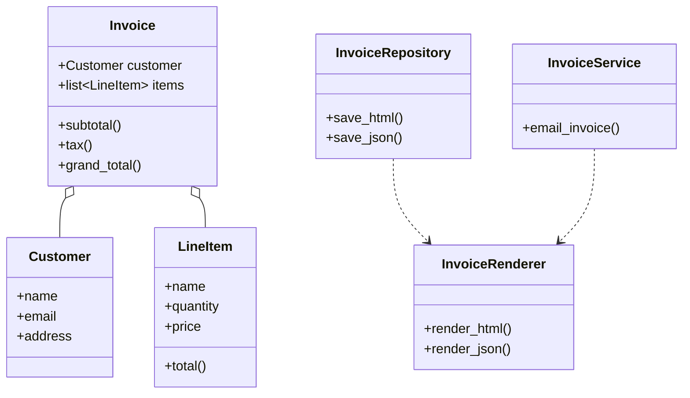
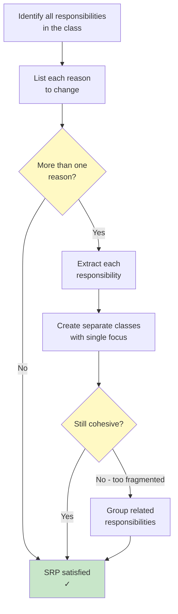

# Single Responsibility Principle (SRP)

> **A class should have one, and only one, reason to change.**

The Single Responsibility Principle is the first of the SOLID principles. It states that every class should have exactly one responsibility — one job to do, one reason to change. When a class takes on multiple responsibilities, it becomes fragile, hard to test, and difficult to maintain.

## The Problem: God Classes

A class with too many responsibilities is often called a "God class." It knows too much and does too much.

### BEFORE: SRP Violation

```python
import json
import smtplib
from email.message import EmailMessage
from pathlib import Path
from typing import Any

class Invoice:
    def __init__(self, customer_email: str, items: list[dict[str, Any]]):
        self.customer_email = customer_email
        self.items = items

    def calculate_total(self) -> float:
        return sum(item["price"] * item["quantity"] for item in self.items)

    def calculate_tax(self, tax_rate: float = 0.08) -> float:
        return self.calculate_total() * tax_rate

    def generate_html(self) -> str:
        total = self.calculate_total()
        tax = self.calculate_tax()
        items_html = "".join(
            f"<tr><td>{i['name']}</td><td>{i['quantity']}</td>"
            f"<td>${i['price']:.2f}</td><td>${i['price'] * i['quantity']:.2f}</td></tr>"
            for i in self.items
        )
        return f"""<html><body>
<h1>Invoice</h1>
<table><tr><th>Item</th><th>Qty</th><th>Price</th><th>Total</th></tr>
{items_html}
<tr><td colspan="3">Subtotal</td><td>${total:.2f}</td></tr>
<tr><td colspan="3">Tax (8%)</td><td>${tax:.2f}</td></tr>
<tr><td colspan="3">Grand Total</td><td>${total + tax:.2f}</td></tr>
</table></body></html>"""

    def save_to_file(self, filename: str = "invoice.html") -> None:
        html = self.generate_html()
        Path(filename).write_text(html)

    def send_email(self) -> None:
        html = self.generate_html()
        msg = EmailMessage()
        msg["Subject"] = "Your Invoice"
        msg["From"] = "billing@company.com"
        msg["To"] = self.customer_email
        msg.set_content(html, subtype="html")
        with smtplib.SMTP("smtp.company.com") as server:
            server.send_message(msg)
```

> [!WARNING]
> This `Invoice` class does **five** things: calculates totals, generates HTML, saves files, sends emails, and manages customer data. That's five reasons to change!

### Problems with this design:

| Responsibility | Why It's a Problem |
|--------------|-------------------|
| **Business logic** (calculations) | Changes when tax rules change |
| **Presentation** (HTML) | Changes when the design changes |
| **Persistence** (file saving) | Changes when storage changes |
| **Delivery** (email) | Changes when email logic changes |
| **Data** (customer info) | Changes when customer fields change |



### AFTER: SRP Refactored

Each class has exactly one responsibility:

```python
from dataclasses import dataclass
from typing import Any
from pathlib import Path
import json

# --- Responsibility 1: Data / Business Logic ---
@dataclass
class LineItem:
    name: str
    quantity: int
    price: float

    def total(self) -> float:
        return self.quantity * self.price

class Invoice:
    def __init__(self, customer: "Customer", items: list[LineItem]):
        self.customer = customer
        self.items = items

    def subtotal(self) -> float:
        return sum(item.total() for item in self.items)

    def tax(self, rate: float = 0.08) -> float:
        return self.subtotal() * rate

    def grand_total(self, rate: float = 0.08) -> float:
        return self.subtotal() + self.tax(rate)

@dataclass
class Customer:
    name: str
    email: str
    address: str

# --- Responsibility 2: Presentation ---
class InvoiceRenderer:
    @staticmethod
    def render_html(invoice: Invoice) -> str:
        items = "".join(
            f"<tr><td>{i.name}</td><td>{i.quantity}</td>"
            f"<td>${i.price:.2f}</td><td>${i.total():.2f}</td></tr>"
            for i in invoice.items
        )
        return f"""<html><body>
<h1>Invoice for {invoice.customer.name}</h1>
<table><tr><th>Item</th><th>Qty</th><th>Price</th><th>Total</th></tr>
{items}
<tr><td colspan="3">Subtotal</td><td>${invoice.subtotal():.2f}</td></tr>
<tr><td colspan="3">Tax</td><td>${invoice.tax():.2f}</td></tr>
<tr><td colspan="3">Grand Total</td><td>${invoice.grand_total():.2f}</td></tr>
</table></body></html>"""

    @staticmethod
    def render_json(invoice: Invoice) -> str:
        return json.dumps({
            "customer": invoice.customer.name,
            "email": invoice.customer.email,
            "items": [
                {"name": i.name, "qty": i.quantity,
                 "price": i.price, "total": i.total()}
                for i in invoice.items
            ],
            "subtotal": invoice.subtotal(),
            "tax": invoice.tax(),
            "grand_total": invoice.grand_total(),
        }, indent=2)

# --- Responsibility 3: Persistence ---
class InvoiceRepository:
    @staticmethod
    def save_html(invoice: Invoice, path: str = "invoice.html") -> None:
        html = InvoiceRenderer.render_html(invoice)
        Path(path).write_text(html)

    @staticmethod
    def save_json(invoice: Invoice, path: str = "invoice.json") -> None:
        data = InvoiceRenderer.render_json(invoice)
        Path(path).write_text(data)

# --- Responsibility 4: Delivery ---
class InvoiceService:
    def __init__(self, smtp_host: str = "smtp.company.com"):
        self.smtp_host = smtp_host

    def email_invoice(self, invoice: Invoice, recipient: str | None = None) -> None:
        import smtplib
        from email.message import EmailMessage

        html = InvoiceRenderer.render_html(invoice)
        msg = EmailMessage()
        msg["Subject"] = f"Invoice for {invoice.customer.name}"
        msg["From"] = "billing@company.com"
        msg["To"] = recipient or invoice.customer.email
        msg.set_content(html, subtype="html")

        with smtplib.SMTP(self.smtp_host) as server:
            server.send_message(msg)
```



> [!SUCCESS]
> Now each class has exactly one responsibility. The `Invoice` class handles business logic. `InvoiceRenderer` handles presentation. `InvoiceRepository` handles persistence. `InvoiceService` handles delivery. Each has one reason to change.

## How to Identify SRP Violations

Ask these questions about your class:

| Question | If Yes... |
|----------|-----------|
| Does this class have more than one "reason to change"? | SRP violated |
| Can I describe what this class does in one sentence without "and"? | SRP violated |
| Does this class depend on multiple, unrelated subsystems? | SRP violated |
| Would I need to modify this class for multiple different feature requests? | SRP violated |
| Is this class hard to test because of mixed concerns? | SRP violated |

### Another Example: User Management

**BEFORE: One class does everything**

```python
import hashlib
import re
import sqlite3
from typing import Optional

class UserManager:
    def __init__(self, db_path: str = "users.db"):
        self.db_path = db_path
        self._init_db()

    def _init_db(self) -> None:
        with sqlite3.connect(self.db_path) as conn:
            conn.execute("""
                CREATE TABLE IF NOT EXISTS users (
                    id INTEGER PRIMARY KEY AUTOINCREMENT,
                    email TEXT UNIQUE NOT NULL,
                    password_hash TEXT NOT NULL,
                    role TEXT DEFAULT 'user'
                )
            """)

    def register(self, email: str, password: str) -> int:
        if not re.match(r"[^@]+@[^@]+\.[^@]+", email):
            raise ValueError("Invalid email")
        if len(password) < 8:
            raise ValueError("Password too short")
        pw_hash = hashlib.sha256(password.encode()).hexdigest()
        with sqlite3.connect(self.db_path) as conn:
            cur = conn.execute(
                "INSERT INTO users (email, password_hash) VALUES (?, ?)",
                (email, pw_hash)
            )
            return cur.lastrowid

    def login(self, email: str, password: str) -> Optional[int]:
        pw_hash = hashlib.sha256(password.encode()).hexdigest()
        with sqlite3.connect(self.db_path) as conn:
            row = conn.execute(
                "SELECT id FROM users WHERE email=? AND password_hash=?",
                (email, pw_hash)
            ).fetchone()
            return row[0] if row else None

    def send_welcome_email(self, email: str) -> None:
        import smtplib
        from email.message import EmailMessage
        msg = EmailMessage()
        msg["Subject"] = "Welcome!"
        msg["From"] = "noreply@site.com"
        msg["To"] = email
        msg.set_content("Welcome to our platform!")
        with smtplib.SMTP("smtp.site.com") as server:
            server.send_message(msg)

    def log_activity(self, user_id: int, action: str) -> None:
        with sqlite3.connect(self.db_path) as conn:
            conn.execute(
                "INSERT INTO activity_log (user_id, action) VALUES (?, ?)",
                (user_id, action)
            )
```

> [!WARNING]
> `UserManager` handles validation, hashing, database operations, email sending, and logging. That's five responsibilities!

**AFTER: SRP-compliant refactoring**

```python
import hashlib
import re
from typing import Optional, Protocol

# --- Responsibility 1: Validation ---
class Validator:
    @staticmethod
    def validate_email(email: str) -> str:
        if not re.match(r"[^@]+@[^@]+\.[^@]+", email):
            raise ValueError("Invalid email format")
        return email

    @staticmethod
    def validate_password(password: str) -> str:
        if len(password) < 8:
            raise ValueError("Password must be at least 8 characters")
        if not re.search(r"[A-Z]", password):
            raise ValueError("Password must contain an uppercase letter")
        if not re.search(r"\d", password):
            raise ValueError("Password must contain a digit")
        return password

# --- Responsibility 2: Hashing ---
class PasswordHasher:
    @staticmethod
    def hash(password: str) -> str:
        salt = "fixed_salt"  # Use a proper salt in production
        return hashlib.sha256((password + salt).encode()).hexdigest()

    @staticmethod
    def verify(password: str, hash_value: str) -> bool:
        return PasswordHasher.hash(password) == hash_value

# --- Responsibility 3: Database Access ---
class UserRepository:
    def __init__(self, db_path: str = "users.db"):
        self.db_path = db_path
        self._init_db()

    def _init_db(self) -> None:
        import sqlite3
        with sqlite3.connect(self.db_path) as conn:
            conn.execute("""
                CREATE TABLE IF NOT EXISTS users (
                    id INTEGER PRIMARY KEY AUTOINCREMENT,
                    email TEXT UNIQUE NOT NULL,
                    password_hash TEXT NOT NULL,
                    role TEXT DEFAULT 'user'
                )
            """)

    def create(self, email: str, password_hash: str) -> int:
        import sqlite3
        with sqlite3.connect(self.db_path) as conn:
            cur = conn.execute(
                "INSERT INTO users (email, password_hash) VALUES (?, ?)",
                (email, password_hash)
            )
            return cur.lastrowid

    def find_by_email(self, email: str) -> Optional[dict]:
        import sqlite3
        with sqlite3.connect(self.db_path) as conn:
            row = conn.execute(
                "SELECT id, email, password_hash, role FROM users WHERE email=?",
                (email,)
            ).fetchone()
            if row:
                return {"id": row[0], "email": row[1],
                        "password_hash": row[2], "role": row[3]}
            return None

# --- Responsibility 4: Notification ---
class EmailService:
    def __init__(self, smtp_host: str = "smtp.site.com",
                 from_addr: str = "noreply@site.com"):
        self.smtp_host = smtp_host
        self.from_addr = from_addr

    def send_welcome(self, to: str) -> None:
        import smtplib
        from email.message import EmailMessage
        msg = EmailMessage()
        msg["Subject"] = "Welcome!"
        msg["From"] = self.from_addr
        msg["To"] = to
        msg.set_content("Welcome to our platform!")
        with smtplib.SMTP(self.smtp_host) as server:
            server.send_message(msg)

# --- Responsibility 5: Auditing ---
class AuditLogger:
    def __init__(self, db_path: str = "audit.db"):
        self.db_path = db_path
        self._init_db()

    def _init_db(self) -> None:
        import sqlite3
        with sqlite3.connect(self.db_path) as conn:
            conn.execute("""
                CREATE TABLE IF NOT EXISTS activity_log (
                    id INTEGER PRIMARY KEY AUTOINCREMENT,
                    user_id INTEGER, action TEXT, created_at TIMESTAMP DEFAULT CURRENT_TIMESTAMP
                )
            """)

    def log(self, user_id: int, action: str) -> None:
        import sqlite3
        with sqlite3.connect(self.db_path) as conn:
            conn.execute(
                "INSERT INTO activity_log (user_id, action) VALUES (?, ?)",
                (user_id, action)
            )

# --- Orchestration ---
class RegistrationService:
    def __init__(self, repo: UserRepository, hasher: PasswordHasher,
                 email_svc: EmailService, audit: AuditLogger):
        self.repo = repo
        self.hasher = hasher
        self.email_svc = email_svc
        self.audit = audit

    def register(self, email: str, password: str) -> dict:
        email = Validator.validate_email(email)
        Validator.validate_password(password)
        pw_hash = self.hasher.hash(password)
        user_id = self.repo.create(email, pw_hash)
        self.email_svc.send_welcome(email)
        self.audit.log(user_id, "user_registered")
        return {"id": user_id, "email": email}
```

> [!TIP]
> Notice how the SRP-compliant version is also easier to test. You can mock `UserRepository`, `EmailService`, and `AuditLogger` independently. Each class has clear inputs and outputs.

## Common Signs of SRP Violation

| Symptom | What It Means |
|---------|---------------|
| Class name has "And" or "Manager" | It probably manages too much |
| Class has unrelated fields or methods | Different responsibilities mixed |
| A method uses only some fields | The unused fields belong elsewhere |
| Testing requires multiple mocks | Dependencies cross concerns |
| Small changes touch many methods | Responsibilities are tangled |

## When SRP Seems Contradictory

Some developers worry that SRP leads to too many small classes. This is a valid concern. The goal is not to create a class for every tiny operation, but to group *cohesive* responsibilities together.

| Too Few Classes (God Class) | Too Many Classes (Over-fragmented) |
|----------------------------|------------------------------------|
| Hard to understand | Hard to follow the flow |
| Hard to test | Too much indirection |
| Hard to change | Too much ceremony |
| Merge conflicts common | Configuration overhead |

> [!NOTE]
> Finding the right granularity is a skill that improves with practice. A good rule of thumb: if your class has more than 5-7 public methods, consider whether it might have multiple responsibilities.



## Real-World: Report Generation

**BEFORE: Mixed concerns**

```python
class Report:
    def __init__(self, title: str, data: list[dict]):
        self.title = title
        self.data = data
        self.filters: list = []

    def add_filter(self, column: str, value) -> None:
        self.filters.append((column, value))

    def get_filtered_data(self) -> list[dict]:
        result = self.data[:]
        for col, val in self.filters:
            result = [r for r in result if r.get(col) == val]
        return result

    def compute_summary(self) -> dict:
        data = self.get_filtered_data()
        return {
            "count": len(data),
            "total": sum(r.get("amount", 0) for r in data),
            "average": sum(r.get("amount", 0) for r in data) / len(data) if data else 0,
        }

    def to_csv(self) -> str:
        data = self.get_filtered_data()
        if not data:
            return ""
        headers = list(data[0].keys())
        lines = [",".join(headers)]
        for row in data:
            lines.append(",".join(str(row.get(h, "")) for h in headers))
        return "\n".join(lines)

    def to_json(self) -> str:
        import json
        return json.dumps(self.get_filtered_data(), indent=2)

    def save(self, filename: str, fmt: str = "csv") -> None:
        from pathlib import Path
        if fmt == "csv":
            Path(filename).write_text(self.to_csv())
        elif fmt == "json":
            Path(filename).write_text(self.to_json())
```

**AFTER: Separated concerns**

```python
from typing import Any, Callable
from dataclasses import dataclass

@dataclass
class ReportData:
    title: str
    rows: list[dict[str, Any]]

class DataFilter:
    def __init__(self):
        self.filters: list[tuple[str, Any]] = []

    def add(self, column: str, value: Any) -> None:
        self.filters.append((column, value))

    def apply(self, data: ReportData) -> ReportData:
        result = data.rows[:]
        for col, val in self.filters:
            result = [r for r in result if r.get(col) == val]
        return ReportData(data.title, result)

class ReportCalculator:
    @staticmethod
    def summary(data: ReportData) -> dict:
        amounts = [r.get("amount", 0) for r in data.rows]
        return {
            "count": len(data.rows),
            "total": sum(amounts),
            "average": sum(amounts) / len(amounts) if amounts else 0,
        }

class ReportFormatter:
    @staticmethod
    def to_csv(data: ReportData) -> str:
        if not data.rows:
            return ""
        headers = list(data.rows[0].keys())
        lines = [",".join(headers)]
        for row in data.rows:
            lines.append(",".join(str(row.get(h, "")) for h in headers))
        return "\n".join(lines)

    @staticmethod
    def to_json(data: ReportData) -> str:
        import json
        return json.dumps(data.rows, indent=2)

class ReportRepository:
    @staticmethod
    def save(data: ReportData, filename: str, content: str) -> None:
        from pathlib import Path
        Path(filename).write_text(content)
```

## When to Apply SRP

| Scenario | Apply SRP? | Why |
|----------|-----------|-----|
| Single method class | No | Just use a function |
| Data class (dataclass) | Usually no | It holds data, one job |
| Class with mixed persistence + logic | Yes | Two reasons to change |
| Class doing calculations + rendering | Yes | Business logic != presentation |
| Class handling auth + logging | Yes | Different concerns |

> [!SUCCESS]
> SRP makes your code easier to understand, test, and maintain. Each class tells a clear story: "I do this one thing, and I do it well."

## Practice Exercises

1. Identify the SRP violations in this class and refactor it:
   ```python
   class Order:
       def __init__(self, items, customer):
           self.items = items
           self.customer = customer
       def total(self): ...
       def print_order(self): ...
       def save_to_db(self): ...
       def send_confirmation(self): ...
       def apply_discount(self, code): ...
       def generate_label(self): ...
   ```

2. A `DataProcessor` class reads CSV files, cleans data, runs ML models, generates charts, and emails reports. How would you split it using SRP? List the new classes.

3. Refactor the following code to follow SRP:
   ```python
   class BlogPost:
       def __init__(self, title, body, author):
           self.title = title
           self.body = body
           self.author = author
           self.comments = []
       def add_comment(self, text, user): ...
       def to_html(self): ...
       def save(self): ...
       def send_notification(self): ...
       def validate(self): ...
   ```

4. What is the "one reason to change" for each of these classes: `Invoice`, `InvoiceRenderer`, `InvoiceRepository`, `InvoiceService`?

5. A `UserSettings` class handles loading/saving settings to a config file AND applying those settings to the UI. Is this an SRP violation? Why? How would you fix it?

6. Create a simple calculator system where the calculator logic, input parsing, and result display are in separate classes following SRP.

7. Review your own codebase and find one class that violates SRP. Describe what responsibilities it has and propose a refactoring.

8. Explain in your own words: how does SRP improve testability? Give a concrete example.

## Summary

- **SRP**: A class should have one, and only one, reason to change
- **God classes** with multiple responsibilities are hard to maintain
- **Signs of violation**: class names with "And" or "Manager", unrelated methods, wide testing surfaces
- **Refactoring**: extract each responsibility into its own class, then compose them
- **Testing benefit**: each small class is independently testable with minimal mocking
- **Balance**: don't over-fragment — group cohesive responsibilities together

> [!SUCCESS]
> SRP is the foundation of clean OOP design. When every class has one job, your code becomes modular, testable, and a pleasure to work with.
