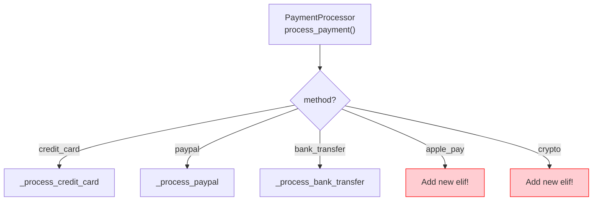
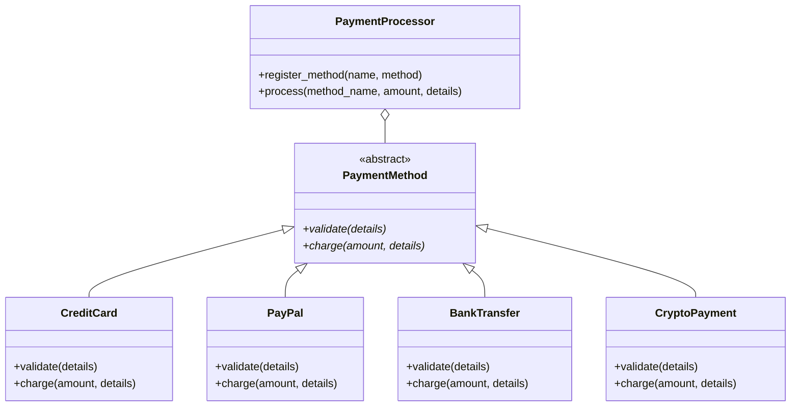
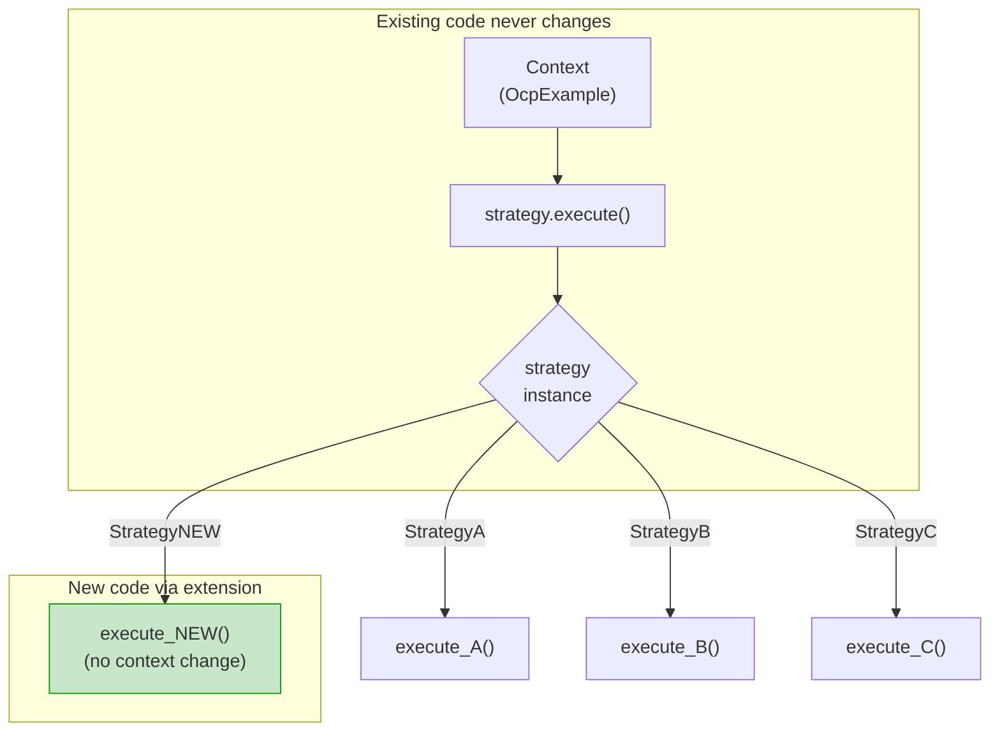
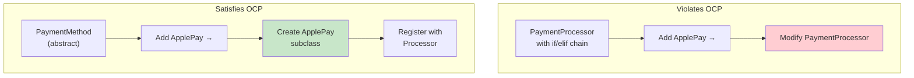

# Open-Closed Principle (OCP)

> **Software entities (classes, modules, functions) should be open for extension, but closed for modification.**

The Open-Closed Principle is the second SOLID principle. It means you should be able to add new functionality without changing existing code. Instead of modifying a class to support new behavior, you extend it through inheritance, composition, or plug-in architectures.

## The Problem: Modification Cascades

When code isn't closed for modification, every new feature requires changing existing code. This leads to bugs, regressions, and merge conflicts.

### BEFORE: OCP Violation

Imagine a payment processing system where every new payment method requires modifying the processor:

```python
from typing import Any

class PaymentProcessor:
    def process_payment(self, method: str, amount: float,
                        details: dict[str, Any]) -> str:
        if method == "credit_card":
            return self._process_credit_card(amount, details)
        elif method == "paypal":
            return self._process_paypal(amount, details)
        elif method == "bank_transfer":
            return self._process_bank_transfer(amount, details)
        else:
            raise ValueError(f"Unknown payment method: {method}")

    def _process_credit_card(self, amount: float,
                             details: dict[str, Any]) -> str:
        card_number = details.get("card_number")
        cvv = details.get("cvv")
        if not card_number or not cvv:
            raise ValueError("Missing credit card details")
        if len(str(card_number)) != 16:
            raise ValueError("Invalid card number")
        print(f"Charging ${amount:.2f} to card ending in {str(card_number)[-4:]}")
        return f"cc_txn_{hash(card_number)}"

    def _process_paypal(self, amount: float,
                        details: dict[str, Any]) -> str:
        email = details.get("email")
        password = details.get("password")
        if not email or not password:
            raise ValueError("Missing PayPal credentials")
        print(f"Processing ${amount:.2f} via PayPal for {email}")
        return f"pp_txn_{hash(email)}"

    def _process_bank_transfer(self, amount: float,
                               details: dict[str, Any]) -> str:
        routing = details.get("routing_number")
        account = details.get("account_number")
        if not routing or not account:
            raise ValueError("Missing bank account details")
        print(f"Transferring ${amount:.2f} to account {str(account)[-4:]}")
        return f"bt_txn_{hash(account)}"
```

> [!WARNING]
> Every time a new payment method is needed (e.g., `"crypto"`, `"apple_pay"`), you must modify the `PaymentProcessor` class. This violates OCP — the class is not closed for modification.



### Problems with this design:

| Problem | Impact |
|---------|--------|
| **Modification required** | Every new payment method changes existing code |
| **Risk of regression** | Adding a method could break existing ones |
| **Large conditional chains** | Hard to read, test, and maintain |
| **Tight coupling** | All methods depend on one class |
| **Violates SRP too** | Processor knows about all payment types |

### AFTER: OCP-Compliant Refactoring

Use an abstract base class and polymorphic dispatch:

```python
from abc import ABC, abstractmethod
from typing import Any, Optional

class PaymentMethod(ABC):
    """Abstract base — open for extension via new subclasses."""

    @abstractmethod
    def charge(self, amount: float, details: dict[str, Any]) -> str:
        pass

    @abstractmethod
    def validate(self, details: dict[str, Any]) -> None:
        pass

class CreditCard(PaymentMethod):
    def validate(self, details: dict[str, Any]) -> None:
        card = details.get("card_number")
        cvv = details.get("cvv")
        if not card or not cvv:
            raise ValueError("Missing credit card details")
        if len(str(card)) != 16:
            raise ValueError("Invalid card number")

    def charge(self, amount: float, details: dict[str, Any]) -> str:
        self.validate(details)
        card = str(details["card_number"])
        print(f"Charging ${amount:.2f} to card ending in {card[-4:]}")
        return f"cc_txn_{hash(card)}"

class PayPal(PaymentMethod):
    def validate(self, details: dict[str, Any]) -> None:
        if not details.get("email") or not details.get("password"):
            raise ValueError("Missing PayPal credentials")

    def charge(self, amount: float, details: dict[str, Any]) -> str:
        self.validate(details)
        email = details["email"]
        print(f"Processing ${amount:.2f} via PayPal for {email}")
        return f"pp_txn_{hash(email)}"

class BankTransfer(PaymentMethod):
    def validate(self, details: dict[str, Any]) -> None:
        if not details.get("routing_number") or not details.get("account_number"):
            raise ValueError("Missing bank account details")

    def charge(self, amount: float, details: dict[str, Any]) -> str:
        self.validate(details)
        account = str(details["account_number"])
        print(f"Transferring ${amount:.2f} to account {account[-4:]}")
        return f"bt_txn_{hash(account)}"

class PaymentProcessor:
    """Closed for modification — open for extension."""

    def __init__(self):
        self._methods: dict[str, PaymentMethod] = {}

    def register_method(self, name: str, method: PaymentMethod) -> None:
        self._methods[name] = method

    def process(self, method_name: str, amount: float,
                details: dict[str, Any]) -> str:
        method = self._methods.get(method_name)
        if not method:
            raise ValueError(f"Unknown payment method: {method_name}")
        return method.charge(amount, details)
```

> [!NOTE]
> The `PaymentProcessor` class is **closed for modification** — its code never changes when new payment methods are added. It's **open for extension** — new methods are added by creating new `PaymentMethod` subclasses and registering them.

```python
# Usage — adding crypto doesn't touch existing code!
processor = PaymentProcessor()
processor.register_method("credit_card", CreditCard())
processor.register_method("paypal", PayPal())
processor.register_method("bank_transfer", BankTransfer())

result = processor.process("credit_card", 150.00, {
    "card_number": 1234567812345678,
    "cvv": "123"
})
print(result)

# Adding a new method without modifying existing classes:
class CryptoPayment(PaymentMethod):
    def validate(self, details: dict[str, Any]) -> None:
        if not details.get("wallet_address"):
            raise ValueError("Missing wallet address")

    def charge(self, amount: float, details: dict[str, Any]) -> str:
        self.validate(details)
        wallet = details["wallet_address"]
        print(f"Sending ${amount:.2f} in crypto to {wallet[:8]}...")
        return f"crypto_txn_{hash(wallet)}"

processor.register_method("crypto", CryptoPayment())
```



> [!SUCCESS]
> New payment methods are now added by creating a subclass of `PaymentMethod` and registering it with the processor. The `PaymentProcessor` and existing payment classes are never modified.

## Strategy Pattern: The OCP Workhorse

The example above uses the **Strategy pattern**, which is the most common way to achieve OCP. Here's a generic template:

```python
from abc import ABC, abstractmethod
from typing import Any

class Strategy(ABC):
    @abstractmethod
    def execute(self, context: Any) -> Any:
        pass

class Context:
    def __init__(self):
        self._strategies: dict[str, Strategy] = {}

    def register(self, name: str, strategy: Strategy) -> None:
        self._strategies[name] = strategy

    def run(self, name: str, input_data: Any) -> Any:
        strategy = self._strategies.get(name)
        if not strategy:
            raise ValueError(f"Unknown strategy: {name}")
        return strategy.execute(input_data)

class ConcreteStrategyA(Strategy):
    def execute(self, context: Any) -> Any:
        return f"Strategy A processed: {context}"

class ConcreteStrategyB(Strategy):
    def execute(self, context: Any) -> Any:
        return f"Strategy B processed: {context}"
```

## More Examples of OCP

### Example 2: Discount Calculator

**BEFORE: Modification-based**

```python
class DiscountCalculator:
    def calculate(self, customer_type: str, amount: float) -> float:
        if customer_type == "regular":
            return amount * 0.05
        elif customer_type == "silver":
            return amount * 0.10
        elif customer_type == "gold":
            return amount * 0.20
        elif customer_type == "platinum":
            return amount * 0.30
        else:
            return 0.0
```

**AFTER: Extension-based**

```python
from abc import ABC, abstractmethod

class DiscountStrategy(ABC):
    @abstractmethod
    def apply(self, amount: float) -> float:
        pass

class RegularDiscount(DiscountStrategy):
    def apply(self, amount: float) -> float:
        return amount * 0.05

class SilverDiscount(DiscountStrategy):
    def apply(self, amount: float) -> float:
        return amount * 0.10

class GoldDiscount(DiscountStrategy):
    def apply(self, amount: float) -> float:
        return amount * 0.20

class PlatinumDiscount(DiscountStrategy):
    def apply(self, amount: float) -> float:
        return amount * 0.30

class DiscountEngine:
    def __init__(self):
        self._discounts: dict[str, DiscountStrategy] = {}

    def register(self, customer_type: str, strategy: DiscountStrategy) -> None:
        self._discounts[customer_type] = strategy

    def calculate(self, customer_type: str, amount: float) -> float:
        strategy = self._discounts.get(customer_type)
        if not strategy:
            return 0.0
        return strategy.apply(amount)

engine = DiscountEngine()
engine.register("regular", RegularDiscount())
engine.register("silver", SilverDiscount())
engine.register("gold", GoldDiscount())
engine.register("platinum", PlatinumDiscount())

# New type added later — no existing code changed:
class VIPDiscount(DiscountStrategy):
    def apply(self, amount: float) -> float:
        return amount * 0.40

engine.register("vip", VIPDiscount())
```

### Example 3: Notification System

**BEFORE**

```python
class Notifier:
    def send(self, message: str, channel: str) -> None:
        if channel == "email":
            self._send_email(message)
        elif channel == "sms":
            self._send_sms(message)
        elif channel == "slack":
            self._send_slack(message)

    def _send_email(self, msg): ...
    def _send_sms(self, msg): ...
    def _send_slack(self, msg): ...
```

**AFTER**

```python
from abc import ABC, abstractmethod

class NotificationChannel(ABC):
    @abstractmethod
    def send(self, message: str, recipient: str) -> None:
        pass

class EmailChannel(NotificationChannel):
    def send(self, message: str, recipient: str) -> None:
        import smtplib
        from email.message import EmailMessage
        msg = EmailMessage()
        msg["To"] = recipient
        msg["Subject"] = "Notification"
        msg.set_content(message)
        with smtplib.SMTP("smtp.example.com") as server:
            server.send_message(msg)

class SMSChannel(NotificationChannel):
    def send(self, message: str, recipient: str) -> None:
        print(f"Sending SMS to {recipient}: {message}")
        # Integration with Twilio or other SMS provider

class SlackChannel(NotificationChannel):
    def send(self, message: str, recipient: str) -> None:
        print(f"Sending Slack message to {recipient}: {message}")
        # Integration with Slack API

class Notifier:
    def __init__(self):
        self.channels: dict[str, NotificationChannel] = {}

    def register_channel(self, name: str, channel: NotificationChannel) -> None:
        self.channels[name] = channel

    def send(self, channel_name: str, message: str, recipient: str) -> None:
        channel = self.channels.get(channel_name)
        if not channel:
            raise ValueError(f"Unknown channel: {channel_name}")
        channel.send(message, recipient)

# Adding push notifications — no modification needed:
class PushChannel(NotificationChannel):
    def send(self, message: str, recipient: str) -> None:
        print(f"Sending push notification to device {recipient}: {message}")

notifier = Notifier()
notifier.register_channel("push", PushChannel())
```

## OCP and the Strategy Pattern



## OCP with the Template Method Pattern

Sometimes you want an algorithm skeleton where subclasses fill in the details:

```python
from abc import ABC, abstractmethod
from pathlib import Path

class DataExporter(ABC):
    """Template Method pattern — skeleton is closed, steps are open."""

    def export(self, data: list[dict], output_path: str) -> Path:
        validated = self._validate(data)
        transformed = self._transform(validated)
        content = self._serialize(transformed)
        path = Path(output_path)
        path.write_text(content)
        print(f"Exported {len(data)} records to {path}")
        return path

    def _validate(self, data: list[dict]) -> list[dict]:
        if not data:
            raise ValueError("No data to export")
        return data

    def _transform(self, data: list[dict]) -> list[dict]:
        return data  # Default: no transformation

    @abstractmethod
    def _serialize(self, data: list[dict]) -> str:
        pass

class CSVExporter(DataExporter):
    def _serialize(self, data: list[dict]) -> str:
        import csv
        import io
        output = io.StringIO()
        writer = csv.DictWriter(output, fieldnames=data[0].keys())
        writer.writeheader()
        writer.writerows(data)
        return output.getvalue()

class JSONExporter(DataExporter):
    def _serialize(self, data: list[dict]) -> str:
        import json
        return json.dumps(data, indent=2)

class XMLExporter(DataExporter):
    def _transform(self, data: list[dict]) -> list[dict]:
        # XML needs special character escaping
        result = []
        for item in data:
            escaped = {k: str(v).replace("&", "&amp;").replace("<", "&lt;")
                       for k, v in item.items()}
            result.append(escaped)
        return result

    def _serialize(self, data: list[dict]) -> str:
        lines = ["<?xml version='1.0' encoding='UTF-8'?>", "<records>"]
        for item in data:
            lines.append("  <record>")
            for key, value in item.items():
                lines.append(f"    <{key}>{value}</{key}>")
            lines.append("  </record>")
        lines.append("</records>")
        return "\n".join(lines)
```

## OCP with Composition (Decorator Pattern)

```python
from abc import ABC, abstractmethod

class DataSource(ABC):
    @abstractmethod
    def read(self) -> str:
        pass

    @abstractmethod
    def write(self, data: str) -> None:
        pass

class FileDataSource(DataSource):
    def __init__(self, path: str):
        self.path = path

    def read(self) -> str:
        from pathlib import Path
        return Path(self.path).read_text()

    def write(self, data: str) -> None:
        from pathlib import Path
        Path(self.path).write_text(data)

class EncryptionDecorator(DataSource):
    def __init__(self, source: DataSource):
        self._source = source

    def read(self) -> str:
        encrypted = self._source.read()
        return self._decrypt(encrypted)

    def write(self, data: str) -> None:
        encrypted = self._encrypt(data)
        self._source.write(encrypted)

    def _encrypt(self, data: str) -> str:
        import base64
        return base64.b64encode(data.encode()).decode()

    def _decrypt(self, data: str) -> str:
        import base64
        return base64.b64decode(data.encode()).decode()

class CompressionDecorator(DataSource):
    def __init__(self, source: DataSource):
        self._source = source

    def read(self) -> str:
        compressed = self._source.read()
        return self._decompress(compressed)

    def write(self, data: str) -> None:
        compressed = self._compress(data)
        self._source.write(compressed)

    def _compress(self, data: str) -> str:
        import gzip
        import base64
        return base64.b64encode(gzip.compress(data.encode())).decode()

    def _decompress(self, data: str) -> str:
        import gzip
        import base64
        return gzip.decompress(base64.b64decode(data.encode())).decode()

# Compose at runtime — OCP-compliant
source = CompressionDecorator(EncryptionDecorator(FileDataSource("data.txt")))
source.write("Hello, OCP!")
print(source.read())  # Original data back
```

> [!TIP]
> The Decorator pattern is a great way to extend behavior without modifying existing classes. Each decorator adds one responsibility and is itself open for further decoration.

## OCP Violations: Warning Signs

| Warning Sign | Description |
|-------------|-------------|
| `if/elif/else` chains on type | New types require new branches |
| `match/case` on type codes | Same problem as if/elif |
| `isinstance()` checks | Polymorphism should replace these |
| Large switch statements | Usually indicate missing abstraction |
| Feature flags littered in code | Consider strategy pattern instead |
| `type` field with conditional logic | Extract to polymorphic classes |

## Comparing Approaches

| Aspect | Without OCP (if/elif) | With OCP (Strategy) |
|--------|---------------------|--------------------|
| Adding new behavior | Modify existing class | Create new subclass |
| Risk of regression | High | Low |
| Test surface | Entire class | Single new class |
| Code reuse | Low (duplicated conditionals) | High (shared abstractions) |
| Dependency direction | Concrete depends on concrete | Both depend on abstraction |
| Readability | Grows linearly worse | Stays constant |

> [!NOTE]
> OCP doesn't mean you should never change existing code. Bug fixes, refactoring for clarity, and performance optimizations are valid modifications. OCP targets *behavioral extension* — adding new features should not require rewriting existing features.



## Practice Exercises

1. Identify the OCP violation in this code and refactor it:
   ```python
   class Logger:
       def log(self, message, output_type="console"):
           if output_type == "console":
               print(message)
           elif output_type == "file":
               with open("log.txt", "a") as f:
                   f.write(message + "\n")
           elif output_type == "db":
               # save to database...
               pass
   ```

2. Design a notification system that follows OCP. Users should be able to add new notification channels (email, SMS, push, Slack, Teams) without modifying existing code.

3. A `ShippingCalculator` currently handles `"ground"`, `"air"`, and `"sea"` shipping. Apply OCP so new shipping methods can be added without modifying the calculator.

4. Implement a `ValidationRule` abstract class and a `Validator` that runs registered rules. Add rules for `EmailRule`, `RequiredRule`, `MinLengthRule`, and `RangeRule`.

5. What is the Strategy pattern and how does it help achieve OCP? Draw the UML class diagram.

6. Refactor this code using OCP:
   ```python
   class ReportGenerator:
       def generate(self, data, format):
           if format == "pdf":
               # generate PDF
           elif format == "html":
               # generate HTML
           elif format == "xlsx":
               # generate Excel
   ```

7. Explain the difference between "closed for modification" and "frozen/unchangeable." When is it acceptable to modify existing code?

8. Create a plugin-style architecture using OCP where a `TextProcessor` accepts registered plugins that can transform text (e.g., `UpperCasePlugin`, `LowerCasePlugin`, `RemovePunctuationPlugin`).

## Summary

- **OCP**: Classes should be open for extension, closed for modification
- **Goal**: Add new features without changing existing, tested code
- **Primary technique**: Abstract base classes + polymorphic dispatch (Strategy pattern)
- **Other patterns**: Template Method, Decorator, Observer all support OCP
- **Benefit**: Reduced regression risk, easier testing, clear extension points
- **Signs of violation**: Long if/elif chains, type-code conditionals, `isinstance` checks

> [!SUCCESS]
> OCP transforms your code from a brittle monolith into an extensible framework. When done right, adding new features feels like plugging in a component, not rewriting existing code.
