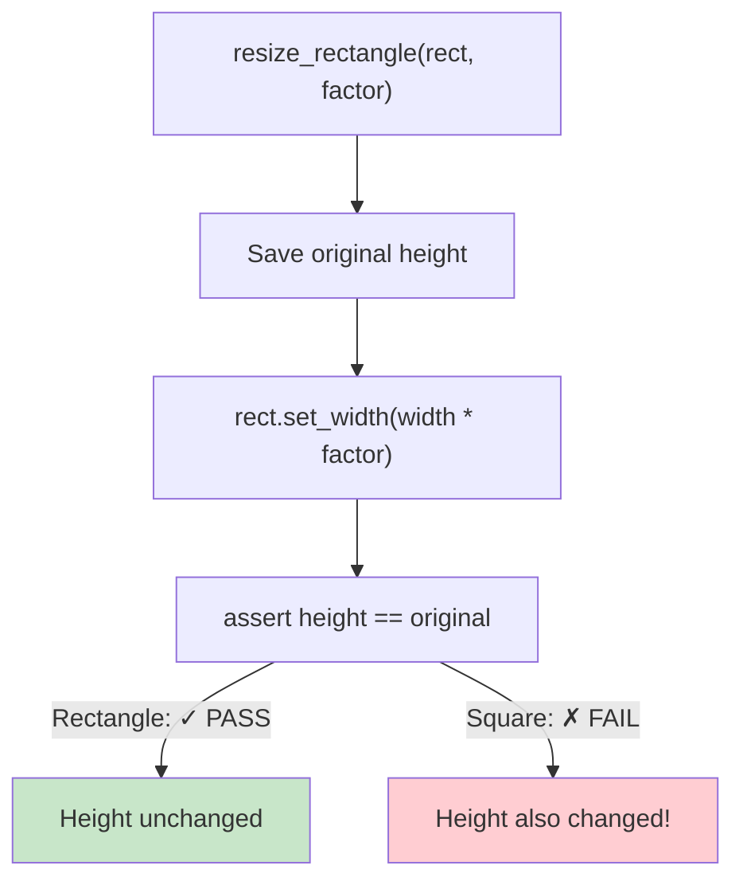
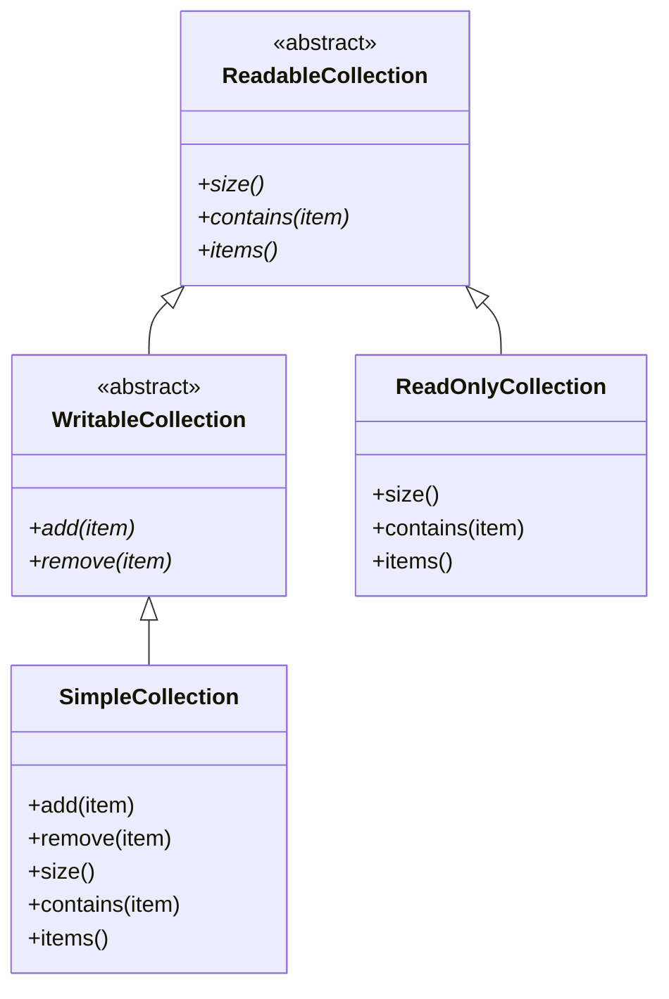
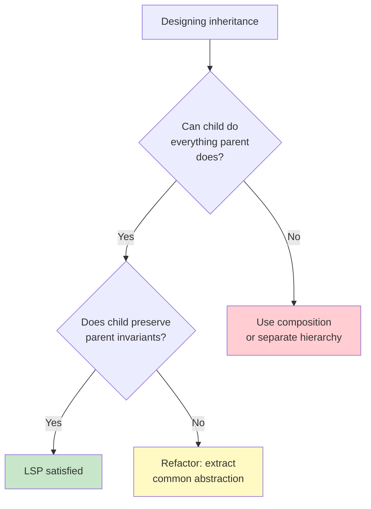

# Liskov Substitution Principle (LSP)

> **Objects of a superclass should be replaceable with objects of its subclasses without affecting the correctness of the program.**

Introduced by Barbara Liskov in 1987, the Liskov Substitution Principle is the third SOLID principle. It defines a strong behavioral contract for inheritance: subclasses must honor the expectations set by their parent classes.

## The Essence of LSP

If you have a function that works with a base class, it should work correctly with any of its subclasses — without knowing which subclass it is.

```python
def process_shape(shape: Shape) -> None:
    print(f"Area: {shape.area()}")
    print(f"Perimeter: {shape.perimeter()}")
```

This function should work correctly for `Rectangle`, `Circle`, `Triangle` — any subclass of `Shape`. If a subclass breaks this expectation, it violates LSP.

## BEFORE: The Classic Rectangle-Square Problem

This is the most famous LSP violation:

```python
class Rectangle:
    def __init__(self, width: float, height: float):
        self.width = width
        self.height = height

    def set_width(self, width: float) -> None:
        self.width = width

    def set_height(self, height: float) -> None:
        self.height = height

    def area(self) -> float:
        return self.width * self.height

class Square(Rectangle):
    def __init__(self, side: float):
        super().__init__(side, side)

    def set_width(self, width: float) -> None:
        self.width = width
        self.height = width  # Maintains square invariant

    def set_height(self, height: float) -> None:
        self.width = height
        self.height = height  # Maintains square invariant
```

At first glance this seems reasonable. A square is a rectangle, right? But watch what happens:

```python
def resize_rectangle(rect: Rectangle, factor: float) -> None:
    """Doubles width, keeps height — should work for any Rectangle."""
    original_height = rect.height
    rect.set_width(rect.width * factor)
    assert rect.height == original_height, "Height should not change!"
    print(f"Area changed from {rect.area() / factor:.2f} to {rect.area():.2f}")

r = Rectangle(10, 5)
resize_rectangle(r, 2)  # Works fine — width=20, height=5

s = Square(5)
resize_rectangle(s, 2)  # BREAKS! height also becomes 10, assertion fails
```

> [!WARNING]
> `Square` violates LSP because it changes the invariant that `set_width` only affects width. Code written for `Rectangle` assumes `set_width` leaves `height` unchanged.



### The Root Cause

`Square` weakens the postcondition of `set_width` and `set_height`. The parent class guarantees:

| Method | Rectangle Postcondition | Square Postcondition | LSP? |
|--------|------------------------|---------------------|------|
| `set_width(w)` | `width == w` | `width == w` AND `height == w` | Violation — stronger constraint |
| `set_height(h)` | `height == h` | `height == h` AND `width == h` | Violation — stronger constraint |

### AFTER: LSP-Compliant Design

Don't force inheritance where it doesn't fit. Use a common abstraction instead:

```python
from abc import ABC, abstractmethod

class Shape(ABC):
    @abstractmethod
    def area(self) -> float:
        pass

    @abstractmethod
    def perimeter(self) -> float:
        pass

class Rectangle(Shape):
    def __init__(self, width: float, height: float):
        self.width = width
        self.height = height

    def area(self) -> float:
        return self.width * self.height

    def perimeter(self) -> float:
        return 2 * (self.width + self.height)

class Square(Shape):
    def __init__(self, side: float):
        self.side = side

    def area(self) -> float:
        return self.side ** 2

    def perimeter(self) -> float:
        return 4 * self.side

def print_shape_info(shape: Shape) -> None:
    print(f"Area: {shape.area():.2f}, Perimeter: {shape.perimeter():.2f}")

print_shape_info(Rectangle(10, 5))
print_shape_info(Square(5))
```

> [!SUCCESS]
> Both `Rectangle` and `Square` are now `Shape` subclasses. Neither violates LSP because `Shape` doesn't have `set_width`/`set_height` methods that would need different behavior.

## Formal LSP Definition

The principle defines behavioral subtyping with these constraints:

| Constraint | Meaning | Example Violation |
|-----------|---------|------------------|
| **Preconditions cannot be strengthened** | Child methods shouldn't add restrictions | Parent accepts all ints, child rejects negatives |
| **Postconditions cannot be weakened** | Child must guarantee at least what parent does | Parent returns non-null, child returns null |
| **Invariants must be preserved** | Class invariants must hold in child | Parent's immutable field is mutable in child |
| **History constraint** | Child shouldn't allow state changes parent forbids | Parent is read-only, child allows writes |

## Example 2: Collection with Restrictions

**BEFORE: LSP Violation**

```python
class CustomCollection:
    def add(self, item: str) -> None:
        self._items.append(item)

    def remove(self, item: str) -> None:
        self._items.remove(item)

    def size(self) -> int:
        return len(self._items)

class ReadOnlyCollection(CustomCollection):
    def add(self, item: str) -> None:
        raise NotImplementedError("Read-only collection")

    def remove(self, item: str) -> None:
        raise NotImplementedError("Read-only collection")
```

```python
def process_collection(coll: CustomCollection) -> None:
    coll.add("test")
    assert coll.size() == 1
    print("Item added successfully")

process_collection(CustomCollection())  # Works
process_collection(ReadOnlyCollection())  # Raises NotImplementedError!
```

> [!WARNING]
> `ReadOnlyCollection` violates LSP by strengthening preconditions and weakening postconditions. Code expecting a `CustomCollection` that supports `add` will break with `ReadOnlyCollection`.

**AFTER: LSP-Compliant**

```python
from abc import ABC, abstractmethod

class ReadableCollection(ABC):
    @abstractmethod
    def size(self) -> int:
        pass

    @abstractmethod
    def contains(self, item: str) -> bool:
        pass

    @abstractmethod
    def items(self) -> list[str]:
        pass

class WritableCollection(ReadableCollection):
    @abstractmethod
    def add(self, item: str) -> None:
        pass

    @abstractmethod
    def remove(self, item: str) -> None:
        pass

class SimpleCollection(WritableCollection):
    def __init__(self):
        self._items: list[str] = []

    def add(self, item: str) -> None:
        self._items.append(item)

    def remove(self, item: str) -> None:
        self._items.remove(item)

    def size(self) -> int:
        return len(self._items)

    def contains(self, item: str) -> bool:
        return item in self._items

    def items(self) -> list[str]:
        return list(self._items)

class ReadOnlyCollection(ReadableCollection):
    def __init__(self, items: list[str]):
        self._items = list(items)

    def size(self) -> int:
        return len(self._items)

    def contains(self, item: str) -> bool:
        return item in self._items

    def items(self) -> list[str]:
        return list(self._items)

def show_collection_info(coll: ReadableCollection) -> None:
    print(f"Collection has {coll.size()} items")
    print(f"Items: {coll.items()}")

def add_to_collection(coll: WritableCollection, item: str) -> None:
    coll.add(item)
    print(f"Added {item}, now {coll.size()} items")

show_collection_info(SimpleCollection())
show_collection_info(ReadOnlyCollection(["a", "b"]))
add_to_collection(SimpleCollection(), "test")
```



## Example 3: Account with Withdrawal Restrictions

**BEFORE: LSP Violation**

```python
class BankAccount:
    def __init__(self, balance: float = 0):
        self.balance = balance

    def withdraw(self, amount: float) -> None:
        if amount <= 0:
            raise ValueError("Amount must be positive")
        if amount > self.balance:
            raise ValueError("Insufficient funds")
        self.balance -= amount

class FixedDepositAccount(BankAccount):
    def __init__(self, balance: float, maturity_date: str):
        super().__init__(balance)
        self.maturity_date = maturity_date
        self._matured = False

    def withdraw(self, amount: float) -> None:
        if not self._matured:
            raise ValueError("Cannot withdraw before maturity date")
        super().withdraw(amount)
```

```python
def process_withdrawal(account: BankAccount, amount: float) -> None:
    initial = account.balance
    account.withdraw(amount)
    assert account.balance == initial - amount
    print(f"Withdrew {amount}, balance: {account.balance}")

process_withdrawal(BankAccount(1000), 200)  # Works
process_withdrawal(FixedDepositAccount(5000, "2026-01-01"), 500)  # Fails!
```

**AFTER: LSP-Compliant**

```python
from abc import ABC, abstractmethod

class Account(ABC):
    def __init__(self, balance: float = 0):
        self._balance = balance

    @property
    def balance(self) -> float:
        return self._balance

    @abstractmethod
    def can_withdraw(self) -> bool:
        pass

    def deposit(self, amount: float) -> None:
        if amount <= 0:
            raise ValueError("Amount must be positive")
        self._balance += amount

class WithdrawableAccount(Account):
    def withdraw(self, amount: float) -> None:
        if amount <= 0:
            raise ValueError("Amount must be positive")
        if amount > self._balance:
            raise ValueError("Insufficient funds")
        self._balance -= amount

    def can_withdraw(self) -> bool:
        return self._balance > 0

class CheckingAccount(WithdrawableAccount):
    pass

class SavingsAccount(WithdrawableAccount):
    withdrawal_limit = 6

    def withdraw(self, amount: float) -> None:
        if amount > self._balance * 0.8:
            raise ValueError("Exceeds withdrawal limit")
        super().withdraw(amount)

class FixedDepositAccount(Account):
    def __init__(self, balance: float, maturity_date: str):
        super().__init__(balance)
        self.maturity_date = maturity_date

    def can_withdraw(self) -> bool:
        from datetime import date
        return date.today() >= date.fromisoformat(self.maturity_date)

    def withdraw(self, amount: float) -> None:
        if not self.can_withdraw():
            raise ValueError("Account has not matured yet")
        if amount <= 0:
            raise ValueError("Amount must be positive")
        if amount > self._balance:
            raise ValueError("Insufficient funds")
        self._balance -= amount

def process_account(account: Account) -> None:
    print(f"Balance: ${account.balance:.2f}")
    print(f"Can withdraw: {account.can_withdraw()}")

def process_withdrawal(account: WithdrawableAccount, amount: float) -> None:
    initial = account.balance
    account.withdraw(amount)
    print(f"Withdrew ${amount:.2f}, remaining: ${account.balance:.2f}")
    assert account.balance == initial - amount

process_account(CheckingAccount(1000))
process_account(FixedDepositAccount(5000, "2026-01-01"))
process_withdrawal(CheckingAccount(1000), 200)
```

## Example 4: Bird Hierarchy Problem

**BEFORE: LSP Violation**

```python
class Bird:
    def fly(self) -> str:
        return "Flying"

    def eat(self) -> str:
        return "Eating"

class Penguin(Bird):
    def fly(self) -> str:
        raise NotImplementedError("Penguins can't fly!")

def let_bird_fly(bird: Bird) -> None:
    print(bird.fly())

let_bird_fly(Bird())    # "Flying"
let_bird_fly(Penguin())  # NotImplementedError!
```

**AFTER: LSP-Compliant**

```python
from abc import ABC, abstractmethod

class Bird(ABC):
    @abstractmethod
    def eat(self) -> str:
        pass

class FlyingBird(Bird):
    @abstractmethod
    def fly(self) -> str:
        pass

class SwimmingBird(Bird):
    @abstractmethod
    def swim(self) -> str:
        pass

class Sparrow(FlyingBird):
    def eat(self) -> str:
        return "Sparrow eating seeds"

    def fly(self) -> str:
        return "Sparrow flying"

class Penguin(SwimmingBird):
    def eat(self) -> str:
        return "Penguin eating fish"

    def swim(self) -> str:
        return "Penguin swimming"

def feed_bird(bird: Bird) -> None:
    print(bird.eat())

def let_fly(bird: FlyingBird) -> None:
    print(bird.fly())

def let_swim(bird: SwimmingBird) -> None:
    print(bird.swim())

feed_bird(Sparrow())
feed_bird(Penguin())
let_fly(Sparrow())
let_swim(Penguin())
```

## LSP vs Inheritance Guidelines

| Guideline | Description |
|-----------|-------------|
| **Subtype requires** | The child should require no more than the parent (preconditions) |
| **Subtype provides** | The child should provide no less than the parent (postconditions) |
| **Subtype preserves** | The child should preserve all invariants of the parent |
| **Subtype doesn't throw** | The child should not throw new exception types the parent doesn't throw |
| **Subtype returns same type** | The child's return type should be a subtype of the parent's return type (covariance) |

## LSP Violations: Warning Signs

| Sign | Problem |
|------|---------|
| Child overrides method to do nothing or raise | Weakens postcondition |
| Child overrides method to reject valid inputs | Strengthens precondition |
| `isinstance` checks in client code | Client knows subclass breaks contract |
| "Is-a" relationship feels wrong | Square-Rectangle, Bird-Penguin |
| Child throws new exception types | Client can't handle them |
| Child breaks parent invariants | Mutable field in supposedly immutable class |

> [!TIP]
> If you find yourself writing `if isinstance(obj, SpecificType):` to handle exceptions, it's almost always an LSP violation. Polymorphism should handle the variation; typeof checks are a code smell.

## Behavioral Contracts

LSP is about behavioral contracts, not just type signatures:

```python
from typing import Protocol, runtime_checkable

@runtime_checkable
class Container(Protocol):
    def add(self, item: str) -> None: ...
    def remove(self, item: str) -> None: ...
    def __len__(self) -> int: ...
    def __contains__(self, item: str) -> bool: ...

class ListContainer:
    def __init__(self):
        self._items: list[str] = []

    def add(self, item: str) -> None:
        self._items.append(item)

    def remove(self, item: str) -> None:
        self._items.remove(item)

    def __len__(self) -> int:
        return len(self._items)

    def __contains__(self, item: str) -> bool:
        return item in self._items

class SetContainer:
    def __init__(self):
        self._items: set[str] = set()

    def add(self, item: str) -> None:
        self._items.add(item)

    def remove(self, item: str) -> None:
        self._items.discard(item)

    def __len__(self) -> int:
        return len(self._items)

    def __contains__(self, item: str) -> bool:
        return item in self._items

def add_duplicate(cont: Container, item: str) -> None:
    """Add item twice — should work for any Container."""
    cont.add(item)
    cont.add(item)
    print(f"Count after adding {item!r} twice: {len(cont)}")

add_duplicate(ListContainer(), "hello")  # Count: 2
add_duplicate(SetContainer(), "hello")   # Count: 1 — still correct
```

Both `ListContainer` and `SetContainer` satisfy the `Container` protocol. The function works correctly with both because neither violates the behavioral contract.

## Comparing Design Approaches

| Approach | LSP Status | Notes |
|----------|-----------|-------|
| Square inherits Rectangle | Violation | Mutating one dimension changes the other |
| Shape → Rectangle, Square | Satisfied | Both are subtypes of Shape |
| Bird → Penguin (fly)| Violation | Penguin can't fly |
| Bird → FlyingBird, SwimmingBird | Satisfied | Separate interfaces for separate behaviors |
| CustomCollection → ReadOnlyCollection | Violation | Throws on add/remove |
| ReadableCollection → WritableCollection | Satisfied | Interface segregation |



## LSP and Design by Contract

Design by Contract (DbC) formalizes LSP:

| Term | Meaning |
|------|---------|
| **Precondition** | What must be true before calling a method |
| **Postcondition** | What must be true after calling a method |
| **Invariant** | What must always be true about an object |

For LSP:
- **Child cannot strengthen preconditions** (can't reject what parent accepts)
- **Child cannot weaken postconditions** (must guarantee at least what parent guarantees)
- **Child must preserve all invariants** (can't break parent's guarantees)

> [!NOTE]
> While Python doesn't enforce contracts natively, you can use `assert` statements, `dataclass` validation, or libraries like `icontract` to enforce them. The important thing is to *design* with contracts in mind.

## Practice Exercises

1. Does the following code violate LSP? Why? Refactor it.
   ```python
   class Stack:
       def push(self, item): ...
       def pop(self): ...
   class NoPopStack(Stack):
       def pop(self):
           raise RuntimeError("Cannot pop from this stack")
   ```

2. The `Rectangle`-`Square` problem is the classic LSP violation. Create a proper design using a `Shape` base class with `area()` and `perimeter()`.

3. Identify the LSP violation in this code and fix it:
   ```python
   class FileWriter:
       def write(self, data: str) -> None:
           with open("output.txt", "w") as f:
               f.write(data)
   class ReadOnlyFileWriter(FileWriter):
       def write(self, data: str) -> None:
           pass  # Does nothing
   ```

4. A `Vehicle` class has `start_engine()` and `drive()`. A `Bicycle` subclass raises `NotImplementedError` for `start_engine()`. How would you refactor this?

5. Explain the relationship between LSP and the "is-a" rule of inheritance. When should you NOT use inheritance?

6. Create a proper hierarchy: `DatabaseConnection` with methods `connect()`, `query()`, `disconnect()`. Create subclasses `MySQLConnection`, `PostgreSQLConnection`, and `RedisConnection`. Ensure LSP is satisfied.

7. What design pattern(s) help avoid LSP violations? Give a concrete example.

8. Refactor this to be LSP-compliant:
   ```python
   class Discount:
       def apply(self, price: float) -> float:
           return price
   class NoDiscount(Discount):
       def apply(self, price: float) -> float:
           return price
   class PercentageDiscount(Discount):
       def __init__(self, percent: float):
           self.percent = percent
       def apply(self, price: float) -> float:
           return price * (1 - self.percent / 100)
   class FixedDiscount(Discount):
       def __init__(self, amount: float):
           self.amount = amount
       def apply(self, price: float) -> float:
           result = price - self.amount
           return result if result > 0 else 0
   ```

## Summary

- **LSP**: Subtypes must be substitutable for their base types
- **Behavioral contract**: Preconditions can't be strengthened, postconditions can't be weakened, invariants must be preserved
- **Classic violation**: Square-Rectangle, Bird-Penguin
- **Fix**: Favor composition, use separate interfaces for separate behaviors
- **Detection**: `isinstance` checks, overrides that raise or do nothing, broken invariants
- **Key insight**: "Is-a" from a modeling perspective doesn't always mean "is-a" from a behavioral perspective

> [!SUCCESS]
> LSP teaches us that inheritance is about behavior, not just structure. A well-designed hierarchy ensures that any subclass can safely stand in for its parent without surprises.
