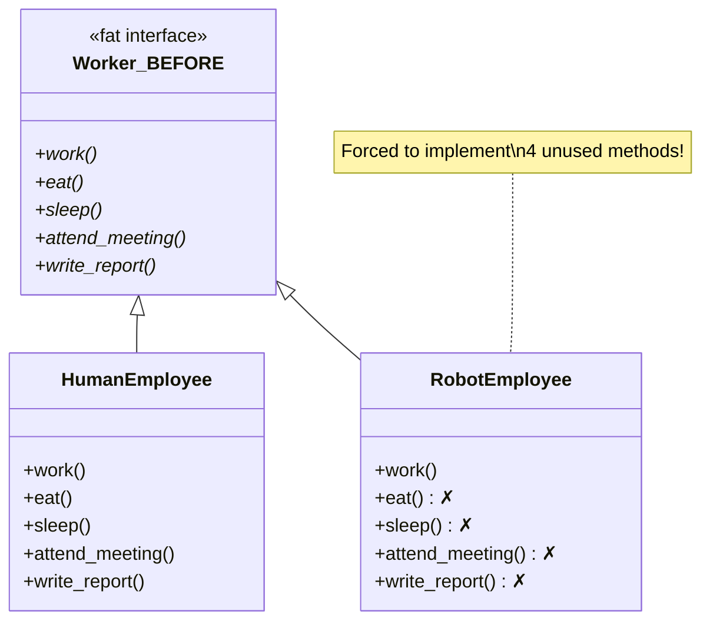
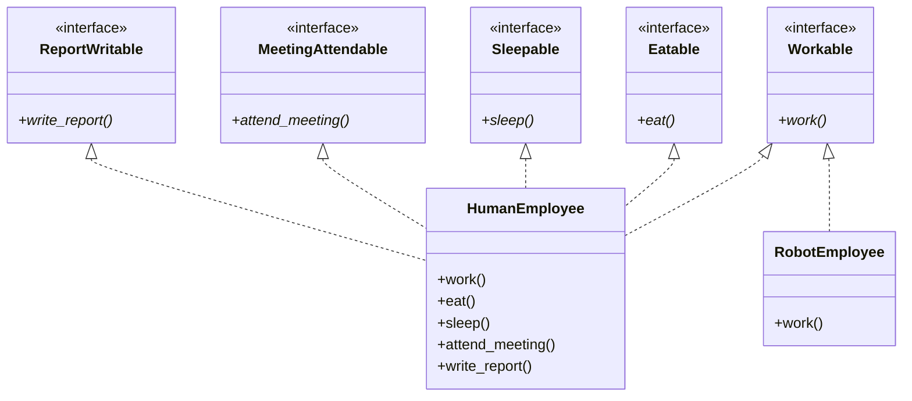
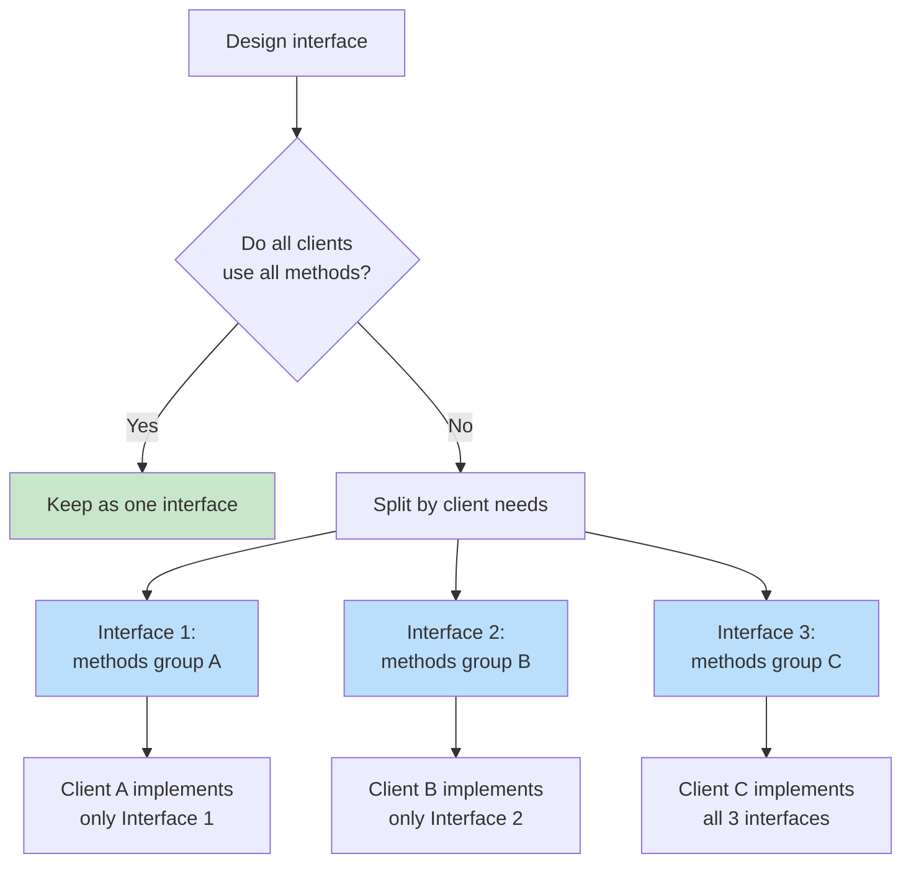

# Interface Segregation Principle (ISP)

> **Clients should not be forced to depend on interfaces they do not use.**

The Interface Segregation Principle is the fourth SOLID principle. It states that no client should be forced to implement methods it doesn't use. Large, "fat" interfaces should be split into smaller, more specific ones so that clients only know about the methods that are relevant to them.

## The Problem: Fat Interfaces

When an interface has many methods, implementing classes are forced to provide bodies for methods they don't need. This leads to empty implementations, `NotImplementedError` stubs, and confusing code.

### BEFORE: ISP Violation — A Fat Interface

```python
from abc import ABC, abstractmethod
from typing import Any

class Worker(ABC):
    @abstractmethod
    def work(self) -> str:
        pass

    @abstractmethod
    def eat(self) -> str:
        pass

    @abstractmethod
    def sleep(self) -> str:
        pass

    @abstractmethod
    def attend_meeting(self) -> str:
        pass

    @abstractmethod
    def write_report(self) -> str:
        pass
```

Now any class implementing `Worker` must provide all five methods:

```python
class HumanEmployee(Worker):
    def work(self) -> str:
        return "Writing code"

    def eat(self) -> str:
        return "Eating lunch"

    def sleep(self) -> str:
        return "Sleeping 8 hours"

    def attend_meeting(self) -> str:
        return "Attending standup"

    def write_report(self) -> str:
        return "Writing weekly report"

class RobotEmployee(Worker):
    def work(self) -> str:
        return "Assembling parts"

    def eat(self) -> str:
        raise NotImplementedError("Robots don't eat")

    def sleep(self) -> str:
        raise NotImplementedError("Robots don't sleep")

    def attend_meeting(self) -> str:
        raise NotImplementedError("Robots don't attend meetings")

    def write_report(self) -> str:
        raise NotImplementedError("Robots don't write reports")
```

> [!WARNING]
> `RobotEmployee` is forced to implement four methods it doesn't need. This violates ISP. The fat `Worker` interface forces clients to depend on methods they don't use.

```python
def manage_worker(worker: Worker) -> None:
    print(worker.work())
    print(worker.eat())       # Crashes for RobotEmployee!
    print(worker.sleep())     # Crashes for RobotEmployee!

try:
    manage_worker(RobotEmployee())
except NotImplementedError as e:
    print(f"Error: {e}")
```



### AFTER: ISP-Compliant — Segregated Interfaces

```python
from abc import ABC, abstractmethod

class Workable(ABC):
    @abstractmethod
    def work(self) -> str:
        pass

class Eatable(ABC):
    @abstractmethod
    def eat(self) -> str:
        pass

class Sleepable(ABC):
    @abstractmethod
    def sleep(self) -> str:
        pass

class MeetingAttendable(ABC):
    @abstractmethod
    def attend_meeting(self) -> str:
        pass

class ReportWritable(ABC):
    @abstractmethod
    def write_report(self) -> str:
        pass

class HumanEmployee(Workable, Eatable, Sleepable,
                    MeetingAttendable, ReportWritable):
    def work(self) -> str:
        return "Writing code"

    def eat(self) -> str:
        return "Eating lunch"

    def sleep(self) -> str:
        return "Sleeping 8 hours"

    def attend_meeting(self) -> str:
        return "Attending standup"

    def write_report(self) -> str:
        return "Writing weekly report"

class RobotEmployee(Workable):
    def work(self) -> str:
        return "Assembling parts"

def manage_worker(worker: Workable) -> None:
    print(worker.work())

def lunch_break(worker: Eatable) -> None:
    print(worker.eat())

manage_worker(RobotEmployee())       # Works
manage_worker(HumanEmployee())       # Works
lunch_break(HumanEmployee())         # Works
# lunch_break(RobotEmployee())       # Type error — RobotEmployee is not Eatable
```

> [!SUCCESS]
> Each interface has a single, clear responsibility. `RobotEmployee` only implements what it needs. No class is forced to depend on methods it doesn't use.



## Example 2: Document Processing System

**BEFORE: Fat Interface**

```python
from abc import ABC, abstractmethod

class DocumentProcessor(ABC):
    @abstractmethod
    def read(self, path: str) -> str:
        pass

    @abstractmethod
    def write(self, path: str, content: str) -> None:
        pass

    @abstractmethod
    def format_as_pdf(self) -> bytes:
        pass

    @abstractmethod
    def format_as_html(self) -> str:
        pass

    @abstractmethod
    def spell_check(self) -> list[str]:
        pass

    @abstractmethod
    def translate(self, target_lang: str) -> str:
        pass
```

```python
class ReadOnlyDocument(DocumentProcessor):
    def read(self, path: str) -> str:
        from pathlib import Path
        return Path(path).read_text()

    def write(self, path: str, content: str) -> None:
        raise NotImplementedError("Read-only document")

    def format_as_pdf(self) -> bytes:
        raise NotImplementedError("Not supported")

    def format_as_html(self) -> str:
        raise NotImplementedError("Not supported")

    def spell_check(self) -> list[str]:
        raise NotImplementedError("Not supported")

    def translate(self, target_lang: str) -> str:
        raise NotImplementedError("Not supported")
```

> [!WARNING]
> `ReadOnlyDocument` is forced to implement five methods it doesn't need. Every one of them throws `NotImplementedError`.

**AFTER: Segregated Interfaces**

```python
from abc import ABC, abstractmethod

class Readable(ABC):
    @abstractmethod
    def read(self, path: str) -> str:
        pass

class Writable(ABC):
    @abstractmethod
    def write(self, path: str, content: str) -> None:
        pass

class PDFFormattable(ABC):
    @abstractmethod
    def format_as_pdf(self) -> bytes:
        pass

class HTMLFormattable(ABC):
    @abstractmethod
    def format_as_html(self) -> str:
        pass

class SpellCheckable(ABC):
    @abstractmethod
    def spell_check(self) -> list[str]:
        pass

class Translatable(ABC):
    @abstractmethod
    def translate(self, target_lang: str) -> str:
        pass

class ReadOnlyDocument(Readable):
    def read(self, path: str) -> str:
        from pathlib import Path
        return Path(path).read_text()

class EditableDocument(Readable, Writable, SpellCheckable):
    def read(self, path: str) -> str:
        from pathlib import Path
        return Path(path).read_text()

    def write(self, path: str, content: str) -> None:
        from pathlib import Path
        Path(path).write_text(content)

    def spell_check(self) -> list[str]:
        return ["word1", "word2"]  # Example

class WebDocument(Readable, HTMLFormattable, Translatable):
    def read(self, path: str) -> str:
        from pathlib import Path
        return Path(path).read_text()

    def format_as_html(self) -> str:
        content = self.read("doc.txt")
        return f"<html><body><p>{content}</p></body></html>"

    def translate(self, target_lang: str) -> str:
        content = self.read("doc.txt")
        return f"[Translated to {target_lang}]: {content}"

def display_document(doc: Readable) -> None:
    print(doc.read("doc.txt"))

def save_document(doc: Writable, content: str) -> None:
    doc.write("doc.txt", content)
    print("Saved!")

def check_spelling(doc: SpellCheckable) -> None:
    errors = doc.spell_check()
    print(f"Spelling errors: {errors}")
```

## Example 3: Notification System with ISP

**BEFORE: Monolithic interface**

```python
from abc import ABC, abstractmethod

class NotificationService(ABC):
    @abstractmethod
    def send_email(self, to: str, subject: str, body: str) -> None:
        pass

    @abstractmethod
    def send_sms(self, to: str, message: str) -> None:
        pass

    @abstractmethod
    def send_push(self, device_token: str, message: str) -> None:
        pass

    @abstractmethod
    def send_slack(self, channel: str, message: str) -> None:
        pass

    @abstractmethod
    def send_teams(self, webhook_url: str, message: str) -> None:
        pass
```

```python
class EmailOnlyService(NotificationService):
    def send_email(self, to: str, subject: str, body: str) -> None:
        print(f"Sending email to {to}: {subject}")

    def send_sms(self, to: str, message: str) -> None:
        raise NotImplementedError

    def send_push(self, device_token: str, message: str) -> None:
        raise NotImplementedError

    def send_slack(self, channel: str, message: str) -> None:
        raise NotImplementedError

    def send_teams(self, webhook_url: str, message: str) -> None:
        raise NotImplementedError
```

**AFTER: Segregated interfaces**

```python
from abc import ABC, abstractmethod

class EmailSender(ABC):
    @abstractmethod
    def send_email(self, to: str, subject: str, body: str) -> None:
        pass

class SMSSender(ABC):
    @abstractmethod
    def send_sms(self, to: str, message: str) -> None:
        pass

class PushSender(ABC):
    @abstractmethod
    def send_push(self, device_token: str, message: str) -> None:
        pass

class SlackSender(ABC):
    @abstractmethod
    def send_slack(self, channel: str, message: str) -> None:
        pass

class TeamsSender(ABC):
    @abstractmethod
    def send_teams(self, webhook_url: str, message: str) -> None:
        pass

class SmtpEmailService(EmailSender):
    def __init__(self, smtp_host: str = "smtp.example.com"):
        self.smtp_host = smtp_host

    def send_email(self, to: str, subject: str, body: str) -> None:
        import smtplib
        from email.message import EmailMessage
        msg = EmailMessage()
        msg["Subject"] = subject
        msg["To"] = to
        msg.set_content(body)
        with smtplib.SMTP(self.smtp_host) as server:
            server.send_message(msg)

class TwilioSMSService(SMSSender):
    def send_sms(self, to: str, message: str) -> None:
        print(f"[SMS to {to}]: {message}")
        # Integration with Twilio API

class FirebasePushService(PushSender):
    def send_push(self, device_token: str, message: str) -> None:
        print(f"[Push to {device_token[:8]}...]: {message}")
        # Integration with Firebase Cloud Messaging

class CompositeNotifier(EmailSender, SMSSender, PushSender, SlackSender):
    """A service that can send via multiple channels."""
    def __init__(self):
        self._services: list = []

    def add_service(self, service) -> None:
        self._services.append(service)

    def send_email(self, to: str, subject: str, body: str) -> None:
        for s in self._services:
            if isinstance(s, EmailSender):
                s.send_email(to, subject, body)

    def send_sms(self, to: str, message: str) -> None:
        for s in self._services:
            if isinstance(s, SMSSender):
                s.send_sms(to, message)

    def send_push(self, device_token: str, message: str) -> None:
        for s in self._services:
            if isinstance(s, PushSender):
                s.send_push(device_token, message)

    def send_slack(self, channel: str, message: str) -> None:
        for s in self._services:
            if isinstance(s, SlackSender):
                s.send_slack(channel, message)
```

## ISP and Python Protocols

Python's `typing.Protocol` makes ISP natural — you don't even need explicit abstract base classes:

```python
from typing import Protocol

class Drawable(Protocol):
    def draw(self) -> str: ...

class Saveable(Protocol):
    def save(self, path: str) -> None: ...

class Printable(Protocol):
    def print_to(self, device: str) -> str: ...

class Circle:
    def draw(self) -> str:
        return "Drawing a circle"

    def save(self, path: str) -> None:
        from pathlib import Path
        Path(path).write_text(f"Circle at {path}")

class TextDocument:
    def save(self, path: str) -> None:
        from pathlib import Path
        Path(path).write_text("Document content")

    def print_to(self, device: str) -> str:
        return f"Printing to {device}"

class Screen:
    def draw(self) -> str:
        return "Drawing on screen"

    def print_to(self, device: str) -> str:
        return f"Screen output to {device}"

def render(thing: Drawable) -> None:
    print(thing.draw())

def persist(thing: Saveable) -> None:
    thing.save("output.dat")

def output(thing: Printable) -> None:
    print(thing.print_to("printer"))

render(Circle())      # Works
persist(Circle())     # Works
persist(TextDocument())  # Works
output(TextDocument())   # Works
```

> [!TIP]
> Python's structural subtyping (Protocols) naturally encourages ISP. Unlike nominal typing, a class doesn't need to declare it implements an interface — it just needs to have the right methods.

## When to Split Interfaces

| Criterion | Keep Together | Split Apart |
|-----------|--------------|-------------|
| Methods always used together | Yes | No |
| Different clients need different subsets | No | Yes |
| Implementation in same class naturally | Yes | No |
| Methods are at same abstraction level | Yes | No |
| Some implementations would be empty/throwing | No | Yes |

## ISP Violations: Warning Signs

| Sign | Problem | Fix |
|------|---------|-----|
| Empty method body | Forced to implement unused method | Split interface |
| `raise NotImplementedError` | Shouldn't be in interface | Split interface |
| `raise UnsupportedOperationError` | Wrong abstraction level | Split interface |
| `pass` as implementation | No-op for required method | Split interface |
| Fat interface with many methods | Likely multiple concerns | Extract into smaller interfaces |
| `isinstance` checks for specific implementations | Client knows subclasses skip methods | Split interface |

> [!NOTE]
> A fat interface is one where most implementations only use a subset of methods. The "fatness" is relative to the clients, not the number of methods.

## Comparison: ISP Before vs After

| Aspect | Fat Interface (Before) | Segregated Interfaces (After) |
|--------|----------------------|------------------------------|
| Number of interfaces | 1 | N (small, focused) |
| Implementation burden | High (all methods) | Low (only needed methods) |
| Client dependency | Unnecessary methods | Only what's needed |
| Change impact | Interface change affects all clients | Change affects only relevant clients |
| Testability | Harder (more mocking) | Easier (focused contracts) |
| Reusability | Low | High |



## ISP and the Adapter Pattern

When you need to work with an existing fat interface, the Adapter pattern can help:

```python
from abc import ABC, abstractmethod

# Existing fat interface (can't change — third-party library)
class LegacyWorker(ABC):
    @abstractmethod
    def work(self): pass
    @abstractmethod
    def eat(self): pass
    @abstractmethod
    def sleep(self): pass

# Our thin interfaces
class Workable(ABC):
    @abstractmethod
    def perform_work(self) -> str: pass

# Adapter
class RobotWorkerAdapter(Workable):
    def __init__(self, robot: LegacyWorker):
        self.robot = robot

    def perform_work(self) -> str:
        return self.robot.work()

# Concrete legacy class
class LegacyRobot(LegacyWorker):
    def work(self):
        return "Robot working"
    def eat(self):
        raise NotImplementedError
    def sleep(self):
        raise NotImplementedError

legacy = LegacyRobot()
adapter = RobotWorkerAdapter(legacy)
print(adapter.perform_work())  # "Robot working"
```

## Real-World: E-commerce Checkout

**BEFORE: Fat interface**

```python
from abc import ABC, abstractmethod

class CheckoutStep(ABC):
    @abstractmethod
    def validate_cart(self) -> bool: pass
    @abstractmethod
    def calculate_shipping(self) -> float: pass
    @abstractmethod
    def calculate_tax(self) -> float: pass
    @abstractmethod
    def apply_discount(self, code: str) -> float: pass
    @abstractmethod
    def process_payment(self) -> str: pass
    @abstractmethod
    def send_confirmation(self) -> None: pass
    @abstractmethod
    def update_inventory(self) -> None: pass
```

**AFTER: Segregated**

```python
from abc import ABC, abstractmethod

class CartValidator(ABC):
    @abstractmethod
    def validate(self) -> bool: pass

class ShippingCalculator(ABC):
    @abstractmethod
    def calculate(self) -> float: pass

class TaxCalculator(ABC):
    @abstractmethod
    def calculate(self, subtotal: float) -> float: pass

class DiscountApplicator(ABC):
    @abstractmethod
    def apply(self, code: str, total: float) -> float: pass

class PaymentProcessor(ABC):
    @abstractmethod
    def process(self, amount: float) -> str: pass

class ConfirmationSender(ABC):
    @abstractmethod
    def send(self, transaction_id: str, email: str) -> None: pass

class InventoryUpdater(ABC):
    @abstractmethod
    def update(self, items: list) -> None: pass

class CheckoutService:
    def __init__(self, validator: CartValidator,
                 shipping: ShippingCalculator,
                 tax: TaxCalculator,
                 discount: DiscountApplicator,
                 payment: PaymentProcessor,
                 confirmation: ConfirmationSender,
                 inventory: InventoryUpdater):
        self._validator = validator
        self._shipping = shipping
        self._tax = tax
        self._discount = discount
        self._payment = payment
        self._confirmation = confirmation
        self._inventory = inventory

    def checkout(self, cart: dict, discount_code: str | None = None,
                 email: str = "") -> dict:
        self._validator.validate()
        subtotal = sum(item["price"] * item["qty"] for item in cart["items"])
        shipping = self._shipping.calculate()
        tax = self._tax.calculate(subtotal)
        total = subtotal + shipping + tax
        if discount_code:
            total = self._discount.apply(discount_code, total)
        txn_id = self._payment.process(total)
        self._inventory.update(cart["items"])
        if email:
            self._confirmation.send(txn_id, email)
        return {"transaction_id": txn_id, "total": total}
```

> [!SUCCESS]
> Each interface represents a single, well-defined responsibility in the checkout process. New payment gateways, shipping providers, or tax calculators can be implemented independently.

## Practice Exercises

1. Identify the ISP violation in this code and refactor it:
   ```python
   class MultiFunctionPrinter(ABC):
       @abstractmethod
       def print(self, doc): pass
       @abstractmethod
       def scan(self, doc): pass
       @abstractmethod
       def fax(self, doc): pass
       @abstractmethod
       def staple(self, doc): pass
   class SimplePrinter(MultiFunctionPrinter):
       def print(self, doc): ...
       def scan(self, doc): raise NotImplementedError
       def fax(self, doc): raise NotImplementedError
       def staple(self, doc): raise NotImplementedError
   ```

2. Split the following interface following ISP:
   ```python
   class UserService(ABC):
       @abstractmethod
       def create_user(self, data): pass
       @abstractmethod
       def update_user(self, id, data): pass
       @abstractmethod
       def delete_user(self, id): pass
       @abstractmethod
       def send_welcome_email(self, email): pass
       @abstractmethod
       def send_password_reset(self, email): pass
       @abstractmethod
       def generate_report(self): pass
       @abstractmethod
       def export_users_csv(self): pass
   ```

3. What is the difference between ISP and SRP? How do they complement each other?

4. Refactor the following to use Python Protocols (structural typing) with ISP:
   ```python
   class MediaPlayer(ABC):
       @abstractmethod
       def play(self): pass
       @abstractmethod
       def pause(self): pass
       @abstractmethod
       def stop(self): pass
       @abstractmethod
       def record(self): pass
   ```

5. A `Database` interface has `connect()`, `query()`, `insert()`, `update()`, `delete()`, `backup()`, `restore()`. A `ReadOnlyDatabase` only uses `connect()` and `query()`. Apply ISP.

6. Explain how ISP relates to the Adapter pattern. When would you use an adapter instead of refactoring the interface?

7. Design interfaces for a smart home system where light controllers, thermostat controllers, and security cameras each need different subsets of capabilities (turn on/off, set temperature, record video, detect motion).

8. How can overly aggressive interface segregation become a problem? What's the balance between ISP and pragmatism?

## Summary

- **ISP**: Clients should not be forced to depend on interfaces they do not use
- **Fat interfaces** force implementing classes to provide unused methods (empty bodies or exceptions)
- **Solution**: Split large interfaces into smaller, role-specific ones
- **Python Protocols** (structural subtyping) naturally encourage ISP
- **Related patterns**: Adapter pattern helps bridge fat interfaces with segregated ones
- **ISP + SRP**: ISP is about interface design for clients; SRP is about class design for responsibilities
- **Balance**: Split enough to avoid fat interfaces, but not so much that you create unnecessary complexity

> [!SUCCESS]
> ISP keeps your interfaces lean and your implementations honest. Each client depends on exactly what it needs — nothing more, nothing less.
